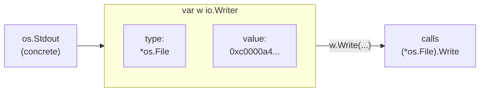

# Interfaces in Depth — Behavior, Not Hierarchy

In [Phase 9](09-idioms-and-gotchas.md) you met interfaces as Go sees them on the surface: small, implicitly satisfied lists of methods, like `io.Writer`. You can write a lot of good Go knowing only that. But there's a layer underneath — what an interface value actually *is* in memory — and once you see it, four things that felt like separate quirks turn out to be one idea wearing four hats. Type assertions, type switches, the empty interface, and the maddening "my nil error isn't nil" bug all fall out of a single fact.

The mental model first, because everything else hangs off it: **an interface value is not the thing you stored in it. It's a tiny box holding two slots — what type the thing is, and the thing itself.** Hold onto that. We'll use it five times.

## The one idea: an interface value is a (type, value) pair

📝 **Interface value** — at runtime, a value of an interface type is a pair: a *dynamic type* (which concrete type is in the box right now) and a *dynamic value* (the actual data, or a pointer to it). The interface itself is just the box; the pair inside is what gives it behavior.

When you assign a concrete value to an interface variable, Go doesn't lose track of what you put in. It records the concrete type alongside the value. That bookkeeping is the whole trick — it's how the interface can later call the *right* method, and how you can later ask "what's actually in here?"



*What just happened:* assigning `os.Stdout` to an `io.Writer` variable filled both slots — the type slot remembers it's an `*os.File`, the value slot points at the actual file. When you call `w.Write(...)`, Go reads the type slot to find *which* `Write` to run. This is **dynamic dispatch**: the method that executes is chosen at runtime from the concrete type in the box, not from the interface type you declared. Two different concrete types behind the same interface call two different methods — that's the entire point of an interface.

💡 **Why this matters.** Every feature in this phase is "do something with one of those two slots." Assertions and switches *read the type slot*. The empty interface is *a box with no method requirements*. The nil trap is *the box being non-empty even when the value slot is nil*. Same box, four questions.

## Type assertions — getting the concrete value back out

Once a value is inside an interface, it's wearing a disguise: you can only call the interface's methods, not the concrete type's other methods or fields. A **type assertion** pulls the disguise off — it says "I believe the concrete type in this box is `X`; give it back to me as an `X`."

📝 **Type assertion** — `x.(T)` checks the interface value `x`'s dynamic type against `T`. There are two forms: the *comma-ok* form `v, ok := x.(T)` (safe — `ok` tells you whether it matched), and the *single-value* form `v := x.(T)` (which **panics** if the type doesn't match).

```go
package main

import "fmt"

func main() {
	var x any = "hello" // an interface box holding a string

	// comma-ok form: never panics, ok reports the match
	s, ok := x.(string)
	fmt.Println(s, ok)

	n, ok := x.(int) // wrong type — no panic, just ok == false
	fmt.Println(n, ok)

	// single-value form: panics if wrong. Use only when you're certain.
	s2 := x.(string)
	fmt.Println(s2)
}
```
```console
$ go run main.go
hello true
0 false
hello
```

*What just happened:* `x` is an interface box whose type slot says `string`. `x.(string)` matched, so `s` got `"hello"` and `ok` was `true`. `x.(int)` *didn't* match — but because we used the comma-ok form, Go didn't panic; it set `n` to the zero value (`0`) and `ok` to `false`. The single-value `x.(string)` worked because we genuinely had a string. Had we written `x.(int)` in single-value form, the program would have crashed with `panic: interface conversion: interface {} is string, not int`.

⚠️ **Reach for comma-ok by default.** The single-value form is fine when a panic is the correct response to a broken assumption, but in ordinary code you almost always want the `ok` so you can handle "not that type" gracefully instead of taking down the program.

## Type switches — branching on the dynamic type

When you need to handle *several* possible concrete types, chaining assertions gets ugly fast. The **type switch** is purpose-built for it: one construct that reads the type slot and branches, binding the unwrapped value in each case.

📝 **Type switch** — `switch v := x.(type) { case T1: ... case T2: ... }`. The special `.(type)` syntax is only legal inside a `switch`. In each `case`, `v` is the value already converted to that case's type, so you can use it directly.

Here's a small formatter that renders different types in different ways:

```go
package main

import "fmt"

type Point struct{ X, Y int }

func describe(x any) string {
	switch v := x.(type) {
	case int:
		return fmt.Sprintf("an int, doubled: %d", v*2)
	case string:
		return fmt.Sprintf("a string of length %d", len(v))
	case Point:
		return fmt.Sprintf("a point at (%d, %d)", v.X, v.Y)
	case nil:
		return "nothing at all"
	default:
		return fmt.Sprintf("some other type: %T", v)
	}
}

func main() {
	fmt.Println(describe(21))
	fmt.Println(describe("go"))
	fmt.Println(describe(Point{3, 4}))
	fmt.Println(describe(nil))
	fmt.Println(describe(3.14))
}
```
```console
$ go run main.go
an int, doubled: 42
a string of length 2
a point at (3, 4)
some other type: float64
nothing at all
```

*What just happened:* each `case` matched against the dynamic type in `x`'s box. In the `int` case, `v` was already a usable `int` (so `v*2` compiled); in the `Point` case, `v` was a real `Point` with `.X` and `.Y`. The `nil` case caught the empty box, and `default` swept up `float64` — note `%T` prints the dynamic type, a handy debugging move. One switch did the work that would otherwise be five separate comma-ok assertions. (Output order matches call order; the `nil` line prints after the `float64`-typed call because that's the order we called `describe`.)

## The empty interface and `any` — holds anything, knows nothing

If an interface is a list of required methods, what does an interface requiring *zero* methods accept? Everything — because every type trivially has "no methods at all." That's the **empty interface**, written `interface{}`, and since Go 1.18 it has a readable alias: **`any`**. They are identical; `any` is just nicer to read.

📝 **`any` / `interface{}`** — an interface with no methods, so every value satisfies it. It's the universal box. You can put anything in, but you can call *no* methods on it until you pull the concrete type back out (with an assertion or type switch).

**When it's the right tool.** Genuinely heterogeneous data, where you can't know the types ahead of time: decoded JSON (`map[string]any`), `fmt.Println`'s variadic `...any`, a cache that stores arbitrary values. In those cases the whole point is "I don't care what type this is yet."

```go
package main

import "fmt"

func main() {
	// A bag of mixed types — the empty interface earns its keep here.
	row := []any{"Ada", 36, true, 3.14}
	for _, field := range row {
		fmt.Printf("%v (%T)\n", field, field)
	}
}
```
```console
$ go run main.go
Ada (string)
36 (int)
true (bool)
3.14 (float64)
```

*What just happened:* `[]any` let us hold a string, an int, a bool, and a float in one slice — impossible with a typed slice. Each element kept its own (type, value) pair, which is why `%T` could report the real type of each. This is the legitimate use: data that is *inherently* mixed.

💡 **Prefer a specific interface whenever you can name the behavior you need.** `any` is powerful precisely because it discards type safety — the compiler can no longer catch a wrong-type mistake, and every use site has to assert the type back out. If what you actually need is "something I can write to" or "something with a `String()` method," declare *that* interface (`io.Writer`, `fmt.Stringer`). Code smell rule of thumb: a function taking `any` and immediately type-switching on a handful of known types usually wanted those types as a small interface or a sum of concrete types instead. Use `any` when the set of types is genuinely open; reach for a named interface when it isn't.

## The nil-interface trap, fully explained

Phase 9 named this one and showed the symptom. Now you have the model to understand *why* — and it's worth the slow walk, because it produces one of the most baffling bugs in Go.

Recall the rule: an interface value is a (type, value) pair. The follow-on rule is the trap itself.

⚠️ **An interface is `nil` only when *both* slots are empty — type *and* value.** If the type slot holds a concrete type, the interface is **not nil**, even when the value slot is a nil pointer. A nil *pointer* and a nil *interface* are not the same thing.

Here's the classic bug: a function returns a `*MyError`, and a nil one accidentally becomes a non-nil `error`.

```go
package main

import "fmt"

type MyError struct{ msg string }

func (e *MyError) Error() string { return e.msg }

// BUG: returns the concrete pointer type, even when there's no error.
func doWork(fail bool) error {
	var e *MyError // nil pointer of type *MyError
	if fail {
		e = &MyError{msg: "it broke"}
	}
	return e // <- always wraps *MyError into the error box
}

func main() {
	err := doWork(false) // we expect "no error"
	if err != nil {
		fmt.Println("caller thinks there was an error:", err)
	} else {
		fmt.Println("no error")
	}
}
```
```console
$ go run main.go
caller thinks there was an error: <nil>
```

*What just happened:* even with `fail == false`, `e` is a nil `*MyError` — but `return e` stuffs it into the `error` interface, filling the **type slot** with `*MyError`. The value slot is nil, but the type slot is *not*, so `err != nil` is `true`. The caller wrongly concludes work failed. (Notice the printed error is `<nil>` — calling `.Error()` on the nil pointer happens to work here only because the method body doesn't dereference `e`; a method that touched `e.msg` would panic instead. Either way, the `if` already went down the wrong branch.)

The fix is to never let a typed nil leak into the interface. Return a *bare* `nil` when there's no error:

```go
package main

import "fmt"

type MyError struct{ msg string }

func (e *MyError) Error() string { return e.msg }

// FIXED: return the *interface* nil explicitly when nothing went wrong.
func doWork(fail bool) error {
	if fail {
		return &MyError{msg: "it broke"} // non-nil error, correctly
	}
	return nil // both slots empty -> a true nil error
}

func main() {
	err := doWork(false)
	if err != nil {
		fmt.Println("error:", err)
	} else {
		fmt.Println("no error")
	}
}
```
```console
$ go run main.go
no error
```

*What just happened:* by returning the literal `nil` on the happy path, we hand back an interface with *both* slots empty — a genuine nil `error`. Now `err != nil` is `false` and the caller takes the right branch. The rule to internalize: don't declare a typed pointer variable and return it as an interface; return concrete errors only when you actually have one, and a bare `nil` otherwise. This is why idiomatic Go writes `return nil` rather than `return someNilPointer`.

## Recap

1. **An interface value is a (type, value) pair.** The type slot remembers the concrete type; the value slot holds the data. This single fact explains everything else, including dynamic dispatch — the method that runs is chosen from the concrete type in the box.
2. **Type assertions read the type slot.** `v, ok := x.(T)` is the safe comma-ok form; `v := x.(T)` panics on a mismatch. Default to comma-ok unless a panic is the right answer.
3. **A type switch** (`switch v := x.(type)`) branches on the dynamic type and hands you the unwrapped value per case — the clean way to handle several possible types.
4. **`any` (alias for `interface{}`)** accepts every value because it requires no methods. Right for genuinely heterogeneous data (JSON, mixed bags); a smell when a specific named interface would say what you actually need.
5. ⚠️ **The nil trap:** an interface is nil only when *both* slots are empty. A nil `*MyError` returned as `error` fills the type slot, so `err != nil` is true. Return a bare `nil`, never a typed nil pointer.

You now understand interfaces from the inside out — not as a hierarchy, but as a small box that pairs behavior with data. Next we turn to **generics**, Go's way to write one function or type that works across many concrete types *with* full compile-time type safety, picking up exactly where the empty interface's trade-offs leave off.

## Quick check

Test yourself on the idea that ties this whole phase together — the (type, value) pair:

```quiz
[
  {
    "q": "What is an interface value actually made of at runtime?",
    "choices": [
      "A pair: the dynamic type of what's stored, plus the value (or a pointer to it)",
      "Just the concrete value, with the type discarded once stored",
      "A copy of the interface's method list and nothing else",
      "A string naming the interface type, like \"io.Writer\""
    ],
    "answer": 0,
    "explain": "An interface value holds two slots — a dynamic type and a dynamic value. That pairing is what enables dynamic dispatch and type assertions, and it's the reason the nil-interface trap exists."
  },
  {
    "q": "You write `n := x.(int)` (single-value form) but `x` actually holds a string. What happens?",
    "choices": [
      "The program panics with an interface conversion error",
      "`n` is set to 0 and execution continues",
      "It's a compile error — the types don't match",
      "`n` becomes the string converted to an int"
    ],
    "answer": 0,
    "explain": "The single-value assertion panics on a type mismatch. To check safely without panicking, use the comma-ok form `n, ok := x.(int)`, which sets `ok` to false instead of crashing."
  },
  {
    "q": "A function does `var e *MyError; return e` as an `error`. Why is the returned error not nil?",
    "choices": [
      "The interface's type slot is filled with *MyError, so only the value slot is nil — and an interface is nil only when both slots are empty",
      "Go automatically converts nil pointers into non-nil errors for safety",
      "Because *MyError has an Error() method, which can never be nil",
      "It actually is nil; the comparison `err != nil` is buggy in Go"
    ],
    "answer": 0,
    "explain": "Returning a typed nil pointer fills the interface's type slot with *MyError. An interface equals nil only when both the type and value slots are empty, so this one is non-nil. The fix is to return a bare `nil` when there's no error."
  }
]
```

---

[← Phase 9: Idioms & Common Gotchas](09-idioms-and-gotchas.md) · [Guide overview](_guide.md) · [Phase 11: Generics & Advanced Types →](11-generics-and-advanced-types.md)