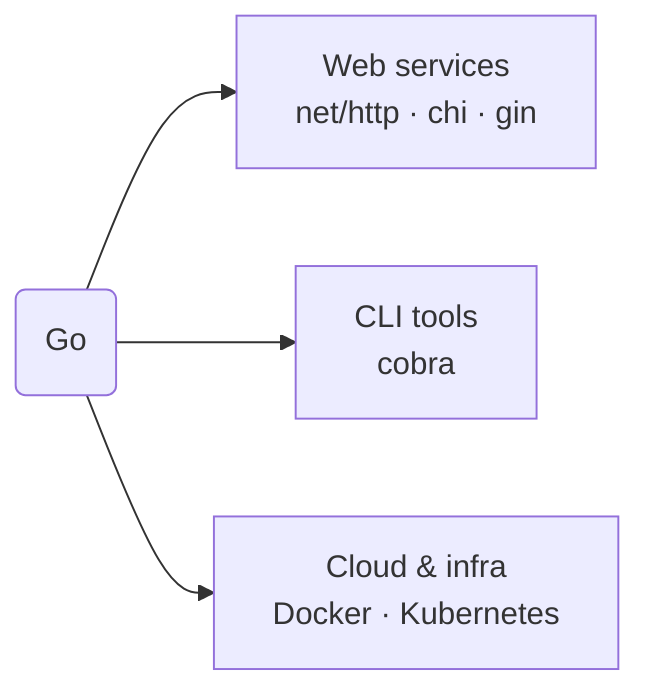

# Where to Go Next

You've covered the whole language: install and syntax, collections and control flow, modules, goroutines and channels, errors and I/O, the toolchain, and the idioms. That's not a beginner's slice of Go — that's *Go*. The remaining question is the good one: now what do you build?

This phase is deliberately short and honest. Go isn't equally good at everything, and the kindest thing I can do is point you at where it genuinely shines, name the few libraries you'll actually reach for, and then get out of your way. The fastest way to make Go stick is to build one real thing — so let's aim you at a target.

## Where Go actually shines

**Web services and APIs.** This is Go's daily-driver job. The standard library's `net/http` (you saw a full server in [Phase 8](08-ecosystem-and-tooling.md)) is genuinely production-ready, and many teams ship real services on it alone. When you want nicer routing, middleware, and URL parameters, the two common choices are **chi** (a thin, idiomatic router that stays close to the standard library) and **gin** (a heavier, batteries-included framework with its own conventions). Both are fine; chi if you like staying near `net/http`, gin if you want more done for you. Start with the standard library, add a router only when you feel the friction.

**Command-line tools.** Go compiles to a single static binary with no runtime to install ([Phase 8](08-ecosystem-and-tooling.md)), which makes it close to ideal for CLIs — you build one file and people just run it. For anything beyond a couple of flags, **cobra** is the de facto library for commands, subcommands, and help text (it's what powers the `kubectl` and `gh` CLIs, among many others). A lot of the developer tools you already use are Go binaries for exactly this reason.

**Cloud and infrastructure — Go's home turf.** This is where Go isn't just *usable* but *dominant*. **Docker** and **Kubernetes** are both written in Go, and so is a large slice of the cloud-native ecosystem around them — Terraform, Prometheus, etcd, and many more. That's not an accident: Go's fast compiles, single static binaries, first-class concurrency ([Phase 6](06-goroutines-and-channels.md)), and strong standard networking library are exactly what infrastructure software needs. If you're drawn to DevOps, platform engineering, or backend infrastructure, you're already in the right language.

📝 **Terminology.** *Cloud-native* describes software built to run in containers and orchestrators (like Kubernetes) rather than on a single fixed server. A surprising amount of it is written in Go — which means knowing Go opens that whole world of tooling to you.

## What to build next

Pick one and finish it. A small thing you complete teaches you more than an ambitious thing you abandon.

- **A JSON API.** A tiny HTTP service with two or three endpoints backed by an in-memory map, using `net/http` and `encoding/json`. You'll exercise handlers, structs, and error handling all at once. Add **chi** when the routing starts to chafe.
- **A real CLI.** Take a chore you do by hand — renaming files, summarizing a log, checking a list of URLs — and make it a command-line tool. Start with the standard `flag` package; graduate to **cobra** when you want subcommands.
- **A concurrent fetcher.** Read a list of URLs and fetch them all at once with goroutines and a `sync.WaitGroup` ([Phase 6](06-goroutines-and-channels.md)), collecting results over a channel. This makes Go's concurrency model concrete in a way no tutorial can.

For each, the loop is the same: write it, run `go fmt`, run `go vet ./...` and `go test ./...` ([Phase 8](08-ecosystem-and-tooling.md)), and reach for the standard library before any third-party package. That habit alone will make your Go look like a veteran's.

## Where to go from here

The official **A Tour of Go** (tour.golang.org) and **Effective Go** (the canonical idioms doc on go.dev) are the two resources worth bookmarking — they're maintained by the Go team and won't steer you wrong. And if you ever want to step back and think about *why* languages make the choices they do — why Go reaches for static binaries and goroutines while another language reaches for a VM and threads — that's the subject of [Languages, Explained Like a Human](/guides/languages-explained-like-a-human). It's a good companion now that you've actually lived inside one language end to end.

You came in not knowing Go. You're leaving able to read it, write it idiomatically, handle concurrency and errors without fear, and reach for the right tool from the box. That's a real skill, and it transfers — the cloud-native world runs on it. Go build the small thing. You're ready.

## Recap

1. **Web** — `net/http` is production-ready; add **chi** (light, idiomatic) or **gin** (heavier, batteries-included) when you want a router.
2. **CLIs** — single static binaries make Go great for tools; **cobra** handles commands and subcommands.
3. **Cloud & infra** — Go's home turf; Docker and Kubernetes are written in Go, and much of the cloud-native stack with them.
4. **Build one real thing** — a JSON API, a CLI, or a concurrent fetcher — and finish it, leaning on the standard library and the toolchain.
5. **Next reading** — A Tour of Go and Effective Go for depth; [Languages, Explained Like a Human](/guides/languages-explained-like-a-human) for the bigger picture.

---

[← Phase 9: Idioms & Common Gotchas](09-idioms-and-gotchas.md) · [Guide overview](_guide.md)
