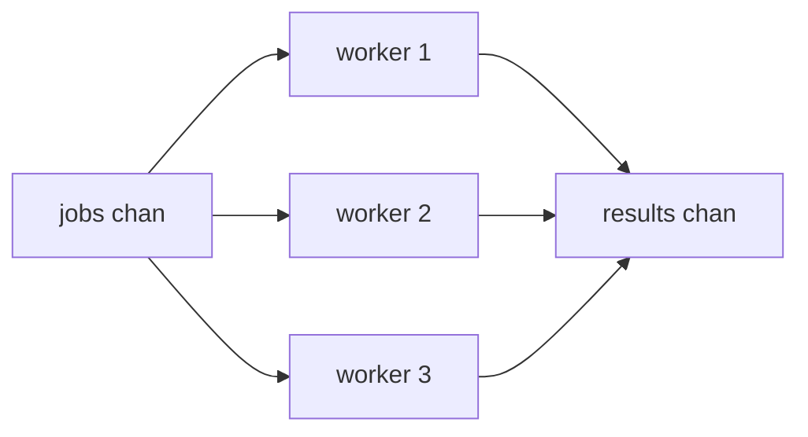

# Concurrency Patterns — From Goroutines to Real Systems

In [Phase 6](06-goroutines-and-channels.md) you learned the two primitives: `go` to start a concurrent task, and channels to pass values between tasks safely. Those are the bricks. This phase is the architecture — the handful of *patterns* that get built out of those bricks over and over in real Go programs.

The mental model to carry through: concurrency in production is rarely "start one goroutine and wait." It's "start a controlled number of goroutines, give them a way to *stop* when the work is no longer needed, spread work across them, collect the results, and protect anything they share." Each section below is one piece of that. None of it is new machinery — it's `go`, channels, and `sync` arranged into shapes you'll reach for by name.

## `select` — wait on several channels at once

You met `select` briefly in Phase 6 for a timeout. Let's make it a tool you reach for deliberately, because it's the control structure that turns one-channel toys into real coordination.

📝 **`select`** — a `switch` whose cases are channel operations (sends or receives). It blocks until *one* case can proceed, then runs exactly that case. If several are ready at once, it picks one at random — so no single channel can starve the others.

**Non-blocking with `default`.** Add a `default` case and `select` stops blocking entirely: if no channel is ready *right now*, it runs `default` and moves on. This is how you "peek" at a channel without committing to wait.

```go
package main

import "fmt"

func main() {
	jobs := make(chan int, 2)
	jobs <- 1 // buffer has room, so this doesn't block

	select {
	case j := <-jobs:
		fmt.Println("got a job:", j)
	default:
		fmt.Println("no job ready")
	}

	select {
	case j := <-jobs:
		fmt.Println("got a job:", j)
	default:
		fmt.Println("no job ready") // buffer is empty now
	}
}
```
```console
$ go run main.go
got a job: 1
no job ready
```
*What just happened:* The first `select` found a value waiting in the buffered channel, so it took the receive case. The second `select` found the channel empty — and because of the `default`, it didn't block waiting for one. It reported "no job ready" and kept going. Without that `default`, the second receive would block forever (and the runtime would shout `deadlock!`). `default` is your "try, but don't wait" switch.

**A timeout with `time.After`.** The other everyday shape is "wait for a result, but give up after a while." `time.After(d)` returns a channel that delivers one value after duration `d` — put it in a `select` next to the thing you're really waiting on, and whichever fires first wins.

```go
package main

import (
	"fmt"
	"time"
)

func main() {
	result := make(chan string)
	go func() {
		time.Sleep(2 * time.Second) // slow work
		result <- "done"
	}()

	select {
	case r := <-result:
		fmt.Println("got:", r)
	case <-time.After(500 * time.Millisecond):
		fmt.Println("gave up waiting")
	}
}
```
```console
$ go run main.go
gave up waiting
```
*What just happened:* `select` watched two channels — the real `result` and the timer from `time.After`. The work needed 2 seconds; the timer fired at half a second, so the timeout case won and printed "gave up waiting." The slow goroutine is still out there, though — it'll eventually try to send on `result` with nobody listening, and *leak*. That dangling goroutine is exactly the problem `context` solves next.

💡 **Key point.** `select` is the join point of Go concurrency. "Receive a result *or* time out," "send *or* bail if the consumer is gone," "wait on work *or* a cancellation signal" — they're all the same shape: list the channels, let whichever is ready win.

## `context` — telling goroutines to stop

The timeout above stopped *us* from waiting, but it did nothing to stop the *worker*. In a real server — handling thousands of requests, each spawning goroutines — work that nobody needs anymore has to actually stop, or you bleed memory and CPU. That's what `context` is for.

📝 **`context.Context`** — a value that carries a cancellation signal (and a deadline, and request-scoped values) down through a call tree. It exposes one channel, `ctx.Done()`, that *closes* when the work should stop. Goroutines `select` on `ctx.Done()` and exit when it fires. Cancellation flows one way: cancel a context and every context derived from it is cancelled too.

You create one from a parent (often `context.Background()` at the top of a program, or the request's context in a server) with a helper that also hands you a way to trigger cancellation:

- `context.WithCancel(parent)` — returns a `ctx` and a `cancel()` function you call to stop it.
- `context.WithTimeout(parent, d)` — auto-cancels after duration `d` (and still gives you a `cancel` to call early).

**A real example.** A worker that loops until it's told to stop:

```go
package main

import (
	"context"
	"fmt"
	"time"
)

func worker(ctx context.Context) {
	for {
		select {
		case <-ctx.Done(): // cancellation signal arrived
			fmt.Println("worker stopping:", ctx.Err())
			return
		default:
			fmt.Println("working...")
			time.Sleep(200 * time.Millisecond)
		}
	}
}

func main() {
	ctx, cancel := context.WithTimeout(context.Background(), 500*time.Millisecond)
	defer cancel() // always release the context's resources

	worker(ctx)
}
```
```console
$ go run main.go
working...
working...
working...
worker stopping: context deadline exceeded
```
*What just happened:* The worker looped, doing a little work each pass. After 500ms the timeout fired, which *closed* `ctx.Done()`; on its next trip through the `select`, the `<-ctx.Done()` case was now ready, so the worker printed why it stopped (`ctx.Err()` reports `context deadline exceeded`) and returned cleanly. No leak — the goroutine *ended*. The `defer cancel()` is non-negotiable: it frees the timer and resources even when the timeout already fired, and `go vet` will warn you if you forget it.

💡 **Key point.** By strong convention, `ctx` is the **first parameter** of any function that does cancellable or long-running work: `func Fetch(ctx context.Context, url string) (...)`. Pass it down the call chain; never store it in a struct. When a request is cancelled or times out at the top, that signal propagates all the way to the bottom and every goroutine watching `ctx.Done()` unwinds. This is *the* idiom for not leaking goroutines.

## Worker pool — N goroutines sharing a queue of jobs

Starting an unbounded number of goroutines (one per job, for a million jobs) will happily exhaust memory or hammer a database into the ground. The fix is a **worker pool**: a fixed crew of goroutines pulling jobs off one channel and pushing results onto another. You get parallelism *and* a cap on how much runs at once.

Here's the topology — one jobs channel feeding a fixed set of workers, all of them feeding one results channel:



**A real example.** Three workers squaring numbers:

```go
package main

import (
	"fmt"
	"sync"
)

func worker(id int, jobs <-chan int, results chan<- int, wg *sync.WaitGroup) {
	defer wg.Done()
	for n := range jobs { // pull jobs until the channel is closed and drained
		results <- n * n
	}
}

func main() {
	jobs := make(chan int, 100)
	results := make(chan int, 100)

	var wg sync.WaitGroup
	for w := 1; w <= 3; w++ {
		wg.Add(1)
		go worker(w, jobs, results, &wg)
	}

	for n := 1; n <= 6; n++ {
		jobs <- n
	}
	close(jobs) // no more jobs; workers' range loops will end

	wg.Wait()      // wait for all workers to finish
	close(results) // safe to close now: nobody is still sending

	sum := 0
	for r := range results {
		sum += r
	}
	fmt.Println("sum of squares:", sum)
}
```
```console
$ go run main.go
sum of squares: 91
```
*What just happened:* Three workers each ran `for n := range jobs`, so they competed to pull from the same channel — a job went to whichever worker was free, giving you load balancing for free. After sending all six jobs, `main` called `close(jobs)`, which is what lets each worker's `range` loop end once the channel drains. A `WaitGroup` tracked the three workers; once `wg.Wait()` returned, *every* sender on `results` was done, so it was safe to `close(results)` and range over it. The result order is non-deterministic (workers finish in whatever order the scheduler picks), but the **sum is deterministic** — 1+4+9+16+25+36 = 91 — which is why summing is a safe way to verify the example.

⚠️ **Gotcha — close in the right order.** `close(results)` must come *after* `wg.Wait()`. Close it while a worker is still sending and that worker panics with "send on closed channel." The discipline: the *senders* finish, then someone who knows they're all done closes the channel. The `WaitGroup` is what tells you "all done."

Notice the directional channel types in the signature: `jobs <-chan int` (receive-only) and `results chan<- int` (send-only). The compiler now *enforces* that a worker can only take from `jobs` and only put onto `results` — a small safety rail that documents the data flow and catches mistakes.

## Fan-out / fan-in — split work, then merge results

A worker pool *is* fan-out/fan-in, named by its two halves:

- **Fan-out** — multiple goroutines reading from the *same* channel, dividing the work. (Our three workers ranging over `jobs`.)
- **Fan-in** — multiple goroutines writing to the *same* channel, merging their output into one stream. (Our three workers all sending to `results`.)

The one new wrinkle in a standalone merge: when several producers feed one output channel, *who closes it?* No single producer knows when the others are done. The answer is the same tool as above — a `WaitGroup` that counts the producers, plus one goroutine whose only job is to wait and then close:

```go
func merge(cs ...<-chan int) <-chan int {
	out := make(chan int)
	var wg sync.WaitGroup
	wg.Add(len(cs))
	for _, c := range cs {
		go func(c <-chan int) {
			defer wg.Done()
			for v := range c {
				out <- v
			}
		}(c)
	}
	go func() {
		wg.Wait()  // all producers drained
		close(out) // ...so it's safe to close the merged channel
	}()
	return out
}
```
*What just happened:* `merge` starts one goroutine per input channel, each copying its values into the shared `out` channel — that's the fan-in. A separate goroutine waits on the `WaitGroup` and closes `out` only once every producer has finished, so the caller can write a plain `for v := range merge(...)`. This "WaitGroup + a closer goroutine" combo is the canonical way to safely close a channel that has many writers.

## The `sync` toolbox — when to share memory instead

Channels are the headline, but they aren't always the right tool. Sometimes you genuinely have *shared state* — a counter, a cache, a config loaded once — and reaching for a channel to guard it is more ceremony than it's worth. That's what the `sync` package is for.

**`sync.Mutex` — one writer at a time.** A mutex is a lock: `Lock()` it before touching shared state, `Unlock()` after. Only one goroutine can hold the lock at a time, so the protected section can't race.

```go
package main

import (
	"fmt"
	"sync"
)

type counter struct {
	mu sync.Mutex
	n  int
}

func (c *counter) inc() {
	c.mu.Lock()
	defer c.mu.Unlock() // unlock on every exit path
	c.n++
}

func main() {
	c := &counter{}
	var wg sync.WaitGroup
	for i := 0; i < 1000; i++ {
		wg.Add(1)
		go func() {
			defer wg.Done()
			c.inc()
		}()
	}
	wg.Wait()
	fmt.Println("final count:", c.n)
}
```
```console
$ go run main.go
final count: 1000
```
*What just happened:* A thousand goroutines all incremented the same `c.n`. `c.n++` looks atomic but isn't — it's read, add, write, three steps the scheduler can interrupt mid-way, so two goroutines can read the same value and one increment gets lost. The mutex serializes `inc`: each goroutine waits its turn, so all 1000 increments land and the count is exactly 1000. Remove the lock and you'd get something *less* than 1000, differently wrong each run. `defer c.mu.Unlock()` right after `Lock()` is the safe habit — the lock releases even if the body panics or returns early.

📝 **`sync.RWMutex`** — a mutex that distinguishes readers from writers. Many goroutines can hold the *read* lock (`RLock`) at once, but a *write* lock (`Lock`) is exclusive. Reach for it when reads vastly outnumber writes (a config or cache read on every request, written rarely) — it lets the readers run in parallel instead of queueing behind each other.

**`sync.WaitGroup` — recap.** You've used it throughout this phase: `Add(n)` before launching, `defer Done()` inside each goroutine, `Wait()` to block until the counter hits zero. It answers "are they all finished?" — nothing more.

**`sync.Once` — run something exactly once.** For one-time initialization (a config load, a singleton connection) that several goroutines might trigger at once, `Once` guarantees the function runs a single time and every other caller blocks until that first run completes.

```go
var (
	once   sync.Once
	config map[string]string
)

func loadConfig() map[string]string {
	once.Do(func() {
		fmt.Println("loading config (this prints once)")
		config = map[string]string{"env": "prod"}
	})
	return config
}
```
*What just happened:* No matter how many goroutines call `loadConfig` simultaneously, `once.Do` runs its function exactly one time; the rest wait for it to finish, then see the already-populated `config`. It's the race-free way to do lazy, shared initialization without writing your own locking.

**So: channel or mutex?** The mantra from Phase 6 — *"don't communicate by sharing memory; share memory by communicating"* — is the default, not a law. The practical split:

- Use a **channel** when you're *passing ownership* of data from one goroutine to another, or coordinating *who does what next*. The value moves; whoever holds it owns it.
- Use a **mutex** when goroutines genuinely *share* one piece of state and each just needs brief, exclusive access (a counter, an in-memory cache). Wrapping that in channels is usually more code for no benefit.

If you're unsure, start with a channel — it's harder to misuse. Drop to a mutex when the channel version feels like fighting the problem.

⚠️ **Gotcha — goroutine leaks, again.** It's the silent failure of every pattern here: a goroutine blocked forever on a channel send or receive that will never happen never gets garbage-collected, and the runtime won't warn you (the rest of the program is still running fine). The slow worker from the `select`/timeout example was one. The fixes are always the same two: give every long-lived goroutine a `ctx.Done()` case so it can be cancelled, and make sure every channel you send on has a guaranteed receiver (or gets closed). Leaks don't crash — they slowly eat memory until something far away falls over.

**And finally: the race detector.** Some concurrency bugs cannot be found by reading at all. A data race — two goroutines touching the same memory at once, at least one writing, with no synchronization — might work fine for a million runs and corrupt data on the million-and-first, depending on scheduler timing. Go ships a tool that finds them for you:

```console
$ go run -race main.go     # run with the race detector on
$ go test -race ./...      # or, far better, run your whole test suite with it
```

Run with `-race` and Go instruments every memory access; the instant two goroutines touch the same location unsafely, it prints a `WARNING: DATA RACE` report naming the exact goroutines, the variable, and the two stack traces. It catches the lost-update bug from the mutex example (if you'd left the lock out), the slice and map races, all of it. It's slower (don't ship a `-race` binary), but make `go test -race` part of your normal test runs — it is the single highest-leverage habit in concurrent Go. If you write goroutines and never run the race detector, you have bugs you haven't met yet.

## Recap

1. **`select`** waits on several channel operations and runs whichever is ready; add `default` for a non-blocking peek, and pair with `time.After` for timeouts. It's the join point of all the patterns here.
2. **`context`** carries a cancellation signal down a call tree. Goroutines `select` on `ctx.Done()` to stop cleanly; create one with `WithCancel`/`WithTimeout`, always `defer cancel()`, and pass `ctx` as the first parameter.
3. **Worker pool** caps concurrency: a fixed set of goroutines `range` over one jobs channel and send to one results channel. Close `jobs` to end the workers; `WaitGroup` then tells you when it's safe to close `results`.
4. **Fan-out / fan-in** is that pool by name — many readers split the work, many writers merge results. To close a many-writer channel safely, use a `WaitGroup` plus a goroutine that waits then closes.
5. **The `sync` toolbox** guards shared state directly: `Mutex`/`RWMutex` for exclusive (or read-shared) access, `WaitGroup` to wait for a batch, `Once` for one-time init. Channels to pass ownership; mutexes to share state. ⚠️ A goroutine blocked forever is a silent leak — give every one a way out.
6. **The race detector** (`go test -race`, `go run -race`) finds data races that reading the code never will. Make it part of your normal test runs.

You can now build the concurrent shapes real Go services are made of — bounded, cancellable, and checked for races. Next we go deep on the other thing every real program must get right: handling what goes *wrong*, the Go way.

## Quick check

Test yourself on the patterns that separate toy goroutines from production ones:

```quiz
[
  {
    "q": "In a worker pool, why must `close(results)` come after `wg.Wait()` rather than before?",
    "choices": [
      "Because a worker still sending on `results` would panic if the channel were already closed",
      "Because `close` only works on empty channels",
      "Because `wg.Wait()` is what allocates the results channel",
      "Because closing first would make the workers run twice"
    ],
    "answer": 0,
    "explain": "Sending on a closed channel panics. `wg.Wait()` returns only once every worker has finished (and therefore stopped sending), so it's the signal that closing `results` is now safe."
  },
  {
    "q": "What does a goroutine actually do to respond to a context being cancelled?",
    "choices": [
      "It `select`s on `ctx.Done()`, which becomes ready when the context is cancelled, and returns",
      "It polls `ctx.Cancelled` as a boolean every loop",
      "Go automatically kills the goroutine when `cancel()` is called",
      "It waits for the garbage collector to stop it"
    ],
    "answer": 0,
    "explain": "Cancellation closes the channel returned by `ctx.Done()`. A goroutine watches that channel in a `select`; once it's ready, the goroutine cleans up and returns on its own. Go never forcibly stops a goroutine — cooperation via `ctx.Done()` is the mechanism."
  },
  {
    "q": "You have a shared in-memory counter incremented by 1000 goroutines and the final total is sometimes less than 1000. What's the right fix?",
    "choices": [
      "Protect the increment with a `sync.Mutex` (or run with `-race` to confirm the data race first)",
      "Add a `time.Sleep` after each increment so they don't collide",
      "Run the program more times until it gives 1000",
      "Make the counter a global variable so all goroutines see it"
    ],
    "answer": 0,
    "explain": "`n++` is read-add-write, not atomic, so concurrent increments lose updates — a classic data race. A mutex serializes access so every increment lands. `go run -race` will pinpoint exactly this race; sleeping only hides it, and a global is still shared unsafely."
  }
]
```

---

[← Phase 11: Generics & Advanced Types](11-generics-and-advanced-types.md) · [Guide overview](_guide.md) · [Phase 13: Error Handling, Deep →](13-error-handling-deep.md)
