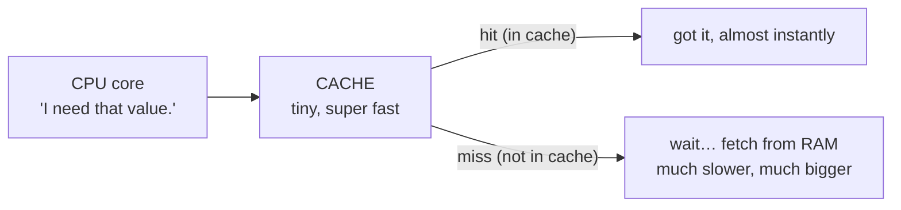

# The CPU — the Worker

The CPU is where the work actually happens. Everything else in your computer exists to feed it or to remember things for it. People talk about the CPU like it's a brain, and that's not wrong, but it sets the wrong expectation — a brain sounds clever and intuitive. The CPU is the opposite: it is staggeringly *simple* and staggeringly *fast*. It does tiny, dull steps, one at a time, billions of times a second. The speed is the whole trick.

Let's make that concrete, then decode every CPU spec you'll ever see.

## What the CPU actually does: one loop, repeated

**What it actually is.** The CPU (Central Processing Unit, also just called the **processor**) is a chip that does one thing in a loop: it grabs the next instruction, carries it out, then grabs the next one. That loop has a name — the **fetch-execute cycle** — and it never stops while the computer is on.

📝 **Terminology.** An *instruction* is one tiny step the CPU knows how to do: "add these two numbers," "copy this value over here," "if that number is zero, jump to a different instruction." Programs aren't single grand commands — they're long lists of these tiny steps. Your CPU runs through them the way you'd follow a recipe, one line at a time.

**What it does in real life.** Round and round the loop goes:


One trip around that loop is incredibly small — "add 3 and 5." But a modern CPU makes that trip an enormous number of times every second, so those tiny steps add up to a video playing, a game running, a page loading. The CPU never gets bored and never speeds up because the task is interesting; it just runs the loop, relentlessly.

**Why this saves you later.** Once you picture the CPU as "a thing running a list of tiny steps very fast," a lot of mysteries dissolve. "Why is my fan loud and my laptop hot?" — something is keeping the CPU running its loop hard, so it's burning energy as heat. "Why did the app freeze?" — the CPU is stuck grinding through a list of steps that's taking far longer than expected. The CPU isn't being temperamental; it's doing exactly what it always does, just a lot of it.

## Spec #1: Clock speed (GHz) — how fast the loop runs

**What it actually is.** The CPU does its steps in time with a steady internal heartbeat called the **clock**. Each tick of that clock is a moment the CPU can do a piece of work. **Clock speed** is how many ticks happen per second, and it's measured in **gigahertz (GHz)**.

📝 **Terminology.** "Hertz" means "times per second." *Giga* means *billion*. So **1 GHz = one billion ticks per second.** A CPU advertised at, say, 3.5 GHz is ticking about three and a half billion times every second. (That's an illustrative number to picture the scale, not a claim about any specific chip.)

**Why people get this wrong.** The tempting belief is "higher GHz = faster computer, always." It's a reasonable guess, and it's *partly* true — for two chips that are otherwise identical, the one with the higher clock speed does more loops per second and finishes the same work sooner. But GHz only tells you how *fast the heartbeat ticks*, not how much useful work gets done per tick. A newer CPU design can do more per tick than an older one, so a newer 3.0 GHz chip can outrun an older 3.5 GHz chip. GHz is a real number, but it only compares fairly within the same generation and family.

**Why this saves you later.** When you see two laptops and one boasts a bigger GHz number, you now know that number is *one* input, not the verdict. And it explains "turbo boost" or a CPU "ramping up": when there's heavy work, the chip can tick faster for a while (and run hotter); when it's idle, it slows the heartbeat down to save battery and stay cool.

## Spec #2: Cores — how many can work at once

**What it actually is.** For a long time a CPU had exactly one worker running one fetch-execute loop. A **core** is one complete worker — one of those loops. A modern CPU packs several cores onto one chip, so it can run several loops genuinely at the same time. "Quad-core" means four workers; "8-core" means eight.

**What it does in real life.** Think of the difference between one cashier and four cashiers. One cashier serves customers one at a time, very fast — but still one at a time. Four cashiers serve four people *simultaneously*. More cores means your computer can truly do several things at once: compress a video on one core while you browse on another while music decodes on a third.

```text
   One core (one worker):          Four cores (four workers):

   task A ─┐                        task A ─► [core 1]
   task B ─┼─► [core] one at        task B ─► [core 2]  all four
   task C ─┤    a time, very        task C ─► [core 3]  at the
   task D ─┘    fast                task D ─► [core 4]  same time
```

**Why people get this wrong.** "More cores = faster everything." Not quite. Extra cores only help when the work can be split into pieces that run side by side. Some tasks split beautifully — video editing, compiling code, running many apps at once. But a single task that has to happen in order — step 2 needs the result of step 1 — can't be spread across cores; it runs on one core no matter how many you have. ⚠️ This is the classic spec-sheet trap: a 16-core chip will not make a program that only knows how to use one core any faster. Many everyday programs lean mostly on one or two cores.

> 💡 **Key point.** **GHz** is how fast *one* worker goes. **Cores** is how *many* workers you have. Fast single tasks want high GHz; lots-of-things-at-once and splittable jobs want more cores. Most real computers benefit from a sensible amount of both, not a giant pile of one.

**Why this saves you later.** Next time you're choosing hardware, you can match it to what you do. If you run one heavy app that does things in strict order, raw per-core speed matters most. If you keep thirty tabs, a chat app, a music player, and a video call all alive at once, more cores keeps them from stepping on each other.

## Spec #3: Cache — the sliver of ultra-fast memory on the chip

This one's quieter — it's rarely a headline spec — but it explains a lot, so meet it gently.

**What it actually is.** The CPU runs its loop far faster than RAM (the main memory, which gets its own phase next) can hand it data. If the CPU had to wait on RAM for every single step, it would spend most of its time idle, tapping its foot. So chip designers put a tiny amount of *extremely* fast memory right on the CPU itself, inches from the work. That's the **cache**. It holds the handful of things the CPU is using right now and is likely to need again in a moment.

**What it does in real life.** Before reaching all the way out to RAM, the CPU checks its cache first. If what it needs is already there (a "cache hit"), it gets it almost instantly and the loop keeps humming. If it's not (a "cache miss"), the CPU has to wait while the data is fetched from the slower RAM. Good caching is why a CPU can stay busy instead of constantly waiting.



**Why this matters even though you won't shop for it.** Cache is your first glimpse of the big idea this whole guide is building toward: a computer keeps the data the CPU needs *close* to the CPU, in small fast memory, and keeps the rest *further away* in bigger, slower memory. Cache is the closest, smallest, fastest rung. RAM is the next rung out. Storage is further still. We'll draw that full ladder — the **memory hierarchy** — in [Phase 3](03-storage-the-filing-cabinet.md). For now, just hold onto the shape: *closer to the CPU = faster but smaller; further away = bigger but slower.*

## What the CPU spec line actually buys you

When you read "8-core, 3.5 GHz" on an ad, you can now translate it:

- **GHz** — how fast each worker runs its loop. Higher helps *within the same chip generation*; it isn't a fair score across generations.
- **Cores** — how many workers run at once. More helps for doing-many-things and for tasks that split into parallel pieces; it does nothing for a single in-order task.
- **Cache** — the unadvertised sliver of fast memory that keeps the workers fed. You won't pick a computer by it, but it's why a CPU isn't constantly stalled waiting on RAM.

## Recap

1. The **CPU** runs your programs by repeating one tiny loop — **fetch, decode, execute** — billions of times a second. It's simple and fast, not clever.
2. **Clock speed (GHz)** is how fast that loop ticks. Higher is faster *only* when comparing similar chips — it measures heartbeat, not work-per-tick.
3. **Cores** are how many loops run at once. More cores help with many-things-at-once and splittable work, but not with a single task that must run in order.
4. **Cache** is a tiny patch of ultra-fast memory on the chip that keeps the CPU fed, so it isn't always waiting on slower RAM — your first taste of the memory hierarchy.

The CPU is the worker. But a worker needs a workspace to spread out the things it's using right now — and that's RAM, next.

## Watch the clock

Clock speed isn't just a spec-sheet number - it's a real, continuous signal ticking billions of times a second. Watch it, and see what an unstable clock looks like:

```explainer-clock
```

Watch it animated: [CPU cache](/explainers/CPUCache.dc.html) and [multicore processing](/explainers/Multicore.dc.html)

---

[← Guide overview](_guide.md) · [Phase 2: RAM — the Workspace →](02-ram-the-workspace.md)
