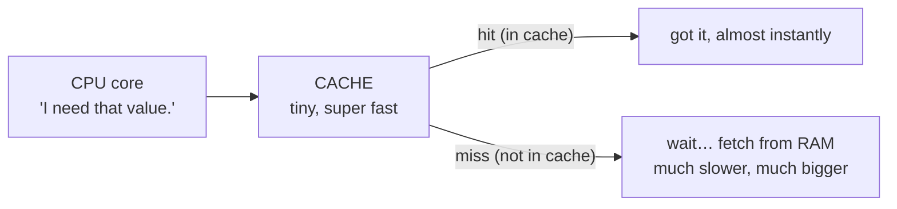

# The CPU — the Worker

The CPU is where the work actually happens — everything else in your computer exists to feed it or remember things for it. People call it a brain, but a brain sounds clever and intuitive. The CPU is the opposite: staggeringly *simple* and staggeringly *fast*. It does tiny, dull steps, one at a time, billions of times a second. The speed is the whole trick.

## What the CPU actually does: one loop, repeated

The CPU (Central Processing Unit, also just called the **processor**) is a chip that does one thing in a loop: grab the next instruction, carry it out, grab the next one. That loop is the **fetch-execute cycle**, and it never stops while the computer is on.

📝 **Terminology.** An *instruction* is one tiny step the CPU knows how to do: "add these two numbers," "copy this value over here," "if that number is zero, jump to a different instruction." Programs are long lists of these steps, and the CPU follows them like a recipe, one line at a time.


One trip around the loop is tiny — "add 3 and 5" — but the CPU makes an enormous number of trips every second, so those steps add up to a video playing, a game running, a page loading.

This picture dissolves a lot of mysteries. "Why is my fan loud and my laptop hot?" — something is keeping the CPU running its loop hard, and that burns energy as heat. "Why did the app freeze?" — the CPU is grinding through a list of steps taking far longer than expected. Not temperamental; just busy.

## Spec #1: Clock speed (GHz) — how fast the loop runs

The CPU steps in time with a steady internal heartbeat called the **clock**. Each tick is a moment the CPU can do a piece of work; **clock speed** is how many ticks happen per second, measured in **gigahertz (GHz)**.

📝 **Terminology.** "Hertz" means "times per second," and *giga* means *billion* — so **1 GHz = one billion ticks per second.** A CPU advertised at 3.5 GHz ticks about three and a half billion times a second. (Illustrative number to picture the scale, not a claim about any specific chip.)

The tempting belief — "higher GHz = faster computer, always" — is only *partly* true: for two otherwise-identical chips, the higher clock finishes the same work sooner. But GHz measures how fast the heartbeat ticks, not how much useful work gets done per tick — a newer 3.0 GHz design can outrun an older 3.5 GHz one. GHz compares fairly only within the same generation and family.

This also explains "turbo boost": under heavy work the chip ticks faster for a while (and runs hotter); when idle, it slows the heartbeat to save battery and stay cool.

## Spec #2: Cores — how many can work at once

A **core** is one complete worker — one fetch-execute loop. CPUs used to have exactly one; a modern chip packs several: "quad-core" means four workers, "8-core" means eight, all running genuinely at the same time.

Think one cashier versus four: one serves customers one at a time, very fast — but still one at a time. Four serve four people *simultaneously*. More cores means your computer can compress a video on one core while you browse on another while music decodes on a third.

```text
   One core (one worker):          Four cores (four workers):

   task A ─┐                        task A ─► [core 1]
   task B ─┼─► [core] one at        task B ─► [core 2]  all four
   task C ─┤    a time, very        task C ─► [core 3]  at the
   task D ─┘    fast                task D ─► [core 4]  same time
```

The other trap: "more cores = faster everything." Extra cores only help when the work splits into pieces that run side by side. Video editing, compiling code, and running many apps at once split beautifully. A single task that must happen in order — step 2 needs step 1's result — runs on one core no matter how many you have. ⚠️ This is the classic spec-sheet trap: a 16-core chip won't speed up a program that only knows how to use one core, and many everyday programs lean on just one or two.

> 💡 **Key point.** **GHz** is how fast *one* worker goes. **Cores** is how *many* workers you have. Fast single tasks want high GHz; lots-of-things-at-once and splittable jobs want more cores. Most real computers benefit from a sensible amount of both, not a giant pile of one.

So match the hardware to what you do: one heavy app that works in strict order wants raw per-core speed; thirty tabs plus a chat app, music, and a video call wants more cores so they don't step on each other.

## Spec #3: Cache — the sliver of ultra-fast memory on the chip

Rarely a headline spec, but it explains a lot. The CPU loops far faster than RAM (the main memory — next phase) can hand it data; waiting on RAM for every step would leave it mostly idle. So designers put a tiny amount of *extremely* fast memory right on the chip: the **cache**. It holds what the CPU is using right now and will likely need again in a moment.

Before reaching out to RAM, the CPU checks its cache first. Already there — a "cache hit" — and it gets it almost instantly. Not there — a "cache miss" — and the CPU waits while the data is fetched from slower RAM. Good caching is why a CPU stays busy instead of constantly waiting.



Cache is your first glimpse of the idea this whole guide builds toward: keep the data the CPU needs *close*, in small fast memory, and the rest *further away* in bigger, slower memory. Cache is the closest, fastest rung; RAM is the next; storage is further still. We'll draw the full ladder — the **memory hierarchy** — in [Phase 3](03-storage-the-filing-cabinet.md). For now: *closer to the CPU = faster but smaller; further away = bigger but slower.*

## What the CPU spec line actually buys you

When an ad says "8-core, 3.5 GHz," you can translate:

- **GHz** — how fast each worker runs its loop. Higher helps *within the same chip generation*; it isn't a fair score across generations.
- **Cores** — how many workers run at once. More helps for many-things-at-once and parallel work; it does nothing for a single in-order task.
- **Cache** — the unadvertised sliver of fast memory that keeps the workers fed instead of stalled waiting on RAM.

## Recap

1. The **CPU** runs programs by repeating one tiny loop — **fetch, decode, execute** — billions of times a second. Simple and fast, not clever.
2. **Clock speed (GHz)** is how fast that loop ticks. Higher is faster *only* between similar chips — it measures heartbeat, not work-per-tick.
3. **Cores** are how many loops run at once. They help splittable and many-at-once work, not a single task that must run in order.
4. **Cache** is a tiny patch of ultra-fast on-chip memory that keeps the CPU fed instead of waiting on RAM — your first taste of the memory hierarchy.

The CPU is the worker. A worker needs a workspace to spread out what it's using right now — that's RAM, next.

## Watch the clock

Clock speed isn't just a spec-sheet number - it's a real, continuous signal ticking billions of times a second. Watch it, and see what an unstable clock looks like:

```explainer-clock
```

Watch it animated: [CPU cache](/explainers/CPUCache.dc.html) and [multicore processing](/explainers/Multicore.dc.html)

---

[← Guide overview](_guide.md) · [Phase 2: RAM — the Workspace →](02-ram-the-workspace.md)
