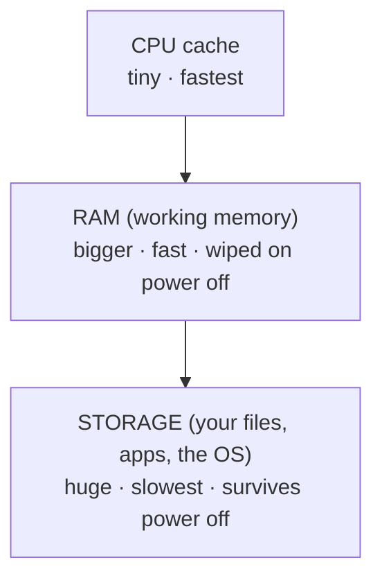

# Storage - the Filing Cabinet

The CPU does the work. RAM is the desk it works on. But the desk gets wiped every time the power goes off - so where do your photos, documents, apps, and the operating system actually *live*? That permanent home is **storage**, the last of our three parts. We'll cover its two numbers, then assemble cache, RAM, and storage into the **memory hierarchy**.

## What storage actually is

**Storage** is where data is kept when nothing's using it - including when the power is off. The OS, every app, every file you've saved sit there waiting. Open something and the computer copies the needed parts *from* storage *into* RAM; save, and changes are written back.

📝 **Terminology.** Storage is *non-volatile* - the opposite of RAM. It keeps its contents without power: pull the plug, come back tomorrow, it's all still there. That permanence is storage's entire reason for existing. (You'll also hear "the disk" or "the drive," and on a spec sheet it's usually an "SSD" with a size like 512 GB.)

This is the other half of the "save your work" story: saving is the moment your work crosses from temporary RAM - the desk that gets wiped - into the cabinet that remembers. That's why a saved document survives a crash and an unsaved one doesn't.

## The two numbers: capacity vs speed

**Capacity - how much it holds.** The big advertised number: "512 GB," "1 TB," "2 TB." It tells you how many photos, videos, apps, and files fit - and *nothing* about how fast they come and go. A bigger cabinet holds more folders; it doesn't make you walk to it any faster.

📝 **Terminology.** Sizes climb in roughly thousand-fold steps: **GB** (gigabyte) → **TB** (terabyte, about a thousand GB). A "512 GB SSD" is a storage *capacity*.

**Speed - how fast it hands data over.** How quickly storage delivers data to RAM (and accepts it back). It's why one computer boots in seconds and another grinds for a minute, and why a big app opens instantly on one machine and crawls on another. Capacity and speed are independent: a drive can be huge and slow, or smaller and fast.

> ⚠️ **Gotcha - capacity is not speed.** People buy a 2 TB drive expecting a speed-up and are puzzled when nothing feels snappier - they bought *room*, not *pace*. What makes storage feel fast is the *type* of drive.

Whether your drive is an old-style spinning hard disk, a modern SSD, or a faster-still NVMe drive matters far more for speed than its capacity does.

> ⏭️ Want the insides - spinning platters vs flash chips, and why NVMe is so much faster? That's [Storage: HDD vs SSD vs NVMe](/guides/storage-hdd-ssd-nvme). This phase keeps storage at the "what it does and where it fits" level.

## The big idea: the memory hierarchy

A pattern kept surfacing across this guide: data the CPU needs *right now* lives somewhere small and fast (cache), data in active use somewhere bigger and a bit slower (RAM), everything else somewhere huge and slower still (storage). That arrangement is deliberate: the **memory hierarchy**.

Why it exists - the trade nobody can escape: fast memory is expensive and physically can't be made huge; huge memory is cheap but slow. No single memory is instantly fast, enormous, *and* permanent. So computers layer several kinds, each trading speed for size as you move away from the CPU.

Climb *up* toward the CPU: faster, but far less room. Slide *down*: vastly more room, slower access. The whole machine works to keep what the CPU needs *now* as high up as possible - storage into RAM, RAM into cache - so the worker rarely waits on the slow layers.

This picture explains everything the three phases built:

- **Cache misses** (Phase 1) - the CPU wanted something not in the fastest rung, so it reached down to RAM and waited.
- **Swapping** (Phase 2) - RAM filled, the OS pushed data *down* to the slow storage rung, and everything dragged.
- **Boot and load times** (this phase) - starting up or opening an app hauls data *up* from storage into RAM, which is why the bottom rung's *speed* shapes how fast the machine feels.

> 💡 **Key point.** Fast feeling = the data the CPU needs is high in the hierarchy (cache or RAM). Slow feeling = the CPU keeps reaching down to the slow bottom rung. "More GHz, more cores, more RAM, a faster SSD" are all, at heart, ways of keeping the worker fed from the fast layers.

## What the storage spec actually buys you

- **Capacity (GB / TB)** - how *much* you can keep. Pick it for how many photos, videos, apps, and files you own. Not a speed number.
- **Drive type (HDD / SSD / NVMe)** - how *fast* storage hands data over, shaping boot times and app opens. Matters more for speed than capacity - see the [storage deep-dive](/guides/storage-hdd-ssd-nvme).

## Recap

1. **Storage is the filing cabinet** - big, permanent, *non-volatile*. It keeps the OS, apps, and files even with the power off.
2. **Capacity and speed are different numbers.** Capacity (GB/TB) is how much fits; speed is how fast it delivers. More capacity does not mean a faster computer.
3. **The type of drive drives the speed** - far more than its size: [HDD vs SSD vs NVMe](/guides/storage-hdd-ssd-nvme).
4. **The memory hierarchy ties it together:** cache → RAM → storage, each bigger but slower, because no single memory can be fast, huge, and permanent at once.
5. **"Fast" means the CPU's data sits high in that hierarchy** - every spec you compare is really about keeping the worker fed from the fast layers.

That's the trio: CPU does the work, RAM is the workspace, storage is the permanent home - and the memory hierarchy is why they're arranged this way. When a computer feels fast or slow, you now know which part to look at.

---

[← Phase 2: RAM - the Workspace](02-ram-the-workspace.md) · [Guide overview](_guide.md)
