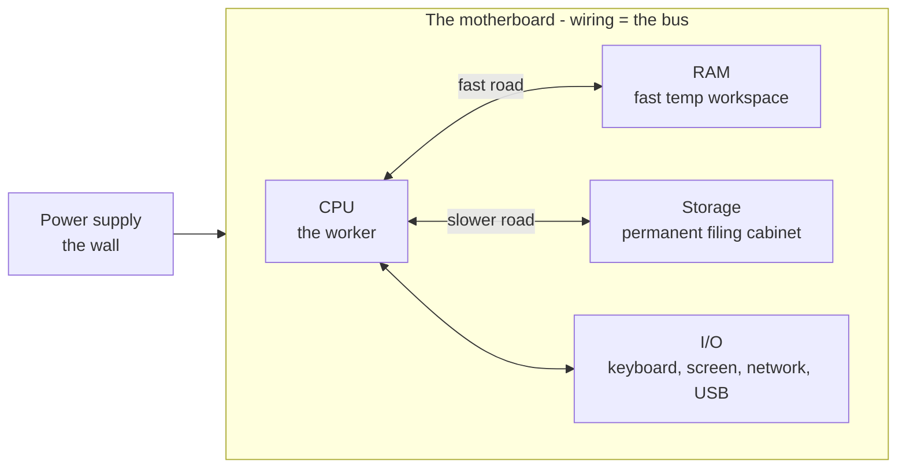

# The Parts and What They Do

One idea underpins the whole machine:

> 💡 **Key point.** A computer is a machine that **follows a list of instructions, one after another, very fast.** That's it. Everything inside exists to store those instructions, fetch them, run them, and remember the results. The "very fast" is what makes a dumb list of steps feel like magic - modern computers run billions of tiny steps per second.

Seen that way, each part has an obvious job: do the steps, hold the data in use, remember it after power-off, connect it all.

## The big picture first

The whole cast on one page - just a few boxes, all connected by the same wiring.



The **CPU** does the work, **RAM** is the fast workspace, **storage** is the permanent filing cabinet, the **motherboard** (and its **bus**) is the wiring that connects everything, and **power** plus **I/O** keep it running and let you talk to it. One at a time.

## The CPU - the worker that does the calculating

The **CPU** (Central Processing Unit, also called "the processor") is the part that actually *does* the instructions - reading each step and carrying it out: add these two numbers, compare them, move this byte over there. Nothing clever, nothing creative; very simple steps, astonishingly fast.

📝 **Terminology.** *CPU* = Central Processing Unit, the chip that executes instructions. People also say "the processor." The brand names you've seen - Intel Core, AMD Ryzen, Apple M-series, Snapdragon - are all CPUs.

The CPU isn't a "brain" that *understands* what you're doing - it's a tireless clerk following tiny, exact orders, billions of times faster than you can think. The cleverness lives in the *instructions* (the software); the CPU just runs them.

Everything your computer does - drawing this text, playing a video, loading a webpage - is the CPU running millions of these tiny steps. "This CPU has 8 cores" means eight clerks working on eight piles at once (more in [Phase 3](03-fast-vs-slow.md)). And "my CPU is at 100%" just means the worker is fully busy - more work piled up than it can get through.

## RAM - the fast temporary workspace

**RAM** (memory) is where the computer keeps what it's actively using *right now* - the top of a desk. The CPU can reach it almost instantly, so anything it's working on lives there: the open app, the document you're editing, the webpage on your screen.

📝 **Terminology.** *RAM* = Random-Access Memory. "Memory" and "RAM" mean the same thing in everyday use. It's measured in gigabytes (GB) - common laptops have 8, 16, or 32 GB.

The single most common mix-up in all of computing is confusing RAM with storage - memory with disk. Both hold "your stuff," but they do opposite jobs:

```text
   RAM (memory)                      STORAGE (disk / SSD)
   ─────────────                     ─────────────────────
   the desk you work on              the filing cabinet
   FAST                              SLOWER
   small (a few GB)                  big (hundreds of GB)
   FORGETS when power goes off  ←──  REMEMBERS when power goes off
```

The line that matters most: **RAM forgets everything when the power goes off; storage remembers.** That's why an unsaved document vanishes if your laptop dies - it was only ever on the desk (RAM), never filed away (storage). "Saving" means copying it from the fast-but-forgetful desk into the slow-but-permanent cabinet.

Opening an app pulls it out of storage onto the desk (RAM) so the CPU can get at it quickly. More RAM = more open at once before the desk runs out - which, as we'll see, is exactly when things get slow.

⚠️ **Gotcha.** "More memory" on a phone or laptop ad sometimes means storage, not RAM - sellers blur the two on purpose. RAM is the small, fast workspace; storage is the big, permanent cabinet. If the number is in the hundreds of GB, it's storage.

## Storage - the permanent filing cabinet

**Storage** (the disk, or on modern machines the **SSD**) is where everything is kept *permanently* - your files, your photos, your apps, and the operating system itself - even when the power is off. That's why your files are still there in the morning.

📝 **Terminology.** *SSD* = Solid-State Drive, the fast modern kind of storage with no moving parts. *HDD* = Hard Disk Drive, the older kind with a spinning magnetic platter - cheaper and bigger, but much slower. Both are "storage." Measured in gigabytes (GB) or terabytes (TB).

Nothing the CPU works on lives *directly* in storage - it's too slow for that. Things get copied from storage into RAM when you need them, worked on there, and copied back when you save. Storage is the warehouse; RAM is the workbench. The journey between them is the heart of [Phase 2](02-running-a-program.md).

This also separates two problems people conflate. A full *disk* means the filing cabinet is stuffed - you can't save new files. Out of *memory* means the desk is crowded - things slow down but nothing is lost. Delete files for the first; close apps for the second.

## The motherboard and the bus - the roads connecting everything

The **motherboard** is the big flat board that everything else plugs into: the CPU sits on it, the RAM slots into it, storage and all the ports connect to it. Running through the board is the wiring that carries data between the parts - collectively called the **bus**. The bus is the set of roads; the parts are the buildings.

A number the CPU needs travels from RAM across the bus; a file you save crosses it from RAM to storage. You don't manage this plumbing, but the *speed* of those roads is part of why some parts feel fast and others slow.

## Power and I/O - keeping it alive and letting you in

**Power** is the simplest: the **power supply** takes electricity from the wall (or the battery) and feeds it to everything on the motherboard at the right levels. No power, no instructions, no computer.

**I/O** stands for **Input/Output** - every part that lets information get *in* (keyboard, mouse, touchscreen, microphone) or *out* (screen, speakers), plus the network and the USB ports. Your keyboard is input; your screen is output; the network is both. To the CPU, all of these are just more things to read from and write to.


Information flows *in*, the machine works on it, results flow *out* - the shape of every program you'll ever run.

## Recap

1. A computer is a machine that **follows instructions one after another, very fast**. Every part serves that one job.
2. The **CPU** is the worker that does the instructions - fast and tireless, but not clever on its own.
3. **RAM** is the fast temporary workspace (the desk). Quick, but **forgets** when power goes off.
4. **Storage** (SSD/disk) is the permanent filing cabinet - slower, bigger, and it **remembers**. Saving means copying from RAM to storage.
5. The **motherboard** holds everything, and its **bus** is the wiring that carries data between the parts.
6. **Power** keeps it alive; **I/O** (keyboard, screen, network, ports) lets information in and out.

Now let's watch the parts cooperate - next we follow a single program from the filing cabinet into the worker's hands.

---

[← Guide overview](_guide.md) · [Phase 2: How They Work Together to Run a Program →](02-running-a-program.md)

## Try it yourself

Everything inside is binary. Convert between bases and try a bitwise operation:

```playground-base
42
```
