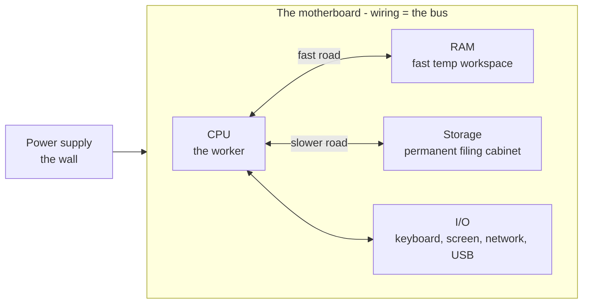

# The Parts and What They Do

Before we name a single part, let's install the one idea the whole machine rests on. Hold onto this and everything else falls into place:

> 💡 **Key point.** A computer is a machine that **follows a list of instructions, one after another, very fast.** That's it. Everything inside exists to store those instructions, fetch them, run them, and remember the results. The "very fast" is what makes a dumb list of steps feel like magic - modern computers run billions of tiny steps per second.

Once you see the machine that way, each part has an obvious purpose: *something* has to do the steps, *something* has to hold the data being worked on right now, *something* has to remember it after the power goes off, and *something* has to connect them. Let's meet them.

## The big picture first

Here's the whole cast on one page. Don't worry about the details yet - just notice that there are only a few boxes, and they're all connected by the same wiring.



Five things to know: the **CPU** does the work, the **RAM** is the fast workspace, **storage** is the permanent filing cabinet, the **motherboard** (and its **bus**) is the wiring that connects everything, and **power** plus **I/O** keep it running and let you talk to it. Now let's take them one at a time.

## The CPU - the worker that does the calculating

**What it actually is.** The **CPU** (Central Processing Unit, also called "the processor") is the part that actually *does* the instructions. It's the worker. When the computer "follows a list of steps," the CPU is the thing reading each step and carrying it out - add these two numbers, compare them, move this byte over there, and so on. It does nothing clever and nothing creative; it does very simple steps, but it does them astonishingly fast.

📝 **Terminology.** *CPU* = Central Processing Unit, the chip that executes instructions. People also say "the processor." The brand names you've seen - Intel Core, AMD Ryzen, Apple M-series, Snapdragon - are all CPUs.

**Why people get this wrong.** It's tempting to imagine the CPU as the computer's "brain" that *understands* what you're doing. It doesn't understand anything. It's more like a tireless clerk who can only follow tiny, exact orders but never gets bored, never gets tired, and works billions of times faster than you can think. The cleverness lives in the *instructions* (the software); the CPU just runs them.

**What it does in real life.** Every single thing your computer does - drawing this text, playing a video, loading a webpage - is the CPU running through millions of these tiny steps. When you hear "this CPU has 8 cores," that means it's like having 8 of those clerks working side by side, so they can do eight piles of work at once. We'll come back to cores in [Phase 3](03-fast-vs-slow.md).

**Why this saves you later.** Once you know the CPU is the part that *does the work*, "my CPU is at 100%" stops being scary jargon. It means the worker is fully busy - there's more work piled up than it can get through right now. That's the whole story.

## RAM - the fast temporary workspace

**What it actually is.** **RAM** (memory) is the workspace where the computer keeps the stuff it's actively using *right now*. Think of it as the top of a desk. The CPU can reach things on the desk almost instantly, so anything it's working on lives there: the app you have open, the document you're editing, the webpage on your screen.

📝 **Terminology.** *RAM* = Random-Access Memory. "Memory" and "RAM" mean the same thing in everyday use. It's measured in gigabytes (GB) - common laptops have 8, 16, or 32 GB.

**Why people get this wrong.** The single most common mix-up in all of computing is confusing RAM with storage - memory with disk. They sound similar and both hold "your stuff," but they do opposite jobs:

```text
   RAM (memory)                      STORAGE (disk / SSD)
   ─────────────                     ─────────────────────
   the desk you work on              the filing cabinet
   FAST                              SLOWER
   small (a few GB)                  big (hundreds of GB)
   FORGETS when power goes off  ←──  REMEMBERS when power goes off
```

The line that matters most: **RAM forgets everything when the power goes off; storage remembers.** That's why an unsaved document vanishes if your laptop dies - it was only ever on the desk (RAM), never filed away (storage). "Saving" means copying it from the fast-but-forgetful desk into the slow-but-permanent cabinet.

**What it does in real life.** When you open an app, the computer pulls it out of storage and lays it out on the desk (RAM) so the CPU can get at it quickly. The more RAM you have, the more you can have open and spread out at once without the computer running out of desk space - which, as we'll see, is exactly when things get slow.

⚠️ **Gotcha.** "More memory" on a phone or laptop ad sometimes means storage, not RAM - sellers blur the two on purpose because most people don't know the difference. Now you do: RAM is the small, fast workspace; storage is the big, permanent cabinet. If the number is in the hundreds of GB, it's storage.

## Storage - the permanent filing cabinet

**What it actually is.** **Storage** (the disk, or on modern machines the **SSD**) is where everything is kept *permanently* - your files, your photos, your apps, and the operating system itself. It's the filing cabinet. Unlike RAM, it holds onto everything even when the power is off. That's why your files are still there in the morning.

📝 **Terminology.** *SSD* = Solid-State Drive, the fast modern kind of storage with no moving parts. *HDD* = Hard Disk Drive, the older kind with a spinning magnetic platter - cheaper and bigger, but much slower. Both are "storage." Measured in gigabytes (GB) or terabytes (TB).

**What it does in real life.** Nothing the CPU works on lives *directly* in storage - it's too slow for that. Instead, things get copied from storage into RAM when you need them, worked on there, and copied back when you save. Storage is the warehouse; RAM is the workbench. The journey between them is the heart of [Phase 2](02-running-a-program.md).

**Why this saves you later.** "My disk is full" and "I'm out of memory" are completely different problems. A full *disk* means the filing cabinet is stuffed - you can't save new files. Being out of *memory* means the desk is crowded - things slow down but nothing is lost. Knowing which one you're hitting tells you whether to delete files (disk) or close apps (memory).

## The motherboard and the bus - the roads connecting everything

**What it actually is.** The **motherboard** is the big flat board that everything else plugs into. The CPU sits on it, the RAM slots into it, storage connects to it, and so do all the ports you plug things into. Running through the board is the wiring that carries data between the parts - collectively called the **bus**. The bus is the set of roads; the parts are the buildings.

📝 **Terminology.** *Motherboard* = the main circuit board that connects all the components. *Bus* = the wiring that data travels along between them. You rarely think about the bus directly, but it's why "everything is connected."

**What it does in real life.** When the CPU needs a number that's sitting in RAM, that number travels across the bus to reach it. When you save a file, the data travels across the bus from RAM to storage. Every part talks to every other part over these roads. You don't manage any of this - it's the plumbing - but it's worth knowing it's there, because the *speed* of those roads is part of why some parts feel fast and others feel slow.

## Power and I/O - keeping it alive and letting you in

Two supporting characters round out the cast.

**Power** is the simplest: the **power supply** takes electricity from the wall (or the battery) and feeds it to everything on the motherboard at the right levels. No power, no instructions, no computer. That's the whole job.

**I/O** stands for **Input/Output** - every part that lets information get *in* (keyboard, mouse, touchscreen, microphone) or *out* (screen, speakers), plus the network and the USB ports where you plug things in. To the CPU, all of these are just more things to read from and write to.

📝 **Terminology.** *I/O* = Input/Output: anything the computer uses to take information in or send it out. Your keyboard is input; your screen is output; the network is both.


That picture - information flows *in*, the machine does work on it, results flow *out* - is the shape of every program you'll ever run.

## Recap

1. A computer is a machine that **follows instructions one after another, very fast**. Every part serves that one job.
2. The **CPU** is the worker that actually does the instructions - fast and tireless, but not clever on its own.
3. **RAM** is the fast temporary workspace (the desk). It's quick but **forgets** when power goes off.
4. **Storage** (SSD/disk) is the permanent filing cabinet - slower, bigger, and it **remembers**. Saving means copying from RAM to storage.
5. The **motherboard** holds everything, and its **bus** is the wiring that carries data between the parts.
6. **Power** keeps it alive; **I/O** (keyboard, screen, network, ports) lets information in and out.

Now that you can name the parts, let's watch them cooperate - next we follow a single program from the filing cabinet all the way into the worker's hands.

---

[← Guide overview](_guide.md) · [Phase 2: How They Work Together to Run a Program →](02-running-a-program.md)

## Try it yourself

Everything inside is binary. Convert between bases and try a bitwise operation:

```playground-base
42
```
