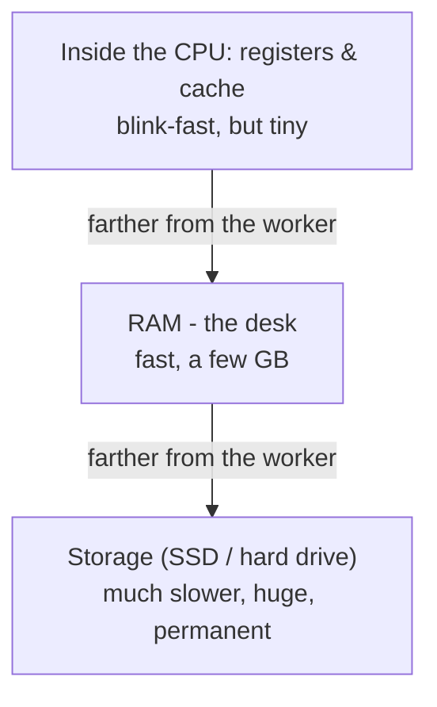

# How They Work Together to Run a Program

In [Phase 1](01-the-parts.md) you met the parts. Now let's see them do the one thing the whole machine is for: running a program. We'll follow a single app - say, a music player - from the moment you double-click its icon to the moment sound comes out of your speakers. The parts don't work in isolation; they hand work to each other in a steady relay, and that relay is what "running a program" actually is.

## First: what is a program, really?

**What it actually is.** A **program** is a list of instructions saved as a file in storage. When it's just sitting there, not running, it's like a recipe in a closed cookbook - a set of steps written down, doing nothing. It only *does* something when those steps are read out and carried out.

📝 **Terminology.** *Program* = the instructions sitting in storage, not running (the recipe). A *running* program - loaded into RAM with the CPU working through it - is often called a **process** (the meal being cooked). Same recipe, but now something's actually happening.

This distinction is the key to the whole journey: a program has to be *moved* from where it's kept (storage) to where it can be *used* (RAM), before the worker (CPU) can do anything with it.

## The journey: from filing cabinet to worker

Here's the relay, start to finish, when you open that music player:

Step 2 is the part most people have never been told. **The CPU can't run a program straight from storage** - storage is far too slow to feed the worker one instruction at a time. So the first thing that happens when you open *anything* is a copy: the program's instructions get pulled up from the filing cabinet onto the desk, where the CPU can reach them fast. The little spinning icon you see when a big app is "loading"? That's largely this copy happening.

## The heartbeat: fetch, then execute

**What it actually is.** Once the program is in RAM, the CPU does the same simple loop, forever, for every program running:

That's the entire job of a CPU: **fetch the next instruction, execute it, move on, repeat** - at a pace of billions of times per second. Each individual step is tiny ("add these two numbers," "compare these," "put this result over there"). There's no grand plan inside the CPU. The plan is the program; the CPU just walks through it relentlessly.

💡 **Key point.** Everything your computer does is this loop running underneath: fetch an instruction, do it, fetch the next. When a game feels alive or a video plays smoothly, that's the CPU racing through this loop so fast that the results blur into motion - like a flipbook flipped fast enough to look like film.

**Why this saves you later.** "What is my computer even doing right now?" has a real answer: its CPU is running this fetch-execute loop through the instructions of whatever programs are open. When a program "hangs" or "freezes," it usually means its instructions told the CPU to wait for something (a file, the network) that hasn't arrived - the worker is stuck on one step, waiting.

## Why there's a hierarchy: fast, slower, much slower

Here's the idea that makes sense of *everything* about computer speed. The parts that hold data aren't equally fast. There's a ladder, and the rule is brutally simple: **the closer to the CPU, the faster - and the smaller and more expensive.**

The gaps between these rungs are enormous - not a little slower, but dramatically slower at each step down. Reaching into the CPU's own scratchpad is near-instant; reaching into RAM is quick; reaching all the way down to storage is slow enough that the CPU would spend most of its time *waiting* if it had to work from there.

📝 **Terminology.** This ladder is called the **memory hierarchy**. The tiny ultra-fast storage inside the CPU is called **cache** - a small stash of the data the CPU expects to need next, kept right where it can grab it.

**Why the ladder exists - the trade-off.** Why not make all of memory as fast as the CPU's scratchpad? Because fast memory is expensive and can only be made in small amounts. Slow memory is cheap and can be made huge. So computers use a bit of each: a tiny amount of blink-fast memory for what's needed *this instant*, a few gigabytes of fast RAM for what's needed *soon*, and a big slab of cheap storage for *everything else*. You get speed where it counts and capacity where it doesn't, without paying for either everywhere.

**Why data has to keep moving toward the CPU.** Because the worker can only run fast when its data is close, the computer is constantly shuttling data *up* the ladder - from storage into RAM, from RAM into the CPU's cache - just ahead of when it's needed. When that works, everything is quick. When the data the CPU needs *isn't* nearby and it has to reach all the way down to storage, you feel it: that's the lag when an app you haven't touched in a while takes a beat to respond. It got shuffled down the ladder, and now it has to climb back up.

⚠️ **Gotcha.** This is exactly why a computer that's "out of RAM" gets *painfully* slow instead of stopping. When the desk (RAM) is full, the computer starts parking some of the overflow down in slow storage and fetching it back as needed. Nothing crashes - but now the CPU keeps waiting on the slow filing cabinet, so everything crawls. The fix isn't a faster CPU; it's more desk space (RAM) or fewer things open. More on that in [Phase 3](03-fast-vs-slow.md).

## The whole picture, together

A program lives in the cabinet, gets laid out on the desk, and the worker runs through it step by step - pulling data up the ladder to stay fast, pushing results back out to you, and saving anything that needs to last back down into the cabinet. That relay, repeated billions of times a second, is a computer running.

## Recap

1. A **program** is instructions sitting in storage (a recipe). Running it means a **process**: instructions in RAM with the CPU working through them.
2. Opening anything first **copies it from storage into RAM**, because the CPU can't work fast from the slow filing cabinet.
3. The CPU's whole job is the **fetch-execute loop**: get the next instruction, do it, repeat - billions of times a second.
4. There's a **memory hierarchy**: CPU cache (blink-fast, tiny) → RAM (fast, medium) → storage (slow, huge). Closer to the CPU means faster but smaller.
5. The computer constantly **moves data up the ladder** toward the CPU to stay quick; having to reach down to slow storage is what lag feels like - and it's why being out of RAM makes everything crawl.

You now know what the parts are and how they cooperate. In the last phase, we cash all of this in: what the specs on a laptop mean, and why "my computer is slow" almost always points to one specific part.

---

[← Phase 1: The Parts and What They Do](01-the-parts.md) · [Guide overview](_guide.md) · [Phase 3: Fast vs Slow (and Buying a Computer) →](03-fast-vs-slow.md)
