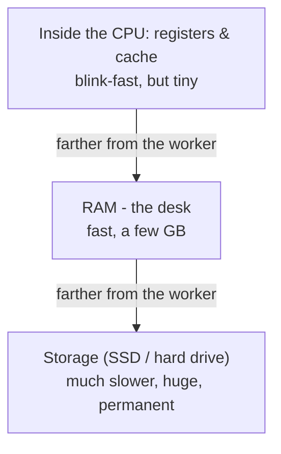
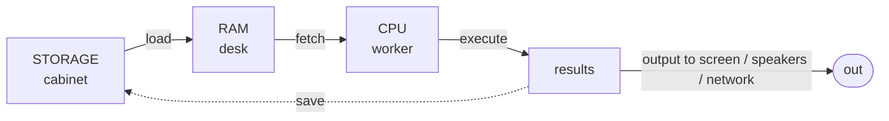

# How They Work Together to Run a Program

You met the parts in [Phase 1](01-the-parts.md). Now we follow a music player from double-click to sound coming out of your speakers: the parts hand work to each other in a steady relay, and that relay *is* "running a program."

## First: what is a program, really?

A **program** is a list of instructions saved as a file in storage. Sitting there, it's a recipe in a closed cookbook - doing nothing until the steps are read out and carried out.

📝 **Terminology.** *Program* = the instructions sitting in storage, not running (the recipe). A *running* program - loaded into RAM with the CPU working through it - is often called a **process** (the meal being cooked).

The whole journey follows from that: a program must be *moved* from storage to RAM before the CPU can do anything with it.

## The journey: from filing cabinet to worker

The relay, start to finish, when you open that music player:

Step 2 is the part most people have never been told: **the CPU can't run a program straight from storage** - it's far too slow to feed the worker. So opening *anything* starts with a copy, pulling the instructions up from the filing cabinet onto the desk. The spinning "loading" icon is largely this copy happening.

## The heartbeat: fetch, then execute

Once the program is in RAM, the CPU runs the same simple loop, forever, for every program:

That's the entire job of a CPU: **fetch the next instruction, execute it, move on, repeat** - billions of times per second. Each step is tiny ("add these two numbers," "compare these," "put this result over there"). There's no grand plan inside the CPU; the plan is the program.

💡 **Key point.** Everything your computer does is this loop running underneath. When a game feels alive or a video plays smoothly, that's the CPU racing through the loop so fast the results blur into motion - a flipbook flipped fast enough to look like film.

It also demystifies freezes: a program "hangs" when its instructions told the CPU to wait for something (a file, the network) that hasn't arrived - the worker is stuck on one step.

## Why there's a hierarchy: fast, slower, much slower

The parts that hold data aren't equally fast. There's a ladder, and the rule is brutally simple: **the closer to the CPU, the faster - and the smaller and more expensive.**

The gaps between rungs are enormous - dramatically slower at each step down. The CPU's own scratchpad is near-instant; RAM is quick; storage is slow enough that the CPU would spend most of its time *waiting* if it worked from there.

📝 **Terminology.** This ladder is the **memory hierarchy**. The tiny ultra-fast storage inside the CPU is **cache** - a small stash of the data the CPU expects to need next, kept right where it can grab it.

Why not make all memory blink-fast? Because fast memory is expensive and only comes in small amounts; slow memory is cheap and huge. So computers use a bit of each: a tiny amount of blink-fast memory for *this instant*, a few gigabytes of RAM for *soon*, and a big slab of cheap storage for *everything else*. Speed where it counts, capacity where it doesn't.

Because the worker only runs fast when its data is close, the computer constantly shuttles data *up* the ladder - storage into RAM, RAM into cache - just ahead of need. When the CPU has to reach all the way down to storage instead, you feel it: the lag when an app you haven't touched in a while takes a beat to respond. It got shuffled down the ladder and has to climb back up.

⚠️ **Gotcha.** This is exactly why a computer that's "out of RAM" gets *painfully* slow instead of stopping. When the desk is full, the computer parks overflow down in slow storage and fetches it back as needed. Nothing crashes - but the CPU keeps waiting on the slow filing cabinet, so everything crawls. The fix isn't a faster CPU; it's more RAM or fewer things open. More in [Phase 3](03-fast-vs-slow.md).

## The whole picture, together

A program lives in the cabinet, gets laid out on the desk, and the worker runs through it step by step - pulling data up the ladder to stay fast, pushing results out to you, saving what needs to last back into the cabinet. That relay, repeated billions of times a second, is a computer running.

## Recap

1. A **program** is instructions sitting in storage (a recipe). Running it means a **process**: instructions in RAM with the CPU working through them.
2. Opening anything first **copies it from storage into RAM** - the CPU can't work fast from the slow filing cabinet.
3. The CPU's whole job is the **fetch-execute loop**: get the next instruction, do it, repeat - billions of times a second.
4. The **memory hierarchy**: CPU cache (blink-fast, tiny) → RAM (fast, medium) → storage (slow, huge). Closer to the CPU means faster but smaller.
5. The computer constantly **moves data up the ladder** to stay quick; reaching down to slow storage is what lag feels like - and why being out of RAM makes everything crawl.

Last phase: what laptop specs mean, and why "my computer is slow" almost always points to one specific part.

---

[← Phase 1: The Parts and What They Do](01-the-parts.md) · [Guide overview](_guide.md) · [Phase 3: Fast vs Slow (and Buying a Computer) →](03-fast-vs-slow.md)
