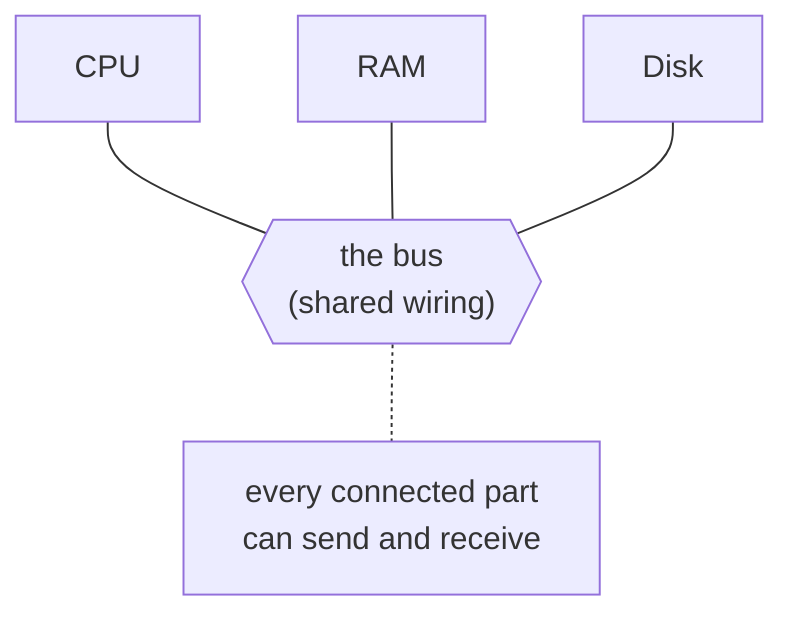
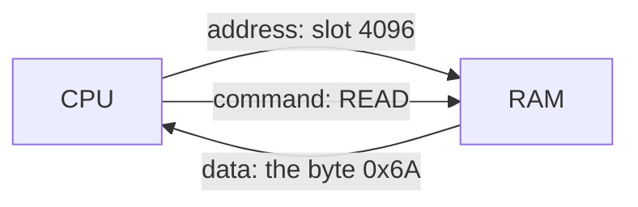

# Buses & Addresses

Here's a question that sounds dumb but isn't: when your CPU wants a number out of RAM, how does it *get*
it? The CPU is one chip. The RAM is a different chip, sitting centimeters away. There has to be something
physical connecting them, and there has to be a way for the CPU to say *which* number it wants out of the
billions in there. Those two things - the wiring and the addressing - are the whole foundation of how
data moves. Let's build them up.

## A bus: the shared wiring

**What it actually is.** A **bus** is a set of wires shared by multiple components, used to carry data
between them. That's it. Not a metaphor for one - literal parallel wires (or traces on the
motherboard) that every connected chip can put signals on and read signals off of.

📝 **Terminology.** *Bus* = shared wiring that carries data between components. The name comes from the
old "omnibus" idea: one shared line that everything rides, rather than a private wire from each part to
every other part.

**Why people get this wrong.** It's tempting to imagine a separate dedicated cable from the CPU to RAM,
another from the CPU to the disk, another to the keyboard - a tangle of point-to-point wires. Early
designs mostly worked the *other* way: one shared bus that many components hang off of. Sharing is the
whole point - it means you can add a new component to the bus without rewiring everything else.



**The catch with sharing.** Because the wires are shared, only one conversation can happen at a time -
two components can't both drive the same wires at the same instant without garbling each other. So a bus
needs rules about *who talks when*. In the simple picture, the CPU is the one in charge: it decides what
goes on the bus and when. (Real machines have more nuance - multiple buses, devices that can take the
wheel - but "the CPU runs the bus" is the right starting model.)

💡 **Key point.** A bus is shared wiring. Its strength is that many parts can hang off it; its constraint
is that only one transfer happens at a time, so something has to coordinate turns.

## Addresses: every byte of RAM has a number

**What it actually is.** RAM is an enormous row of byte-sized slots, and **every slot has its own number,
called its address**. The first byte is address 0, the next is address 1, and so on, all the way up. An
address is nothing more exotic than "which slot."

📝 **Terminology.** *Address* = the number that identifies one specific storage location. *Byte* = the
unit each address points at - 8 bits, enough to hold one number from 0 to 255, or one character.

```text
   address:    0      1      2      3      4      5    ...
             ┌────┐ ┌────┐ ┌────┐ ┌────┐ ┌────┐ ┌────┐
      RAM:   │ 72 │ │ 01 │ │ FF │ │ 00 │ │ 6A │ │ .. │   each slot holds one byte;
             └────┘ └────┘ └────┘ └────┘ └────┘ └────┘   each has a fixed number
```

**Why this matters.** An address turns "somewhere in memory" into "exactly here." When a program holds a
variable, what it really holds (underneath) is an address - *where* the value lives. When you hear the
word **pointer**, that's all it is: a value that *is* an address, pointing at another spot in memory.

📝 **Terminology.** *Pointer* = a value whose contents are a memory address. It "points at" the data
living at that address instead of holding the data directly.

⚠️ **Gotcha.** Addresses are just numbers, which means a program can compute a *wrong* one - point at a
slot it has no business touching. That's the root of a whole family of bugs and security holes (out-of-
bounds reads, use-after-free). The operating system and CPU work together to wall each program into its
own range of addresses; reach outside it and you get the famous "segmentation fault." We're describing
physical addressing here; the OS adds a layer (virtual memory) on top, which is its own guide.

## How the CPU reads and writes RAM

Now put the two ideas together. The CPU and RAM are connected by the **memory bus**. To move a byte, the
CPU uses the bus to carry three things: an **address** (which slot), a **command** (read or write), and -
for a write - the **data** itself.



**What it does in real life - a read.** The CPU puts the address on the bus and signals "read." The RAM
finds that slot, puts its byte back on the bus, and the CPU receives it. A **write** is the mirror image:
the CPU puts the address *and* the data on the bus, signals "write," and RAM stores the byte in that
slot.

You can think of the wires as having jobs. The lines that carry *which slot* are the **address bus**; the
lines that carry *the actual byte(s)* are the **data bus**; and a few control lines carry *read vs.
write*. People often say "the bus" for all of them together.

📝 **Terminology.** *Address bus* = the wires that carry the address (which location). *Data bus* = the
wires that carry the data itself. *Memory bus* = the bus between the CPU and RAM, made of both plus
control lines.

**A concrete picture.** Imagine the CPU is running an instruction that means "load the byte at address
4096 into a register." Here's the conversation, in plain English:

```text
   CPU → bus:   address = 4096,  control = READ
   RAM → bus:   data    = 0x6A         (the byte that was sitting in slot 4096)
   CPU:         stores 0x6A in a register, moves on to the next instruction
```

*What just happened:* the CPU didn't "reach into" RAM. It *asked* over shared wiring - named the slot,
named the operation - and RAM answered on the same wiring. Every variable read, every value written,
every instruction fetched is some version of this little request-and-answer over the memory bus,
happening billions of times a second.

**Why this saves you later.** Once you see memory as "numbered slots reached over a bus," a lot stops
being mysterious. Why is RAM faster than disk? Partly because it's wired close on a fast bus built for
exactly this. Why does "more bandwidth" speed things up? Wider/faster buses move more bytes per second.
Why can a pointer bug corrupt unrelated data? Because addresses are just numbers, and the wrong number
points at the wrong slot. The bus-and-address model is the lens for all of it.

## Recap

1. A **bus** is shared wiring that carries data between components - flexible because many parts hang off
   it, constrained because only one transfer happens at a time.
2. Every byte of RAM has an **address** - a plain number naming one slot. A **pointer** is just a value
   that holds an address.
3. The CPU reads and writes RAM over the **memory bus** by putting an **address** and a **read/write**
   command on the wires (and the **data**, for a write). It asks; RAM answers.

Next, we follow those same wires *past* RAM - to the disk, the keyboard, the network card - and meet the
trick that lets a device move data without making the CPU babysit every byte.

---

[← Guide overview](_guide.md) · [Phase 2: How the CPU Talks to Devices (I/O) →](02-how-the-cpu-talks-to-devices.md)
