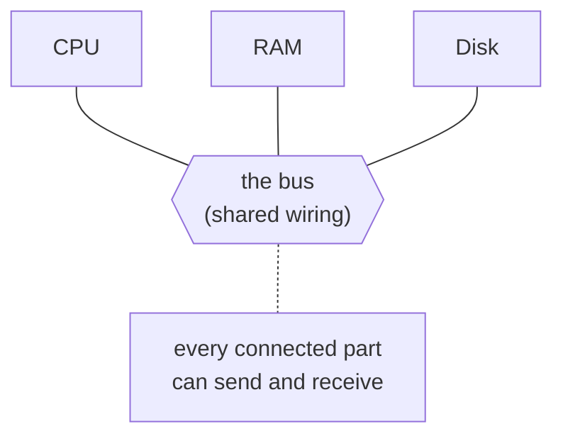
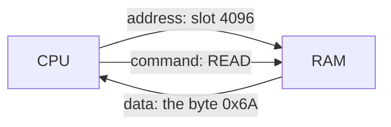

# Buses & Addresses

When your CPU wants a number out of RAM, how does it *get* it? The CPU is one chip; the RAM is another,
centimeters away. Something physical has to connect them, and the CPU needs a way to name *which* of the
billions of numbers it wants. Those two things - wiring and addressing - are the foundation of how data
moves.

## A bus: the shared wiring

A **bus** is a set of wires shared by multiple components, used to carry data between them. Not a
metaphor - literal parallel wires (or traces on the motherboard) that every connected chip can drive and
read.

📝 **Terminology.** *Bus* = shared wiring that carries data between components - from the old "omnibus"
idea: one shared line everything rides, rather than a private wire between every pair of parts.

The tempting picture is dedicated cables - CPU to RAM, CPU to disk, CPU to keyboard. Early designs mostly
worked the *other* way: one shared bus many components hang off, so you can add a component without
rewiring everything else.



The catch: only one conversation can happen at a time - two components driving the same wires at once
would garble each other. So a bus needs rules about *who talks when*; in the simple picture, the CPU
decides. (Real machines add nuance - multiple buses, devices that can take the wheel - but "the CPU runs
the bus" is the right starting model.)

## Addresses: every byte of RAM has a number

RAM is an enormous row of byte-sized slots, and **every slot has its own number, called its address**:
the first byte is address 0, the next is 1, and so on. An address is nothing more exotic than "which
slot."

📝 **Terminology.** *Address* = the number that identifies one specific storage location. *Byte* = the
unit each address points at - 8 bits, enough to hold one number from 0 to 255, or one character.

```text
   address:    0      1      2      3      4      5    ...
             ┌────┐ ┌────┐ ┌────┐ ┌────┐ ┌────┐ ┌────┐
      RAM:   │ 72 │ │ 01 │ │ FF │ │ 00 │ │ 6A │ │ .. │   each slot holds one byte;
             └────┘ └────┘ └────┘ └────┘ └────┘ └────┘   each has a fixed number
```

An address turns "somewhere in memory" into "exactly here." When a program holds a variable, what it
really holds underneath is an address - *where* the value lives.

📝 **Terminology.** *Pointer* = a value whose contents are a memory address. It "points at" the data
living at that address instead of holding the data directly.

⚠️ **Gotcha.** Addresses are just numbers, so a program can compute a *wrong* one - pointing at a slot it
has no business touching. That's the root of a whole family of bugs and security holes (out-of-bounds
reads, use-after-free). The OS and CPU wall each program into its own range of addresses; reach outside
it and you get the famous "segmentation fault." That's physical addressing; the OS adds virtual memory on
top, which is its own guide.

## How the CPU reads and writes RAM

Put the two ideas together. The CPU and RAM are connected by the **memory bus**. To move a byte, the bus
carries three things: an **address** (which slot), a **command** (read or write), and - for a write -
the **data** itself.



A **read**: the CPU puts the address on the bus and signals "read"; RAM finds that slot and puts its
byte back on the bus. A **write** is the mirror image: the CPU puts the address *and* the data on the
bus, signals "write," and RAM stores the byte.

The wires have jobs: the lines carrying *which slot* are the **address bus**, the lines carrying *the
actual byte(s)* are the **data bus**, and a few control lines carry *read vs. write*. People say "the
bus" for all of them together.

A concrete picture - the CPU runs an instruction meaning "load the byte at address 4096 into a register":

```text
   CPU → bus:   address = 4096,  control = READ
   RAM → bus:   data    = 0x6A         (the byte that was sitting in slot 4096)
   CPU:         stores 0x6A in a register, moves on to the next instruction
```

*What just happened:* the CPU didn't "reach into" RAM. It *asked* over shared wiring - named the slot,
named the operation - and RAM answered on the same wiring. Every variable read, every value written,
every instruction fetched is a version of this request-and-answer, billions of times a second.

Once you see memory as "numbered slots reached over a bus," a lot stops being mysterious. Why is RAM
faster than disk? Partly because it's wired close on a fast bus built for exactly this. Why does "more
bandwidth" speed things up? Wider/faster buses move more bytes per second. Why can a pointer bug corrupt
unrelated data? Addresses are just numbers, and the wrong number points at the wrong slot.

## Recap

1. A **bus** is shared wiring between components - flexible because many parts hang off it, constrained
   because only one transfer happens at a time.
2. Every byte of RAM has an **address** - a plain number naming one slot. A **pointer** is just a value
   holding an address.
3. The CPU reads and writes RAM over the **memory bus** by putting an **address** and a **read/write**
   command on the wires (plus the **data**, for a write). It asks; RAM answers.

Next, we follow those wires *past* RAM - to the disk, the keyboard, the network card - and meet the trick
that lets a device move data without making the CPU babysit every byte.

---

[← Guide overview](_guide.md) · [Phase 2: How the CPU Talks to Devices (I/O) →](02-how-the-cpu-talks-to-devices.md)
