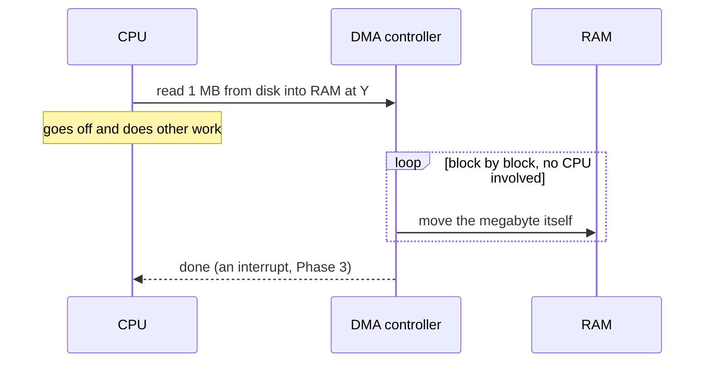

# How the CPU Talks to Devices (I/O)

In Phase 1 the only thing on the far end of the bus was RAM. But the CPU also needs to talk to the disk,
the keyboard, the network card, the GPU - and you already have the mental model: addresses and a bus,
pointed at hardware instead of RAM. The payoff is the last section, where a device learns to move data
*by itself*.

## I/O: reaching past RAM

**I/O** - input/output - is the CPU exchanging data with anything that isn't its own registers or RAM.
Input is data coming *in* (a keypress, a packet arriving, bytes read from disk); output is data going
*out* (pixels to the screen, bytes written to disk, a packet sent).

📝 **Terminology.** *Device* = any piece of hardware that isn't the CPU or main memory - disk, keyboard,
network card, GPU, USB stick.

A device isn't a blob of storage like RAM; it has controls. A disk controller has a spot you write "read
sectors 100–200" into, a spot you read status from ("busy" / "done" / "error"), and a spot data flows
through: the device's **registers**. The CPU's whole conversation with a device is reading and writing
them. The question is *how* the CPU addresses them - two classic answers, and every machine uses one or
both.

## Two ways to address a device

### Memory-mapped I/O

The system reserves a chunk of the address space and wires it to a device instead of to RAM. The device's
registers get **real memory addresses**, so the CPU talks to the device using the *exact same*
read/write-an-address mechanism from Phase 1 - address 0xFE00 just leads to the network card instead of
a memory slot.

```text
   one address space, carved up:

   0x0000 ┌──────────────────────────┐
          │   RAM                     │   normal memory slots
          │                           │
   0xFE00 ├──────────────────────────┤
          │   network card registers  │   ← a write here goes to the DEVICE,
          │   disk controller regs    │     not to a memory chip
   0xFFFF └──────────────────────────┘
```

The elegance: the CPU needs *no special instructions* - "write this value to that address" already
exists. The downside: those addresses are spent, they can't also be RAM - one reason a 32-bit machine
with 4 GB installed sometimes can't use all 4 GB: some of the range is claimed by devices.

### Port I/O

The other approach gives devices their own separate numbering - **ports** - living *outside* the memory
address space, reached with dedicated CPU instructions (on x86, literally `in` and `out`). Port 0x60 is
the keyboard controller; an `in` from port 0x60 reads the latest key.

📝 **Terminology.** *Port* (in this hardware sense) = a device's address in a separate I/O address space,
accessed with special I/O instructions rather than normal memory reads and writes. (This is *not* the
same thing as a network port like 443 - same word, different world.)

Neither is "better"; it's a design trade-off:

```text
   ┌──────────────────┬─────────────────────────────┬──────────────────────────────┐
   │                  │  Memory-mapped I/O           │  Port I/O                    │
   ├──────────────────┼─────────────────────────────┼──────────────────────────────┤
   │  Addressing      │  shares the memory address   │  separate I/O address space   │
   │                  │  space with RAM              │                               │
   │  CPU support     │  none extra - normal load/   │  needs special instructions   │
   │                  │  store instructions          │  (e.g. in / out)              │
   │  Cost            │  uses up memory addresses    │  keeps memory space free, but  │
   │                  │                              │  adds a separate mechanism    │
   └──────────────────┴─────────────────────────────┴──────────────────────────────┘
```

Modern systems lean heavily on memory-mapped I/O because reusing the memory mechanism is simpler and
scales to big, fast devices. Port I/O survives mostly for older/simpler peripherals.

## DMA: letting the device do the carrying

Suppose you're reading a one-megabyte file off the disk into RAM. With everything so far, the CPU would
do it the slow way:

```text
   the CPU doing it by hand ("programmed I/O"):

   read byte from disk register  →  write byte to RAM  →  repeat
   read byte from disk register  →  write byte to RAM  →  repeat
   ... one million times, with the CPU busy the entire time ...
```

A performance catastrophe: the fastest, most valuable thing in the machine is stuck shoveling bytes one
at a time - and while it shovels, your music can't decode and your UI can't redraw.

**DMA - Direct Memory Access** - is a small dedicated helper (a *DMA controller*, often built into the
device itself) that can read and write RAM *over the bus on its own*, without routing every byte through
the CPU. The CPU sets up the job once, then steps away.

📝 **Terminology.** The "direct" in *Direct Memory Access* means *direct to memory, around the CPU*.

The conversation becomes a delegation:



*What just happened:* the CPU described the transfer, handed the grunt work to the DMA controller, and
went back to real work. The megabyte still travels over the bus - but the *CPU* isn't carrying each byte.
One setup, one "done" at the end, instead of a million round trips.

⚠️ **Gotcha.** DMA and the CPU share the same bus (Phase 1: only one transfer at a time). While DMA hauls
a big block, the CPU may have to wait its turn for the bus - so DMA isn't "free," it just frees the CPU
from *doing the copy*. The win is overwhelming anyway: the CPU runs real work during almost all of the
transfer.

This is why a big file copy, a video stream, or a busy network connection doesn't peg one CPU core at
100%. Disks, network cards, GPUs, and sound cards all use DMA so the CPU stays free for actual
computation. Throughput high while CPU usage stays modest = DMA doing its job. And a driver that "sets up
a DMA buffer" is doing exactly this: handing the device an address range in RAM and saying "fill this
yourself."

## Recap

1. **I/O** is the CPU exchanging data with devices, and to the CPU a device looks like a set of
   **registers** it reads and writes.
2. Those registers are reached either by **memory-mapped I/O** (real memory addresses, reusing the Phase 1
   mechanism) or by **port I/O** (a separate I/O address space with special instructions) - a trade-off,
   not a winner.
3. **DMA** lets a device move data to and from RAM by itself. The CPU sets up the transfer once and walks
   away, which is why moving lots of data doesn't tie up the processor.

But when the DMA controller finishes, it has to *tell* the CPU. How does a device get the CPU's
attention without the CPU constantly checking? The last piece: interrupts.

---

[← Phase 1: Buses & Addresses](01-buses-and-addresses.md) · [Guide overview](_guide.md) · [Phase 3: Interrupts →](03-interrupts.md)
