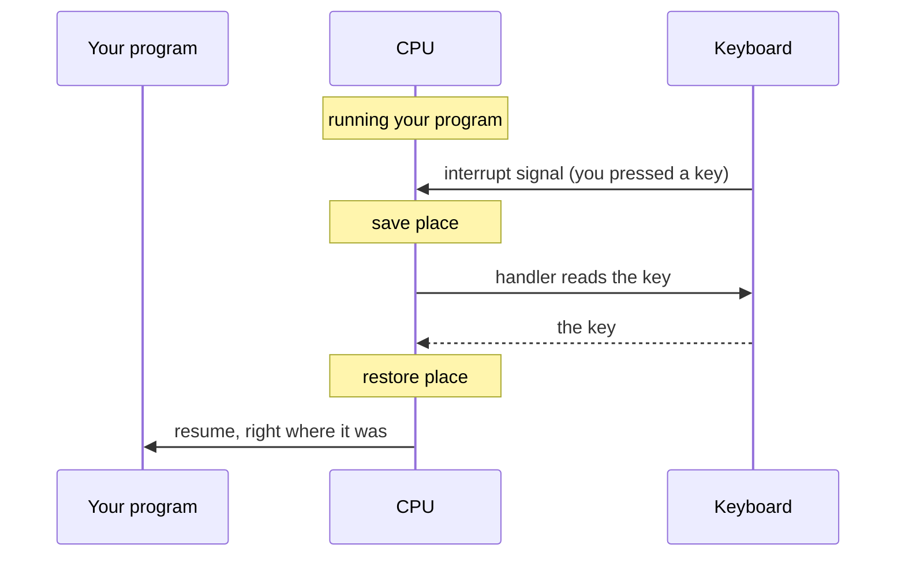

# Interrupts — Getting the CPU's Attention

We've left one thread dangling. In Phase 2, when DMA finished moving a file, it had to tell the CPU "I'm
done." And way back, your keyboard has a byte ready the moment you press a key. So here's the real
question of this phase: *how does a device get the CPU's attention?* The CPU is busy running your program,
billions of instructions a second. It can't read minds. There are exactly two ways to find out a device
needs you, and the difference between them is the difference between a sluggish machine and a snappy one.

## The slow way: polling

**What it actually is.** **Polling** means the CPU repeatedly *asks* — "are you ready yet? are you ready
yet?" — checking a device's status register over and over in a loop until the answer is yes.

```text
   polling loop (the CPU asking, over and over):

   check keyboard status →  nothing
   check keyboard status →  nothing
   check keyboard status →  nothing          ← thousands of pointless checks
   check keyboard status →  nothing             while you decide what to type
   check keyboard status →  KEY READY!  →  read it
```

**Why it's wasteful.** Think about your keyboard. Between keystrokes, whole tenths of a second pass — an
eternity to a CPU. If the CPU polled the keyboard, it would ask "ready? ready? ready?" millions of times
and get "no" almost every single time. All that effort, producing nothing, while real work waits. Polling
burns the CPU to *watch* instead of letting it *work*.

⚠️ **Gotcha — polling isn't always wrong.** If you *know* the answer is coming in nanoseconds (a
super-fast device, a tight low-latency loop), polling can actually beat the alternative, because you skip
the overhead of being interrupted. The point isn't "polling bad" — it's "polling for events that arrive
rarely or unpredictably wastes enormous CPU." For a keyboard, that's exactly the wrong fit.

## The fast way: interrupts

**What it actually is.** An **interrupt** is a signal a device sends to the CPU that means "stop what
you're doing for a moment — I have something for you." Instead of the CPU checking the device, the device
*taps the CPU on the shoulder* the instant it has news. The CPU doesn't have to look; it gets told.

📝 **Terminology.** *Interrupt* = a hardware signal that makes the CPU pause its current work, jump to a
small piece of code to handle the event, then resume exactly where it left off. *Interrupt handler* (or
*interrupt service routine*) = that small piece of code that deals with the event.

**What it does in real life.** When you press a key, the keyboard controller raises an interrupt. The CPU,
mid-instruction-stream on your program, finishes the current instruction, then:



*What just happened:* the CPU bookmarked exactly where it was in your program (saved its registers and
position), ran a short **handler** that grabbed the key from the keyboard, then restored the bookmark and
carried on as if nothing happened. Your program never knew it was briefly set aside. The key was noticed
the *moment* you pressed it — not on the next poll, because there is no poll.

**Where this connects back.** This is precisely how DMA reports in. Remember Phase 2's step 4: the DMA
controller finishes moving your file and raises an interrupt to say "done." The CPU was off doing real
work the whole time, and the interrupt is what calls it back, exactly when there's finally something to
do — no polling the disk in a loop.

## Why interrupts are what make a computer feel alive

Put it together and you can *feel* the difference. Almost everything you interact with is event-driven and
unpredictable: keystrokes, mouse moves, clicks, packets arriving, a timer firing. None of it is on a
schedule the CPU could guess.

- **With polling**, the CPU would have to constantly stop and check every device "just in case,"
  shredding its time on questions that mostly answer "no."
- **With interrupts**, the CPU runs flat-out on real work and is pulled aside *only* when something
  genuinely happens — and then *immediately*.

```text
   polling:     work? CHECK CHECK CHECK work? CHECK CHECK work? CHECK ...
                (attention sprayed everywhere, most checks wasted)

   interrupts:  ████ real work ████ ▮tap▮ ████ real work ████ ▮tap▮ ████
                (full focus, redirected the instant — and only when — needed)
```

That "only when needed, but instantly" property is why your cursor tracks your hand with no lag, why a
keypress shows up the moment you make it, and why a download finishing pops a notification right away
instead of seconds later. Responsiveness *is* interrupts.

**Why this saves you later.** "Interrupt" stops being a scary word once you see it's just "a device taps
the CPU." It explains a lot of real-world vocabulary: an **interrupt storm** is a misbehaving device
tapping so often the CPU can't get real work done (a real cause of mysterious system slowdowns); a
"busy-wait" or "spin loop" eating 100% CPU is usually polling where an interrupt or sleep belonged. When
you profile a program and see it pegged at full CPU doing "nothing," ask whether it's polling something it
should be waiting on. The fix is almost always "stop asking; get told."

## Recap

1. A device gets the CPU's attention one of two ways: **polling** (the CPU keeps asking) or **interrupts**
   (the device signals the CPU).
2. **Polling** wastes CPU on events that arrive rarely or unpredictably — though it can win for events you
   know are coming in nanoseconds.
3. An **interrupt** makes the CPU pause, run a short **handler**, and resume exactly where it left off —
   so events are handled the instant they happen.
4. Interrupts are what let the CPU stay focused on real work yet react immediately — which is why a
   computer feels **responsive**, and how DMA, the keyboard, the network, and timers all report in.

That's the full picture: bytes ride **buses**, the CPU names locations by **address**, it reaches devices
through **I/O** and offloads bulk movement to **DMA**, and devices call back through **interrupts**. The
roads and the traffic signals — the whole in-between that turns a pile of parts into a machine.

> ⏭️ Ready to see the software side take over? [What an Operating System Is](/guides/what-an-operating-system-is)
> picks up here — the OS is the code that sets up those DMA buffers and wires up those interrupt handlers.
> See also [How Devices Connect](/guides/how-devices-connect) for how peripherals plug into all this.

---

[← Phase 2: How the CPU Talks to Devices (I/O)](02-how-the-cpu-talks-to-devices.md) · [Guide overview](_guide.md)
