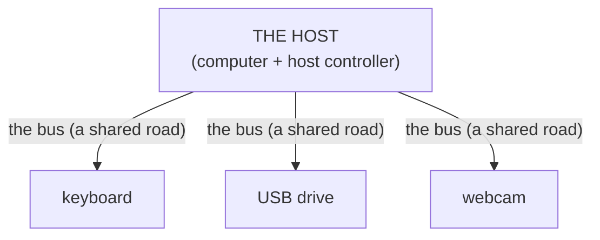
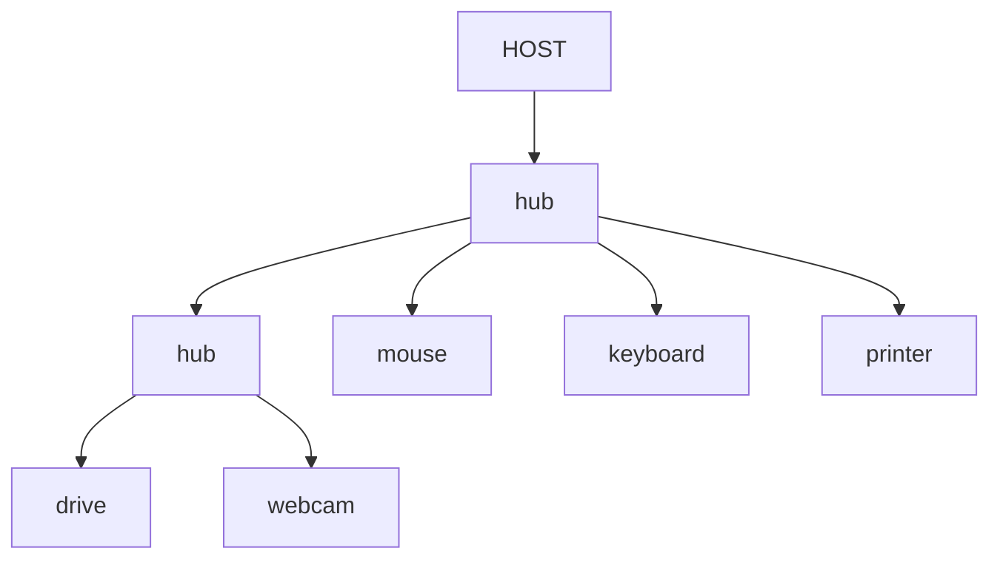

# USB & the Host/Device Model

USB is the port you've used most and understood least - by design, it asks nothing of you. Until
something *doesn't* appear ("USB device not recognized," a drive that mounts on one machine and not
another) and the friendliness turns into a black box. The whole standard rests on one lopsided
relationship and one little ceremony; see both, and USB stops surprising you.

## The one big idea: a host in charge of devices

USB is not a connection between equals - it's one boss and its workers. The boss is the **host**, almost
always the computer (more precisely, a chip in it called the *host controller*). Everything you plug in
is a **device**: keyboard, flash drive, webcam. The host starts every conversation; devices only ever
answer.

📝 **Terminology.** A *device* is sometimes called a *peripheral*. The "B" in USB literally stands for
"Bus" - a shared road the host directs traffic on; the *host controller* is the chip that runs it.

This is why you can't normally plug two laptops together with a plain USB-A cable and have them talk -
both think they're the host, and a USB conversation needs exactly one. It's also why a device does
nothing until a host gives it power and starts asking questions: devices are patient and dumb on
purpose; the intelligence lives on the host side.



## What happens when you plug something in (enumeration)

The ceremony between "you pushed the connector in" and "the thing works" is **enumeration** - the host
noticing a new device, then interviewing it. The sequence:

1. **Detection.** Electrically, the host notices a device on the port (a voltage on the data lines
   changes). This is the "bong" sound or the tray-icon flash.
2. **Reset and address.** The host resets the device to a known state and assigns it a number (an
   *address*) so it can be told apart from everything else on the bus.
3. **The interview (descriptors).** The host asks the device to describe itself. The device sends back
   **descriptors** - small data structures that say "I am vendor `0x05ac`, product `0x024f`, and I behave
   like a *keyboard*." (Those vendor/product IDs are how the system knows *exactly* what you plugged in.)
4. **Driver match.** Using that description, the operating system finds and loads the matching **driver** -
   the translator that knows how to talk to this kind of device. Now an app can use it.

📝 **Terminology.** *Device class* = a standard category (keyboard, mass storage, audio) that lets the OS
use a generic driver instead of one specific to that exact model.

On Linux you can watch enumeration live. Plug in a flash drive and check the kernel log:

```console
$ sudo dmesg --follow
[ 8842.1] usb 1-2: new high-speed USB device number 7 using xhci_hcd
[ 8842.3] usb 1-2: New USB device found, idVendor=0781, idProduct=5567
[ 8842.3] usb 1-2: Product: SanDisk Cruzer Blade
[ 8842.4] usb-storage 1-2:1.0: USB Mass Storage device detected
[ 8842.7] sd 6:0:0:0: [sdb] 30031872 512-byte logical blocks
```

*What just happened:* the whole ceremony in five lines. The host (`xhci_hcd`, the host controller driver)
gave the device a number (`7`), read its descriptors (`idVendor`, `idProduct`, the product name),
recognized the *mass storage* class, loaded the `usb-storage` driver, and the drive showed up as a disk
(`sdb`). "USB device not recognized" is this exact sequence failing partway - usually at the interview or
the driver-match step.

⚠️ **Gotcha - "not recognized" is rarely the cable's fault, but sometimes it is.** Enumeration needs the
*data* lines, not only power. A charge-only cable (very common among cheap cables and phone chargers)
skips or under-builds the data wires: the device charges but never enumerates - it looks dead. If a
device powers on but is never detected, swapping to a known-good data cable is a real first move, not
superstition.

When a device "doesn't work," you now have a sequence to point at. Does it get power (light on)? Then
detection's fine - suspect the interview or driver. Detected on one computer but not another? The
hardware's fine - it's a missing or broken driver on the second machine.

## Hubs and daisy-chaining: one port becomes many

A **hub** splits one upstream port into several downstream ports: plug four things into a hub and the
host sees all four. Hubs nest - a port on your laptop feeds a hub, a port on
*that* hub feeds another - which is what "daisy-chaining" means. The host still addresses and interviews
every device individually, however deep in the tree it sits. Many things you don't think of as hubs *are*
hubs internally - a monitor with USB ports on the back, a keyboard with a passthrough port.



⚠️ **Gotcha - power is shared, and it's the usual reason a chain "gets flaky."** A port supplies limited
power, and an *unpowered* (bus-powered) hub splits that one budget among everything hanging off it. Plug
a power-hungry device - a portable hard drive, some webcams - into an unpowered hub already running a few
things, and it may enumerate intermittently, disconnect under load, or never spin up. The fix is a
*powered* hub (one with its own wall adapter). Nesting depth also has limits, but you'll hit a power
problem long before that.

"It worked when it was the only thing plugged in" and "it disconnects when I copy big files" are classic
shared-power symptoms, not broken devices.

## The genuinely confusing part: USB naming and USB-C

This confuses *everybody*, because the names mix up two unrelated questions:

- **What shape is the connector?** The physical plug: **USB-A** (the classic flat rectangle that only
  goes in one way after three tries), **USB-B** and **Micro-USB** (older, on printers and small devices),
  and **USB-C** (the small reversible oval).
- **How fast can it move data, and what can it carry?** The *protocol / version* - USB 2.0, USB 3.x, and
  so on.

The trap is assuming the shape tells you the speed. **It does not.** *USB-C is a connector - a plug
shape, not a speed.* It might run slow USB 2.0 underneath, or a fast protocol, or an entirely different
one. "It's USB-C" tells you what the plug looks like, nothing more.

The version names are a committee-made mess. The same generation of speed has been labeled with
different "USB 3.x" names at different points; later branding shifted toward marketing names like
**SuperSpeed USB** with a stated number ("SuperSpeed USB 5Gbps" or "10Gbps"). Upshot: **the version
number on the box is unreliable** - the meaningful number is the advertised data rate, the "Gbps"
figure, not the "3.x" label.

⚠️ **Gotcha - and this is the one that bites.** A USB-C port can hide any of several protocols, so two
ports that *look identical* can behave completely differently. A USB-C port might carry:
- plain USB data (slow or fast),
- **DisplayPort** video (the same port drives a monitor - "DP Alt Mode"),
- **Thunderbolt** (a faster protocol that uses the USB-C connector),
- **power delivery** (USB-PD) to charge a laptop.

…and a given port may support some and not others - why one USB-C port on a laptop drives an external
display and its identical-looking neighbor doesn't, or one charges the laptop and another won't. The plug
shape promised nothing; the *port's* capabilities are what matter.

How to actually tell: look for the icon next to the port (a display symbol means video out; a
lightning/Thunderbolt bolt means Thunderbolt; an "SS" or a number means the faster data rate) or check
the spec sheet - when in doubt, the only honest source.

## Recap

1. **One host, many devices.** The host (your computer) starts every conversation, supplies power, and
   addresses each device. Devices only answer.
2. **Enumeration is the plug-in ceremony.** Detect → reset and address → interview (descriptors) → match a
   driver. "Not recognized" is this sequence failing partway, and a charge-only cable is a real cause.
3. **Hubs split one port into many** and nest freely, but they share *one* power budget - flakiness under
   load usually means you want a powered hub.
4. **Connector ≠ speed.** USB-C is a plug shape; the version/protocol is separate, and identical-looking
   USB-C ports can carry different things (data, video, Thunderbolt, power). Check the icon or spec, not
   the shape.

Next we go *inside* the case, where the heavy hardware lives - and where the connection model flips from
"slow and universal" to "fast and direct."

---

[← Guide overview](_guide.md) · [Phase 2: PCIe - the High-Speed Internal Highway →](02-pcie-the-internal-highway.md)
