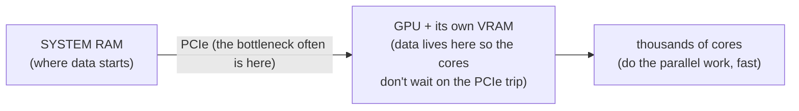

# GPUs & Peripherals

By now you have the two roads: USB for the things you plug and unplug, PCIe for the heavy hardware inside.
This phase looks at what's at the ends of those roads. First the biggest, most misunderstood tenant of the
PCIe highway - the **GPU** - and *why* a computer bothers having a second, very different processor at all.
Then a short tour of the humble peripherals from Phase 1, and the elegant trick that lets one driver
handle a thousand different keyboards.

## Why a GPU exists at all

**What it actually is.** A GPU (Graphics Processing Unit) is a processor built for a completely different
shape of work than the CPU. The CPU is a few very clever cores that do complicated tasks one after
another, *fast*. A GPU is thousands of much simpler cores that all do the *same* simple operation at the
same time, on different pieces of data. The CPU is a brilliant chef; the GPU is a stadium full of line
cooks who can each crack one egg - useless for a complex recipe, unbeatable for cracking ten thousand eggs
at once.

```text
   CPU                          GPU
   ┌────┐ ┌────┐                ┌─┬─┬─┬─┬─┬─┬─┬─┬─┐
   │core│ │core│   a few        │ │ │ │ │ │ │ │ │ │  thousands of
   └────┘ └────┘   powerful     ├─┼─┼─┼─┼─┼─┼─┼─┼─┤  simple cores,
   ┌────┐ ┌────┐   cores,       │ │ │ │ │ │ │ │ │ │  all doing the
   │core│ │core│   complex      ├─┼─┼─┼─┼─┼─┼─┼─┼─┤  SAME thing to
   └────┘ └────┘   work in      │ │ │ │ │ │ │ │ │ │  DIFFERENT data
                   sequence     └─┴─┴─┴─┴─┴─┴─┴─┴─┘  at once
```

**Why this design exists.** Drawing a screen is the original case of "do the same thing to millions of
items": every pixel needs roughly the same color math, independently. A CPU doing that one pixel at a time
would crawl; a GPU does huge swaths of pixels simultaneously. That's **massively parallel** work - many
identical operations with no dependence on each other - and it's the GPU's entire reason for being.

**Why GPUs now run machine learning too.** Here's the part that surprises people. Training and running a
neural network is, underneath, mostly one operation repeated at enormous scale: multiplying big grids of
numbers (matrices) together. That is *exactly* the "same simple math, millions of times, in parallel"
shape graphics has. So the hardware built to shade pixels turned out to be the ideal hardware for ML - not
a coincidence, but the same parallel pattern wearing a different hat. The "GPU" now spends much of its life
doing math that has nothing to do with graphics.

## How a GPU connects - and how it gets fed

**What it actually is.** The GPU is a PCIe device - usually a card in the x16 slot from Phase 2, or a chip
soldered to the same kind of high-bandwidth connection. The wide slot isn't vanity: the GPU has to move
gigantic amounts of data between itself and the rest of the system, constantly.

**The real bottleneck is feeding it.** A GPU with thousands of cores is only useful if you can keep them
supplied with data. The work itself is fast; getting the data *to* the GPU over PCIe, and results back, is
often the slow part. This is why GPUs carry their own large, very fast on-board memory (VRAM): once data
is sitting in VRAM, the cores can chew through it without waiting on the PCIe trip back to system RAM.



⚠️ **Gotcha - "my GPU is barely being used" is usually a feeding problem.** When a GPU sits at low
utilization while work is clearly happening, the cores are typically *starved* - waiting on data that
hasn't arrived (from disk, from the CPU preparing it, or across PCIe) rather than lacking power. This ties
straight back to Phase 2: a GPU on a slower-than-expected PCIe link (fewer lanes or an older generation)
can be throttled by the road, not the engine. The fix is rarely "a bigger GPU"; it's removing whatever
stops data from arriving fast enough.

**Why this saves you later.** "Should I buy a faster GPU?" becomes a sharper question: is the GPU actually
the limit, or is it idling while waiting to be fed? And it explains why VRAM capacity matters so much for
large models - if the data doesn't fit in VRAM, you're back to paying the slow PCIe trip constantly.

## How everyday peripherals present themselves

Now the other end of the USB road from Phase 1. A keyboard, a mouse, a webcam, a display - wildly different
devices. The clever bit is how few drivers it actually takes to support all of them.

**The idea: device classes.** Remember from Phase 1 that during enumeration a device describes itself.
Part of that description is its **class** - a standard category like "keyboard," "mouse," "mass storage,"
or "video." The operating system ships with one generic driver per class. So *any* device that says "I'm a
standard keyboard" is handled by the same built-in keyboard driver - no per-model download needed. This is
why a keyboard or flash drive from a brand you've never heard of works the instant you plug it in.

📝 **Terminology.** *Device class* = a standard behavior category a device claims during enumeration.
*HID* (Human Interface Device) is the class that covers keyboards, mice, game controllers, and similar
input devices - the reason almost any keyboard or mouse "just works" without you installing anything.

**A quick tour:**

- **Keyboard and mouse** - both are HID-class devices. They announce "I'm a standard input device,"
  the OS loads the generic HID driver, and they work immediately. A fancy keyboard's extra macro keys or
  RGB lighting are the part that needs the manufacturer's own software - but the *typing* always works,
  because the standard class covers it.
- **Display** - connects over a video link (HDMI, DisplayPort, or DisplayPort carried over a USB-C port,
  as Phase 1 warned). The screen and the system negotiate a resolution and refresh rate during connection,
  much like USB's interview - which is why a freshly plugged-in monitor usually lands on a sensible
  resolution on its own.
- **Webcam** - typically presents as the standard USB video class, so the OS can capture a basic image
  with a generic driver. Vendor software adds the extras (autofocus tuning, effects), but the core "show a
  video stream" is a standard class, which is why most webcams produce *a* picture instantly even before
  any app from the maker is installed.

**Why classes are the right design.** Without classes, every keyboard would need its own driver shipped to
every OS - an impossible amount of busywork, and a fresh keyboard wouldn't work until you found and
installed software. By agreeing on standard behaviors, the industry lets one driver serve thousands of
models. The cost is that *non-standard* features (those macro keys, that lighting) fall outside the class
and need extra software - exactly the split you see in practice.

## It all comes back to drivers

Every device in this guide - the USB stick, the GPU, the webcam, the keyboard - reaches your programs the
same way: through a **driver**, the OS's translator for one kind of hardware. The host detects the device,
learns what it is, and loads the matching driver; from then on your apps talk to the OS in generic terms
("read this drive," "draw this," "give me the camera frame") and the driver handles the device-specific
reality.

That layer - what a driver is, and why "it broke after an update" so often means "the driver broke" - is
told properly in [What an Operating System Is](/guides/what-an-operating-system-is). We won't re-teach it
here; the point for *this* guide is that the physical connection (USB or PCIe) is only half the
story. A device is plugged in *and* enumerated *and* matched to a working driver before an app can use it.
When something "isn't working," it's worth asking which of those three is missing - and you now know how to
tell.

## Recap

1. **A GPU exists for massively parallel work** - thousands of simple cores doing the same operation on
   different data at once. Built for graphics; now equally suited to ML, because both are the same "same
   math, millions of times" pattern.
2. **It connects over PCIe** (the x16 slot), and feeding it data - over PCIe, into its VRAM - is often the
   real bottleneck. Low GPU utilization usually means starved cores, not a weak GPU.
3. **Peripherals present via device classes.** A device claims a standard category (keyboard, mouse, HID,
   video) during enumeration, so one generic driver serves thousands of models; only non-standard extras
   need vendor software.
4. **Everything routes through a driver.** Physical connection is only half of it - a device must be
   plugged in, enumerated, *and* matched to a working driver before an app can use it.

That's the whole picture: the universal door (USB), the internal highway (PCIe), the parallel powerhouse
(GPU), and the standard-class trick that makes peripherals plug-and-play - each one a place you can now
reason about instead of guess.

---

[← Phase 2: PCIe - the High-Speed Internal Highway](02-pcie-the-internal-highway.md) · [Guide overview](_guide.md)
