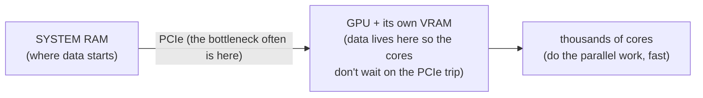

# GPUs & Peripherals

You have the two roads - USB and PCIe. What's at the ends of them? First the biggest, most misunderstood
tenant of the PCIe highway, the **GPU**, then the humble peripherals from Phase 1 and the trick that lets
one driver handle a thousand different keyboards.

## Why a GPU exists at all

A GPU (Graphics Processing Unit) is built for a completely different shape of work: the CPU is a few
very clever cores doing complicated tasks one after another, *fast*; a GPU is thousands of much simpler
cores doing the *same* simple operation on different pieces of data at once. The CPU is a brilliant chef;
the GPU is a stadium of line cooks who can each crack one egg - useless for a complex recipe, unbeatable
for ten thousand eggs at once.

```text
   CPU                          GPU
   ┌────┐ ┌────┐                ┌─┬─┬─┬─┬─┬─┬─┬─┬─┐
   │core│ │core│   a few        │ │ │ │ │ │ │ │ │ │  thousands of
   └────┘ └────┘   powerful     ├─┼─┼─┼─┼─┼─┼─┼─┼─┤  simple cores,
   ┌────┐ ┌────┐   cores,       │ │ │ │ │ │ │ │ │ │  all doing the
   │core│ │core│   complex      ├─┼─┼─┼─┼─┼─┼─┼─┼─┤  SAME thing to
   └────┘ └────┘   work in      │ │ │ │ │ │ │ │ │ │  DIFFERENT data
                   sequence     └─┴─┴─┴─┴─┴─┴─┴─┴─┘  at once
```

Drawing a screen is the original case of "do the same thing to millions of items": every pixel needs
roughly the same color math, independently. A CPU doing one pixel at a time would crawl; a GPU does huge
swaths simultaneously. That's **massively parallel** work - many identical, independent operations - the
GPU's entire reason for being.

Why GPUs now run machine learning too: a neural network is, underneath, mostly multiplying big grids of
numbers (matrices) at enormous scale - *exactly* the "same simple math, millions of times, in parallel"
shape graphics has. The hardware built to shade pixels turned out to be ideal for ML: the same parallel
pattern wearing a different hat.

## How a GPU connects - and how it gets fed

The GPU is a PCIe device - usually a card in the x16 slot from Phase 2, or a chip soldered to the same
kind of high-bandwidth connection. The wide slot isn't vanity - the GPU constantly moves gigantic amounts
of data to and from the rest of the system.

The real bottleneck is feeding it: the work itself is fast, but getting data *to* the GPU over PCIe, and
results back, is often the slow part. That's why GPUs carry large, very fast on-board memory (VRAM) -
once data sits there, the cores chew through it without waiting on the PCIe trip back to system RAM.



⚠️ **Gotcha - "my GPU is barely being used" is usually a feeding problem.** Low utilization while work is
clearly happening typically means *starved* cores - waiting on data (from disk, from the CPU preparing
it, or across PCIe), not lacking power. This ties back to Phase 2: a GPU on a slower-than-expected PCIe
link (fewer lanes or an older generation) is throttled by the road, not the engine. The fix is rarely "a
bigger GPU"; it's removing whatever stops data from arriving fast enough.

"Should I buy a faster GPU?" becomes: is the GPU actually the limit, or idling, waiting to be fed? It's
also why VRAM capacity matters for large models - data that doesn't fit in VRAM pays the slow PCIe trip
constantly.

## How everyday peripherals present themselves

A keyboard, a mouse, a webcam, a display - wildly different devices. The clever bit is how few drivers it
takes to support them all.

During enumeration (Phase 1) a device describes itself, including its **class** - a standard category
like "keyboard," "mouse," "mass storage," or "video." The OS ships one generic driver per class, so *any*
device claiming "standard keyboard" gets the same built-in driver - no per-model download, and a keyboard
or flash drive from a brand you've never heard of works the instant you plug it in.

📝 **Terminology.** *HID* (Human Interface Device) = the device class covering keyboards, mice, game
controllers, and similar input devices - the reason almost any keyboard or mouse "just works."

A quick tour:

- **Keyboard and mouse** - both HID-class: they announce "standard input device," the OS loads the
  generic HID driver, and they work immediately. Macro keys or RGB lighting need the manufacturer's
  software - but the *typing* always works: the standard class covers it.
- **Display** - connects over a video link (HDMI, DisplayPort, or DisplayPort over USB-C, as Phase 1
  warned). Screen and system negotiate a resolution and refresh rate during connection, much like USB's
  interview - why a fresh monitor usually lands on a sensible resolution by itself.
- **Webcam** - typically the standard USB video class, so the OS captures a basic image with a generic
  driver. Vendor software adds extras (autofocus tuning, effects), but the core "show a video stream" is
  standard - most webcams produce *a* picture before any maker's app is installed.

Without classes, every keyboard would need its own driver shipped to every OS, and a fresh keyboard
wouldn't work until you installed software. Standard behaviors let one driver serve thousands of models;
the cost is that *non-standard* features fall outside the class and need extra software - exactly the
split you see in practice.

## It all comes back to drivers

Every device in this guide - USB stick, GPU, webcam, keyboard - reaches your programs the same way:
through a **driver**, the OS's translator for one kind of hardware. Once the host detects, interviews,
and driver-matches a device, apps talk to the OS in generic terms ("read this drive," "draw this," "give
me the camera frame") and the driver handles the device-specific reality.

That layer - what a driver is, and why "it broke after an update" so often means "the driver broke" - is
told properly in [What an Operating System Is](/guides/what-an-operating-system-is). The point for *this*
guide: the physical connection is only half the story - a device must be plugged in *and* enumerated
*and* matched to a working driver before an app can use it. When something "isn't working," ask which of
the three is missing.

## Recap

1. **A GPU exists for massively parallel work** - thousands of simple cores doing the same operation on
   different data at once. Graphics and ML are the same "same math, millions of times" pattern.
2. **It connects over PCIe** (the x16 slot); feeding it data - over PCIe, into its VRAM - is often the
   real bottleneck. Low GPU utilization usually means starved cores, not a weak GPU.
3. **Peripherals present via device classes** (keyboard, mouse, HID, video) during enumeration, so one
   generic driver serves thousands of models; only non-standard extras need vendor software.
4. **Everything routes through a driver** - plugged in, enumerated, *and* driver-matched before an app
   can use it.

That's the whole picture: the universal door (USB), the internal highway (PCIe), the parallel powerhouse
(GPU), and the standard-class trick that makes peripherals plug-and-play.

Watch it animated: [CPU vs. GPU](/explainers/CPUvsGPU.dc.html)

---

[← Phase 2: PCIe - the High-Speed Internal Highway](02-pcie-the-internal-highway.md) · [Guide overview](_guide.md)
