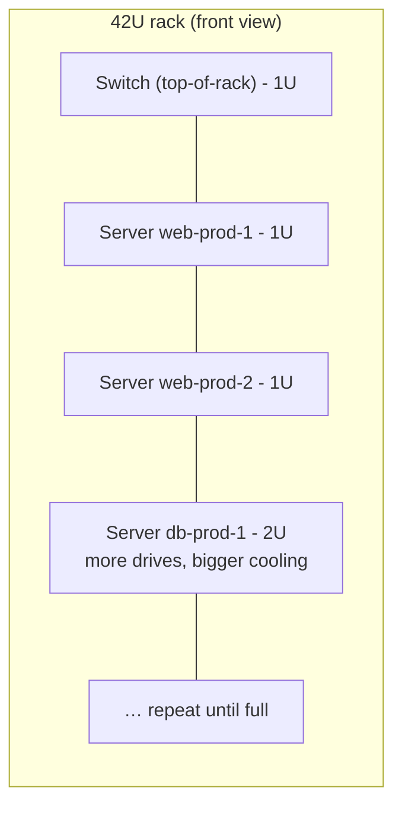
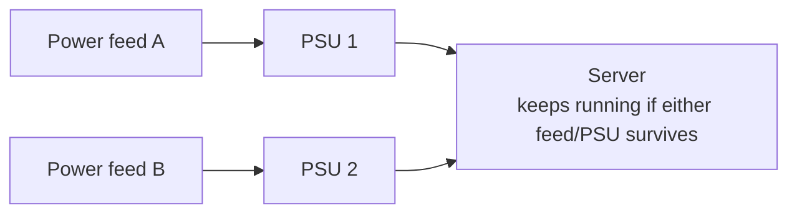
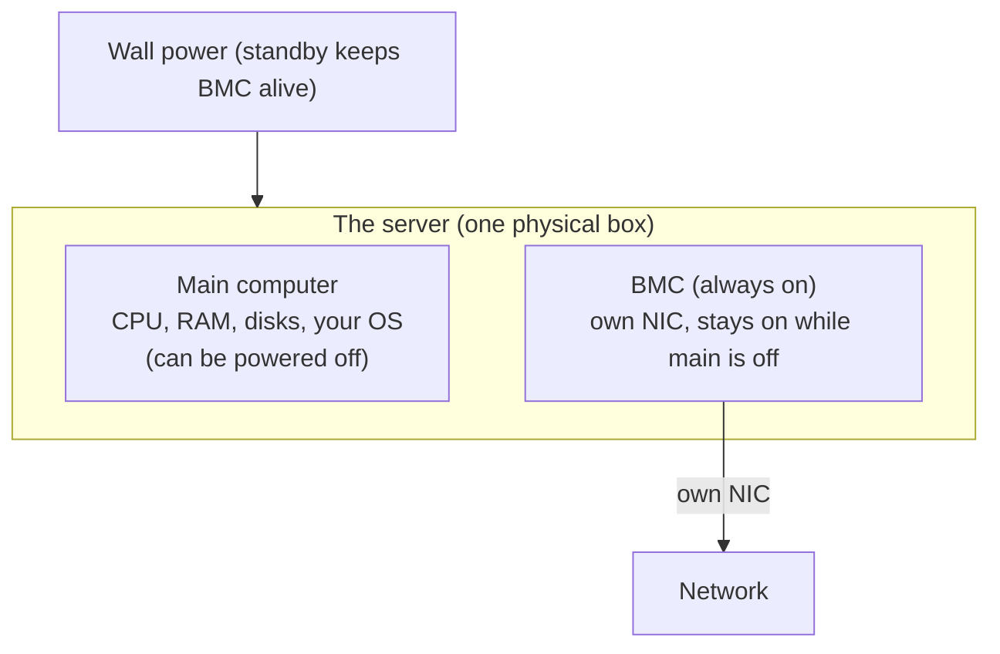

# A Server vs Your Laptop

Open up a server and a laptop side by side and you'll recognize everything. There's a CPU. There's RAM in
slots. There's storage. There's a power supply, a motherboard, fans. None of it is alien - a server is not
some exotic class of machine. It's the *same computer you already understand*, built by people who made a
completely different set of bets.

That's the whole mental model for this phase, and it's worth holding onto before we get to the parts:

> A laptop is optimized to be **used by one person, in front of it, occasionally**. A server is optimized
> to **serve many requests, unattended, continuously, for years** - and to be **packed in tight** next to
> hundreds of its siblings.

Every physical difference you're about to meet falls out of that one trade. Your laptop optimizes for
portability, a nice screen, and battery life. A server throws all three away - it never moves, no human
looks at it, and it lives plugged into the wall - and spends everything it saves on **uptime** and
**density**. Let's walk the parts.

```text
   YOUR LAPTOP                              A SERVER
   ─────────────────────────────────       ─────────────────────────────────
   built to be carried             │       built to be bolted into a rack
   one CPU, soldered RAM           │       1–2+ CPU sockets, many RAM slots
   regular RAM                     │       ECC RAM (detects/corrects bit flips)
   a battery + one power brick     │       two power supplies, either can fail
   a screen + keyboard you use     │       no screen - managed over the network
   sleeps when you close the lid   │       runs for months without a reboot
```

## The form factor: it's a pizza box, not a tower

**What it actually is.** Most servers aren't shaped like a desktop tower. They're flat, wide, shallow
metal trays designed to slide into a **rack** - a standardized steel frame, 19 inches wide on the inside,
that holds machines stacked horizontally on top of each other like trays in an oven.

📝 **Terminology.** A **rack unit**, written **U** (or RU), is the standard height increment: **1U =
1.75 inches (44.45 mm)**. A server's height is quoted in U. A **1U** server is a single thin slot - the
classic "pizza box." A **2U** server is twice as tall (room for bigger fans, more drives, fatter heat
sinks). Racks themselves are typically **42U** tall (source: the 42U full-height rack is the long-standing
industry standard; 45U and 48U variants exist).

**Why it's shaped this way.** The flat, rack-mount form factor is entirely about **density** - fitting the
most computing into the least floor space, power, and cooling. A data center pays for square footage,
electricity, and air conditioning; the more machines per rack and the more racks per room, the better the
economics. A tower wastes all of that. So the server gets squashed flat, its ports moved to the front and
back for cabling in a row, and its lid bolted down because nobody's opening it casually.



**Why this saves you later.** When a colleague says "we're out of rack space" or "that box is a 2U," you
now know they're talking about *physical inches in a steel frame*, not an abstraction. Capacity planning
in a data center is, at bottom, a game of fitting Us into racks and watts into rooms.

## ECC memory: RAM that catches its own mistakes

This is the difference most people have never heard of, and it's one of the most important.

**What it actually is.** **ECC** stands for **Error-Correcting Code** memory. It's RAM with extra bits and
circuitry that let it **detect - and usually correct - bit errors**: a `1` that silently flips to a `0`
(or vice versa) on its own.

**Why this matters at all.** Bits in RAM do occasionally flip without anyone touching them. Cosmic rays,
stray electrical noise, and plain manufacturing imperfection can knock a single bit out of place. On your
laptop, a rare flip might cause a one-pixel glitch, a crash you blame on a flaky app, or nothing you ever
notice. On a machine running for *months*, holding a *database* that many people depend on, a silently
corrupted bit is a real and serious problem - it could mean a wrong number in a financial record that
nobody ever questions.

📝 **Terminology.** A **bit flip** (or "soft error") is a stored bit spontaneously changing value with no
write from software. "Soft" because the hardware isn't broken - the next write to that location works fine;
it's the stored value that got corrupted.

**What it does in real life.** Standard (non-ECC) RAM stores your data and trusts it. ECC RAM stores your
data *plus* a small checksum alongside it. On every read, the memory controller recomputes the checksum and
compares:

```text
   NON-ECC RAM                         ECC RAM
   ┌──────────────┐                    ┌──────────────┬─────────┐
   │   8 bytes    │                    │   8 bytes    │  check  │
   │   of data    │                    │   of data    │  bits   │
   └──────────────┘                    └──────────────┴─────────┘
   a flipped bit is                    a flipped bit is caught on read:
   read out silently,                  a single-bit error is corrected
   as if it were correct               on the fly; a worse one is flagged
```

A single-bit flip gets **silently corrected** and logged; a rarer multi-bit error gets **detected and
reported** so the machine can halt rather than serve corrupt data. The trade is that ECC RAM costs a little
more and runs a hair slower - a trade no serious server skips. (It also needs a CPU and motherboard that
*support* ECC, which is part of why server chips and boards differ from desktop ones.)

⚠️ **Gotcha.** ECC correcting errors is *normal and healthy* - that's its job. But a server logging a
*steadily rising* count of corrected errors on one memory module is telling you that stick of RAM is dying.
ECC's quiet correction can mask a failing module until it tips over into uncorrectable errors and takes the
machine down. The errors are visible in the server's management logs; rising counts mean "replace that DIMM
soon," not "ignore, it's handling it."

**Why this saves you later.** When you wonder why "server-grade" hardware costs more than parts with the
same headline specs, ECC is a big part of the answer. You're not paying for speed - you're paying for the
machine to *not lie to you* about what's in memory.

## More of everything: cores, sockets, RAM slots

**What it actually is.** A server is built to do many things at once for many clients, so it's sized for
*parallelism*, not for one person's responsiveness.

- **More cores.** Server CPUs commonly carry far more cores than a laptop chip, because the work is many
  independent requests that can run side by side rather than one foreground app you're waiting on.
- **More sockets.** A **socket** is a physical mount on the motherboard for a CPU. Your laptop has one. Many
  servers have **two sockets** (some more), so the machine runs two whole CPUs, sharing the same memory and
  workload.
- **More RAM slots.** Servers have many memory slots and accept far larger total RAM than a laptop, because
  databases, caches, and dozens of simultaneous processes are hungry for it.

📝 **Terminology.** A **socket** is the slot a CPU plugs into; "a two-socket server" (or "dual-socket")
means two physical processors. Don't confuse it with a *network* socket - same word, unrelated meaning. A
**core** is one independent execution unit inside a CPU; a chip with many cores can genuinely do many
things at the same instant.

> ⏭️ If cores, threads, and how a CPU actually executes work are fuzzy, the electronics live in
> [CPU, RAM & Storage](/guides/cpu-ram-and-storage). Here we only care that a server has *more* of them,
> and why.

**Why this saves you later.** "Throw a bigger box at it" has a precise meaning once you can see the dials:
more cores for more concurrent work, more RAM to hold more in memory, a second socket when one CPU's worth
of cores isn't enough. It also explains why doubling a server's specs can *more* than double its price -
you may be crossing from one socket to two, which changes the whole class of machine.

## Redundant power supplies: two ways to stay alive

**What it actually is.** Your laptop has one power path: one battery, one charger. A server typically has
**two power supply units (PSUs)**, and the machine keeps running on **either one alone**.

**Why this exists.** A power supply is a component, and components fail. If a server had one PSU and it
died, the machine would drop dead instantly - every service on it, gone. With two, one can fail (or be
unplugged) and the server doesn't even hiccup. Better still, the two PSUs are often fed from **two separate
power circuits**, so even losing a whole circuit - a tripped breaker, a failed feed - doesn't take the
machine down.



We'll meet this idea - *two of a thing so the failure of one doesn't matter* - over and over in
[Phase 2](02-built-not-to-stop.md). Redundant power is the first and most visible example.

**Why this saves you later.** When you see a server with two power cords and wonder why, it's not a spare
in a drawer - *both are plugged in and live*, and the second exists precisely so a person (or a failure)
can remove one without anything noticing.

## Remote management: running a machine with no monitor

Here's the puzzle that trips up everyone meeting servers for the first time. A server has **no monitor, no
keyboard, no mouse**. So: how do you install the operating system before the OS - and its network, and its
SSH - even exists? How do you watch it boot? How do you power-cycle a frozen machine that won't answer the
network anymore? How do you do *any* of this when the server is in a building you may never physically
visit?

**What it actually is.** Every serious server contains a **second, tiny computer** built onto the
motherboard whose entire job is to manage the *main* computer. It's called the **BMC** - **Baseboard
Management Controller** - and you talk to it using a standard called **IPMI** (and increasingly its modern
successor, Redfish). The BMC has its **own network port and its own little operating system**, completely
separate from the main server.

📝 **Terminology.** **BMC** (Baseboard Management Controller) = the small dedicated chip-computer on the
motherboard that manages the host machine. **IPMI** (Intelligent Platform Management Interface) = the
long-standing standard protocol for talking to a BMC. Vendors brand their BMC implementations - Dell calls
theirs **iDRAC**, HP calls theirs **iLO**, Supermicro just says **IPMI** - but it's the same idea.

**The part that surprises people.** The BMC runs **even when the server is "off."** As long as the machine
is plugged into the wall - even with the main system powered down - the BMC is awake and listening on the
network, drawing a trickle of standby power. "Off," for a server, usually means *the main computer is off
but its little manager is still on*.



**What it does in real life.** Through the BMC, over the network, an admin who is nowhere near the building
can:

- **Power the machine on, off, or hard-reset it** - the equivalent of physically pressing the power button,
  done remotely, even on a server that's totally frozen and ignoring the network.
- **See the actual screen** - a remote console showing exactly what a monitor plugged into the front would
  show, including the boot-up and BIOS screens that exist *before any OS*.
- **Mount an OS installer remotely** and install the operating system from scratch on a bare machine that
  has nothing on its disks yet.
- **Read the hardware's health** - temperatures, fan speeds, PSU status, and those ECC memory error counts
  from earlier - straight from the sensors.

This is how data centers work at all. The vast majority of servers are *never* touched by hands after
they're racked. Everything - install, boot, recover, power-cycle - happens through the BMC and over the
network.

⚠️ **Gotcha - the BMC is a security boundary you can't ignore.** Because the BMC can power-cycle the
machine, watch its screen, and mount installers, anyone who reaches it controls the server completely -
*more* completely than a normal admin login, because they're below the OS. BMC management networks are kept
strictly separate from the public internet and the main traffic network for exactly this reason. A BMC
exposed to the open internet is one of the most dangerous misconfigurations there is.

**Why this saves you later.** The first time someone says "I'll just reboot it over the iDRAC" or "the iLO
shows it's stuck at POST," you'll know they mean the out-of-band management controller - the always-on
little computer - not a normal SSH session. And you'll understand the answer to the riddle: you administer a
machine with no monitor because it ships with a built-in one you reach over the wire.

## Recap

1. A server is the **same fundamental computer** as your laptop - CPU, RAM, storage - built around
   **uptime and density** instead of portability and a nice screen.
2. The **rack-mount form factor** (height measured in **U**, racks typically **42U**) exists to pack the
   most computing into the least floor space, power, and cooling.
3. **ECC memory** detects and corrects spontaneous **bit flips**, so a long-running machine doesn't
   silently serve corrupted data - and its error logs warn you when a DIMM is dying.
4. Servers have **more cores, more sockets, and more RAM slots** because their job is many things at once,
   not one person's foreground app.
5. **Redundant power supplies** (often on separate circuits) let the machine survive the failure of a power
   path - the first taste of "no single point of failure."
6. A **BMC** (talked to via **IPMI**/iDRAC/iLO) is a tiny always-on computer-within-the-computer that lets
   admins power-cycle, watch the screen, install the OS, and read sensors **remotely - even while the main
   machine is off** - which is how a monitor-less server is managed at all.

Next, we take the redundancy idea - two PSUs so one can fail - and follow it through the rest of the
machine: disks, drives, and the single principle that governs reliable hardware design.

---

[← Guide overview](_guide.md) · [Phase 2: Built Not to Stop - Redundancy & Reliability →](02-built-not-to-stop.md)
