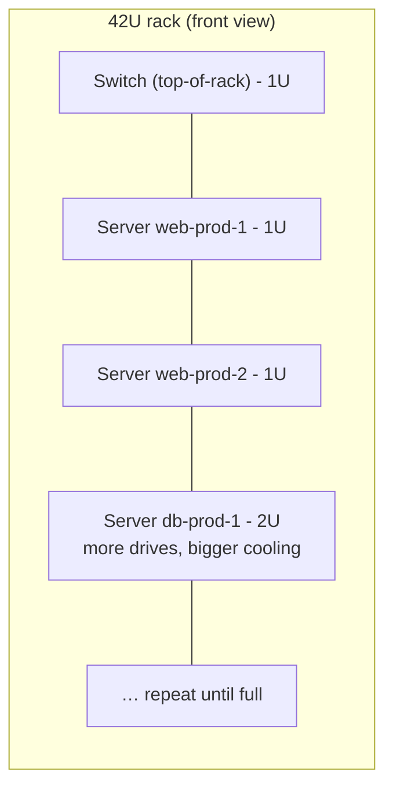
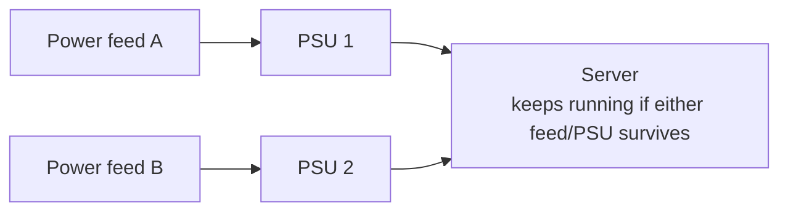
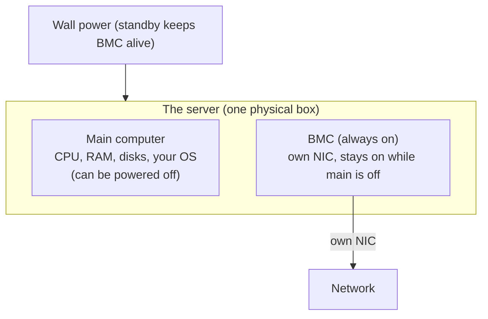

# A Server vs Your Laptop

Open a server and a laptop side by side and you'll recognize everything: CPU, RAM in slots, storage,
power supply, motherboard, fans. A server is the *same computer you already understand*, built by people
who made a completely different set of bets:

> A laptop is optimized to be **used by one person, in front of it, occasionally**. A server is optimized
> to **serve many requests, unattended, continuously, for years** - and to be **packed in tight** next to
> hundreds of its siblings.

Every physical difference below falls out of that one trade. A laptop optimizes for portability, a nice
screen, and battery life; a server throws all three away - it never moves, no human looks at it, it lives
plugged into the wall - and spends everything it saves on **uptime** and **density**.

```text
   YOUR LAPTOP                              A SERVER
   ─────────────────────────────────       ─────────────────────────────────
   built to be carried             │       built to be bolted into a rack
   one CPU, soldered RAM           │       1–2+ CPU sockets, many RAM slots
   regular RAM                     │       ECC RAM (detects/corrects bit flips)
   a battery + one power brick     │       two power supplies, either can fail
   a screen + keyboard you use     │       no screen - managed over the network
   sleeps when you close the lid   │       runs for months without a reboot
```

## The form factor: it's a pizza box, not a tower

Most servers aren't towers but flat, shallow metal trays that slide into a **rack** - a standardized
steel frame, 19 inches wide inside, holding machines stacked like trays in an oven.

📝 **Terminology.** A **rack unit**, written **U** (or RU), is the standard height increment: **1U =
1.75 inches (44.45 mm)**. A **1U** server is a single thin slot - the classic "pizza box." A **2U** server
is twice as tall (room for bigger fans, more drives, fatter heat sinks). Racks themselves are typically
**42U** tall (the long-standing industry standard; 45U and 48U variants exist).

The flat form factor is entirely about **density** - the most computing per unit of floor space, power,
and cooling. A data center pays for square footage, electricity, and air conditioning; a tower wastes all
three. So the server is squashed flat, ports moved front and back for cabling in a row, lid bolted down
because nobody opens it casually.



"We're out of rack space" and "that box is a 2U" mean *physical inches in a steel frame*; capacity
planning in a data center is, at bottom, fitting Us into racks and watts into rooms.

## ECC memory: RAM that catches its own mistakes

The difference most people have never heard of, and one of the most important. **ECC** (**Error-Correcting
Code**) memory is RAM with extra bits and circuitry that **detect - and usually correct - bit errors**: a
`1` that silently flips to a `0` (or vice versa) on its own.

Bits in RAM do occasionally flip untouched - cosmic rays, stray electrical noise, plain manufacturing
imperfection. On your laptop, a rare flip might cause a one-pixel glitch, a crash you blame on a flaky
app, or nothing you notice. On a machine running for *months*, holding a *database* many people depend
on, a silently corrupted bit is serious - it could be a wrong number in a financial record nobody ever
questions.

📝 **Terminology.** A **bit flip** (or "soft error") is a stored bit spontaneously changing value with no
write from software. "Soft" because the hardware isn't broken - the next write works fine; it's the
stored value that got corrupted.

Standard RAM stores your data and trusts it. ECC RAM stores your data *plus* a small checksum, and on
every read the memory controller recomputes and compares:

```text
   NON-ECC RAM                         ECC RAM
   ┌──────────────┐                    ┌──────────────┬─────────┐
   │   8 bytes    │                    │   8 bytes    │  check  │
   │   of data    │                    │   of data    │  bits   │
   └──────────────┘                    └──────────────┴─────────┘
   a flipped bit is                    a flipped bit is caught on read:
   read out silently,                  a single-bit error is corrected
   as if it were correct               on the fly; a worse one is flagged
```

A single-bit flip gets **silently corrected** and logged; a rarer multi-bit error gets **detected and
reported** so the machine can halt rather than serve corrupt data. The trade: ECC costs a little more and
runs a hair slower - a trade no serious server skips. (It also needs a CPU and motherboard that *support*
ECC, part of why server chips and boards differ from desktop ones.)

⚠️ **Gotcha.** ECC correcting errors is *normal and healthy*. But a *steadily rising* count of corrected
errors on one memory module means that stick of RAM is dying - ECC's quiet correction can mask a failing
module until it tips into uncorrectable errors and takes the machine down. The counts appear in the
management logs; rising means "replace that DIMM soon," not "ignore, it's handling it."

This is also why "server-grade" hardware costs more than parts with the same headline specs: you're not
paying for speed, you're paying for the machine to *not lie to you* about what's in memory.

## More of everything: cores, sockets, RAM slots

A server does many things at once for many clients, so it's sized for *parallelism*, not one person's
responsiveness:

- **More cores.** Server CPUs carry far more cores than laptop chips, because the work is many independent
  requests running side by side.
- **More sockets.** A **socket** is a physical mount on the motherboard for a CPU. Your laptop has one;
  many servers have **two** (some more), running two whole CPUs that share the same memory and workload.
- **More RAM slots.** Servers accept far larger total RAM, because databases, caches, and dozens of
  simultaneous processes are hungry for it.

📝 **Terminology.** "Two-socket" (or "dual-socket") = two physical processors. Don't confuse a CPU socket
with a *network* socket - same word, unrelated. A **core** is one independent execution unit inside a CPU.

> ⏭️ If cores and threads are fuzzy, the electronics live in
> [CPU, RAM & Storage](/guides/cpu-ram-and-storage) - here we only care that a server has *more* of them,
> and why.

"Throw a bigger box at it" has a precise meaning once you see the dials: more cores for more concurrent
work, more RAM to hold more in memory, a second socket when one CPU's worth of cores isn't enough. It
also explains why doubling specs can *more* than double price - you may be crossing from one socket to
two, a different class of machine.

## Redundant power supplies: two ways to stay alive

Your laptop has one power path. A server typically has **two power supply units (PSUs)** and keeps
running on **either one alone**. A power supply is a component, and components fail; with one PSU, its
death drops the machine instantly - every service on it, gone. With two, one can fail (or be unplugged)
and the server doesn't hiccup. The two PSUs are often fed from **two separate power circuits**, so even
losing a whole circuit - a tripped breaker, a failed feed - doesn't take the machine down.



We'll meet this idea - *two of a thing so the failure of one doesn't matter* - over and over in
[Phase 2](02-built-not-to-stop.md). And when you see a server with two power cords: *both are plugged in
and live*, precisely so a person (or a failure) can remove one without anything noticing.

## Remote management: running a machine with no monitor

The puzzle that trips up everyone meeting servers: a server has **no monitor, no keyboard, no mouse**. So
how do you install the operating system before the OS - and its network, and its SSH - even exists? How
do you power-cycle a frozen machine that won't answer the network, in a building you may never visit?

Every serious server contains a **second, tiny computer** on the motherboard whose entire job is to
manage the *main* one: the **BMC** - **Baseboard Management Controller** - reached via a standard called
**IPMI** (and increasingly its modern successor, Redfish). The BMC has its **own network port and its own
little operating system**, completely separate from the main server.

📝 **Terminology.** *IPMI* = Intelligent Platform Management Interface. Vendors brand their BMCs -
Dell's **iDRAC**, HP's **iLO**, Supermicro just says **IPMI** - but it's the same idea.

The surprise: the BMC runs **even when the server is "off."** As long as the machine is plugged into the
wall, the BMC is awake on the network, drawing a trickle of standby power.
"Off," for a server, usually means *the main computer is off but its little manager is still on*.



Through the BMC, over the network, an admin nowhere near the building can:

- **Power the machine on, off, or hard-reset it** - remotely pressing the power button, even on a machine
  that's frozen and ignoring the network.
- **See the actual screen** - a remote console showing what a plugged-in monitor would show, including
  the boot and BIOS screens that exist *before any OS*.
- **Mount an OS installer remotely** and install the operating system on a bare machine with empty disks.
- **Read the hardware's health** - temperatures, fan speeds, PSU status, and those ECC error counts from
  earlier - straight from the sensors.

This is how data centers work at all: the vast majority of servers are *never* touched by hands after
they're racked. Everything - install, boot, recover, power-cycle - happens through the BMC.

⚠️ **Gotcha - the BMC is a security boundary you can't ignore.** Anyone who reaches the BMC controls the
server completely - *more* completely than a normal admin login, because they're below the OS. BMC
management networks are kept strictly separate from the public internet and the main traffic network for
exactly this reason. A BMC exposed to the open internet is one of the most dangerous misconfigurations
there is.

So when someone says "I'll just reboot it over the iDRAC" or "the iLO shows it's stuck at POST," they
mean the out-of-band management controller, not a normal SSH session. You administer a machine with no
monitor because it ships with a built-in one you reach over the wire.

## Recap

1. A server is the **same fundamental computer** as your laptop, built around **uptime and density**
   instead of portability and a nice screen.
2. The **rack-mount form factor** (height in **U**, racks typically **42U**) packs the most computing into
   the least floor space, power, and cooling.
3. **ECC memory** detects and corrects spontaneous **bit flips**, so a long-running machine doesn't
   silently serve corrupted data - and its error logs warn you when a DIMM is dying.
4. Servers have **more cores, more sockets, and more RAM slots** because their job is many things at once.
5. **Redundant power supplies** (often on separate circuits) survive the failure of a power path - the
   first taste of "no single point of failure."
6. A **BMC** (via **IPMI**/iDRAC/iLO) is a tiny always-on computer-within-the-computer for remote
   power-cycling, console access, OS installs, and sensor readings - **even while the main machine is
   off**.

Next we follow the redundancy idea through the rest of the machine: disks, drives, and the single
principle that governs reliable hardware design.

---

[← Guide overview](_guide.md) · [Phase 2: Built Not to Stop - Redundancy & Reliability →](02-built-not-to-stop.md)
