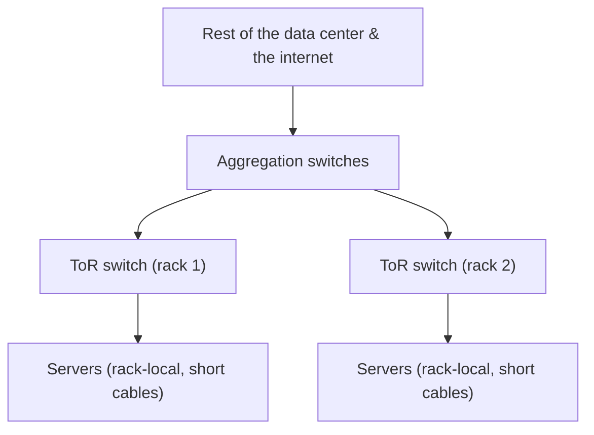
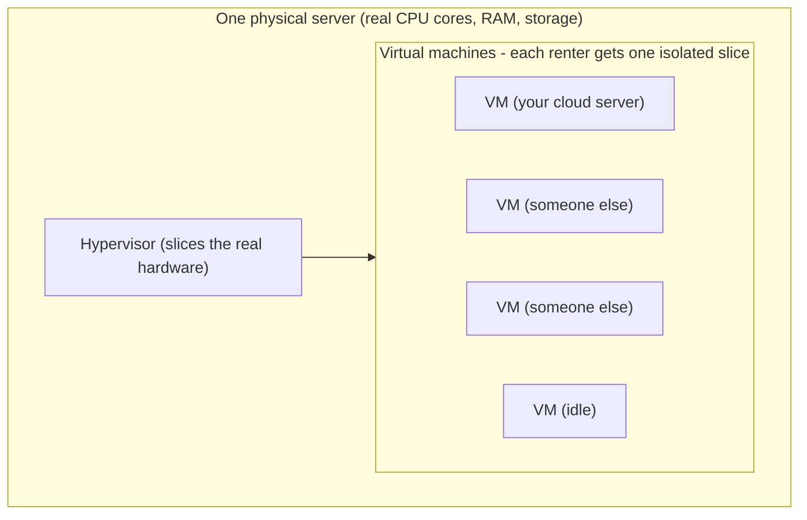

# The Data Center & "The Cloud"

You can now picture one server - a flat metal box, built for uptime, full of redundant parts. Multiply it
by tens of thousands, put it in a purpose-built warehouse, and you have a **data center**. Multiply
*that* by a few buildings in a region, run by a company that rents you slices by the hour, and you have
**the cloud**. By the end of this phase we'll retire the phrase "the cloud is just someone else's
computer" - not by mocking it, but by making it *precise*. It's almost exactly right, and the "almost" is
the interesting part.

## A room full of racks

A data center is a building engineered to house, power, cool, and network a very large number of servers.
Inside are long rows of the **racks** from [Phase 1](01-a-server-vs-your-laptop.md) - steel frames packed
with 1U and 2U servers - lined up in aisles, humming.

```text
   A DATA-CENTER ROW (looking down an aisle)

   [rack][rack][rack][rack][rack][rack][rack]   ← a row of racks
   [rack][rack][rack][rack][rack][rack][rack]   ← another row
        │                              │
   each rack ≈ 42U of servers,    aisles between rows carry
   each server full of CPUs,      cabling, and crucially, AIR
   RAM, and RAID arrays           (we'll get to cooling)
```

The building exists to give every server three things reliably and at massive scale: **network**,
**power**, and **cooling**. Those three - not the servers themselves - are what a data center is really
*about*, and any one of them running short is what limits how many machines a building can hold.

## Networking: top-of-rack and up

Wiring tens of thousands of machines individually back to one place would be a cabling nightmare, so data
centers use a hierarchy that starts inside each rack. Remember the switch at the top of Phase 1's rack
diagram? That's the **top-of-rack (ToR) switch**: every server in *that* rack plugs into it with a short
cable. ToR switches connect upward to bigger aggregation switches, which connect upward again toward the
data center's links to the wider internet.

📝 **Terminology.** A **switch** connects machines on a local network and forwards traffic between them.



> ⏭️ How IP addresses, routing, and the internet itself work is a networking topic of its own; the
> takeaway here is the *hierarchy*: server → top-of-rack switch → aggregation → the wider world.

## Power and cooling: the real limits

Surprise: a data center's hardest problems aren't about computing. They're about **electricity** and
**heat**.

**Power.** Tens of thousands of servers draw an enormous, continuous amount of electricity - and they can
*never* lose it. So the building applies the two-PSU idea at building scale: multiple independent grid
feeds, banks of **batteries (a UPS - uninterruptible power supply)** that carry the load for the seconds
it takes to react to an outage, and **diesel generators** that run the entire building if grid power
stays down. No single power failure should take the building offline - the same no-single-point-of-failure
principle from [Phase 2](02-built-not-to-stop.md), scaled up.

📝 **Terminology.** A **UPS** buys *seconds to minutes*, not hours - its job is to carry the load
seamlessly until generators take over or grid power returns.

**Cooling.** Every watt a server consumes comes back out as **heat**; without aggressive cooling, a room
of thousands of servers would cook itself within minutes. Cooling is so central that data centers are
physically laid out around airflow. The common scheme is **hot aisle / cold aisle**: cold air is
delivered to the fronts of the servers, hot exhaust blows out the backs into shared "hot" aisles where
it's captured and carried away - instead of hot and cold air mixing into lukewarm uselessness.

```text
   HOT AISLE / COLD AISLE (airflow, looking down from above)

      cold air in →  [server fronts] → [server backs]  → hot air out
                      ┌───────────┐     ┌───────────┐
      COLD AISLE      │   rack    │     │   rack    │     HOT AISLE
      (cold supply)   │  front →  │     │  ← back   │   (hot exhaust,
                      └───────────┘     └───────────┘    carried away)
      servers pull cold air in the front, push heat out the back;
      the layout keeps the two from mixing.
```

When people talk about a data center's *capacity*, they often mean power and cooling, not floor space - a
room can run out of watts or cooling long before it runs out of room for racks. It's also why "the cloud"
has an environmental footprint worth taking seriously: the cloud is not ethereal. It's a warehouse that
draws as much power as a small town and works hard to stay cold.

## Redundancy at building scale

Every reliability idea from one server reappears here, one level up - and a cloud provider keeps copies
of your data across *multiple* machines, often across *multiple buildings*, so one machine or one
building failing doesn't lose it.

📝 **Terminology.** Cloud providers group data centers into **regions** (a geographic area, e.g. "US
East") made up of multiple **availability zones** - separate buildings (or clusters) with independent
power and networking, close enough for fast communication but far enough apart that a fire, flood, or
power event in one won't take out the others. Spreading systems across zones is the cloud-scale version
of "no single point of failure."

```text
   ONE SERVER          ONE DATA CENTER             ONE CLOUD REGION
   ──────────          ───────────────             ────────────────
   two PSUs            redundant feeds + UPS        multiple availability
   RAID across disks   + diesel generators          zones (separate
                       redundant ToR/uplinks        buildings), data
                                                    copied across them

   same principle, three scales: eliminate the single point of failure.
```

## So what *is* "the cloud"?

Now we can be exact. Strip the word "just" from "the cloud is just someone else's computer" and the rest
is essentially true - with one crucial refinement.

When you "spin up a server in the cloud," you are almost never handed a *whole* physical machine. One of
those very real servers - in a rack, in one of these power-and-cooling-redundant buildings - is **sliced
up** by software into many isolated **virtual machines (VMs)**, and you rent **one slice**. This is
**virtualization**: a thin layer called the **hypervisor** runs on the physical server, carving its real
CPU cores, RAM, and storage into self-contained virtual computers - each *believing* it's a whole
machine, each isolated from the others sharing the same metal. Your "cloud instance" is one of them.



The honest, precise version:

> **The cloud is real, physical servers - in someone else's buildings, with their power, cooling, and
> redundancy - divided by software into rentable slices, billed by the hour.** "Someone else's computer"
> isn't a dismissal; it's the literal architecture. The genius isn't that the computer disappeared. It's
> that you got the slice you needed, instantly, without buying the building.

⚠️ **Gotcha - "serverless" still runs on servers.** "Serverless" means *you* don't manage or even see the
server - the provider runs your code on their machines, spinning capacity up only when your code runs and
billing you for that. The metal from Phase 1 is still there, in the racks from this phase. The name
describes *your* experience of it, not its absence.

Once you see the physical machine under the abstraction, cloud behavior stops being mysterious. "Noisy
neighbor" slowdowns? Another VM on the same physical host is hogging the shared hardware. Why does
spreading across availability zones cost more but survive outages? You're paying to *not* have all your
slices in one building. Why do bigger instances cost disproportionately more? Past a point you're renting
a larger fraction of a physical box - eventually crossing into the two-socket, more-RAM class of machine
from Phase 1.

## Where this leaves you

You started with the laptop in front of you and ended inside a warehouse drawing the power of a small
town - one idea zoomed out three times: a computer you understand, rebuilt for uptime and density, made
not to stop, then replicated by the thousand and rented in slices. What you *don't* have yet is what you
*do* with one once it's yours: a bare Linux box with no monitor, reached over the network, waiting to
serve something.

> ⏭️ Ready to drive one? **[Linux for Servers](/guides/linux-for-servers)** picks up exactly here: how to
> SSH into that headless machine, run long-lived services on it, read its logs, and keep it secure. This
> guide showed you the metal; that one shows you the operator's seat.

## Recap

1. A **data center** houses thousands of racked servers and exists to give them **network, power, and
   cooling** reliably and at scale.
2. Networking is a **hierarchy**: each server cables to a **top-of-rack switch**, which connects up through
   aggregation switches toward the wider internet.
3. **Power and cooling are the real limits** - redundant feeds, **UPS** batteries, and diesel generators
   keep power on; **hot aisle / cold aisle** layout keeps heat moving. A room can run out of watts before
   it runs out of space.
4. Every reliability idea **scales up**: one server's two PSUs and RAID become a building's redundant power
   and a region's multiple **availability zones** - the same "no single point of failure."
5. **The cloud is real, physical servers** in someone else's buildings, sliced by **virtualization** (a
   **hypervisor**) into rentable **VMs** - a cloud instance is one slice of a machine like the one in
   Phases 1 and 2.
6. **"Serverless"** still runs on those servers - the name describes your experience, not the disappearance
   of the metal.

---

[← Phase 2: Built Not to Stop](02-built-not-to-stop.md) · [Guide overview](_guide.md)
