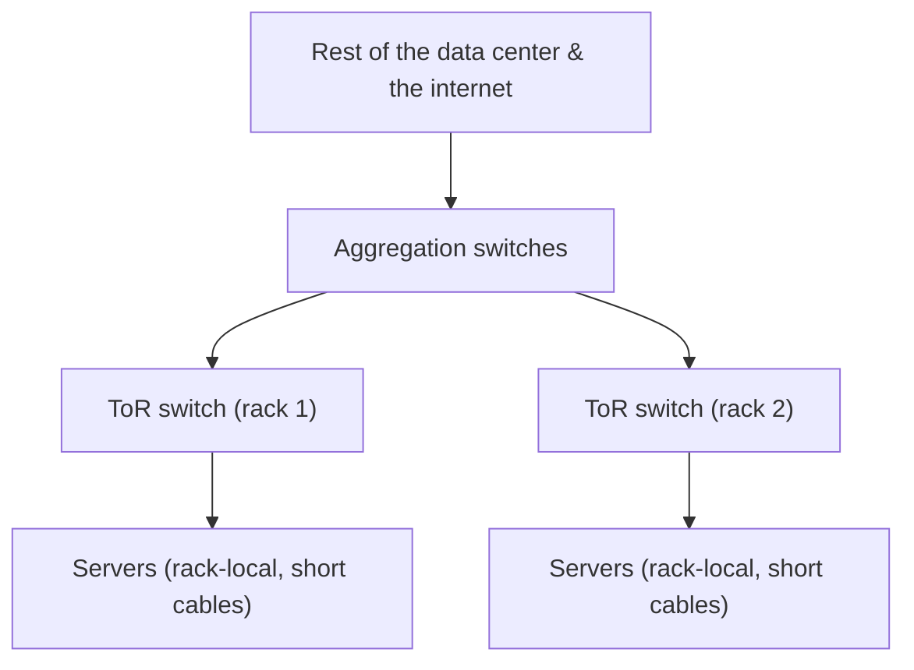

# The Data Center & "The Cloud"

You can now picture one server — a flat metal box, built for uptime, full of redundant parts that let it
shrug off failures and get repaired while it runs. Now take that picture and multiply it by tens of
thousands, put it in a purpose-built warehouse, and you have a **data center**. Multiply *that* by a few
buildings in a region, run by a company that rents you slices of it by the hour, and you have **the cloud**.

This phase zooms out one last time and, by the end, retires the phrase "the cloud is just someone else's
computer" — not by mocking it, but by making it *precise*. Because it's almost exactly right, and the
"almost" is the interesting part.

## A room full of racks

**What it actually is.** A data center is a building engineered for one purpose: to house, power, cool, and
network a very large number of servers. Walk inside and you see long rows of the **racks** from
[Phase 1](01-a-server-vs-your-laptop.md) — steel frames, each packed with servers stacked in their 1U and
2U slots — lined up in aisles, humming.

```text
   A DATA-CENTER ROW (looking down an aisle)

   [rack][rack][rack][rack][rack][rack][rack]   ← a row of racks
   [rack][rack][rack][rack][rack][rack][rack]   ← another row
        │                              │
   each rack ≈ 42U of servers,    aisles between rows carry
   each server full of CPUs,      cabling, and crucially, AIR
   RAM, and RAID arrays           (we'll get to cooling)
```

The building exists to give every one of those servers three things reliably and at massive scale:
**network**, **power**, and **cooling**. Those three, not the servers themselves, are what a data center is
really *about* — and any one of them running short is what limits how many machines a building can hold.

## Networking: top-of-rack and up

**What it actually is.** Every server needs to talk to the network — to other servers and to the outside
world. Wiring tens of thousands of machines individually back to one place would be a cabling nightmare, so
data centers use a tidy hierarchy that starts inside each rack.

Remember the switch sitting at the top of the rack diagram back in Phase 1? That's the **top-of-rack (ToR)
switch**: a network switch that lives in (usually) the top slot of the rack and that every server in *that*
rack plugs into with a short cable. The ToR switches then connect upward to bigger aggregation switches,
which connect upward again toward the data center's links to the wider internet.

📝 **Terminology.** A **switch** is a device that connects machines on a local network and forwards traffic
between them. **Top-of-rack (ToR)** describes the switch placed in each rack so that rack's servers cable to
it locally, instead of every server running a long cable to a central point.



> ⏭️ This is the physical shape of data-center networking; how IP addresses, routing, and the internet
> itself work is a networking topic of its own. Here, the takeaway is the *hierarchy*: server → top-of-rack
> switch → aggregation → the wider world.

## Power and cooling: the real limits

Here's something that surprises people: a data center's hardest problems aren't about computing. They're
about **electricity** and **heat**.

**Power.** Tens of thousands of servers draw an enormous, continuous amount of electricity — and they can
*never* lose it, because losing power means every machine drops dead at once. So a data center builds the
same redundancy you saw in a single server's two PSUs, but at building scale: multiple independent feeds
from the power grid, banks of **batteries (a UPS — uninterruptible power supply)** that carry the load for
the seconds it takes to react to an outage, and **diesel generators** that start up and run the entire
building if grid power stays down. No single power failure should take the building offline — the same
no-single-point-of-failure principle from [Phase 2](02-built-not-to-stop.md), scaled up.

📝 **Terminology.** A **UPS** (uninterruptible power supply) is a battery system that instantly carries the
load when incoming power fails, bridging the gap until generators take over or grid power returns. It buys
*seconds to minutes*, not hours — its job is to make the handover seamless.

**Cooling.** Every watt of electricity a server consumes comes back out as **heat**. Pack thousands of
servers into a room and, without aggressive cooling, that room would cook itself — and its machines — within
minutes. Cooling is so central that data centers are physically laid out around airflow. The common scheme
is **hot aisle / cold aisle**: racks are arranged so cold air is delivered to the fronts of the servers and
the hot exhaust blows out the backs into shared "hot" aisles, where it's captured and carried away, instead
of hot and cold air mixing into lukewarm uselessness.

```text
   HOT AISLE / COLD AISLE (airflow, looking down from above)

      cold air in →  [server fronts] → [server backs]  → hot air out
                      ┌───────────┐     ┌───────────┐
      COLD AISLE      │   rack    │     │   rack    │     HOT AISLE
      (cold supply)   │  front →  │     │  ← back   │   (hot exhaust,
                      └───────────┘     └───────────┘    carried away)
      servers pull cold air in the front, push heat out the back;
      the layout keeps the two from mixing.
```

**Why this matters to you.** When people talk about a data center's *capacity*, they often mean power and
cooling, not floor space — a room can run out of watts or cooling long before it runs out of room for racks.
And this is *also* why "the cloud" has an environmental footprint worth taking seriously: all that
electricity and cooling is real, physical, and large. The cloud is not ethereal. It's a warehouse that
draws as much power as a small town and works hard to stay cold.

## Redundancy at building scale

Every reliability idea from one server reappears here, one level up. A single server has two PSUs; a data
center has redundant power feeds, UPS, and generators. A single server has RAID so one disk's death doesn't
lose data; a cloud provider keeps copies of your data across *multiple* machines, and often across
*multiple buildings*, so one machine — or one building — failing doesn't lose it.

📝 **Terminology.** Cloud providers group their data centers into **regions** (a geographic area, e.g. "US
East") made up of multiple **availability zones** — separate buildings (or clusters) with independent power
and networking, close enough for fast communication but far enough apart that a fire, flood, or power event
in one won't take out the others. Spreading your systems across zones is the cloud-scale version of "no
single point of failure."

```text
   ONE SERVER          ONE DATA CENTER             ONE CLOUD REGION
   ──────────          ───────────────             ────────────────
   two PSUs            redundant feeds + UPS        multiple availability
   RAID across disks   + diesel generators          zones (separate
                       redundant ToR/uplinks        buildings), data
                                                    copied across them

   same principle, three scales: eliminate the single point of failure.
```

It's the same sentence from Phase 2, all the way up: *find the thing whose failure stops you, and make sure
there isn't just one of it.* The cloud is that principle applied at the scale of buildings.

## So what *is* "the cloud"?

Now we can be exact. You've heard "the cloud is just someone else's computer." Strip the word "just" (we
don't do hand-waving here), and the rest is essentially true — with one crucial refinement.

When you "spin up a server in the cloud," you are almost never handed a *whole* physical machine. Instead,
one of those very real, very physical servers — sitting in a rack, in a row, in one of these
power-and-cooling-redundant buildings — is **sliced up** by software into many isolated **virtual machines
(VMs)**, and you rent **one slice**.

**What it actually is.** A technology called **virtualization** runs a thin layer (a **hypervisor**) on the
physical server. The hypervisor carves the machine's real CPU cores, RAM, and storage into multiple
self-contained virtual computers, each of which *believes* it's a whole machine with its own CPU, memory,
and disk — and each isolated from the others sharing the same metal. Your "cloud instance" is one of those
virtual machines.

📝 **Terminology.** **Virtualization** is running multiple isolated virtual computers on one physical
machine. The **hypervisor** is the software layer that creates and isolates them, dividing the real
hardware among the **virtual machines (VMs)** running on top. A **cloud VM / instance** is one such virtual
machine that you rent.


So the honest, precise version of the saying is:

> **The cloud is real, physical servers — in someone else's buildings, with their power, cooling, and
> redundancy — divided by software into rentable slices, billed by the hour.** "Someone else's computer"
> isn't a dismissal; it's the literal architecture. The genius isn't that the computer disappeared. It's
> that you got the slice you needed, instantly, without buying the building.

⚠️ **Gotcha — "serverless" still runs on servers.** You'll hear "serverless" and think the servers are
gone. They're not. "Serverless" means *you* don't manage or even see the server — the provider runs your
code on their machines, spinning capacity up only when your code runs and billing you for that. The metal
from Phase 1 is still there, in the racks from this phase. The name describes *your* experience of it, not
its absence.

**Why this is worth knowing.** Once you can see the physical machine under the abstraction, a lot of cloud
behavior stops being mysterious. "Noisy neighbor" slowdowns? Another VM on the same physical host is hogging
the shared hardware. Why spreading across availability zones costs more but survives outages? You're paying
to *not* have all your slices on machines in one building. Why bigger instances cost disproportionately
more? Past a point you're renting a larger fraction of a physical box — eventually crossing into the
two-socket, more-RAM class of machine from Phase 1.

## Where this leaves you

You started with the laptop in front of you and ended inside a warehouse drawing the power of a small town.
The whole journey was one idea, zoomed out three times: a computer you understand, rebuilt for uptime and
density, made not to stop, then replicated by the thousand and rented out in slices.

What you *don't* have yet is the other half — what you actually *do* with one of these machines once it's
yours. You rent a cloud VM; now it's a bare Linux box with no monitor, reached over the network, waiting
for you to make it serve something. That's a different skill, and it has its own guide:

> ⏭️ Ready to drive one? **[Linux for Servers](/guides/linux-for-servers)** picks up exactly here: how to
> SSH into that headless machine, run long-lived services on it, read its logs, and keep it secure. This
> guide showed you the metal; that one shows you the operator's seat.

## Recap

1. A **data center** is a building that houses thousands of racked servers and exists to give them
   **network, power, and cooling** reliably and at scale.
2. Networking is a **hierarchy**: each server cables to a **top-of-rack switch**, which connects up through
   aggregation switches toward the wider internet.
3. **Power and cooling are the real limits** — redundant feeds, **UPS** batteries, and diesel generators
   keep power on; **hot aisle / cold aisle** layout keeps the heat moving. A room can run out of watts or
   cooling before it runs out of space.
4. Every reliability idea **scales up**: one server's two PSUs and RAID become a building's redundant power
   and a region's multiple **availability zones** — the same "no single point of failure," at building
   scale.
5. **The cloud is real, physical servers** in someone else's buildings, sliced by **virtualization** (a
   **hypervisor**) into rentable **VMs**. "Someone else's computer" is literally true; a cloud instance is
   one slice of a machine like the one in Phases 1 and 2.
6. **"Serverless"** still runs on those servers — the name describes your experience, not the disappearance
   of the metal.

---

[← Phase 2: Built Not to Stop](02-built-not-to-stop.md) · [Guide overview](_guide.md)
