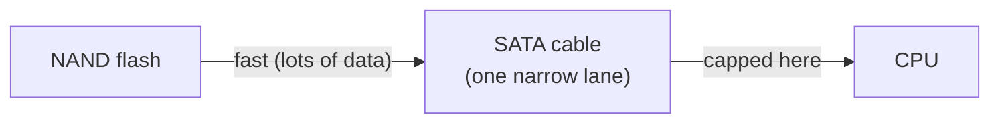

# NVMe vs SATA - the Interface Bottleneck

Here's the part that trips up even people who know SSDs are fast. Two SSDs can use the very same flash chips
and still perform very differently - because the *connection* between the drive and the rest of the computer
can be a bottleneck. You can put a race car on a one-lane country road, and it'll go exactly as fast as the
road allows.

This phase is about that road. The drive's flash is one thing; the **interface** it talks through is another,
and the interface is where SATA and NVMe part ways.

📝 **Terminology.** An **interface** here is the combination of the physical connection and the language the
drive and computer use to talk over it. **SATA** and **NVMe** are two such interfaces. They are *not* a
storage technology like flash - they're how the storage gets *delivered* to the rest of the machine.

## SATA - a road built for spinning disks

**What it actually is.** SATA is the older interface, and the key fact about it is *when* it was designed: in
the era of HDDs. Its whole design assumed the thing on the other end was a slow, mechanical spinning disk that
could never deliver data very fast anyway. So SATA's data path is relatively narrow, and its command system
talks to the drive one queue at a time - perfectly adequate for an HDD that's bottlenecked by its own moving
arm.

**The problem.** When you put a *flash* SSD on a SATA connection, the flash is suddenly capable of delivering
data far faster than SATA can carry it. The road, built for a horse and cart, can't keep up with the car. A
good SATA SSD is still enormously faster than any HDD - losing the moving parts (Phase 2) is a huge win all by
itself - but the SATA interface puts a ceiling on it that the flash itself would happily blow past.



## NVMe over PCIe - a road built for flash

**What it actually is.** NVMe is the newer interface, designed *for* flash from the start, and it talks over
**PCIe** - the same high-speed bus the computer uses for other fast components like graphics cards. Two things
make it fast. First, PCIe gives it a much wider, higher-bandwidth path than SATA. Second, NVMe's command
system was built assuming a device that can handle enormous numbers of requests *in parallel* - many deep
queues at once - which is exactly what flash, with no single moving head to serialize through, can do.

📝 **Terminology.** **PCIe** (PCI Express) is the computer's general-purpose high-speed expansion bus - how the
CPU talks to fast peripherals. NVMe drives ride on it directly. For how PCIe and buses actually move data
around inside the machine, see [How Data Moves Inside a Machine](/guides/how-data-moves-inside-a-machine).

**What it does in real life.** Take the SATA ceiling off, and the flash gets to stretch its legs. An NVMe
drive is far faster than a SATA SSD on raw throughput, and it shines especially at handling many requests at
once - the kind of heavy, parallel workload a SATA connection would choke. The honest nuance: for *everyday*
desktop tasks (boot, launch an app, open a document), a SATA SSD already feels so much better than an HDD that
the jump from SATA SSD to NVMe is real but far less dramatic than the jump from HDD to *any* SSD was. NVMe's
advantage becomes obvious under heavy load - large file transfers, video editing, compiling big projects,
databases, anything moving a lot of data or making many simultaneous requests.

```text
   The size of the jumps you actually feel:

   HDD ───────────────────────────► SATA SSD ──────────► NVMe SSD
       │◄═══ HUGE (lost the ═══►│    │◄═ noticeable, ═►│
       │     moving parts)      │    │   load-dependent│
```

## How to tell which one you have

You don't have to open the case. The interface usually gives itself away:

- **A SATA drive** is connected by *two cables*: a flat data cable and a separate power cable. SATA SSDs are
  almost always a flat 2.5-inch rectangle (laptop-drive shaped). All traditional HDDs use SATA too.
- **An NVMe drive** is usually a small bare stick - an **M.2** module - that slots directly into the
  motherboard with no cables at all.

⚠️ **Gotcha - the M.2 slot is the great confuser.** **M.2** is a physical *shape/slot*, not an interface. Most
M.2 drives are NVMe, but some M.2 SSDs actually speak **SATA** over that same slot - same stick shape, SATA
speed underneath. So "it's an M.2" does not guarantee "it's NVMe." Don't judge by the connector alone; check
what it actually reports.

The reliable way is to ask the operating system what the drive reports:

```console
$ lsblk -d -o NAME,ROTA,TRAN,MODEL
NAME    ROTA TRAN   MODEL
sda        1 sata   WDC WD10EZEX-08WN4A0
sdb        0 sata   Samsung SSD 860 EVO 500GB
nvme0n1    0 nvme   Samsung SSD 980 PRO 1TB
```
*What just happened:* On Linux, `lsblk` listed each whole drive (`-d`) with three telling columns. `ROTA` is
"rotational": `1` means a spinning HDD, `0` means flash. `TRAN` is the transport (the interface): `sata` vs
`nvme`. So this machine has, in order: a spinning SATA hard disk, a SATA *SSD* (flash, but on the older
interface), and a true NVMe SSD. That middle row is exactly the case the gotcha warns about - flash that's
*not* on NVMe. (On Windows, Task Manager → Performance shows each disk's type; on macOS, the drives are NVMe
on any modern Mac.)

## Which should you pick?

Here's the honest, case-by-case version - no "it depends" cop-out.

| Your situation | The honest pick |
|---|---|
| **Reviving an old laptop/desktop** | *Any* SSD over the HDD. If the machine only takes SATA, a SATA SSD is a massive, life-changing upgrade - don't skip it waiting for NVMe support it may not have. |
| **Building/buying a normal modern PC** | NVMe for the drive holding your OS and apps. It's the default now, usually costs about the same as SATA SSD, and there's no reason to choose the slower interface. |
| **You move big files, edit video, compile, or run a busy database** | NVMe, clearly. This is where its parallel-request and high-throughput advantage actually shows up in your day. |
| **You need to store a LOT of data cheaply** (media library, backups, archives) | An HDD, still. Cheapest per gigabyte by far, and bulk/archive storage is mostly sequential, so the slow random access barely matters. |
| **You want both speed and capacity** | The classic combo: a smaller NVMe (or SATA) SSD for the OS and active work, a big HDD for bulk storage. Best value per dollar for most people. |

💡 **The one rule to remember.** The biggest, most-felt upgrade is always **HDD → SSD** - that's where you
escape the moving parts. **SATA → NVMe** is a genuine, worthwhile second step, but a smaller one for everyday
use and a large one under heavy load. If you can only make one move, make the first one.

## Recap

1. An SSD's flash can outrun the **interface** it plugs into - the connection itself can be the bottleneck.
2. **SATA** was designed in the HDD era: a narrower path and a one-queue-at-a-time command system that **caps**
   a flash SSD's speed (though it's still far faster than any HDD).
3. **NVMe over PCIe** was designed for flash: a wider, higher-bandwidth path and massively parallel command
   queues, so it's far faster - especially under heavy, parallel load.
4. **M.2 is a shape, not an interface** - some M.2 drives are SATA. Check what the drive *reports*
   (e.g. `lsblk` on Linux) rather than trusting the connector.
5. Picking: the **HDD → SSD** jump is the big one; choose **NVMe** for a modern OS/apps drive and heavy work,
   keep an **HDD** for cheap bulk, and combine both for the best value.

That's the whole stack, from a magnetic spot on a spinning platter to flash racing down a PCIe lane. You can
now read any storage spec sheet and know not just *which* is faster, but *why* - and that's what lets you
choose well instead of guess.

---

[← Phase 2: SSD - Flash, No Moving Parts](02-ssd-flash-no-moving-parts.md) · [Guide overview](_guide.md)
