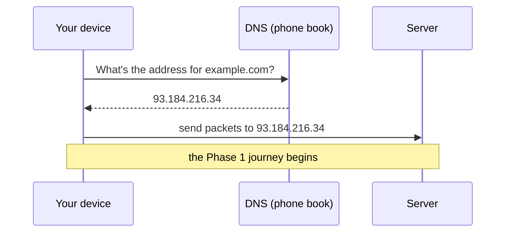

# Addresses & Names

In the last phase we followed a request across the internet to a server. But we skipped over something: when you typed `example.com`, how did your device know which of the millions of computers on Earth to actually send your packets to? That's the question this phase answers. It comes down to two ideas working together — **addresses** and **names**.

## Every machine has an address

**What it actually is.** Every device that talks on the internet has an **IP address** — a number that uniquely identifies it on the network, the way a street address uniquely identifies a building. When a packet needs to get somewhere, its label carries the IP address of the destination, and the routers along the way use that number to pass it in the right direction.

📝 **Terminology.** *IP address* = the numeric address of a machine on a network. *IP* stands for *Internet Protocol* — the agreement that defines how these addresses work and how packets are routed using them.

You've almost certainly seen one. It looks like this:

```text
   93 . 184 . 216 . 34      ← four numbers, separated by dots
```

That dotted-number form is the most common style of IP address. (There's a newer, longer style with letters and colons too, built because the world started running out of the short ones — but the *idea* is identical: a number that names a machine. The detail of both styles lives in [IP, DNS & Ports](/guides/ip-dns-and-ports).)

**Why people get this wrong.** A common assumption is that a website "is" a name like `example.com`, and the number is some technical alias. It's actually the other way around at the routing level: the network only ever moves packets using **numbers**. The name is the human convenience layered on top. Routers don't know or care about `example.com`; they know `93.184.216.34`.

## Names exist because numbers are awful to remember

So if the network runs on numbers, why do we type names at all? Because humans are terrible at numbers and great at words.

Imagine if visiting a website meant remembering `93.184.216.34` instead of `example.com` — and a different long number for every site you use. You'd need a notebook. And it would get worse: when a company moves its site to a new machine with a new number, every one of those memorized numbers would suddenly be wrong.

So the internet keeps **two** layers on purpose:

```text
   what humans use            what the network routes by
   ┌──────────────┐           ┌────────────────┐
   │ example.com  │  ──────▶   │ 93.184.216.34  │
   │ (a name you  │ translated │ (the address   │
   │  can recall) │   into     │  packets need) │
   └──────────────┘           └────────────────┘
```

📝 **Terminology.** *Domain name* = the human-friendly name of a site, like `example.com` or `wikipedia.org`. It's a label that *points to* an IP address, not the address itself.

The benefit of separating them is real: the name can stay the same forever even when the underlying machine — and its number — changes. You keep typing `example.com`; behind the scenes the company can swap servers, and the name gets pointed at the new number. Names are stable; numbers can move.

## DNS: the internet's phone book

So something has to translate names into numbers. That something is **DNS**.

**What it actually is.** DNS — the *Domain Name System* — is the internet's phone book. You give it a name; it gives you back the number. Just like looking up a person's name in a phone book to get their phone number, your device looks up `example.com` in DNS to get its IP address — *before* it can send any packets.

**What it does in real life.** This lookup happens automatically, in the blink before a page loads, every single time you visit a site by name. You never see it, but it's the very first step of the journey from Phase 1. The order is:



**A real example.** You can do the lookup by hand. The `nslookup` command asks DNS the same question your browser asks:

```console
C:\> nslookup example.com

Server:   dns.google
Address:  8.8.8.8

Non-authoritative answer:
Name:     example.com
Address:  93.184.216.34
```

*What just happened:* You handed DNS the name `example.com` and it handed back the address `93.184.216.34`. The "Server" line at the top is *which* phone book you asked (here, a public DNS service at `8.8.8.8`). The "Address" at the bottom is the answer — the number your packets will actually be sent to. This is exactly the translation step that happens silently before every page load.

**The gotcha.** Because the name and the number are separate, two things can break independently — and knowing which one helps you a lot. If DNS can't answer (the lookup fails), you'll often see an error like "server not found" or "this site can't be reached" — your device never even got an address to send to. That's different from getting an address fine but the server itself being down. Same blank page, two completely different causes. When a site won't load, "is it a name problem or a machine problem?" is the first useful question, and a quick `nslookup` answers it.

**Why this saves you later.** Half of "the internet is down" moments are actually DNS moments. A site that loads by its raw IP but not by its name; a new domain that "isn't working yet" because the phone book hasn't caught up; a company-wide outage that turns out to be a DNS misconfiguration — these all make immediate sense once you hold the two layers apart in your head. Names are looked up; numbers are routed to.

## Recap

1. Every machine on the internet has an **IP address** — a number that identifies it, the way a street address identifies a building. The network routes packets using these **numbers**.
2. We use **domain names** like `example.com` because humans remember words, not numbers — and because a name can stay stable even when the machine behind it changes.
3. **DNS** is the internet's phone book: it **translates names into numbers**, automatically, right before a page loads.
4. Names and numbers can fail independently — so "is it a name problem (DNS) or a machine problem (the server)?" is a powerful first question when something won't load.

We now have a request that travels (Phase 1) and a way to find the right machine to send it to (Phase 2). One question remains: once the request *arrives*, how do the two machines actually understand each other? They have to speak the same language.

---

[← Guide overview](_guide.md) · [Phase 3: Client, Server & Talking the Same Language →](03-client-server-and-protocols.md)
