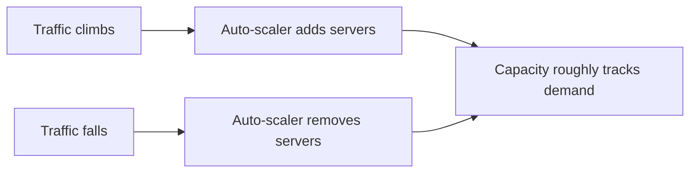

# Why You'd Want This at All

Picture your traffic over a single day, graphed out. It's not a flat line. There's a quiet stretch overnight, a climb through the morning, a lunch spike, an evening peak, maybe a second spike if you're a food delivery app or a news site during breaking news. Now picture the same shape stretched over a year, with a Black Friday or a product-launch day towering over every other point on the graph. Whatever you build, real traffic looks like a mountain range, not a straight line - and that shape is the entire reason auto-scaling exists.

## The old way: pick a number and buy it

Before elastic cloud infrastructure, capacity planning meant buying physical servers, and buying servers is slow - ordering, shipping, racking, configuring, none of it happens in minutes. So teams had to guess a number months in advance and live with that guess. There were only two ways to guess, and both cost you.

**Provision for the peak, and pay for it every hour you're not at the peak.** If your busiest moment needs 20 servers, you buy 20 servers, and they sit there running (and costing money) through the quiet overnight hours when 3 would comfortably handle the load. You're paying full price for capacity you use for maybe two hours a day.

**Provision for the average, and fall over at the peak.** If your typical load needs 5 servers, you buy 5, and the day the mountain range hits its tallest peak, those 5 servers get slammed with traffic they were never sized for. Pages slow down, requests start timing out, and in the worst case the whole thing goes down - often at the exact moment (a launch, a sale, a viral spike) when being up mattered the most.

```text
Provision for peak    -> reliable, but expensive: idle capacity most of the day
Provision for average -> cheap, but fragile: falls over exactly when it matters most
```

*What this means:* both options are bad tradeoffs - one wastes money continuously, the other risks an outage at the worst possible time. You're forced to pick your poison, because the server count is fixed the moment you buy it.

## What changed: capacity you can rent by the minute

Cloud infrastructure broke that constraint. Instead of buying physical machines, you rent virtual ones, and a new virtual machine can be up and running in minutes instead of weeks. That single change - capacity becoming rentable and fast to provision - is what makes a third option possible for the first time: **don't pick one number. Let the number follow the traffic.**

This is what **auto-scaling** does: it watches how much load your application is actually under, right now, and automatically adds servers when load climbs and removes them when load falls back down. You stop guessing a fixed number months ahead. Instead, you describe *rules* - "if things get busy, add capacity; if things get quiet, remove it" - and the infrastructure enforces those rules continuously, without a human deciding in the moment.



*What this diagram means:* capacity is no longer a single number chosen in advance - it's a moving quantity that follows the shape of the traffic mountain range, climbing and shrinking with it instead of sitting fixed at one height all day.

## What this actually buys you

The value is genuinely both sides of the old tradeoff at once, not a compromise between them. During the quiet overnight hours, you're running only what you need, so you're not paying for 20 idle servers to cover a peak that isn't happening right now. During the launch-day spike, more capacity comes online to absorb it, so you're not stuck with the 5 servers sized for an average Tuesday.

> Auto-scaling doesn't eliminate the mountain range in your traffic - it makes your capacity follow the shape of the mountain instead of standing at one fixed height and hoping.

But "capacity follows demand" raises an obvious question: follows *how*? What number is it watching, how fast does it react, and what stops it from overreacting to every blip? That's the mechanism - the whole subject of Phase 2.

[← Overview](_guide.md) | [Phase 2: How it actually decides to scale →](02-how-it-decides.md)
