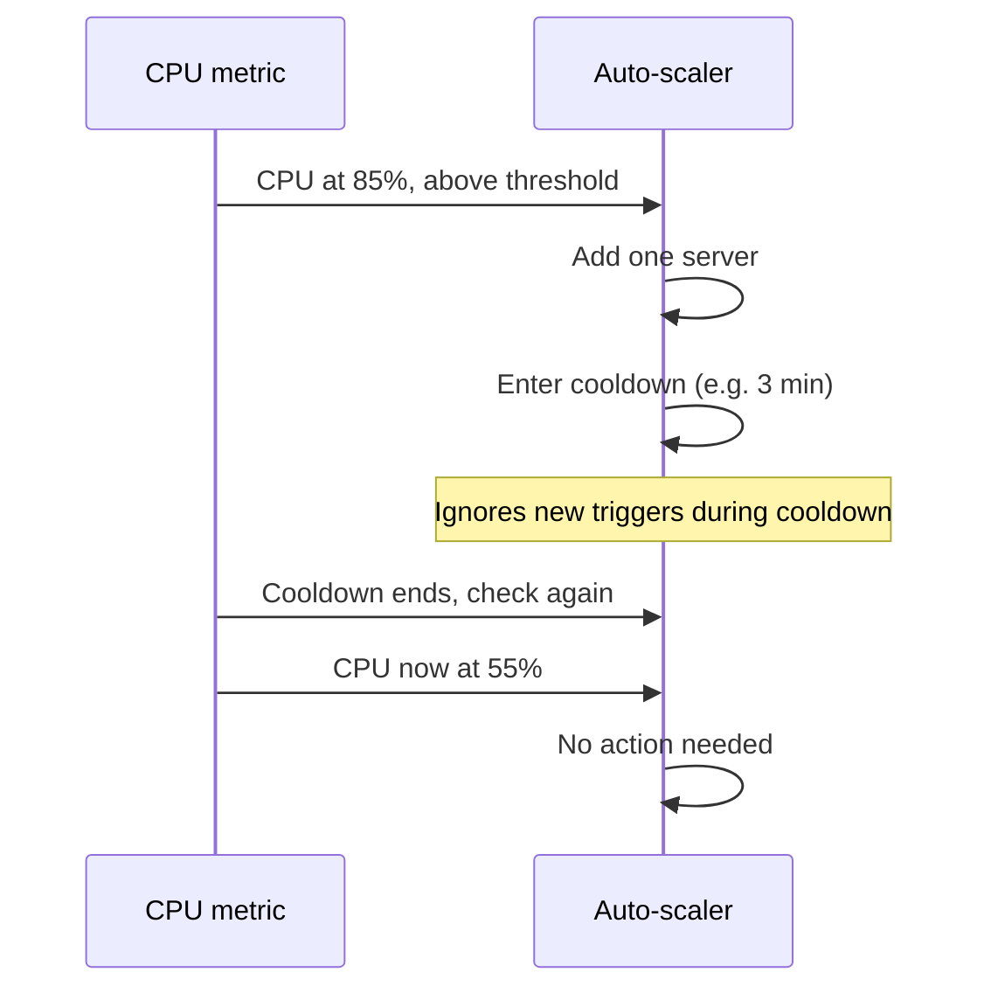

# How It Actually Decides to Scale

"Add capacity when things get busy" sounds simple until you have to define "busy" precisely enough for software to act on it without a human in the loop. Too sensitive, and you're adding and removing servers every time traffic twitches. Too sluggish, and by the time it reacts, the spike already happened. This phase is that mechanism, piece by piece.

## Step one: pick a metric worth watching

Auto-scaling needs a number to watch, and the number has to actually reflect strain on your system. The usual candidates:

- **CPU utilization** — the most common default. If your servers are doing computation-heavy work, CPU climbing toward 100% is a direct sign they're struggling to keep up.
- **Memory usage** — matters more for workloads that hold a lot of data in memory (caches, in-memory processing) where CPU might look fine while memory is the real bottleneck.
- **Request count** — how many requests per second are hitting your servers. A more direct measure of "how busy are we" than CPU, since a request-heavy but computationally light workload might never spike CPU at all.
- **Queue depth** — for background job systems, this is often the best signal of all: it's not "how hard is the CPU working," it's literally "how much unstarted work is piling up right now."

📝 **Terminology:** none of these is universally "correct" — the right metric is whichever one actually goes up when your system is genuinely struggling to keep up with demand. A CPU-bound image-processing service should probably watch CPU. A job queue that emails receipts should watch queue depth, because that number rising directly means "customers are waiting longer than they should."

## Step two: set a threshold, and add a cooldown so it doesn't overreact

A metric alone isn't a decision — you need a line that, when crossed, actually triggers a change. This is the **threshold**: "if CPU utilization stays above 70% for a few minutes, add another server." The "stays above" part matters as much as the number itself. A single one-second CPU spike from a background task shouldn't trigger anything; sustained strain over a real window of time should.

Even with a sensible threshold, there's a second problem: right after scaling up, the metric doesn't calm down instantly, because new servers take a moment to start absorbing traffic (more on this in Phase 3). If the auto-scaler checks again 30 seconds later and CPU still looks high, it might add *another* server on top of the one still spinning up — and then another, overshooting what was actually needed. The fix is a **cooldown period**: a deliberate pause after a scaling action that gives the last change time to take effect before judging whether more is needed.



*What this diagram means:* the cooldown is what stops one busy moment from triggering a runaway chain of additions — it forces the system to wait, breathe, and re-measure before deciding whether the first response was even enough.

## Step three: pick a scaling policy

Once you know *when* to act, you still need to decide *how much* to add or remove each time. This is the **scaling policy**, and the two common shapes are:

**Step scaling** reacts in fixed increments based on how far past the threshold you are. "If CPU is 70-80%, add 1 server. If it's 80-90%, add 2. Above 90%, add 4." It's predictable and straightforward to reason about, but it requires you to have pre-guessed the right step sizes for your workload.

**Target-tracking scaling** works backward from a goal instead: "keep average CPU utilization at 60% across all servers, whatever it takes." You don't specify step sizes at all — the system continuously adds or removes servers to hold that target, the same way a thermostat doesn't ask "how much colder should the room be," it keeps adjusting toward the set temperature instead. This is the more common default in modern cloud platforms precisely because it needs less manual tuning.

```text
Step scaling       -> you define the increments per threshold band, more manual, very predictable
Target tracking     -> you define one goal number, the system figures out the increments, less tuning
```

## Horizontal vs. vertical: two different ways to add capacity

There's one more axis, and it's a different question entirely: when you add capacity, do you add *more machines*, or make the *existing machines bigger*?

**Vertical scaling** means upgrading a server's own resources — more CPU cores, more RAM, on the same machine. It's simple in concept, but it has a hard ceiling (there's a biggest instance size the cloud provider offers), and most importantly, it almost always requires downtime — you can't add a CPU while a server is running as if it never happened, so applying a vertical resize typically means restarting the instance.

**Horizontal scaling** means adding more machines running the same application side by side, and it's what "auto-scaling" almost always refers to in practice. New servers can join a running fleet without touching the servers already serving traffic, which is exactly why it's the shape that pairs with automation — nothing already running has to stop.

```text
Vertical scaling   -> bigger machine, hits a ceiling, usually needs a restart
Horizontal scaling -> more machines, scales further, new ones join without disrupting old ones
```

This is why virtually every auto-scaling system you'll encounter — the kind with metrics, thresholds, and policies described above — is scaling horizontally. The mechanism depends on being able to add a new, independent unit of capacity without interrupting anything already in flight, and that's a property only horizontal scaling has.

[← Phase 1: Why you'd want this at all](01-why-you-need-this.md) | [Overview](_guide.md) | [Phase 3: The gotchas →](03-the-gotchas.md)
