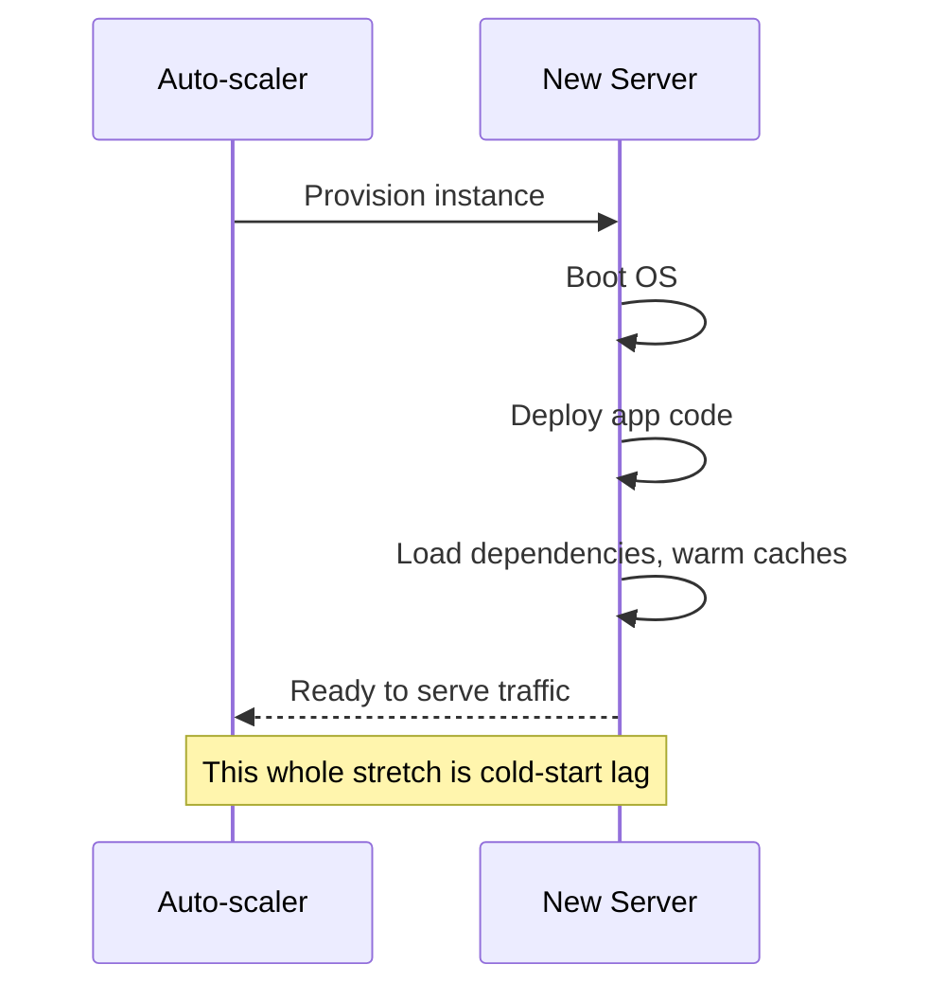

# The Gotchas

Everything in Phase 2 makes auto-scaling sound like a clean, automatic fix — watch a metric, cross a threshold, add a server, done. In practice, the moment between "decide to add a server" and "that server is actually helping" is where most of the real-world pain lives. This phase is about that gap, and about the one piece of infrastructure that has to be sitting next to your auto-scaler or none of it does any good.

## Cold-start lag: a new server isn't instantly useful

When the auto-scaler decides to add capacity, a brand-new server doesn't appear ready to serve traffic the instant it's requested. It has to actually boot: the operating system starts, your application code gets deployed onto it, dependencies load, database connections get established, and — for a lot of modern stacks — a warm-up period passes before caches are populated and just-in-time compilers have optimized the hot paths. This whole stretch is called **cold-start lag**, and depending on your stack it can run anywhere from a few seconds to a couple of minutes.



*What this diagram means:* the decision to scale and the moment extra capacity actually helps are two different points in time, separated by real, sometimes significant, delay. Auto-scaling reacts as fast as its metrics allow, but the new server is on its own clock after that.

The practical consequence: if your traffic spike is short and sharp — a flash sale that lasts five minutes — cold-start lag can eat most or all of that window. The new server might finish booting right around the time the spike is already over, having done nothing to help the moment it was meant for.

## The thundering herd: needing capacity exactly while it's still arriving

Cold-start lag gets worse when combined with a sudden, large spike, because of a timing trap sometimes called the **thundering herd** problem. Picture this sequence: traffic surges hard and fast, your existing servers immediately get overwhelmed, the auto-scaler correctly detects this and starts spinning up new capacity — and then, for the next 30-90 seconds of cold-start lag, your *existing overwhelmed servers* are the only thing standing between your users and a wall of failed requests. The exact moment you most need the new capacity is the moment it's guaranteed not to be ready yet.

This is why relying on auto-scaling alone as your entire defense against a launch-day spike is risky. Auto-scaling is a real mitigation, but it isn't instantaneous, and a sharp enough spike will always outrun it by at least one cold-start cycle. Real systems combine it with things like pre-scaling ahead of a known event (a scheduled sale, a marketing push) and rate limiting or graceful degradation so overwhelmed servers fail politely — returning a "please retry" instead of falling over completely — rather than leaning on auto-scaling as the only line of defense.

> Auto-scaling reacts to demand it's already seeing. It cannot react to demand that hasn't happened yet — which means the fastest-arriving spikes will always outrun it by roughly one cold-start cycle.

## The piece that makes all of this actually work: a load balancer

This part gets overlooked because it's a separate piece of infrastructure, not something the auto-scaler itself does. Auto-scaling can perfectly detect a spike, decide to add three new servers, and boot them — and none of that matters to a single user unless something is also responsible for sending traffic *to* those new servers instead of continuing to hammer the old ones.

That's the job of a **load balancer**: it sits in front of your fleet of servers and distributes incoming requests across whichever servers are currently registered and healthy. When auto-scaling adds a server, it isn't useful because it exists — it's useful because the load balancer notices it, confirms it's healthy, and starts routing a share of traffic to it. When auto-scaling removes a server, the load balancer has to stop sending it traffic *before* it's shut down, or requests get dropped mid-flight.

```text
Auto-scaler  -> decides how many servers should exist right now
Load balancer -> decides which server each individual request actually goes to
```

Without a load balancer doing that second job, adding servers is like hiring more cashiers and never telling customers which line to join — the new capacity exists, technically, but the crowd keeps piling onto the same overwhelmed checkout it already knew about. Auto-scaling and load balancing are two distinct pieces of infrastructure solving two distinct problems, and neither one is a complete answer to "handle variable traffic" without the other sitting right beside it.

```quiz
[
  {
    "q": "What is cold-start lag?",
    "choices": [
      "The time it takes a load balancer to detect a server has failed",
      "The delay between a new server being provisioned and it actually being ready to serve traffic",
      "A deliberate delay added to prevent scaling too often",
      "The time it takes a metric to cross its threshold"
    ],
    "answer": 1,
    "explain": "A newly added server has to boot, deploy code, load dependencies, and often warm up caches before it can actually help — that whole stretch is cold-start lag."
  },
  {
    "q": "Why can a sharp, sudden traffic spike still overwhelm a system that has auto-scaling configured correctly?",
    "choices": [
      "Auto-scaling only works during business hours",
      "The new capacity takes time to become ready, so it can't help during the exact window the spike is happening",
      "Auto-scaling requires manual approval for every scale-up",
      "Sudden spikes always exceed the maximum number of servers allowed"
    ],
    "answer": 1,
    "explain": "This is the thundering herd problem: the spike arrives faster than cold-start lag allows new servers to become ready, so existing servers absorb the worst of it regardless."
  },
  {
    "q": "Why does auto-scaling need a load balancer to actually be useful?",
    "choices": [
      "The load balancer is what decides when to scale, not the auto-scaler",
      "Without it, new servers exist but nothing routes traffic to them instead of the already-overwhelmed old ones",
      "Load balancers are required by law for any auto-scaled system",
      "A load balancer prevents cold-start lag entirely"
    ],
    "answer": 1,
    "explain": "Auto-scaling decides how many servers should exist; the load balancer decides which server each request actually goes to. A new server only helps once the load balancer is routing traffic to it."
  }
]
```

Watch it animated: [auto-scaling](/explainers/AutoScaling.dc.html)

[← Phase 2: How it actually decides to scale](02-how-it-decides.md) | [Overview](_guide.md)
