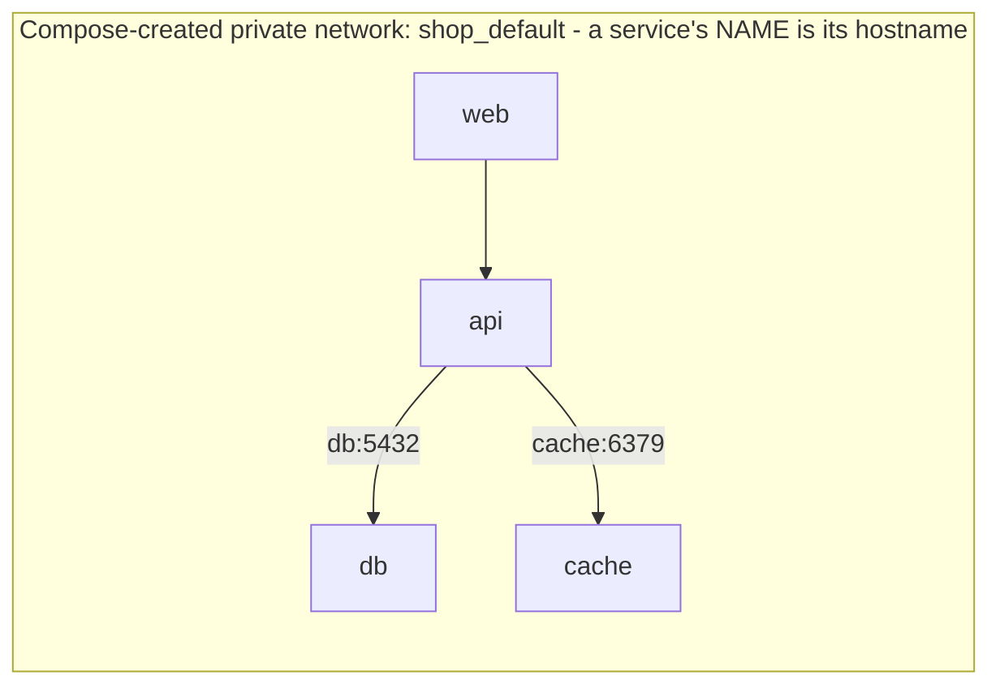

# Networking, Volumes & Dev Workflow

Your stack comes up. So why does the API sometimes crash on startup, where exactly does your database's
data live, and how do you get code changes to show up without rebuilding the image every time? These
three questions - networking, persistence, and the dev loop - are what separate "I got the example
running" from "I run my projects on this." This phase answers all three, then names the two traps that
bite people once they're comfortable: `depends_on` not meaning what you think, and the temptation to ship
your dev compose file straight to production.

## How services find each other: the Compose network

When Compose brings up a stack, it creates a private network and puts every service on it. On that
network, **each service is reachable by its service name as a hostname.** The service called `db` in
your file is literally reachable at the address `db` from any other service in the stack. Coming from
running containers by hand, people expect to wire up IP addresses, `--link` flags, or hand-managed
networks - none of that. The service name *is* the address. That's the whole mechanism.



Look back at the API's config from Phase 2:

```yaml
  api:
    environment:
      DATABASE_URL: postgres://app:secret@db:5432/shop
      REDIS_URL: redis://cache:6379
```

The host in `DATABASE_URL` is `db`; the host in `REDIS_URL` is `cache`. Those are the service names. When the API opens a connection to `db:5432`, the Compose network resolves `db` to the database container and the connection lands. You can watch it from inside the API container:

```console
$ docker compose exec api ping -c 1 db
PING db (172.18.0.2): 56 data bytes
64 bytes from 172.18.0.2: icmp_seq=0 ttl=64 time=0.089 ms
```

*What just happened:* `docker compose exec api ...` ran a command *inside* the running `api` container. From there, `db` resolved to the database container's address on the private network - no IP addresses written anywhere, no extra configuration. That name-based resolution is what makes the connection strings in your file work.

💡 **Key point.** This is why the service names you pick in Phase 2 matter: they're the addresses your code uses. Rename `db` to `database` in the file and you must change `db:5432` to `database:5432` in `DATABASE_URL` too, or the API can't find it.

⚠️ **Gotcha - `localhost` inside a container is the container itself.** A reflex from non-Docker life is to point the API at `localhost:5432` for the database. Inside a container, `localhost` means *that same container*, not your machine and not the database. The API would be looking for Postgres inside itself, find nothing, and fail to connect. Across the stack, you always use *service names*, never `localhost`.

## Keeping your data: named volumes in practice

You met named volumes in Phase 2. Here's why they matter, made concrete. A container's own filesystem
dies with the container. The named volume `db_data` lives outside the container, so when you recreate the
database container, the data is still there. Add some data, recreate the container, and confirm it
survived:

```console
$ docker compose down
[+] Running 5/5
 ✔ Container shop-db-1   Removed
 ...
$ docker compose up -d
[+] Running 5/5
 ✔ Container shop-db-1   Started
 ...
$ docker compose exec db psql -U app -d shop -c "SELECT count(*) FROM products;"
 count
-------
    42
(1 row)
```

*What just happened:* You tore the whole stack down - destroying the database *container* - then brought it back up, creating a brand-new `db` container. The 42 rows are still there because the data never lived in the container; it lived in the `db_data` volume, which `down` left untouched. The new container mounted the same volume and found the data waiting.

You can see the volume Docker is keeping for you:

```console
$ docker volume ls
DRIVER    VOLUME NAME
local     shop_db_data
```

*What just happened:* Compose named the volume by combining the project name (`shop`) with the volume name from your file (`db_data`). That's the storage that outlives your containers.

⚠️ **Gotcha - `down -v` deletes it.** As flagged in Phase 2: `docker compose down` keeps volumes, but `docker compose down -v` destroys them. That `-v` is how the 42 rows above would vanish for good. Use it when you *want* a clean slate; never use it when you don't.

## The dev loop: bind-mounts for live-reload

A named volume is storage Docker manages. A **bind-mount** is different: it maps a folder *on your
machine* directly into the container, so the container sees your real, live source files. Edit a file in
your editor and the container sees the change instantly - no image rebuild.

📝 **Bind-mount.** A mapping from a path on your host into a path in the container. Unlike a named volume (managed by Docker, for persistence), a bind-mount points at a *specific folder you control*, used mostly to share your source code into a container during development.

Without it, your workflow during development is brutal: change one line, rebuild the image, recreate the
container, see the change. With a bind-mount plus a dev server that watches for file changes, you change
a line and it's live in the container immediately. You add a bind-mount to the service running your code:

```yaml
  api:
    build: ./api
    volumes:
      - ./api:/app          # bind-mount: your ./api folder → /app in the container
    environment:
      DATABASE_URL: postgres://app:secret@db:5432/shop
      REDIS_URL: redis://cache:6379
```

*What just happened:* `./api:/app` maps your local `./api` directory onto `/app` inside the container. Now the code running in the container *is* the code in your editor. Pair that with a watch-and-reload dev server inside the container and saving a file reloads the app - the fast inner loop you actually want when building.

💡 **Telling the two apart.** A volume entry with a *path* on the left (`./api:/app`) is a bind-mount - it points at a folder you can see. A volume entry with a *name* on the left (`db_data:/var/lib/postgresql/data`) is a named volume - Docker manages it and you declare it in the top-level `volumes:` block. Same `volumes:` key in the service, two different tools.

## Trap #1: `depends_on` waits for start, not readiness

We flagged this in Phase 2; here's the real fix. `depends_on` guarantees the database *container* starts before the API container. It does **not** guarantee Postgres inside that container has finished initializing and is accepting connections. So this can happen:

```console
$ docker compose up
db-1   | database system is starting up
api-1  | Error: connect ECONNREFUSED db:5432
api-1  | exited with code 1
db-1   | database system is ready to accept connections
```

*What just happened:* Compose did its job - it started `db` before `api`. But the API came up a fraction of a second faster than Postgres finished initializing, tried to connect to a database that wasn't listening yet, and crashed. `depends_on` was satisfied; the database just wasn't *ready*.

**The real fix: a healthcheck plus a condition.** Teach Compose how to know the database is genuinely ready, then make the API wait for *that*:

```yaml
  db:
    image: postgres:16
    environment:
      POSTGRES_USER: app
      POSTGRES_PASSWORD: secret
      POSTGRES_DB: shop
    volumes:
      - db_data:/var/lib/postgresql/data
    healthcheck:
      test: ["CMD-SHELL", "pg_isready -U app -d shop"]
      interval: 5s
      timeout: 3s
      retries: 5

  api:
    build: ./api
    depends_on:
      db:
        condition: service_healthy
```

*What just happened:* The `healthcheck` runs `pg_isready` - Postgres's own "are you ready for connections?" probe - every 5 seconds until it succeeds, marking `db` *healthy*. The longer `depends_on` form, `condition: service_healthy`, tells Compose to hold the API back until `db` reports healthy, not just started - so the API only launches once the database can actually answer it.

💡 **Key point.** "It starts before it" and "it's ready before it" are different promises. `depends_on` alone makes the first; a healthcheck with `condition: service_healthy` makes the second. For anything the next service immediately connects to - a database especially - you want the second.

## Trap #2: your dev compose is not your prod compose

The file we've built is excellent for development and *wrong* for production, on purpose. The very things that make local dev pleasant are the things you must not ship.

Run your eye down what's dev-only in this file:

```text
   DEV (great locally)              PROD (must change)
   ───────────────────             ───────────────────
   passwords in plain text   ──►   secrets from a vault / env, not in Git
   bind-mount ./api:/app     ──►   no bind-mount - run the built image
   no resource limits        ──►   memory/CPU limits set
   "build: ./api" locally    ──►   a versioned, pre-built, pushed image
   ports exposed freely      ──►   only what must be public is public
```

⚠️ **Gotcha - don't ship the dev file unchanged.** The bind-mount `./api:/app` means "run whatever code is in this folder" - in production there *is* no such folder, and even if there were, you want to run the exact, tested, built image, not live-edited files. The plaintext password is a development convenience and a production liability. Copying your dev `docker-compose.yml` to a server and running it is one of the most common ways people get burned.

**The calm way to handle it.** Keep the shared, true-everywhere parts in `docker-compose.yml`, and put the dev-only conveniences (bind-mounts, exposed debug ports, the throwaway password) in a separate `docker-compose.override.yml` that Compose merges in automatically *only* during local development. Production runs the base file with its own settings layered on instead. The mental model that matters: **one file is not meant to serve both worlds** - keep the differences explicit. (Full override mechanics and a production-grade setup are deeper material for a follow-up guide; for now, just don't deploy the dev file as-is.)

📝 **A note on the word "production."** Production means the real environment serving real users - where a leaked password or live-edited code isn't a learning moment, it's an incident. The bar there is genuinely different from your laptop, and pretending otherwise is how good developers have bad days.

## Recap

1. **Services reach each other by service name** on the private network Compose creates - never by IP, never by `localhost`.
2. **Named volumes keep your data** alive across container recreation; `down` keeps them, `down -v` destroys them.
3. **Bind-mounts (`./folder:/path`) share your live source into the container** for fast edit-and-reload development - distinct from named volumes.
4. **`depends_on` means *started*, not *ready*** - for a database the next service connects to, add a `healthcheck` and `condition: service_healthy`.
5. **Dev compose ≠ prod compose** - bind-mounts, plaintext secrets, and `build:` are dev conveniences; never deploy the dev file unchanged.

You can now run a real multi-service stack, understand how it talks to itself, keep its data safe, develop against it quickly, and avoid the two traps that catch people once they're comfortable. That's the whole everyday skill - go run something real on it.

---

[← Phase 2: The compose file](02-the-compose-file.md) · [Guide overview](_guide.md)

**Related:** [Docker Without the Magic](/guides/docker-without-the-magic) · [Environment Variables & Config](/guides/env-vars-and-config)
