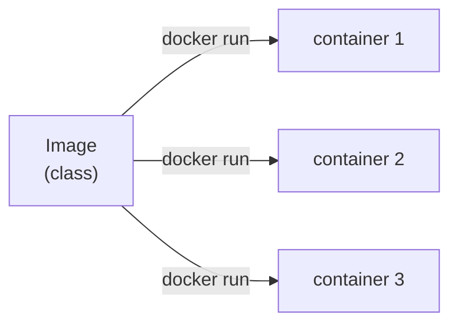

# Image vs Container (and Why Not a VM)

Before any commands, let's install the idea the entire tool stands on. Almost every Docker confusion -
"why didn't my change show up?", "where did the container go?", "is this a tiny computer?" - comes from
blurring two words that mean genuinely different things: **image** and **container**. Get the difference
clear and most of Docker stops being mysterious.

## The one analogy: a class and an object

If you've written any code, you already know this shape:

*One image → many containers: run it five times, you get five independent containers.*

An **image** is a **read-only, packaged snapshot of a filesystem, plus the metadata for how to run it** -
which command to start, which port the program listens on, what environment it expects. It's a frozen
template. It doesn't *do* anything on its own, the same way a class definition doesn't run until you
instantiate it. It sits on disk, and you can copy it, share it, and start it as many times as you like.

A **container** is a **running instance of an image** - the image brought to life as a live process, with
its own slice of memory, its own writable scratch space on top of the image's frozen files, and its own
lifecycle (it starts, runs, and stops). One image, many containers: start the same image three times and
you have three independent containers that can't see each other's running state, exactly like three
objects built from one class.

📝 **Terminology.** *Image* = the frozen template on disk. *Container* = a live process running from that
template. You **build** images and you **run** containers. People say "Docker image" and "Docker
container" interchangeably in casual speech, but the moment something breaks, the distinction is the first
thing to get straight.

## Why people get this wrong

The common wrong picture is "a container is a little computer." It feels like one - its own filesystem,
processes, network address - so calling it a tiny machine seems fair. But that picture leads you astray
fast:

- It makes you expect the container to *remember* things, like a computer does. It doesn't, by default -
  when a container stops, the writable scratch layer it was using is thrown away. (That's Phase 3's whole
  topic.)
- It makes you think editing a file on your laptop should change what's inside a running container. It
  won't - the container is running from the frozen image, not from your project folder. You have to
  **rebuild** the image or mount your folder in deliberately.

The accurate picture is smaller and more useful: a container is **one (or a few) isolated processes,
wrapped so they think they have the machine to themselves.** That's it. The isolation is a costume, not a
second computer.

## Containers vs virtual machines: where the weight goes

The question everyone asks next: isn't this just a virtual machine? It is not, and the difference is the
reason Docker took over. It comes down to one thing - **the kernel**.

> 📝 **Terminology.** The *kernel* is the core of an operating system: the part that actually talks to the
> hardware and shares it among programs. If that's fuzzy, the
> [What an Operating System Is](/guides/what-an-operating-system-is) guide explains it from scratch.

*Virtual machines - each carries a full guest OS (heavy):*

*Containers - share the host's one kernel (light):*

**The VM way.** A virtual machine emulates a whole computer. On top of your real OS sits a *hypervisor*,
and on top of that, each VM runs its **own complete guest operating system** - its own kernel, its own
boot process - before your app even starts. Powerful (you can run Windows on Linux) but heavy: each VM
carries gigabytes of OS and takes the better part of a minute to boot, because it really is booting one.

**The container way.** Containers don't bring their own OS kernel. They **share the host's kernel** and
ask it - through the same system calls every normal program uses - for their own isolated view of the
filesystem, processes, and network. The container holds your app and its libraries, nothing more. No
guest OS to boot, so a container starts in a fraction of a second and weighs megabytes, not gigabytes.

💡 **Key point.** A VM virtualizes the *hardware* and runs a full OS on top. A container virtualizes the
*operating system* - an isolated process group sharing the one kernel that's already running. That single
design choice is why containers are small and fast, and it's the trade-off too: because they share the
host kernel, Linux containers need a Linux kernel. (On macOS and Windows, Docker quietly runs a small
Linux VM in the background to provide one - why "it's not a VM" has a footnote on those machines.)

**The gotcha this dissolves.** People expect a container to be a *security* boundary as strong as a VM.
It's strong, but not the same: a container shares the host kernel, so a kernel-level exploit isn't walled
off the way it is between VMs. Fine for most work; for running fully untrusted code, it's a real
distinction. Knowing *where* the isolation comes from tells you exactly how far to trust it.

## Why this saves you later

Holding "image = frozen template, container = running instance, both share the host kernel" in your head
defuses a whole row of future headaches:

- **"My code change didn't take effect."** Of course - the container is running the *old image*. You
  rebuild the image (Phase 2) or mount your source in (Phase 3).
- **"The container disappeared / my data is gone."** Containers are instances; stopping one discards its
  scratch layer. Persistence is a thing you add on purpose (Phase 3).
- **"Why is this so much faster than the VM we used to use?"** No guest OS to boot. Now you know exactly
  what you're *not* paying for.

## Recap

1. An **image** is a read-only, layered snapshot of a filesystem plus how to run it - a frozen template,
   like a class.
2. A **container** is a running instance of an image - a live process with its own scratch space, like an
   object. One image can spawn many containers.
3. You **build** images; you **run** containers.
4. Containers are not little computers and not VMs: they're **isolated processes sharing the host's
   kernel**, which is why they're small and start in moments.
5. A **VM** carries its own full OS and kernel (heavy, strong isolation); a **container** shares the
   host's kernel (light, fast, isolation with a kernel-shaped footnote).

Next, we'll build an image ourselves and watch it come together one cached layer at a time.

Watch it animated: [containers vs. VMs](/explainers/ContainersVMs.dc.html)

---

[← Guide overview](_guide.md) · [Phase 2: Building an Image - the Dockerfile & Layers →](02-the-dockerfile-and-layers.md)
