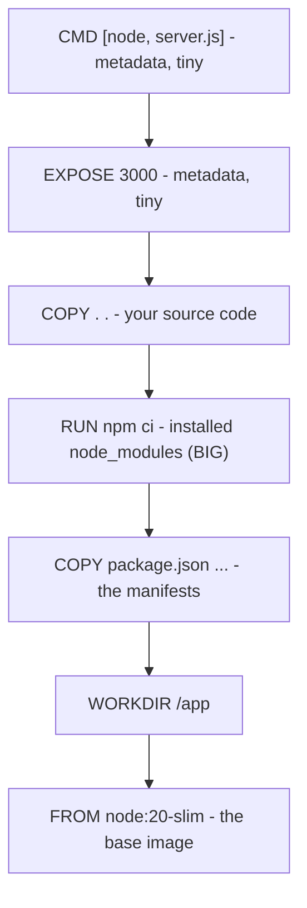

# Building an Image: the Dockerfile & Layers

Now you'll make an image of your own. The thing that turns a frozen template from Phase 1 into something
you can actually build is a file called a **Dockerfile** - a plain-text recipe Docker reads top to bottom.
The single most useful thing to understand here isn't any one command; it's **layers**, because layers
explain why two Dockerfiles that produce the identical image can rebuild in 2 seconds or 2 minutes.

## The Dockerfile: a recipe Docker reads top to bottom

A Dockerfile is an ordered list of instructions that describe how to assemble an image: start from some
base, copy your files in, install dependencies, and declare how to run the program. Each line is an
instruction in `CAPITALS` followed by its arguments.

Here's a realistic one for a small Node.js app, annotated:

```dockerfile
# Start from an official image that already has Node installed.
# This becomes our base layer - we build on top of it.
FROM node:20-slim

# Set the working directory inside the image. Commands below run here,
# and it's created if it doesn't exist.
WORKDIR /app

# Copy ONLY the dependency manifests first (see "why order matters" below).
COPY package.json package-lock.json ./

# Install dependencies. This is the slow step we want to cache.
RUN npm ci

# Now copy the rest of the source code.
COPY . .

# Document the port the app listens on (this is metadata, not a published port).
EXPOSE 3000

# The default command to run when a container starts from this image.
CMD ["node", "server.js"]
```

📝 **Terminology.** *Base image* - the image named in `FROM` that you build on top of. You almost never
start from nothing; you start from an official image (like `node`, `python`, `nginx`) that someone else
already assembled. *`RUN`* executes a command *while building the image*. *`CMD`* is the command that runs
*when a container starts*. Confusing those two is one of the most common Dockerfile mistakes - `RUN`
happens at build time, `CMD` at run time.

## Layers: every instruction is a cached step

Each instruction in the Dockerfile produces a **layer** - a saved diff of what changed in the filesystem
at that step. The final image is those layers stacked, read-only, one on top of the next:



*Each instruction is one read-only layer; the final image is them stacked.*

When you rebuild, Docker walks the instructions in order and **reuses the cached layer for any step whose
inputs haven't changed.** The instant it hits a step whose inputs *did* change, that layer and **every
layer after it** are rebuilt from scratch. The cache is a streak that breaks the moment something
upstream changes.

That single rule is why the Dockerfile above copies `package.json` *before* the source code. Your
dependencies change rarely; your source changes constantly. By installing dependencies before copying
source, an ordinary code edit leaves the `npm ci` layer untouched - Docker reuses it from cache, and the
rebuild is fast.

⚠️ **Gotcha.** Flip those two lines - `COPY . .` *before* `RUN npm ci` - and every code change invalidates
the copy layer, which forces `npm ci` to re-run on every single build, reinstalling every dependency. The
image is identical; the build is agonizing. **Order your Dockerfile from least-frequently-changed to
most-frequently-changed.** That's the whole art of a fast Dockerfile.

## `docker build`: turn the recipe into an image

```console
$ docker build -t my-app:1.0 .
[+] Building 18.4s (10/10) FINISHED
 => [internal] load build definition from Dockerfile          0.0s
 => [1/5] FROM docker.io/library/node:20-slim                 2.1s
 => [2/5] WORKDIR /app                                        0.1s
 => [3/5] COPY package.json package-lock.json ./             0.0s
 => [4/5] RUN npm ci                                         14.8s
 => [5/5] COPY . .                                            0.2s
 => exporting to image                                        1.1s
 => => naming to docker.io/library/my-app:1.0
```

*What just happened:* `docker build` read the Dockerfile and built each layer in order. `-t my-app:1.0`
**tags** the result - `my-app` is the name, `1.0` the *tag* (usually a version). The `.` at the end is the
**build context**: the folder Docker hands to the build so `COPY` has something to copy from. Notice
`[4/5] RUN npm ci` took 14.8s - the slow step.

Now change one line of `server.js` and build again:

```console
$ docker build -t my-app:1.1 .
[+] Building 1.6s (10/10) FINISHED
 => [1/5] FROM docker.io/library/node:20-slim                 0.0s
 => CACHED [2/5] WORKDIR /app                                 0.0s
 => CACHED [3/5] COPY package.json package-lock.json ./       0.0s
 => CACHED [4/5] RUN npm ci                                   0.0s
 => [5/5] COPY . .                                            0.2s
 => exporting to image                                        0.4s
```

*What just happened:* this is the payoff for ordering the Dockerfile well. Steps 1–4 say `CACHED` - your
dependencies didn't change, so Docker reused those layers, including the expensive `npm ci`. Only `COPY .
.` re-ran, because only your source changed. The build dropped from ~18s to under 2s. Same image,
fraction of the time.

📝 **Terminology.** A *tag* (`my-app:1.0`) is a human-readable label for an image version. If you leave it
off, Docker assigns `latest` - which is a name, not a promise of newness, and is a common source of "wait,
which version is this?" confusion later.

## `docker run`: bring the image to life

You have an image. Phase 1's lesson: running it creates a container.

```console
$ docker run -d -p 8080:3000 --name web my-app:1.0
3f9a2c1b7e4d8a6f0c2e1d9b4a7c6e5f0a1b2c3d4e5f6a7b8c9d0e1f2a3b4c5d
```

*What just happened:* `docker run` started a container from `my-app:1.0`. The flags carry the meaning:

- `-d` - **detached**: run in the background and hand you back the terminal (it printed the container's
  long ID).
- `-p 8080:3000` - **publish a port**: forward port `8080` on your machine to port `3000` inside the
  container. The format is `HOST:CONTAINER`, and getting it backwards is a classic mistake.
- `--name web` - give the container a friendly name instead of a random one, so you can refer to it later.

⚠️ **Gotcha.** `EXPOSE 3000` in the Dockerfile **does not** open the port to your machine - it's only
documentation of what the app listens on. The port is only reachable from your laptop because of
`-p 8080:3000` on `docker run`. Forgetting `-p` is the single most common "it works in the container but I
can't reach it" mistake - we'll return to it in [Phase 3](03-volumes-and-the-gotchas.md).

Check it's running and reach it:

```console
$ docker ps
CONTAINER ID   IMAGE        COMMAND            STATUS         PORTS                    NAMES
3f9a2c1b7e4d   my-app:1.0   "node server.js"   Up 6 seconds   0.0.0.0:8080->3000/tcp   web

$ curl http://localhost:8080
Hello from inside the container!
```

*What just happened:* `docker ps` lists *running* containers (add `-a` to also see stopped ones). The
`PORTS` column confirms the mapping `0.0.0.0:8080->3000/tcp` - traffic to your port 8080 reaches the app's
port 3000. The `curl` proves it end to end. When you're done, `docker stop web` halts it and `docker rm
web` removes it.

## The registry: where images live so others can pull them

An image on your laptop helps only you. A **registry** is a server that stores images so anyone (or any
deploy server) can download them - Docker Hub is the default public one, companies run private ones.

📝 **Terminology.** *Registry* = the image store. *`pull`* = download an image from it. *`push`* = upload
one to it. This is the actual mechanism behind "works on my machine" finally being true everywhere: you
push the exact image you tested, and the server pulls the exact same bytes.

```console
$ docker pull nginx:latest
latest: Pulling from library/nginx
a2abf6c4d29d: Pull complete
...
Status: Downloaded newer image for nginx:latest

$ docker tag my-app:1.0 yourname/my-app:1.0
$ docker push yourname/my-app:1.0
The push refers to repository [docker.io/yourname/my-app]
5f70bf18a086: Pushed
...
1.0: digest: sha256:9c1e... size: 1986
```

*What just happened:* `pull` downloaded `nginx` layer by layer (notice it pulls *layers* - if you already
have a layer, it's skipped, which is why related images share storage). To `push` your own image you first
`tag` it with your registry username (`yourname/my-app`), then `push` sends up each layer Docker Hub
doesn't already have. The deploy target later runs `docker pull yourname/my-app:1.0` and gets a
byte-for-byte identical environment to the one you built.

## Recap

1. A **Dockerfile** is an ordered recipe; each instruction builds a read-only **layer**.
2. The **build cache** reuses unchanged layers and rebuilds everything from the first changed step
   onward - so order instructions least-changed first (dependencies before source).
3. **`docker build -t name:tag .`** turns the recipe into a tagged image.
4. **`docker run -d -p HOST:CONTAINER --name … image`** starts a container; `-p` is what actually opens a
   port to your machine (`EXPOSE` alone does not).
5. A **registry** stores images: **`pull`** to download, **`push`** to upload - the real machinery that
   makes an environment reproducible everywhere.

Next, the part that surprises everyone: where your data goes when the container stops, and the traps that
catch every newcomer.

---

[← Phase 1: Image vs Container](01-image-vs-container.md) · [Guide overview](_guide.md) · [Phase 3: Volumes & the Gotchas →](03-volumes-and-the-gotchas.md)
