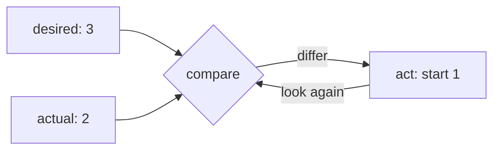

# The Problem K8s Solves

Before any YAML, get the one idea the entire tool is built around - everything else in Kubernetes follows
from it.

You know how to run a container. Now picture doing it *for real*: forty containers across six machines, that
must stay up at 3am, survive a server dying, scale up when traffic spikes, find each other over the network,
and get updated to a new version without taking the site down. Do that by hand and it becomes your life. That
gap - between "I can run a container" and "I can keep a fleet of them healthy across machines forever" - is
exactly what Kubernetes closes.

## Doing it by hand is brutal - and here's why

Every Kubernetes feature is an answer to one of these. Run containers across a few servers with nothing but
Docker and your own willpower, and here's what lands on you:

- **Placement.** A new container needs to run *somewhere*. Which machine has enough free CPU and memory right
  now? You have to look, decide, and remember.
- **Restarts.** A container crashes at 3am. Who notices? Who starts it again? Right now: you, woken up.
- **Machine death.** A whole server falls over. Everything it ran is gone, and those containers need to come
  back *on other machines* - fast, without you logging in to do it.
- **Scaling.** Traffic triples for a sale. You need ten copies of the web container instead of three, spread
  across machines, then back down afterward so you're not paying for idle boxes.
- **Networking.** Those ten copies come and go on different machines with different IPs. How does anything
  *find* them? You can't hard-code an address that changes.
- **Rollouts.** New version ships. You want to replace old containers with new ones gradually, confirm the
  new ones are healthy, and roll back instantly if they're not - all without a window of downtime.

Each is solvable by hand for one container. Across a fleet, doing all of them constantly forever is a
full-time job no human does well at 3am. So we hand it to software.

📝 **Terminology.** *Orchestration* = the automated coordination of many containers across many machines -
deciding where they run, keeping the right number alive, connecting them, and updating them. An
*orchestrator* is the software that does it; Kubernetes (**k8s**) is the dominant one.

## The mental model: you declare desired state, it makes it true

This is a genuine shift in how you think, and it's the heart of the tool.

With plain Docker you give **imperative** commands - "start this container," "stop that one" - one action at
a time. Kubernetes is **declarative**: you describe the *end state you want* - "I want 3 copies of this web
app running, reachable at this address" - and hand that to the cluster. You don't say *how* or *where*. You
say *what*, and it figures out the rest and keeps it that way.

Newcomers treat `kubectl` like Docker - a tool for one-off commands. That misses the point: you're not
commanding Kubernetes to *do* a thing, you're telling it what *should be true*, and it takes on the standing
job of making and holding that true. A container you started by hand stays dead when it crashes; a container
Kubernetes is responsible for comes right back.

```text
   IMPERATIVE (plain Docker)              DECLARATIVE (Kubernetes)
   ───────────────────────────           ─────────────────────────────────
   you: "start container A"               you: "I want 3 of A running"
   you: "it crashed - start it again"     k8s: notices 1 died, starts a new one
   you: "server died - restart all 3      k8s: re-places the lost copies on
        somewhere else, by hand"               healthy machines, on its own
   you: "scale up - start 7 more"          you: change "3" to "10", k8s does the rest

   you are the control loop.              k8s is the control loop. you set the goal.
```

Once you accept "I declare the desired state, it reconciles reality toward it," everything confusing about
Kubernetes turns readable. *Why did my deleted container come back?* You declared you wanted it, and never
un-declared it. *Why is there a copy on a different machine now?* The one that died had to be replaced, and
that machine had room. You stop thinking "what command do I run?" and start thinking "what do I want to be
true, and have I told the cluster?"

## The control loop - the engine under all of it

That phrase "makes reality match" isn't a metaphor - it's a literal loop running constantly inside the
cluster.

Kubernetes runs **controllers** - small programs each watching one kind of thing. A controller's job never
changes: *compare actual state to desired state, and if they differ, act to close the gap.* Then do it again.
Forever.



*What this gives you:* what people call "self-healing" is just this loop doing its boring job. Nobody wrote
special crash-recovery logic. A container died, actual (2) drifted below desired (3), and on the next pass
the controller noticed the gap and started one. The loop doesn't know or care *why* reality drifted - crash,
dead machine, you deleting one by accident. It only ever nudges actual toward desired.

⚠️ **Gotcha - this loop fights you when you forget about it.** The most common early surprise: you manually
delete a container (a Pod) to "clean it up," and seconds later an identical one is running. You didn't do
anything wrong - you deleted it from *reality* while the *desired* state still says it should exist, so the
loop recreated it. To actually remove something for good, change what you *declared* (scale the Deployment
down, or delete it), not the running copy. Fighting the control loop by hand is a losing game; it always gets
the last move.

💡 **Key point.** Kubernetes isn't a pile of commands you run. It's a system you give a *goal* to, that works
continuously to keep that goal true across a fleet of machines. Hold that, and the objects in the next phase
are just vocabulary for expressing the goal.

## Recap

1. Running many containers across many machines by hand means doing **placement, restarts, recovery from
   machine death, scaling, networking, and rollouts** - constantly, forever. That's the job Kubernetes takes
   off you.
2. Kubernetes is **declarative**: you describe the **desired state** ("3 of these, reachable here"), not the
   step-by-step commands. You set the *what*; it handles the *how* and *where*.
3. Under the hood, **controllers** run a **control loop** - compare actual to desired, act to close the gap,
   repeat. "Self-healing" and "auto-scaling" are just that loop doing its job.
4. The loop always wins, so the way to change anything is to **change what you declared**, not to fight the
   running copies by hand.

Next, the actual objects you use to declare all this - the Pod, the Deployment, and the Service - with real
YAML and `kubectl`.

---

[← Guide overview](_guide.md) · [Phase 2: The Core Objects →](02-the-core-objects.md)
