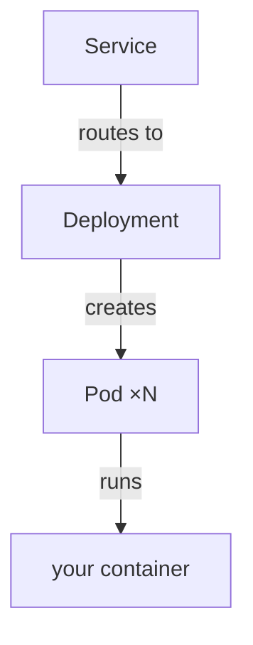
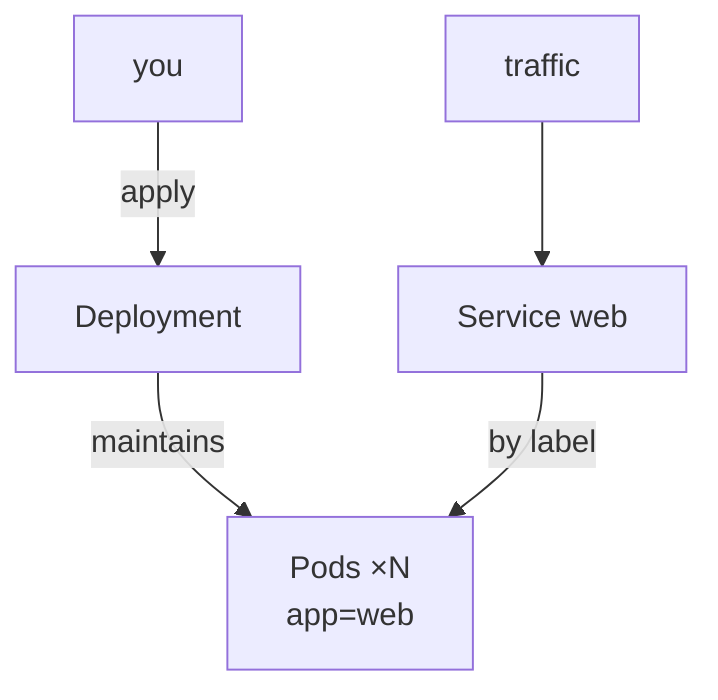

# The Core Objects

Kubernetes has a *lot* of objects, and the docs list them all with equal weight, which is how everyone ends up
overwhelmed. To run an app you meet a small handful, over and over. Learn these four ideas - Pod, Deployment,
Service, and the controller that ties them together - and you can read most real-world setups.

A quick way to hold them before we dig in:



Notice the direction: you almost never create a Pod yourself. You declare a **Deployment**, it makes the
**Pods**, and a **Service** gives those Pods a stable address. Take them in the order you'd actually build.

## The Pod - the smallest thing Kubernetes runs

**What it actually is.** A Pod is the smallest unit Kubernetes schedules: a thin wrapper around **one or more
containers** that share a network address and storage and always live and die together on the same machine.
Ninety percent of the time a Pod holds exactly *one* container - read "Pod" as "my running container, plus
the Kubernetes paperwork around it."

**Why people get this wrong.** The concept exists mainly for the rare case where two containers are so
tightly coupled they must share a network and be co-located (a "sidecar," like a logging helper riding
alongside your app). More important: people treat Pods as pets they create and tend. **Pods are cattle** -
disposable, created, killed, and replaced constantly. If one dies, you don't repair it, the system makes a
fresh one.

**Why this saves you later.** Because Pods are disposable, you never store anything precious *inside* one
(its filesystem vanishes with it). And "how do I keep the right number alive?" can't be the Pod's job -
that's the Deployment's.

📝 **Terminology.** *Node* = one machine in the cluster that runs Pods. *Cluster* = all the nodes plus the
*control plane* (the brain running the controllers and the API). You talk to the API with `kubectl`; the
control plane decides which node each Pod lands on.

## The Deployment - desired replicas and safe rollouts

This is the object you'll actually write and edit most. If you learn one Kubernetes object well, make it this.

**What it actually is.** A Deployment declares: *"Here's a Pod template, and I want N replicas of it running
at all times - and here's how to roll out changes safely."* It's the standing goal from Phase 1, written
down. A controller keeps exactly N healthy Pods alive, replaces any that die, and rolls Pods over to a new
version gradually when you change the template.

**A real example.** Here is a minimal, annotated Deployment. This is the shape you'll see everywhere:

```yaml
apiVersion: apps/v1
kind: Deployment              # the object type
metadata:
  name: web                   # what we'll call this Deployment
spec:
  replicas: 3                 # ← THE DESIRED STATE: keep 3 Pods alive
  selector:
    matchLabels:
      app: web                # this Deployment owns Pods labeled app=web
  template:                   # ← the Pod template: every replica is stamped from this
    metadata:
      labels:
        app: web              # the label the selector above matches (these MUST agree)
    spec:
      containers:
        - name: web
          image: myapp:1.4.0  # the image to run - same kind you built with Docker
          ports:
            - containerPort: 8080   # the port your app listens on inside the container
```

*What just happened:* you didn't tell Kubernetes to *start three containers* - you declared that the world
should contain three Pods stamped from this template, labeled `app=web`. `replicas: 3` is the desired state;
`selector`/`labels` is how the Deployment recognizes its own Pods (labels are how almost everything in
Kubernetes finds everything else). Apply this and the control loop from Phase 1 goes to work:

```console
$ kubectl apply -f web-deployment.yaml
deployment.apps/web created

$ kubectl get pods
NAME                   READY   STATUS    RESTARTS   AGE
web-7d9f8c6b5d-2xk9p   1/1     Running   0          12s
web-7d9f8c6b5d-q4m7n   1/1     Running   0          12s
web-7d9f8c6b5d-v8r2t   1/1     Running   0          12s
```

*What just happened:* `apply` sent your declared state to the cluster's API. The controller saw "desired: 3,
actual: 0" and created three Pods, each named after the Deployment plus a random suffix (disposable - not
yours to care about). `1/1` means one of one containers is ready. You declared a number; the cluster made it
true. Now watch self-healing be utterly mundane:

```console
$ kubectl delete pod web-7d9f8c6b5d-2xk9p
pod "web-7d9f8c6b5d-2xk9p" deleted

$ kubectl get pods
NAME                   READY   STATUS    RESTARTS   AGE
web-7d9f8c6b5d-q4m7n   1/1     Running   0          3m
web-7d9f8c6b5d-v8r2t   1/1     Running   0          3m
web-7d9f8c6b5d-8lz5w   1/1     Running   0          6s     ← brand-new, replacing the one you killed
```

*What just happened:* deleting the Pod dropped actual to 2. Desired still said 3, so the controller closed
the gap by creating a fresh Pod (new suffix, 6-second age) - the control loop from Phase 1, in action.

**Rolling out a new version.** Change the image and re-apply - the everyday update:

```console
$ kubectl set image deployment/web web=myapp:1.5.0
deployment.apps/web image updated

$ kubectl rollout status deployment/web
Waiting for deployment "web" rollout to finish: 1 out of 3 new replicas have been updated...
Waiting for deployment "web" rollout to finish: 2 out of 3 new replicas have been updated...
deployment "web" successfully rolled out
```

*What just happened:* the Deployment didn't kill all three old Pods at once - it brought up new (`1.5.0`)
Pods and retired old (`1.4.0`) ones a few at a time, keeping the app serving throughout, a **rolling
update**. Failed health checks would have stopped it, leaving the old ones running, with
`kubectl rollout undo deployment/web` to snap back. Gradual, watched, reversible updates: the rollout pain
from Phase 1, solved.

⚠️ **Gotcha - the selector and the template labels must match.** `selector.matchLabels` and
`template.metadata.labels` have to agree (both `app: web` above), or the Deployment either refuses to create
Pods or creates Pods it can't recognize as its own - a baffling "it made Pods but says it has zero replicas"
situation. Check the labels first.

## The Service - a stable address in a world of disposable Pods

Pods are disposable: each has its own IP, constantly replaced with new ones at new IPs. So how does anything
*reach* your app when the address keeps changing? The Service is the answer.

**What it actually is.** A Service is a **stable, unchanging address** that sits in front of a set of Pods
and load-balances traffic across them. The Pods behind it come and go; the Service's name and address stay
put. It finds its Pods by **label selector**, same as a Deployment, so it automatically includes new Pods and
drops dead ones.

**A real example.** A minimal Service for the Deployment above:

```yaml
apiVersion: v1
kind: Service
metadata:
  name: web                   # other apps reach this app by this name
spec:
  selector:
    app: web                  # send traffic to every Pod labeled app=web
  ports:
    - port: 80                # the Service listens on port 80
      targetPort: 8080        # and forwards to the Pods' containerPort 8080
```

```console
$ kubectl apply -f web-service.yaml
service/web created

$ kubectl get service web
NAME   TYPE        CLUSTER-IP      EXTERNAL-IP   PORT(S)   AGE
web    ClusterIP   10.96.140.21    <none>        80/TCP    5s
```

*What just happened:* you created a Service named `web` with a fixed cluster IP that won't change for its
life. Anything inside the cluster can now reach your app at `web` (an internal DNS name) without knowing
which Pods exist or what their IPs are. Each request load-balances to a healthy `app=web` Pod, and when the
Deployment replaces a dead one, the Service picks up the new Pod automatically.

📝 **Terminology.** *ClusterIP* (the default, shown above) = reachable only *inside* the cluster. To expose
an app to the outside world you use a different Service type (`NodePort`, `LoadBalancer`) or an **Ingress**,
left for operational follow-up material - the mental model, *a stable address fronting disposable Pods*, is
identical regardless of type.

**Why this trio is the whole pattern.** Deployment keeps N Pods alive and updates them safely; Service gives
them one steady address and spreads load; the control loop ties it together and heals it - a complete,
self-maintaining service in two short YAML files. Every fancier object you'll meet later is a refinement of
this base.

## How it all fits



## Recap

1. A **Pod** wraps one (occasionally more) container; it's the smallest unit Kubernetes runs, and it's
   **disposable** - replaced, not repaired. You rarely create one directly.
2. A **Deployment** declares **desired replicas** and a **Pod template**, keeps exactly that many alive,
   replaces dead Pods, and performs **safe, reversible rolling updates** when you change the image.
3. A **Service** is a **stable address** that load-balances across a Deployment's Pods, finding them by
   **label** so it tracks the constant churn automatically.
4. **Labels + selectors** are the glue: Deployments own Pods by label, Services route to Pods by label.
   Mismatched labels are a top early bug.

Now the honest part everyone skips: knowing how Kubernetes works doesn't mean you should run it. Next: when
it earns its keep - and when it doesn't.

---

[← Phase 1: The Problem K8s Solves](01-the-problem-k8s-solves.md) · [Phase 3: Should You Even Use It? →](03-should-you-even-use-it.md)
