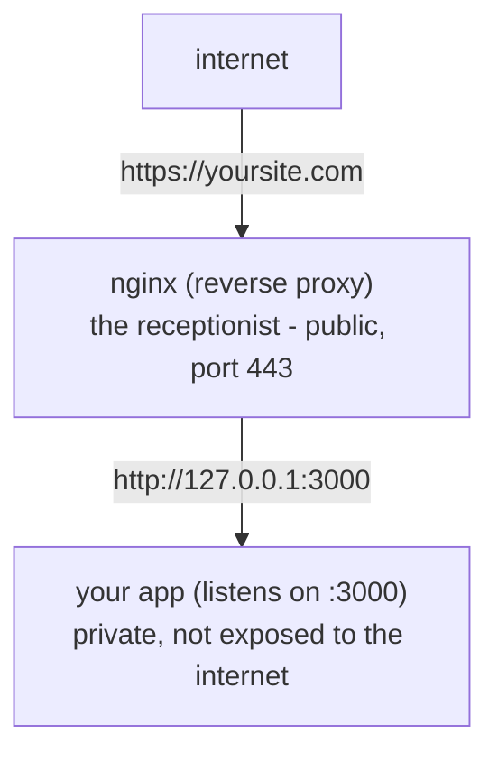

# What a Reverse Proxy Is

Here's the situation that trips people up. Your app runs fine on its own port. But you can't just point the
whole internet at `your-app:3000` and call it done - you need HTTPS, you need to serve images and CSS without
waking up your app for every one of them, and you'd really rather the world didn't know which framework you're
running or what port it's on. So you put another server in front. That front server is a **reverse proxy**,
and nginx is the one most people reach for.

The good news: once you see what it's doing, it stops being scary. It's not magic. It's a forwarder.

## The mental model: a receptionist

**What it actually is.** A reverse proxy is a server that receives every incoming request, then *forwards* it
to your actual app and passes the app's response back to the visitor. The visitor never talks to your app
directly - they only ever talk to the proxy.

Picture an office with a receptionist at the front desk. Visitors don't wander the building looking for the
right person. They tell the receptionist what they need; the receptionist walks it back to the right office,
gets the answer, and hands it back. Visitors only ever see the front desk. That's nginx.



📝 **Terminology - reverse vs forward proxy.** A *forward* proxy sits in front of *clients* and forwards their
requests out to the internet (think a corporate proxy that all the employees' browsers go through). A
*reverse* proxy sits in front of *servers* and forwards requests in to them. "Reverse" just means it's on the
server's side of the conversation, not the client's. We only care about reverse proxies here.

## Why you actually want one

You could, technically, expose your app to the internet directly. People do, in development. Here's what the
proxy buys you that makes it nearly universal in production:

- **TLS termination - HTTPS handled in one place.** The proxy holds your TLS certificate and does the
  encryption/decryption. Your app speaks plain HTTP on a private port and never has to know about
  certificates. One place to renew the cert, one place to configure it. (More on this in
  [Phase 3](03-what-nginx-does-in-practice.md).)
- **Serving static files cheaply.** Images, CSS, JavaScript, fonts - nginx can read those straight off disk
  and send them, fast, without ever bothering your app. Your app's job is the dynamic stuff; let the front
  desk hand out the brochures.
- **One public entry point.** Everything arrives at port 443 on one machine. Your app, your admin panel, your
  API can all live behind that single door on different internal ports, routed by URL path or hostname.
- **Hiding and centralizing.** The outside world sees nginx, not your framework, your port, or how many copies
  of your app are running. And cross-cutting concerns - logging, rate limiting, compression - live in one
  place instead of being reimplemented in every app.

💡 **Key point.** The proxy is where all the *infrastructure* concerns live - encryption, compression,
routing, throttling - so your *application* can stay focused on application logic. That separation is the
whole reason the pattern exists.

## A real, minimal nginx config

Here's the smallest config that does the core job: take HTTP requests on port 80 and forward them to an app
running locally on port 3000. Every line earns its place; read the comments.

```nginx
# A "server" block is one virtual host - one site nginx answers for.
server {
    listen 80;                       # accept plain HTTP on port 80
    server_name yoursite.com;        # only handle requests for this hostname

    # A "location" block matches a URL path. "/" matches everything.
    location / {
        # The heart of a reverse proxy: forward this request to your app.
        proxy_pass http://127.0.0.1:3000;

        # Pass along facts about the original request that would otherwise
        # be lost once nginx forwards it (see the gotcha below).
        proxy_set_header Host              $host;
        proxy_set_header X-Real-IP         $remote_addr;
        proxy_set_header X-Forwarded-For   $proxy_add_x_forwarded_for;
        proxy_set_header X-Forwarded-Proto $scheme;
    }
}
```

*What just happened:* You told nginx: "When a request for `yoursite.com` arrives on port 80, forward it to the
app at `127.0.0.1:3000` and wait for its reply." The `proxy_set_header` lines attach extra information about
the *original* visitor - their IP address, the hostname they asked for, whether they came in over HTTP or
HTTPS - so your app can still see who's really calling, even though, as far as the network is concerned, the
request now comes from nginx.

📝 **Terminology - `127.0.0.1` / `localhost`.** That address means "this same machine." So `proxy_pass
http://127.0.0.1:3000` means "hand the request to whatever is listening on port 3000 right here on this box."
Your app and nginx are usually neighbors on the same server.

⚠️ **The gotcha that bites everyone: the real client IP.** Once nginx forwards a request, your app sees the
connection as coming from nginx (`127.0.0.1`), not from the actual visitor. If you log "client IP" without
help, every single request looks like it came from your own server. Those `X-Forwarded-For` and `X-Real-IP`
headers are how nginx tells your app "the request *looks* like it's from me, but the real human was at *this*
address." Your app (or framework) has to be configured to *trust and read* those headers - otherwise rate
limits, geolocation, and audit logs all see one fake IP. We come back to this in detail in
[Phase 3](03-what-nginx-does-in-practice.md), because it's the single most common reverse-proxy mistake.

**Why this saves you later.** When you understand that nginx is a forwarder that *replaces the connection*,
two confusing things suddenly make sense: why your logs show `127.0.0.1` for every user, and why your app
doesn't need to know anything about HTTPS even though your site is clearly served over HTTPS. The proxy
absorbed both. That mental model carries you through everything else in this guide.

## Recap

1. A **reverse proxy** receives every request and forwards it to your app - the receptionist at the front
   desk. Visitors only ever talk to the proxy.
2. You want one because it handles **TLS** in one place, **serves static files** cheaply, gives you **one
   public entry point**, and **hides and centralizes** infrastructure concerns.
3. The core directive is **`proxy_pass`** inside a `location` block inside a `server` block.
4. Forwarding **replaces the connection**, so you must pass headers like **`X-Forwarded-For`** for your app to
   see the real visitor - the classic gotcha.

Next: what happens when one copy of your app isn't enough, and the proxy starts spreading traffic across
several.

---

[← Guide overview](_guide.md) · [Phase 2: Load Balancing →](02-load-balancing.md)
