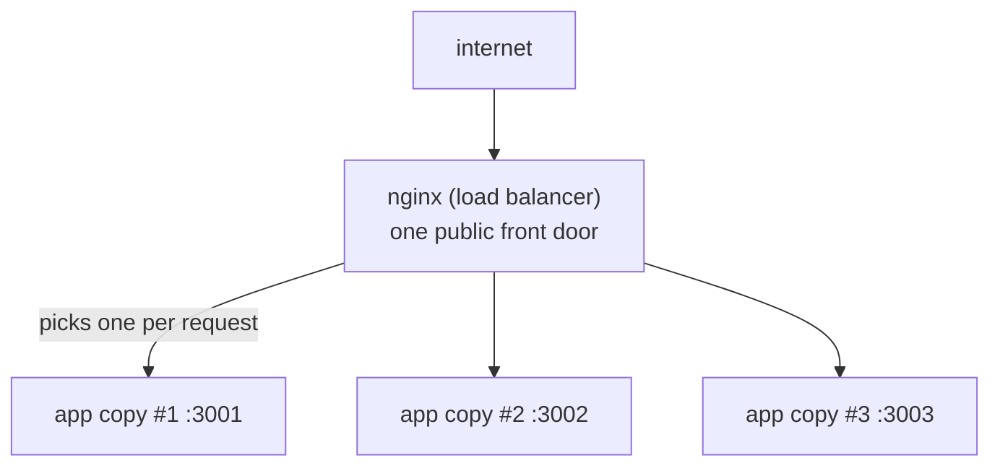

# Load Balancing

So far the receptionist has been walking requests to one office. But what happens when one person can't keep
up? On a busy day, a single copy of your app maxes out its CPU, requests start queuing, and pages get slow.
You can buy a bigger machine for a while - but eventually the answer is to run *several* copies of your app
and have the proxy spread requests across them. That's load balancing: the same receptionist doing a
slightly smarter job.

## The mental model: one front desk, several offices

**What it actually is.** A load balancer is a reverse proxy that, instead of forwarding to one app, forwards
to a *pool* of identical app instances - deciding, per request, which instance to send it to. Same
receptionist, but now five identical offices can all answer the same question, and the receptionist picks
one each time.



*The "upstream" pool - interchangeable instances.*

📝 **Terminology - "upstream."** In nginx, the pool of backend instances is called an **upstream**. It's the
group of servers that requests flow *up to* after passing through the proxy. You'll see it as a named block in
the config.

## The config: an upstream pool

You declare the pool once, then point `proxy_pass` at it by name:

```nginx
# Define the pool of identical app instances.
upstream my_app {
    server 127.0.0.1:3001;
    server 127.0.0.1:3002;
    server 127.0.0.1:3003;
}

server {
    listen 80;
    server_name yoursite.com;

    location / {
        proxy_pass http://my_app;     # forward to the pool, not one instance
        proxy_set_header Host $host;
        proxy_set_header X-Forwarded-For $proxy_add_x_forwarded_for;
    }
}
```

*What just happened:* you named a pool `my_app` with three instances, then told nginx to forward to
`http://my_app`. nginx now distributes incoming requests across those three. By default it uses
**round-robin** - request one goes to `:3001`, request two to `:3002`, request three to `:3003`, request four
back to `:3001`, and so on.

## How nginx decides who gets the next request

The rule nginx uses to pick an instance is the **load-balancing strategy**. The two you'll meet first:

- **Round-robin (the default).** Hand requests out in rotation, evenly. Works well when every request costs
  about the same and every instance is about equally powerful.
- **Least-connections (`least_conn`).** Send the next request to whichever instance has the *fewest* active
  connections. Better when request times vary a lot, so a slow one doesn't bury one instance while others sit
  idle.

You switch strategy by naming it at the top of the upstream block:

```nginx
upstream my_app {
    least_conn;                       # use least-connections instead of round-robin
    server 127.0.0.1:3001;
    server 127.0.0.1:3002;
    server 127.0.0.1:3003;
}
```

*What just happened:* adding `least_conn` told nginx to stop rotating blindly and always pick the least-busy
instance. Nothing else about the pool changed.

💡 **Key point.** Start with round-robin - it's the default for a reason and right for most workloads. Reach
for `least_conn` only when you see one instance getting hammered while others are quiet.

## Health checks: skipping the dead office

A pool is only useful if the receptionist stops sending visitors to an office where nobody's home. If one of
your instances crashes or hangs, you don't want a third of your traffic getting errors.

**What it actually does.** With the open-source nginx that ships in package managers, health checking is
*passive*: nginx watches the results of the real requests it forwards. If an instance fails or times out
enough times in a row, nginx marks it temporarily unavailable and routes around it, then retries after a
cooldown. Tune this per-server:

```nginx
upstream my_app {
    server 127.0.0.1:3001 max_fails=3 fail_timeout=30s;
    server 127.0.0.1:3002 max_fails=3 fail_timeout=30s;
    server 127.0.0.1:3003 max_fails=3 fail_timeout=30s;
}
```

*What just happened:* you told nginx: "if an instance fails 3 times within 30 seconds, treat it as down for
the next 30 seconds and send no traffic there. After that, try again." A crashed instance quietly drops out
of rotation and rejoins when it recovers - visitors keep getting served by the healthy ones.

⚠️ **Gotcha - passive isn't the same as active.** Passive health checks only notice a sick instance *because
a real user's request just failed against it* - a handful of visitors eat the failure before nginx routes
around it. *Active* health checks - nginx probing each instance on a schedule, before sending real traffic -
are a feature of the commercial nginx Plus, not the free open-source nginx
(source: <https://docs.nginx.com/nginx/admin-guide/load-balancer/http-health-check/>). If you need active
probing on open-source nginx, that's typically handled at a layer above (your orchestrator or platform).

## The prerequisite nobody mentions: your app must be stateless

Here's the part that surprises people. Load balancing only works cleanly if **any instance can handle any
request** - the proxy might send a given user to a different instance on every click. If instance #1 quietly
stored your shopping cart in its own memory, and your next request lands on instance #2, your cart is gone.

The fix is to make your app **stateless**: keep no per-user data in a single instance's memory. Push shared
state out to a place all instances can reach - a database, a cache like Redis, a shared session store. Then
every instance is genuinely interchangeable, and the receptionist can hand your request to anyone.

> This is exactly the discipline covered in [Designing for Scale](/guides/designing-for-scale) -
> statelessness is the foundation that makes horizontal scaling actually work.

**Why this saves you later.** The day your traffic doubles, you want the fix to be "run two more instances
and add two lines to the upstream block" - not "rearchitect the app under pressure." Building stateless from
the start is what makes scaling a config change instead of a crisis.

## Recap

1. A **load balancer** is a reverse proxy that forwards to a **pool (upstream)** of identical instances and
   picks one per request.
2. The default strategy is **round-robin** (even rotation); **`least_conn`** sends to the least-busy instance,
   better when request times vary a lot.
3. **Passive health checks** (`max_fails` / `fail_timeout`) let nginx route around a failing instance;
   *active* probing is an nginx Plus feature.
4. Load balancing assumes your app is **stateless** - shared state belongs in a database or cache, not in one
   instance's memory. See [Designing for Scale](/guides/designing-for-scale).

Next: the day-to-day reality of running nginx - TLS, compression, caching, rate limiting, and how to change
the config without taking your site down.

Send traffic and watch how each algorithm spreads it across the backends:

```playground-lb
```

Watch it animated: [load balancing](/explainers/LoadBalancing.dc.html)

---

[← Phase 1: What a Reverse Proxy Is](01-what-a-reverse-proxy-is.md) · [Guide overview](_guide.md) · [Phase 3: What nginx Does in Practice →](03-what-nginx-does-in-practice.md)
