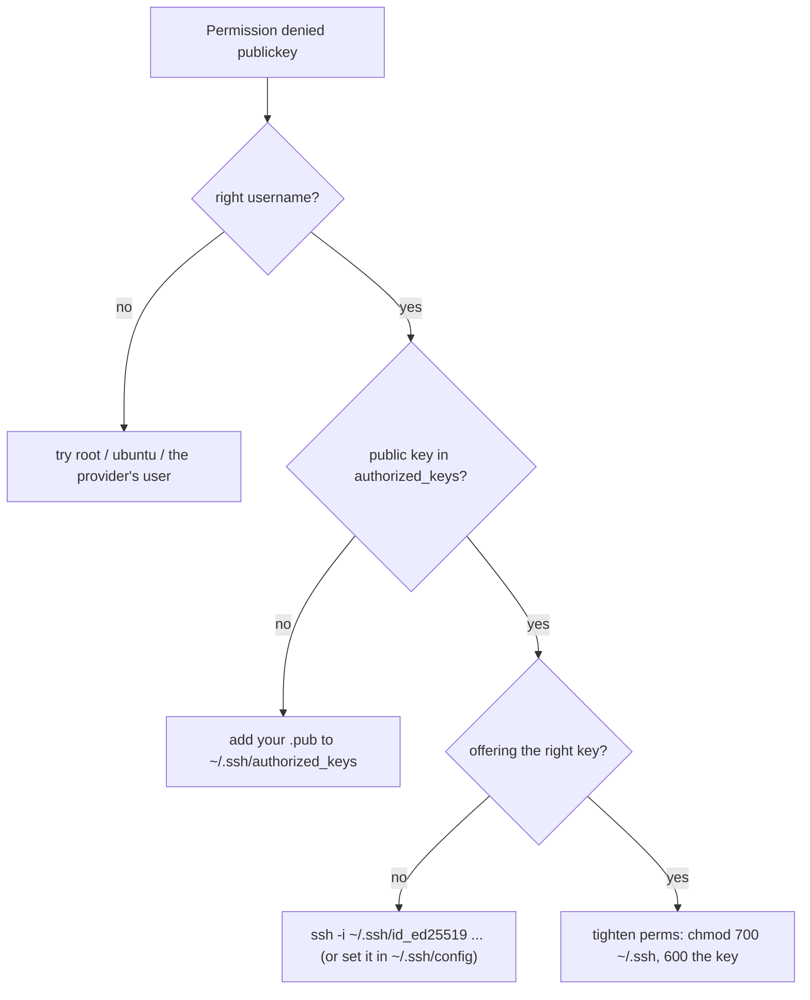

# SSH In With a Key

Your box has a public IP and you need a shell on it. The tool is **SSH**, and the right way in is a
**key**, not a password. This phase is the deploy-focused version; for how key pairs actually work — the
padlock-and-key mental model — read [SSH & Keys](/guides/ssh-and-keys) alongside it. Here we cover what
bites you the *first* time you point SSH at a brand-new server.

## Keys, in one paragraph

You generate a **key pair**: a *private* key that never leaves your laptop, and a *public* key that's
safe to hand out. You put the public key in the server's `~/.ssh/authorized_keys`; when you connect, SSH
proves you hold the matching private key without ever sending it. No password travels, and brute-forcing
a key is hopeless. Most VPS providers let you **paste your public key at creation** — do that, and the
box comes up already trusting you.

```console
$ ssh-keygen -t ed25519 -C "you@example.com"     # generates ~/.ssh/id_ed25519 (private) + .pub (public)
$ cat ~/.ssh/id_ed25519.pub                       # this is the line you paste into the provider / authorized_keys
$ ssh root@203.0.113.10                            # connect (user is often root or ubuntu on a fresh box)
```
*What just happened:* `ssh-keygen` made the pair; you copied the `.pub` (public) line to the server; `ssh`
connected as the box's initial user. The private `id_ed25519` stayed on your laptop the whole time.

📝 **On Windows.** Modern Windows 10/11 ship OpenSSH — `ssh` and `ssh-keygen` work in PowerShell out of
the box. If they don't, enable **Settings → Apps → Optional Features → OpenSSH Client** (one click), or
use the SSH that comes with Git Bash. You do *not* need PuTTY anymore.

## ⚠️ Use a key, then turn passwords off

A fresh box with password login is a magnet: bots hammer `root` with guessed passwords within *minutes*
of it getting a public IP. Once your key works, disable password login entirely on the server in
`/etc/ssh/sshd_config`:

```console
$ sudo nano /etc/ssh/sshd_config     # set:  PasswordAuthentication no
$ sudo systemctl restart ssh         # (on some distros the service is named sshd)
```
*What just happened:* you told the SSH server to stop accepting passwords at all — only keys. The bots
can now knock forever and never get in. ⚠️ **Confirm your key works in a second terminal *before* you log
out**, or a typo here can lock you out of your own box.

## ⚠️ The "Permission denied (publickey)" decision tree

You will see this error. It's almost never deep — it's one of a few mundane things. Walk it in order:



1. **Wrong username.** `ssh root@…` when the box's user is `ubuntu` (or vice versa). The username is part
   of who you're proving to be — right key, wrong user, still denied. Try the provider's default user.
2. **Public key not on the server.** Your `.pub` isn't in that user's `~/.ssh/authorized_keys`, so there's
   nothing to match. Paste it in (or re-create the box with the key attached).
3. **Wrong key offered.** You have several keys and SSH isn't offering the right one — point at it with
   `ssh -i ~/.ssh/id_ed25519 …` or name it in `~/.ssh/config`.
4. **Permissions too open.** SSH refuses a private key other users could read: `chmod 700 ~/.ssh` and
   `chmod 600 ~/.ssh/id_ed25519`.

(The full version of this checklist, with the verbose `ssh -v` trick, lives in
[SSH & Keys → Living With SSH](/guides/ssh-and-keys).)

## ⚠️ The provider's web console mangles pasted symbols

When SSH locks you out completely, every provider offers a **web/VNC console** — a browser window into
the box's screen. It's a genuine lifesaver, with one nasty quirk: that console emulates a keyboard, and
**pasting text with special characters into it often garbles them.** Paste a long key, a password with
`@ / $ | { }`, or a config line, and characters silently drop or change — so your "correct" key or
password mysteriously doesn't work. If you must use the console, type sensitive strings *by hand*, or
keep them simple, or (better) fix SSH so you never need the console. Many a "but I pasted it exactly!"
hour has died here.

## Recap

1. **Generate a key pair**, put the **public** half in the server's `authorized_keys` (or paste it at
   creation); the private half never leaves your laptop. Windows has `ssh`/`ssh-keygen` built in.
2. ⚠️ Once keys work, set **`PasswordAuthentication no`** — but confirm the key in a second terminal
   first so you don't lock yourself out.
3. ⚠️ **`Permission denied (publickey)`** is the decision tree above: username → key installed → key
   offered → file permissions.
4. ⚠️ The **web/VNC console garbles pasted symbols** — type sensitive strings by hand there.

You're on the box. Time to run your actual app.

---

[← Phase 1: Pick a Cheap VPS](01-pick-a-vps.md) · [Guide overview](_guide.md) · [Phase 3: Docker & Your Private Repo →](03-docker-and-your-repo.md)
