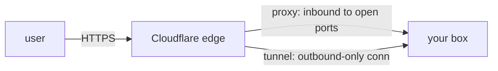

# Behind Cloudflare

Right now traffic hits your box directly over plain HTTP. Putting **Cloudflare** in front gives you, for
free: HTTPS (a real certificate, auto-renewed), a CDN, and a shield against floods of junk traffic.
Cloudflare sits between your users and your server — users talk to Cloudflare, Cloudflare talks to your
box (the **origin**). (The "what is HTTPS even doing" mental model is [HTTPS & TLS](/guides/https-and-tls);
here we wire it up and dodge the traps.)

There are two ways to connect Cloudflare to your box, and the second is genuinely better.



## Option A: proxied DNS (the orange cloud)

In Cloudflare's dashboard, your DNS records have a **proxy toggle** (the orange cloud). Turn it on and
Cloudflare stops handing out your real IP — instead, traffic routes *through* Cloudflare, which terminates
HTTPS at its edge and forwards to your origin. Quick to set up. The catch: your origin still needs ports
80/443 open to receive Cloudflare's forwarded traffic — which leads straight to the firewall gotcha below.

## Option B: Cloudflare Tunnel (no open ports — prefer this)

A **Tunnel** flips the direction. You run a small agent (`cloudflared`) on your box that makes an
**outbound** connection to Cloudflare and holds it open. Traffic comes *down* that tunnel — so your server
needs **no inbound ports open at all.** Nothing to port-scan, nothing to firewall, no exposed origin IP.

```console
$ curl -fsSL https://pkg.cloudflare.com/install.sh | sudo bash   # install cloudflared (see Cloudflare docs)
$ cloudflared tunnel login
$ cloudflared tunnel create myproject
$ cloudflared tunnel route dns myproject yourproject.com
$ cloudflared tunnel run myproject
```
*What just happened:* you installed the agent, authenticated it to your Cloudflare account, created a named
tunnel, pointed your domain at it, and ran it. Your app is now reachable at `https://yourproject.com` over
an outbound-only connection — with **zero** inbound ports open on the box. (In production you'd run
`cloudflared` as a service, or as another container in your compose stack.)

💡 **Key point.** Tunnel beats proxy for a side project: free HTTPS *and* the firewall problem below
simply can't exist, because there's nothing listening to the public internet.

## ⚠️ The app-side must-dos: origin, CSRF, and secure cookies

Here's the bug that ruins the victory lap: everything *looks* up, the page loads over HTTPS — but **login
silently fails**, or you get mysterious **403s**. The cause is that your app is now behind a proxy, and it
doesn't know it. Two fixes, both mandatory:

⚠️ **Tell your app its real public origin (for CSRF / redirects).** Your framework sees requests arriving
from Cloudflare, often as `http` on some internal host — not as `https://yourproject.com`. So its CSRF
check ("did this form come from my own site?") compares against the wrong origin and **rejects valid
requests with a 403**, and any "redirect to my URL" sends users somewhere wrong. Set your app's public URL
/ trusted origins explicitly:
```text
# .env
SITE_URL=https://yourproject.com
# many frameworks also need an explicit trusted-origins / allowed-hosts list = yourproject.com
```

⚠️ **Set cookies `Secure` (`COOKIE_SECURE=true`).** The public connection is HTTPS, so your session cookie
must be marked **Secure** — otherwise the browser may refuse to send it back over HTTPS (or your framework
sets it for `http` and the `https` request never sees it), and **the user logs in, gets bounced straight
back to the login page, forever.** A login loop with no error is almost always this.
```text
# .env
COOKIE_SECURE=true
```
*What just happened:* you told the app "your real address is `https://yourproject.com`" (so CSRF and
redirects line up) and "only send session cookies over HTTPS" (so logins stick). These two settings are
invisible locally — on `http://localhost` everything works — and break the moment you're behind HTTPS in
front of a proxy. (Remember from [Phase 3](03-docker-and-your-repo.md): after editing `.env`, you must
`docker compose up -d --force-recreate` — `restart` won't pick these up.)

## ⚠️ Firewall the origin so nobody bypasses Cloudflare

If you went with **Option A (proxy)** and left ports 80/443 open to the whole internet, you have a hole:
anyone who discovers your origin IP can hit the box **directly**, skipping Cloudflare's HTTPS and
protection entirely. All that edge security becomes optional for an attacker.

Lock the origin so it *only* accepts traffic from Cloudflare:

```console
$ sudo ufw default deny incoming
$ sudo ufw allow 22/tcp                 # keep your SSH in!
# then allow 80/443 ONLY from Cloudflare's published IP ranges (see their docs), e.g.:
$ sudo ufw allow from 173.245.48.0/20 to any port 443 proto tcp
$ sudo ufw enable
```
*What just happened:* the box now refuses inbound traffic except SSH and HTTPS-from-Cloudflare, so the
origin can't be reached directly. ⚠️ **Allow SSH (22) before you `enable`**, or you'll firewall yourself
out. And with **Option B (Tunnel)** this whole section is moot — there are no inbound ports to lock,
which is the entire reason a tunnel is the cleaner choice.

## Recap

1. **Cloudflare = free HTTPS + protection**, sitting between users and your origin.
2. **Proxy (orange cloud)** is quick but keeps origin ports open; **Tunnel (`cloudflared`)** needs **no
   inbound ports** — prefer it.
3. ⚠️ Behind a proxy, set **`SITE_URL` / trusted origins** (or CSRF gives 403s) and **`COOKIE_SECURE=true`**
   (or logins loop) — then `--force-recreate` to apply them.
4. ⚠️ With the proxy, **firewall the origin to Cloudflare's IPs** so nobody hits the box directly (allow
   SSH first!). With a Tunnel, there's nothing to firewall.

It's live, HTTPS, and safe. The last step is making *future* changes effortless.

---

[← Phase 4: Domains & DNS](04-domains-and-dns.md) · [Guide overview](_guide.md) · [Phase 6: Auto-Deploy on Merge →](06-auto-deploy-on-merge.md)
