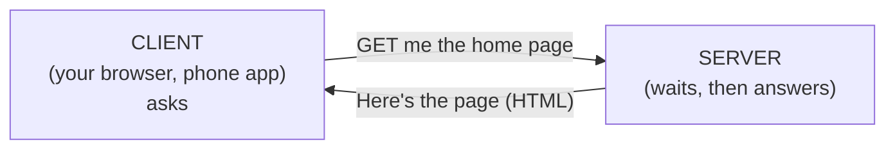

# A Computer That's Always On

Let's clear the fog before anything else. The word "server" sounds like it names a special, exotic machine -
something fundamentally different from the laptop in front of you. It isn't. We're going to build one mental
picture, and once you have it, every "server" sentence you've ever heard suddenly makes sense.

## What a server actually is

**What it actually is.** A server is a computer running a program that **waits for requests and answers
them**. That's the entire definition. The same CPU, memory, and disk you already understand, running software
whose whole job is to sit patiently and respond when something asks it for something.

The word "server" is doing double duty, and that's where a lot of the confusion comes from. It can mean:

- **The software** - the program that waits and answers (a "web server," a "database server").
- **The computer** - the machine that program runs on.

Both are correct. People say "the server crashed" when they mean the machine, and "start the server" when
they mean the program. Once you know both meanings live in one word, the sentences stop being slippery.

📝 **Terminology.** *Server* (software) = a program that waits for requests and responds to them. *Server*
(hardware) = the computer that program runs on. Context tells you which one someone means.

**Why people get this wrong.** The common picture is that a server is a giant, blinking, refrigerator-sized
box in a locked room, completely unlike a "normal" computer. The big boxes in locked rooms are real - but
they're servers for the same reason a food truck and a five-star kitchen are both kitchens: they do the same
*job* at different scales. The job is what matters, not the size of the box.

**What it does in real life.** Right now, somewhere, a program is running that does nothing but loop: *wait
for a request… got one… figure out the answer… send it back… wait for the next one.* When you open a website,
your browser sends a request to that program, and that program sends back the page. The "always on" part is
the point - it has to be waiting *whenever* someone might ask, which is why servers are left running day and
night.

## Your laptop can be a server

Here's the fact that dissolves the mystery for good: **the computer you're reading this on can be a server.**
There's nothing to install at the hardware level, no permission to unlock. A server is a *role* a computer
plays, not a category of machine. The moment you run a program that listens for requests, your computer is
serving.

Developers do this constantly. When you build a website, you run a tiny web server *on your own laptop* so
you can see your work in a browser before anyone else does:

```console
$ python3 -m http.server 8000
Serving HTTP on 0.0.0.0 port 8000 (http://0.0.0.0:8000/) ...
```

*What just happened:* Python started a real web server, right there on your laptop. It's now sitting in that
wait-for-a-request loop. Open `http://localhost:8000` in your browser and your laptop will answer - your
machine is the server, your browser is the client, and they're both on the same computer. Press `Ctrl+C` and
the server stops; your laptop goes back to being "just" a laptop. The role was temporary. That's all "being a
server" ever was.

💡 **Key point.** "Server" is a job, not a kind of hardware. Any computer running a program that waits for and
answers requests is, at that moment, a server.

## The client/server model

Now we can name the relationship, because you've already seen both halves of it.

**What it actually is.** Almost everything on a network works as a conversation between two roles:

- The **client** *asks*. ("Give me the home page." "Save this comment." "What's my account balance?")
- The **server** *answers*. ("Here's the page." "Saved." "Your balance is shown below.")

📝 **Terminology.** *Client* = the program that initiates a request. *Server* = the program that waits for
requests and responds. The same machine can be a client in one conversation and a server in another.



**What it does in real life.** Every time you load a page, tap a button in an app, or send a message, your
device is the client and some server is the responder. The client starts the conversation; the server never
calls you first - it waits to be asked. That asymmetry is the heart of the model: one side reaches out, the
other side stands ready.

**Why this saves you later.** Once you think in client and server, error messages get readable. "The server
returned a 500" means the responder hit a problem while answering. "Connection refused" means nothing was
listening - there was no server in its wait loop at that address. You'll know which side of the conversation
broke before you've read a single log line.

> ⏭️ Curious how that request actually travels across the world to reach the server? That's the network's job
> - see [How the Internet Works](/guides/how-the-internet-works). For now, just hold the two roles: one asks,
> one answers.

## Recap

1. A server is an **ordinary computer running a program that waits for requests and answers them** - nothing
   exotic.
2. The word "server" means both the **software** (the waiting program) and the **hardware** (the machine it
   runs on); context tells you which.
3. **Being a server is a role, not a kind of machine** - your own laptop can be a server the moment it runs a
   listening program.
4. The **client/server model** is the whole relationship: the client asks, the server answers, and the server
   waits to be asked.

Next, we'll look at what actually earns a computer the everyday name "server" - the handful of traits that
separate a machine doing serving from your laptop running a quick test.

---

[← Guide overview](_guide.md) · [Phase 2: What Makes It a "Server" →](02-what-makes-it-a-server.md)

## See it move

Step through the journey of one request - the DNS lookup, the request out, and the response back:

```playground-network
```
