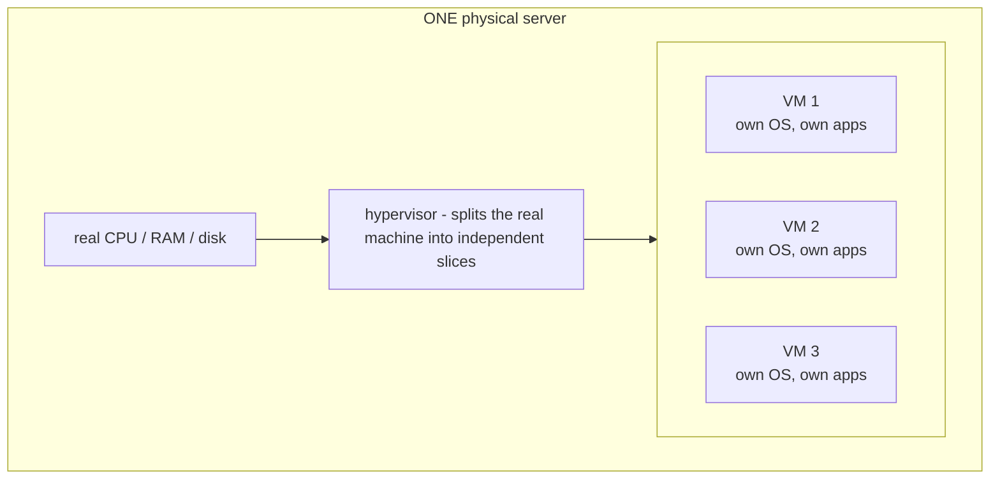
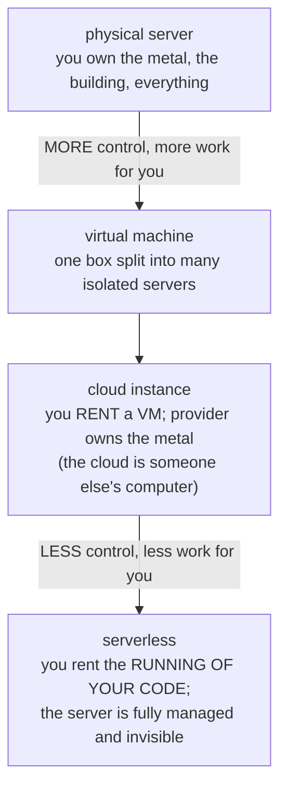

# From a Box to the Cloud

You now know what a server is and what makes a computer one. The last piece of the fog is *where* a server
lives - "the cloud" has made that question feel mystical. It isn't. There's a clear ladder from a physical
box you could carry to a sliver of a machine you rent and never see. We'll climb it one rung at a time, and
by the top, "the cloud" will be a precise, ordinary thing.

The thing that doesn't change as we climb: at every rung, it's still **a computer running a program that waits
for requests and answers them**. Only *who owns the box* and *how much of it you get* changes.

## Rung 1: A physical server

**What it actually is.** A real, physical computer - metal, chips, fans - dedicated to serving. The
food-truck-vs-five-star-kitchen point from Phase 1, made literal: same job as your laptop, often beefier
hardware, built to run continuously.

**What it does in real life.** Someone has to *own* this box: plug it in, cool it, connect it to the
network, replace the disk when it dies. If that someone is you or your company, you have a physical server
"on premises" - the most direct form, and the most work. You're responsible for the metal.

**The gotcha.** ⚠️ One physical server is often *wasted*. A single app rarely uses all of a powerful machine's
CPU and memory - so the box sits mostly idle, burning power and money to do a fraction of what it could. That
waste is exactly the problem the next rung solves.

## Rung 2: A virtual machine

**What it actually is.** A **virtual machine (VM)** is a software-created "computer" running *inside* a
physical one. Special software called a **hypervisor** carves one physical server into several independent
virtual ones, each with its own slice of CPU, memory, and disk - and each behaving like a complete, separate
computer.

📝 **Terminology.** *Virtual machine (VM)* = a fully-functioning computer that exists as software, running on
top of a physical host. *Hypervisor* = the software that splits one physical machine into multiple isolated
VMs and keeps them from interfering with each other.

*Each VM thinks it's a whole computer - isolated from the others.*

**What it does in real life.** That idle, wasted physical box from Rung 1 now hosts *several* servers at
once, each isolated from the others. If one VM crashes or gets compromised, the others keep running. This is
the breakthrough the whole cloud is built on: a server stops being a *physical object* and becomes a
*configuration of software* you can create, copy, and destroy on demand.

**Why this matters.** Because a VM is just software, you can create one in seconds, throw it away when done,
and make another exactly like it - you can't do that with metal. This flexibility is what makes renting
practical, the next rung.

## Rung 3: A cloud instance (renting a VM)

**What it actually is.** A **cloud instance** is a virtual machine you **rent** from a cloud provider -
Amazon Web Services (AWS), Google Cloud, Microsoft Azure, and others. They own gigantic data centers full of
physical servers, carve them into VMs, and rent those VMs out by the hour.

📝 **Terminology.** *Cloud instance* = a virtual machine you rent from a cloud provider, running in their data
center. *Cloud provider* = a company (AWS, Google Cloud, Azure, etc.) that owns the physical machines and rents
out slices of them.

**What it does in real life.** You go to the provider's website, choose how much CPU and memory you want, and
a few moments later you have a running server - reachable at an address, ready to log in to and use. You
never see the physical machine, and don't know (or care) which building it's in. You pay for what you use
and shut it off when you're done.

**This is what "the cloud" means, precisely.** The famous line -

> 💡 *"The cloud is just someone else's computer."*

- is **literally true**, and now you can see exactly why. Your cloud server *is* a real computer (a VM on a
physical box) sitting in *someone else's* data center, that *you rent* instead of own. "The cloud" isn't a
place in the sky; it's other people's machines, rented out and managed for you. The fog was hiding something
completely ordinary.

**What you're renting, and why.** You're renting the parts you don't want to deal with: the metal, the
building, the power, the cooling, the network, and the person who swaps the dead disk at 4am. You handle the
software; they handle the hardware. For most people and companies, that trade is overwhelmingly worth it.

> ⏭️ Choosing a provider, picking an instance size, and understanding what you're actually paying for is its
> own topic - see [Cloud Platforms Explained](/guides/cloud-platforms-explained).

## Rung 4: Serverless (renting even less)

**What it actually is.** At the top of the ladder, you stop renting a *machine* at all and start renting *the
running of your code*. With **serverless**, you hand the provider a piece of code and a rule for when to run it
("whenever a request comes in"). They run it on their servers, only when it's needed, and you pay only for the
moments it's actually running.

📝 **Terminology.** *Serverless* = a model where you provide code and the cloud provider runs it on demand,
managing all the servers for you. (The name is marketing: there are still servers - you just never see or
manage them.)

**The gotcha.** ⚠️ "Serverless" does **not** mean there's no server. The server is very much there, running
your code in the provider's data center. What's gone is *your* relationship with it: you don't pick its
size, patch it, or keep it running. It became so fully managed that, from your seat, it disappeared. The name
describes your *experience*, not reality.

**What you're renting, and why.** Even less of your attention. You're no longer responsible for an always-on
machine sitting and waiting - the provider handles the waiting, and only spins up your code when a request
arrives. For workloads that are quiet most of the time, you pay almost nothing while idle. The trade-off is
less control over the machine, which, for many jobs, you didn't want anyway.

## The whole ladder

*Reading the ladder:* as you go down, you hand off more of the work - and give up more direct control over the
machine. At the top you own everything and do everything; at the bottom you own nothing and barely think about
the machine. The *server* - a computer waiting for requests and answering them - is present at every single
rung. What changes is only how much of it is yours to manage.

## Recap

1. A **physical server** is a real, owned computer dedicated to serving - direct, but all the work (and
   waste) is yours.
2. A **virtual machine** is a software-defined server running inside a physical one; a hypervisor splits one
   box into many isolated VMs, turning a server into something you can create and destroy on demand.
3. A **cloud instance** is a VM you *rent* from a provider's data center - exactly why "the cloud is someone
   else's computer" is literally true: a real machine, in someone else's building, that you rent.
4. **Serverless** rents you the *running of your code* instead of a machine; there's still a server, you
   just never see or manage it.
5. Across the whole ladder, it's always the same thing - a computer waiting for requests and answering them.
   Only *who owns it* and *how much you manage* changes.

You now have the "A" of infrastructure: what a server is, what makes a computer one, and where servers live.
The natural next steps are learning to actually *connect* to one and to *choose* one.

---

[← Phase 2: What Makes It a "Server"](02-what-makes-it-a-server.md) · [Guide overview →](_guide.md)

**Where to go next:**
[SSH and Keys](/guides/ssh-and-keys) - how to securely log in to a server and run commands on it ·
[Cloud Platforms Explained](/guides/cloud-platforms-explained) - choosing and renting a server from a provider ·
[Linux for Servers](/guides/linux-for-servers) - the operating system most servers actually run.
