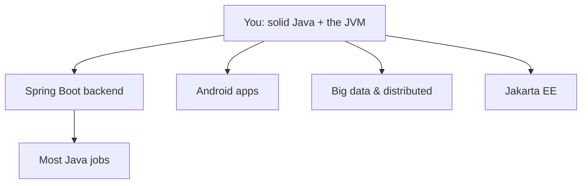

# Where to Go Next — Putting Java to Work

Take a second to notice what you've done. You didn't only learn a language — you learned the *platform* it runs on. Classes and objects, generics and collections, exceptions, threads and concurrency, the standard library, and the JVM underneath all of it: how bytecode runs, how garbage collection keeps your memory tidy, how the just-in-time compiler quietly makes hot code fast. That's not a beginner's slice of Java. That's the real thing, language and runtime both.

So this last phase isn't more syntax. Everything from here is *application* — taking what you already know and pointing it at a real target. The Java world is huge, and it is tempting to feel you must learn all of it at once. You don't. Here's the honest map of where Java genuinely shines, an honest paragraph on each path, and — most importantly — what to build so it actually sticks.

## The branches from here



*What this shows:* four directions lead out from where you stand, and one of them — **Spring Boot** — is where most Java careers actually live. You don't have to pick forever. But pick *one to go deep on next*, because depth beats breadth when you're learning, and going wide too early leaves you with four shallow puddles instead of one well.

## Backend with Spring Boot — the dominant Java job

If you only chase one of these, make it this one. **Spring Boot** is, for most people, the highest-leverage next step — it's the framework behind a huge share of Java backend jobs, and "Java developer" in a job posting very often means "Spring Boot developer."

What it gives you: **dependency injection** (the framework wires your objects together so you stop doing it by hand), **REST APIs** (you write a method, annotate it, and it answers HTTP requests), and **JPA** (you describe your data as plain Java classes and it talks to the database for you). It builds directly on the objects, interfaces, and generics you already know — the annotations are new, the foundation isn't.

The leap from here is short *because* you understand the Java underneath. That's not a small advantage. People who jump straight into Spring Boot without the language often spend months unsure where the framework's magic ends and their own code begins. You won't have that fog.

## Android — Java still works, concepts transfer

**Android** is the other place a lot of Java has historically lived. The honest update: **Kotlin** is now Google's primary recommended language for Android, and most new code is written in it. But two things are true. Java still works for Android development, and Kotlin runs on the *same JVM* you just learned — so its objects, collections, null-handling, and concurrency are the concepts you already have, with friendlier syntax on top.

In other words, the Java you learned isn't wasted here even if you write Kotlin. If building things people tap on their phones is what excites you, this path is open, and your foundation carries over almost completely.

## Big data & distributed systems — much of this world is the JVM

Here's a corner of the industry that surprises people: a large slice of the **big data and distributed systems** world runs on the JVM. **Apache Kafka** (the de facto event-streaming backbone of modern systems), **Apache Spark** (large-scale data processing), and **Elasticsearch** (search at scale) are all JVM software. So is a great deal of the infrastructure around them.

That means your Java — and your understanding of threads, memory, and the JVM from Phases 14 and 17 — is a real entry ticket to data engineering and distributed-systems work. If you're drawn to systems that move enormous amounts of data, you're already standing in the right ecosystem.

## Jakarta EE — the enterprise standard

**Jakarta EE** (formerly Java EE) is the long-standing set of enterprise standards — servlets, persistence, messaging, and more — that powers a great many large, established corporate systems. It's heavier and more ceremonial than Spring Boot, and it's less likely to be where you start today. But it's worth *knowing the name*: if you join a big enterprise with a mature Java codebase, there's a fair chance some of it lives here. Treat it as a path you can recognize and step into later, not your first stop.

💡 **Why Java keeps winning.** It's not hype — it's the opposite. Java's superpower is **stability plus ecosystem plus the JVM**. Decades of battle-tested libraries for nearly anything you need, world-class tooling (IDEs, profilers, build systems), and a runtime that stays backward-compatible for years. That's often called "boring technology," and it's meant as a compliment: big systems want code that keeps working, that they can hire for, and that won't break on the next upgrade. That's exactly what Java offers, which is why it's still everywhere a decade after people started predicting its decline.

## What to actually build

Reading guides got you here. *Building* is what turns knowledge into skill. The trick is something small enough to finish but real enough to teach you the messy parts. A few honest suggestions:

- **A REST API with Spring Boot, backed by a database.** A handful of endpoints — create, read, list, delete — storing data in a real database through JPA. This is the single most career-relevant thing you can build, and it makes dependency injection and persistence concrete in a way no tutorial can.
- **A command-line tool.** Take a chore you do by hand — renaming files, summarizing a log, checking a list of URLs — and make it a Java program. You'll exercise classes, collections, file I/O, and exceptions all at once, with no framework in the way.
- **A multi-threaded downloader.** Fetch several URLs at once using the concurrency tools from [Phase 14](14-concurrency-and-threads.md). Watching real work happen in parallel makes threads stop being abstract — this is the example that makes that phase click.

Whichever you pick, the real instruction is this: **finish one.** A finished rough project teaches you far more than three polished half-projects abandoned at 80%. Pick the one that excites you, build it end to end, and ship it even if it's small.

## A last word, and what to read

Two resources are worth bookmarking. The **official Java tutorials and documentation** on the Oracle/OpenJDK sites are thorough and trustworthy — maintained by the people who build Java. And once you're comfortable, **"Effective Java"** by Joshua Bloch is the canonical book on Java idioms; it's where good Java developers learn to write *idiomatic* Java rather than merely working Java.

And if you ever want to step back and think about *why* languages make the choices they do — why Java reaches for a VM and a garbage collector and static types while another language reaches for something else entirely — that's the subject of [Languages, Explained Like a Human](/guides/languages-explained-like-a-human). It's a good companion now that you've lived inside one language, and its runtime, end to end.

You came in not knowing Java. You're leaving able to read it, write it with real objects and generics, handle exceptions and threads without flinching, and reason about the JVM beneath your code. That's a genuine, hireable skill — and the ecosystem it opens is one of the largest in software. Go build the small thing. You're ready.

## Recap

1. **You learned the language *and* the JVM** — everything from here is applying that foundation, not starting over.
2. **Spring Boot is the highest-leverage next step for most** — dependency injection, REST APIs, and JPA, and it's where most Java jobs are. Go deep on this one first.
3. **The other branches:** Android (Kotlin is primary now, but the JVM concepts transfer), big data and distributed systems (Kafka, Spark, Elasticsearch — much of it is JVM), and Jakarta EE for established enterprise codebases.
4. **Java keeps winning** on stability, ecosystem, and the JVM — "boring tech that keeps working," which is exactly what big systems want.
5. **Build one real thing and finish it** — a Spring Boot REST API, a CLI tool, or a multi-threaded downloader — leaning on the standard library and what you already know.
6. **Next reading:** the official Java docs and *Effective Java* (Bloch) for idioms; [Languages, Explained Like a Human](/guides/languages-explained-like-a-human) for the bigger picture.

## Quick check

Test yourself on the one decision that matters most here — where to point your Java next:

```quiz
[
  {
    "q": "For most people, which path is the highest-leverage next step after learning Java?",
    "choices": [
      "Spring Boot — dependency injection, REST APIs, and JPA, and where most Java jobs are",
      "Jakarta EE, because it's the oldest and therefore the most important",
      "Learning a second language immediately before building anything in Java",
      "Android, because Java is still the primary recommended Android language"
    ],
    "answer": 0,
    "explain": "Spring Boot is behind a huge share of Java backend jobs, and the leap is short because it builds directly on the objects, interfaces, and generics you already know. Android's primary language is now Kotlin, and Jakarta EE is heavier and less common as a starting point."
  },
  {
    "q": "Why is the Java you learned still valuable even if you do Android development with Kotlin?",
    "choices": [
      "Kotlin runs on the same JVM, so your objects, collections, and concurrency concepts transfer directly",
      "Android refuses to run any Kotlin code unless Java is also present",
      "Kotlin is just Java with a different file extension and identical syntax",
      "Google requires every Android app to include at least one Java class"
    ],
    "answer": 0,
    "explain": "Kotlin compiles to and runs on the JVM you just learned, so the underlying model — objects, collections, null-handling, concurrency — is the same. The syntax differs, but your foundation carries over almost completely."
  },
  {
    "q": "What's the most important rule when choosing a project to build next?",
    "choices": [
      "Pick one small-but-real project and finish it end to end",
      "Start three ambitious projects so you cover more ground at once",
      "Only build something if you can use all four branches in it",
      "Avoid databases and concurrency until you've read every Java book"
    ],
    "answer": 0,
    "explain": "A finished rough project teaches far more than several polished half-projects abandoned at 80%. Pick one that excites you — a Spring Boot API, a CLI tool, or a multi-threaded downloader — and ship it, even if it's small."
  }
]
```

---

[← Phase 17: Performance & the Ecosystem](17-performance-and-ecosystem.md) · [Guide overview](_guide.md)
