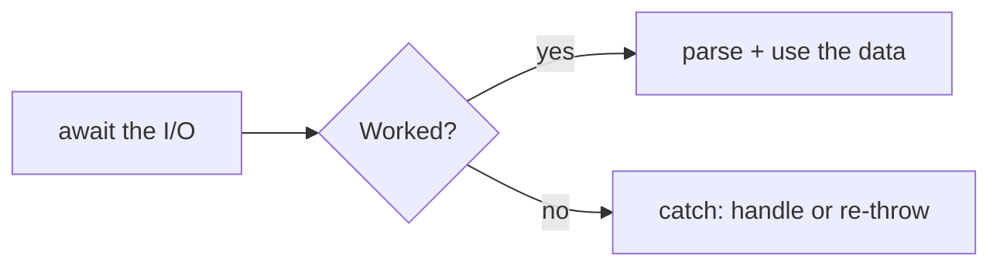

# Errors & I/O — When Things Go Wrong and Data Comes In

Two things every real program does: it touches the outside world (files, networks, user input), and the outside world lets it down. The file isn't there. The network times out. The JSON is malformed. A program that assumes everything works is a program that crashes in front of a user.

This phase is about handling failure on purpose, and about reading the outside world — **I/O** ("input/output"). The error-handling tools are the same everywhere; the I/O tools differ by *runtime* (browser vs. Node), so we'll cover both. The good news: once you've seen the shape, it's the same shape every time.

## try / catch / finally — handling the explosion

**What it actually is.** When JavaScript hits something it can't do — calling a method on `undefined`, parsing broken JSON — it **throws** an error: it stops the current code and looks for someone to catch it. If nobody catches it, the program (or that operation) crashes. `try/catch` is how you volunteer to catch it.

```javascript
try {
  const data = JSON.parse(text);
  console.log(data.name);
} catch (err) {
  console.log("Bad JSON:", err.message);
} finally {
  console.log("Done either way");
}
```
*What just happened:* The `try` block runs normally. If anything inside it throws, execution jumps straight to `catch` with the error object (`err`) — the rest of `try` is skipped. `finally` runs no matter what, success or failure. Use `finally` for cleanup you can't skip (closing a connection, hiding a spinner).

📝 **Terminology.** An *error* (or *exception*) is an object describing what went wrong — `err.message` is the human text, `err.name` is the type (e.g. `TypeError`). To *throw* is to raise one; to *catch* is to handle it.

## throw — raising your own errors

**What it actually is.** You don't only catch errors the language throws — you `throw` your own when your code hits a situation it can't honor. Throwing an `Error` is how you say "this is broken; whoever called me needs to deal with it."

```javascript runnable
function withdraw(balance, amount) {
  if (amount > balance) {
    throw new Error("Insufficient funds");
  }
  return balance - amount;
}

try {
  withdraw(100, 150);
} catch (err) {
  console.log(err.message);
}
```
```console
Insufficient funds
```
*What just happened:* `throw new Error(...)` immediately stopped `withdraw` and sent the error up to whoever called it. The caller's `try/catch` caught it. Throwing beats returning a magic value like `-1` or `null`, because an error can't be silently ignored — it forces a decision.

⚠️ **Gotcha: throw `Error` objects, not strings.** `throw "oops"` technically works, but a bare string has no stack trace, so you lose the line-number trail that tells you *where* it broke. Always `throw new Error("message")`.

## Errors in async code — the part that surprises people

Here's the trap. A rejected Promise is *not* caught by a plain `try/catch` placed around the call that returns it — because the call returns immediately, before the rejection happens. The error arrives later, on the queue.

**The fix is simple and it's the whole reason `async/await` is lovely:** when you `await` a Promise, a rejection is thrown *right there*, so an ordinary `try/catch` around the `await` catches it.

```javascript
async function loadUser(id) {
  try {
    const res = await fetch(`https://api.example.com/user/${id}`);
    if (!res.ok) {
      throw new Error(`Server returned ${res.status}`);
    }
    return await res.json();
  } catch (err) {
    console.log("Could not load user:", err.message);
    return null;
  }
}
```
*What just happened:* Wrapping the `await`s in `try/catch` catches both kinds of failure: a *network* failure (where `fetch`'s Promise rejects) and a *bad response* we `throw` ourselves. Note the `res.ok` check — that's a gotcha all its own, below.

⚠️ **Gotcha: `fetch` does not reject on HTTP errors.** A 404 or 500 is a *successful* network round-trip as far as `fetch` is concerned, so its Promise **resolves**, not rejects. It only rejects when the request can't complete at all (no network, DNS failure). You must check `res.ok` (or `res.status`) yourself and throw, as above. Skipping this is the single most common `fetch` mistake.

⚠️ **Gotcha: unhandled promise rejections.** If a Promise rejects and nothing catches it, the error doesn't vanish — it surfaces as a warning, and in modern Node it can **crash the process**:

```console
$ node app.js
UnhandledPromiseRejection: This error originated either by throwing
inside of an async function without a catch block...
node:internal/process/promises ... (Use `node --trace-warnings ...`)
```
*What just happened:* An async function rejected and no `try/catch` or `.catch()` was waiting. Every Promise you fire needs a home for its failure — either `await` it inside a `try/catch`, or attach a `.catch()`. A Promise with no error handler is a bug waiting for a bad day.

## I/O #1 — the network, in the browser: `fetch`

**What it actually is.** `fetch` is the browser's built-in way to make HTTP requests. It returns a Promise of a `Response`. Reading JSON is two steps, and each one can fail.

```javascript
async function getQuote() {
  const res = await fetch("https://api.example.com/quote");
  if (!res.ok) throw new Error(`HTTP ${res.status}`);
  const data = await res.json(); // parses the body as JSON
  return data;
}
```
*What just happened:* `res.json()` reads the response body and parses it as JSON — and it's *also* async (the body may still be streaming in), so it needs its own `await`. If the body isn't valid JSON, `res.json()` rejects, which your surrounding `try/catch` will catch.

> 💡 Same `fetch`, deeper dive: status codes, headers, request bodies, and what JSON actually is live in [HTTP and JSON API Basics](/guides/http-and-json-api-basics).

## I/O #2 — files, in Node: `fs`

**What it actually is.** The browser can't read your hard drive (good — imagine if web pages could). **Node**, which runs JavaScript outside the browser, can — through its built-in **`fs`** ("file system") module. The modern, Promise-based version lives at `node:fs/promises`, so you `await` it just like `fetch`.

```javascript
import { readFile } from "node:fs/promises";

async function loadConfig() {
  try {
    const text = await readFile("config.json", "utf8");
    return JSON.parse(text);
  } catch (err) {
    if (err.code === "ENOENT") {
      console.log("No config file; using defaults.");
      return {};
    }
    throw err; // some other problem — let it bubble up
  }
}
```
*What just happened:* `readFile(path, "utf8")` returns a Promise of the file's contents as a string (the `"utf8"` tells it to give you text, not raw bytes). `JSON.parse` turns that text into an object. The `catch` inspects `err.code`: `ENOENT` ("Error NO ENTry") means the file doesn't exist, which we handle gracefully — any *other* error we re-throw, because we don't actually know how to fix it.

📝 **Terminology.** `ENOENT` is a standard OS error code meaning "no such file or directory." Node surfaces it on `err.code`. Checking `err.code` (rather than the message text) is the reliable way to branch on *which* failure happened.

⚠️ **Gotcha: don't blindly `JSON.parse`.** `JSON.parse` throws a `SyntaxError` on malformed input — a stray trailing comma, an empty file, an HTML error page where you expected JSON. Always parse inside a `try/catch` so one bad file doesn't take down your whole program.

## The pattern that ties it together

Notice every example has the same skeleton, whether the data comes from a network or a disk:



*What this shows:* `await` the slow input, branch on success, and always have a `catch` that either recovers or deliberately passes the error up. You don't need to memorize APIs — you need this shape, and the discipline to never leave a failure path empty.

## Recap

1. **`try/catch/finally`** handles thrown errors; `finally` always runs (use it for cleanup).
2. **`throw new Error("...")`** raises your own errors — use `Error` objects, not strings, so you keep the stack trace.
3. In async code, **wrap `await` in `try/catch`** to catch rejected Promises; an **unhandled rejection** can crash Node.
4. **`fetch` doesn't reject on 404/500** — check `res.ok` and throw yourself; `res.json()` is async and can also fail.
5. I/O is runtime-specific: **`fetch`** for the network in the browser, **`node:fs/promises`** for files in Node — and **always guard `JSON.parse`**.

---

[← Phase 6: Async & the DOM](06-async-and-the-dom.md) · [Guide overview](_guide.md) · [Phase 8: The Ecosystem & Tooling →](08-ecosystem-and-tooling.md)
