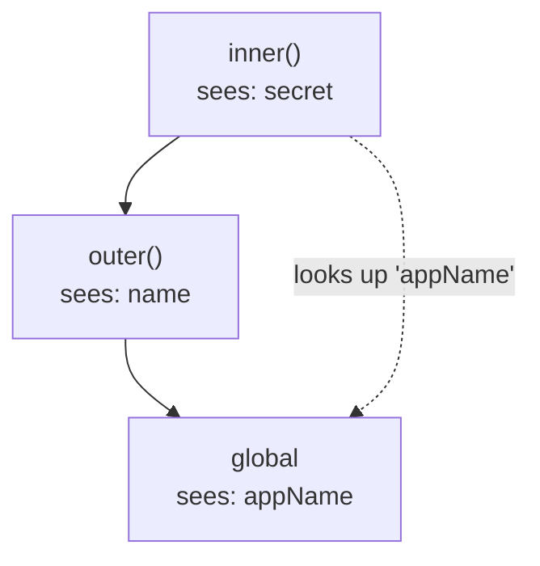

# Scope, Closures & Hoisting — How JavaScript Remembers

Phase 9 handed you a cheat-card line about hoisting and moved on. That was a survival tip. This phase is the real thing — the machinery underneath every variable you've ever written. Once you see it, three of JavaScript's most confusing behaviors stop being magic: why a loop variable inside `setTimeout` all shows the same number, why `let` and `var` behave differently in blocks, and the big one — **closures**, the feature that powers callbacks, event handlers, React hooks, and the module pattern.

The whole phase rests on one question: *when JavaScript sees a variable name, where does it go looking for the value?* Answer that precisely and everything else falls out of it.

## Scope and the scope chain — where names are looked up

**What it actually is.** **Scope** is the set of variables visible from a given spot in your code. Every function you write creates a new scope, nested inside the scope it was written in. When you use a variable, JavaScript looks in the current scope first; if it's not there, it looks in the scope *outside* that one, then the one outside *that*, all the way out to the global scope. That outward chain of lookups is the **scope chain**.

📝 **Lexical scope** — "lexical" means *where you wrote it*. A function's scope is decided by its physical position in the source code, not by where or how it's later called. JavaScript figures out the scope chain by reading your file, before anything runs.



*One idea:* a name lookup only ever travels *outward*, never inward. `inner` can reach into `outer` and the global scope, but nothing outside `inner` can see `inner`'s variables. Let's watch the chain resolve a name:

```javascript runnable
const appName = "Manual";          // global scope

function outer() {
  const name = "Ada";              // outer's scope
  function inner() {
    const secret = 42;             // inner's scope
    console.log(secret, name, appName); // found at 3 different levels
  }
  inner();
}
outer();
```
```console
42 Ada Manual
```
*What just happened:* Inside `inner`, JavaScript found `secret` right there in the local scope. It didn't find `name`, so it stepped out to `outer`'s scope — found it. It didn't find `appName` there either, so it stepped out again to the global scope — found it. Three names, resolved at three different links of the chain, all by walking outward.

⚠️ **Gotcha — lookups go out, not in.** If you tried to read `secret` from inside `outer` (but outside `inner`), you'd get a `ReferenceError`. A scope is a one-way mirror: the inside sees out, the outside can't see in. This is *why* you can have a `name` variable in ten different functions without them colliding — each lives in its own scope.

## `var` vs `let`/`const` — function scope vs block scope

Here's the first place the rules actually diverge, and it's the source of a famous bug. The difference is the *unit* of scope each keyword respects.

📝 **Block scope** — a "block" is any `{ ... }`: an `if`, a `for`, a bare pair of braces. `let` and `const` are confined to the block they're declared in. **Function scope** — `var` ignores blocks entirely; it's visible throughout the *entire function* it lives in, no matter how many braces it's nested inside.

```javascript runnable
function test() {
  if (true) {
    var leaks = "I'm everywhere in test()";
    let trapped = "I'm stuck in this if-block";
    console.log(trapped);          // fine — same block
  }
  console.log(leaks);              // fine — var ignores the block
  console.log(typeof trapped);    // "undefined" — let didn't escape
}
test();
```
```console
I'm stuck in this if-block
I'm everywhere in test()
undefined
```
*What just happened:* `var leaks` was declared inside the `if` block, but `var` doesn't care about blocks — it belongs to the whole function, so it's readable after the `if` closes. `let trapped` obeys the block: outside the `if`, it doesn't exist, so `typeof trapped` reports `"undefined"`. That leak is exactly why `var` causes trouble.

**The classic loop bug.** This is the one that's confused everyone. You loop, schedule some callbacks, and expect them to print `0, 1, 2`. With `var`, they all print `3`:

```javascript runnable
const withVar = [];
for (var i = 0; i < 3; i++) {
  withVar.push(() => i);           // capture i... but which i?
}
console.log(withVar.map((fn) => fn())); // [3, 3, 3]

const withLet = [];
for (let j = 0; j < 3; j++) {
  withLet.push(() => j);
}
console.log(withLet.map((fn) => fn())); // [0, 1, 2]
```
```console
[ 3, 3, 3 ]
[ 0, 1, 2 ]
```
*What just happened:* With `var i`, there is exactly **one** `i` for the whole loop — function-scoped, shared by all three callbacks. By the time they run, the loop has finished and that single `i` is `3`, so every callback reads `3`. With `let j`, JavaScript creates a **fresh `j` for each iteration** — three separate variables, each captured by its own callback, each holding the value it had that round. This is the headline reason to default to `let`/`const` and treat `var` as legacy.

💡 **Key insight.** `let`/`const` being block-scoped isn't just tidier — it makes loops with closures *do what you mean*. The per-iteration binding is the whole fix. Reach for `var` essentially never in new code.

## Hoisting, properly — declarations come first

Before JavaScript runs a single line of a scope, it does a quick first pass: it finds all the declarations and sets them up. *That* is **hoisting** — declarations are processed before execution begins, as if they were lifted to the top of their scope. But "hoisting" doesn't mean every keyword behaves the same. There are three distinct behaviors.

**Function declarations are fully hoisted.** The whole function — name and body — is available before its line. That's why you can call it above where it's written.

**`var` is hoisted but left undefined.** The *name* is set up early (so using it isn't a `ReferenceError`), but its *value* isn't assigned until the line runs. Read it early and you get `undefined`.

**`let` and `const` are hoisted into the Temporal Dead Zone.** The name is reserved, but touching it before its declaration line throws.

📝 **Temporal Dead Zone (TDZ)** — the stretch from the start of a scope until a `let`/`const` declaration actually runs. The variable exists (the name is reserved) but is off-limits; reading it throws `ReferenceError: Cannot access 'x' before initialization`. The TDZ is JavaScript protecting you from using a value that isn't ready yet.

```javascript runnable
console.log(addUp(2, 3));    // 5 — function declaration is fully hoisted
console.log(maybe);          // undefined — var name exists, value doesn't yet
var maybe = "now I have a value";

function addUp(a, b) {
  return a + b;
}

try {
  console.log(strict);       // throws — strict is in the TDZ
  let strict = "too late";
} catch (e) {
  console.log("TDZ error:", e.message);
}
```
```console
5
undefined
TDZ error: Cannot access 'strict' before initialization
```
*What just happened:* `addUp` ran before its definition because function declarations are hoisted whole. `maybe` printed `undefined` — `var` reserved the name during hoisting but hadn't reached the assignment yet. And `strict` threw: a `let` is hoisted *enough* to know it exists, but accessing it before its line lands you in the TDZ. The clean habit that sidesteps all of this: **declare before you use, and prefer `const`.**

⚠️ **Gotcha — the TDZ is a feature, not a bug.** It feels hostile the first time it bites, but it's catching a real mistake: you tried to use a value that the code hasn't computed yet. With `var`, that same mistake silently gives you `undefined` and the bug surfaces somewhere far away. The TDZ fails loud and early, right at the source.

## Closures — a function remembers where it was born

This is the headline. A **closure** is what you get when a function outlives the scope it was created in, and *keeps access to that scope's variables anyway*. The function carries its birthplace with it.

📝 **Closure** — a function bundled together with the variables from the scope where it was *defined*. When the function runs later — even long after its outer function has returned — it can still read and update those captured variables. It remembers where it was born, not where it's called.

This sounds abstract until you build one. The counter factory is the canonical example:

```javascript runnable
function makeCounter() {
  let count = 0;                   // lives in makeCounter's scope
  return function () {
    count += 1;                    // reaches outward to count
    return count;
  };
}

const counter = makeCounter();     // makeCounter has now RETURNED
console.log(counter());            // 1
console.log(counter());            // 2
console.log(counter());            // 3

const fresh = makeCounter();       // a brand-new, independent count
console.log(fresh());              // 1
```
```console
1
2
3
1
```
*What just happened:* `makeCounter` ran, created `count`, and returned the inner function — then `makeCounter` was *done*. Normally `count` would vanish when its function returned. But the returned function still references `count`, so JavaScript keeps that variable alive for as long as the function exists. Each call reaches outward to the *same* `count` and bumps it. And `fresh` is a separate call to `makeCounter`, so it gets its own `count` starting at `1` — closures don't share state across separate creations.

💡 **The mental model.** Don't think "the function copied `count`." Think: the function holds a live link back to the exact scope it was born in. As long as the function is reachable, that scope stays alive. A closure is a function plus a backpack of the variables it grew up with.

**A real use — true data privacy.** Those captured variables aren't reachable from outside the closure. There's no `counter.count` to poke at — the only way to touch `count` is through the function. That gives you genuinely private state, which JavaScript otherwise lacks:

```javascript runnable
function once(fn) {
  let called = false;              // private — nobody outside can flip this
  let result;
  return function (...args) {
    if (!called) {
      called = true;
      result = fn(...args);
    }
    return result;
  };
}

const setup = once(() => {
  console.log("running expensive setup...");
  return "ready";
});

console.log(setup());   // runs the body
console.log(setup());   // skips it — returns the cached result
console.log(setup());   // still cached
```
```console
running expensive setup...
ready
ready
ready
```
*What just happened:* `once` returns a wrapper that closes over the private flag `called` and the cached `result`. The first call flips `called` and runs the real function; every call after that sees `called === true` and returns the stored result without re-running. Nothing outside can reset `called` — it's sealed inside the closure. This exact pattern guards one-time initialization, single payment submissions, and "load it once" caches everywhere.

## Why it matters — closures are everywhere

You've been using closures since Phase 4 without naming them. Now you can see them:

- **Callbacks and event handlers.** When you write `button.addEventListener("click", () => doThing(config))`, that handler closes over `config`. It still works whenever the click fires — minutes later — because the closure kept `config` alive.
- **The module pattern.** Wrapping code in a function and returning only what you want public is the closure-powered way to get private variables. It's how libraries hid internals before `import`/`export`.
- **React hooks.** `useState` and friends lean entirely on closures — each render's functions close over that render's values. (The loop-variable bug from earlier is the #1 source of "stale closure" confusion in React.)
- **The cost.** A closure keeps its captured variables alive as long as the function lives. Usually that's exactly what you want — but a long-lived closure (an event handler you never remove) holds onto everything it captured, which can quietly keep large objects in memory. Remove handlers you no longer need.

The thread tying the whole phase together: scope is decided by *where you write code*, hoisting decides *what's ready when execution starts*, and closures are scope *outliving* the function that created it. Same machine, three views.

## Recap

1. **Scope** is the set of visible variables; a name lookup walks the **scope chain** *outward* — local, then enclosing, then global — and never inward.
2. **Lexical scope** means scope is fixed by *where code is written*, not where it's called — JavaScript wires up the chain by reading the source.
3. **`var` is function-scoped** (it leaks out of blocks); **`let`/`const` are block-scoped**. The per-iteration binding of `let` is what fixes the classic `[3, 3, 3]` loop-in-callback bug.
4. **Hoisting** processes declarations first: functions are fully hoisted, `var` is hoisted-but-`undefined`, and `let`/`const` sit in the **Temporal Dead Zone** until their line runs.
5. A **closure** is a function plus the variables from its birthplace; it keeps those variables alive after the outer function returns, giving you private state and persistent counters.
6. Closures power **callbacks, event handlers, the module pattern, and React hooks** — but a long-lived closure holds its captured variables in memory, so release handlers you no longer need.

## Quick check

Test yourself on the one idea that ties this phase together — where a function looks for its variables:

```quiz
[
  {
    "q": "Why do the `var` callbacks print `[3, 3, 3]` while the `let` callbacks print `[0, 1, 2]`?",
    "choices": [
      "`var` creates one shared, function-scoped `i` for the whole loop; `let` creates a fresh, block-scoped binding each iteration",
      "`let` callbacks run before the loop finishes, but `var` callbacks run after",
      "`var` rounds its values up to the final count, while `let` preserves them",
      "Arrow functions only capture `let` variables, never `var` variables"
    ],
    "answer": 0,
    "explain": "There's exactly one function-scoped `i` with `var`, shared by all three callbacks — by the time they run, it's 3. `let` gives each iteration its own binding, so each callback captures the value it had that round."
  },
  {
    "q": "What is the Temporal Dead Zone?",
    "choices": [
      "The window from the start of a scope until a `let`/`const` line runs, during which accessing the variable throws",
      "A performance penalty for declaring too many variables in one function",
      "The time it takes a closure to release its captured variables from memory",
      "A region of code where `var` declarations are silently ignored"
    ],
    "answer": 0,
    "explain": "`let`/`const` are hoisted enough that the name is reserved, but reading them before their declaration line throws `ReferenceError: Cannot access 'x' before initialization`. That stretch is the TDZ — it fails loud instead of giving you a silent `undefined`."
  },
  {
    "q": "After `const c = makeCounter()` returns, why can the returned function still increment `count`?",
    "choices": [
      "The returned function is a closure — it holds a live link to the scope where it was defined, keeping `count` alive",
      "`count` was copied into the returned function as a private constant",
      "JavaScript re-runs `makeCounter` on every call to rebuild `count`",
      "`count` was secretly promoted to a global variable when makeCounter returned"
    ],
    "answer": 0,
    "explain": "A closure keeps the variables from its birthplace alive as long as the function exists. The returned function references `count`, so that scope isn't discarded — each call reaches the same live `count` and bumps it. A separate `makeCounter()` call gets its own independent `count`."
  }
]
```

---

[← Phase 9: Idioms & Common Gotchas](09-idioms-and-gotchas.md) · [Guide overview](_guide.md) · [Phase 11: this, Prototypes & the Object Model →](11-this-prototypes-and-objects.md)