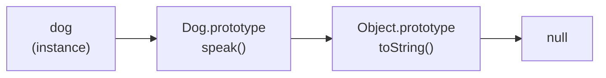

# this, Prototypes & the Object Model — How Objects Really Work

Back in [Phase 9](09-idioms-and-gotchas.md) you got a one-line warning about `this`: use arrow functions in callbacks and the weirdness mostly goes away. That advice is good, but it's a bandage over a deep idea. This phase peels the bandage off and shows you the machinery underneath — `this`, prototypes, and what a `class` *actually* is.

Here's the mental model to hold onto before we start: **JavaScript objects don't have private blueprints the way classes do in other languages. Every object is wired to *another* object it falls back to.** That single linked-list-of-objects idea explains inheritance, methods, and `class` all at once. And `this`? It's not part of the object at all — it's decided fresh every time a function runs, based purely on *how* you called it. Get those two ideas and the rest of the language stops surprising you.

## `this` is set by HOW you call, not where you wrote it

This is the single most misunderstood word in JavaScript. In Java or Python, `this`/`self` means "the object this method belongs to," fixed forever. In JavaScript, `this` is a *parameter that gets filled in at call time*. The same function body can see four different `this` values depending on how it's invoked.

📝 **`this`** — an implicit argument every regular function receives. Its value is not decided when you write the function; it's decided by the **call site** — the exact expression you used to call it.

There are four rules, and they're checked in this order:

1. **`new` binding** — called with `new`? `this` is the brand-new object being built.
2. **Explicit binding** — called via `call`, `apply`, or `bind`? `this` is whatever you passed.
3. **Implicit binding** — called as `obj.method()`? `this` is `obj` (the thing left of the dot).
4. **Default binding** — none of the above? `this` is `undefined` in strict mode (modules and classes are always strict), or the global object in sloppy mode.

Let's prove it. One function, called four ways, four answers:

```javascript runnable
"use strict";

function whoAmI() {
  return this;
}

const obj = { name: "obj", whoAmI };

console.log(obj.whoAmI().name);        // implicit: left of the dot
console.log(whoAmI());                 // default: nothing left of a dot
console.log(whoAmI.call({ name: "explicit" }).name); // explicit
console.log(new whoAmI());             // new: a fresh object
```
```console
obj
undefined
explicit
whoAmI {}
```
*What just happened:* The function never changed — only the call site did. `obj.whoAmI()` had `obj` to the left of the dot, so `this` was `obj`. The bare `whoAmI()` had nothing to the left, so in strict mode `this` was `undefined`. `whoAmI.call({...})` forced `this` to the object we handed it. And `new whoAmI()` ignored everything else and made `this` a fresh empty object. Same body, four `this` values — decided entirely by *how* it was called.

⚠️ **Gotcha — pulling a method off its object loses `this`.** `const f = obj.whoAmI; f();` does *not* keep `obj`. The dot is gone at the call site, so you fall through to default binding and `this` is `undefined`. This is exactly what bites you when you pass `obj.method` as a callback — the receiver gets stripped off. Remember it as: **`this` follows the dot, and the dot has to be there when you call.**

## `call`, `apply`, and `bind` — taking control of `this`

Since `this` is decided by the call site, JavaScript gives you three tools to *set it yourself*. They all answer "run this function, but with `this` set to an object I choose."

- **`fn.call(thisArg, a, b)`** — call `fn` right now, with `this = thisArg`, passing arguments one by one.
- **`fn.apply(thisArg, [a, b])`** — identical, except arguments come as one **array**. (Mnemonic: **a**pply takes an **a**rray.)
- **`fn.bind(thisArg)`** — does *not* call anything. It returns a **new function** with `this` permanently locked to `thisArg`. You call that new function later.

```javascript runnable
function describe(greeting, punct) {
  return `${greeting}, I am ${this.name}${punct}`;
}

const ada = { name: "Ada" };

console.log(describe.call(ada, "Hi", "!"));      // args one by one
console.log(describe.apply(ada, ["Hey", "."]));  // args as an array

const greetAda = describe.bind(ada);             // returns a new function
console.log(greetAda("Hello", "?"));             // this is locked to ada
```
```console
Hi, I am Ada!
Hey, I am Ada.
Hello, I am Ada?
```
*What just happened:* `call` and `apply` both ran `describe` immediately with `this` forced to `ada` — the only difference was how the arguments were packaged (loose vs. an array). `bind` was different in kind: it didn't run anything, it manufactured `greetAda`, a new function whose `this` is forever `ada`. We called `greetAda` later and it still remembered. `bind` is how you hand a method to a callback *without* losing its receiver: `setTimeout(obj.method.bind(obj), 100)`.

💡 **Key point.** `call` and `apply` are "invoke now with this `this`"; the only difference is argument packaging. `bind` is "make me a pre-wired copy for later." Reach for `bind` when something else will do the calling (a timer, an event handler) and you need `this` to survive the trip.

## Arrow functions have no `this` of their own

Arrow functions break all four rules above — on purpose. An arrow function **doesn't get its own `this`**. When you write `this` inside an arrow, it isn't filled in at call time; it's read from the surrounding scope where the arrow was *defined*, exactly like any other variable. This is called **lexical `this`**.

That's a feature when an arrow is used as a callback, and a bug when it's used as a method.

```javascript runnable
const timer = {
  seconds: 0,
  startBroken() {
    // regular function callback: gets its OWN this (not `timer`)
    [1, 2].forEach(function () { this.seconds++; });
  },
  startFixed() {
    // arrow callback: borrows startFixed's this, which IS `timer`
    [1, 2].forEach(() => { this.seconds++; });
  },
};

try { timer.startBroken(); } catch (e) { console.log("broken throws:", e.constructor.name); }
timer.startFixed();
console.log("seconds:", timer.seconds);
```
```console
broken throws: TypeError
seconds: 2
```
*What just happened:* In `startBroken`, the plain `function` callback followed the default rule — its `this` was `undefined` (strict mode inside a method), so `this.seconds++` threw a `TypeError`. In `startFixed`, the arrow had no `this` of its own, so it reached outward to `startFixed`'s `this`, which implicit binding had set to `timer`. The arrow "captured" the right receiver automatically. **This is why arrows fixed the callback problem you saw in Phase 9.**

⚠️ **Gotcha — never use an arrow as an object method.** `const obj = { name: "x", hi: () => this.name }` is broken. The arrow captures `this` from wherever `obj` was defined (the module top level, where `this` is `undefined`), *not* from `obj`. There's no dot magic for arrows. Methods that need `this` to mean "my object" must be regular functions (or the `method() {}` shorthand); save arrows for callbacks.

## The prototype chain — how property lookup really works

Now the other half. Every JavaScript object has a hidden internal link to *another* object, called its **prototype**. When you read a property and the object doesn't have it, JavaScript doesn't give up — it follows that link and looks on the prototype. If it's not there either, it follows *that* object's link, and so on, until it finds the property or hits `null`. That chain of fallback objects is the **prototype chain**.

📝 **Prototype** — the object a given object falls back to for properties it doesn't have itself. The hidden link is reachable (for inspection) via `Object.getPrototypeOf(obj)` or the legacy `obj.__proto__`.

This is the entire inheritance model of the language. There are no classes underneath — there's just objects pointing at objects.



Here the lookup walks left to right. Watch a method get found two links up the chain, even though the instance itself doesn't have it:

```javascript runnable
function Dog(name) {
  this.name = name;                      // own property, on the instance
}
Dog.prototype.speak = function () {      // shared method, on the prototype
  return `${this.name} says woof`;
};

const d = new Dog("Rex");

console.log(d.speak());                                   // found on Dog.prototype
console.log(d.hasOwnProperty("name"));                   // true — own property
console.log(d.hasOwnProperty("speak"));                  // false — it's inherited
console.log(Object.getPrototypeOf(d) === Dog.prototype); // true — the hidden link
```
```console
Rex says woof
true
false
true
```
*What just happened:* `d` itself only had one property: `name`, set by `this.name = name`. When we called `d.speak()`, JavaScript looked on `d`, didn't find `speak`, followed the hidden link to `Dog.prototype`, and found it there — then ran it with `this = d` (implicit binding, because of the dot). That's why `hasOwnProperty("speak")` is `false`: the method lives on the prototype, *shared* by every `Dog`, not copied onto each instance. One function in memory, every dog uses it.

💡 **Key point.** Own properties (set with `this.x =`) live on the instance; methods live on the prototype, shared by all instances. Property *writes* always go on the instance, but property *reads* walk the chain. This is what makes prototypes memory-efficient: a thousand dogs share one `speak`.

## Classes are sugar over prototypes

In Phase 7 you wrote `class`. Here's the reveal: **`class` does not add a new object model.** It's a cleaner, less error-prone *spelling* of the exact prototype wiring you just saw. A class method lands on `.prototype`; `extends` links one prototype to another; `super` walks up the chain. Same machinery, nicer syntax.

```javascript runnable
class Animal {
  constructor(name) { this.name = name; }
  speak() { return `${this.name} makes a sound`; }
}

class Dog extends Animal {
  speak() { return `${super.speak()} (woof)`; } // super = up the chain
}

const d = new Dog("Rex");
console.log(d.speak());

// Proof it's the same prototype mechanism from the previous section:
console.log(d.hasOwnProperty("speak"));                          // false — on prototype
console.log(Object.getPrototypeOf(d) === Dog.prototype);         // true
console.log(typeof Dog.prototype.speak);                         // "function"
console.log(Object.getPrototypeOf(Dog.prototype) === Animal.prototype); // extends = linked prototypes
```
```console
Rex makes a sound (woof)
false
true
function
Dog.prototype.speak === a function on the chain
```
*What just happened:* `Dog`'s `speak` lives on `Dog.prototype` (not on the instance — `hasOwnProperty` is `false`), identical to the hand-rolled version in the last section. `extends` set `Dog.prototype`'s own prototype to `Animal.prototype`, so `super.speak()` reached one link up and ran `Animal`'s method. The class syntax wrote all the `Dog.prototype.x = ...` plumbing for you, plus guardrails (you can't call a class without `new`, methods are non-enumerable). But strip the syntax away and it's the same chain of objects.

⚠️ **Gotcha — `class` is not a new kind of thing.** Don't think "objects vs. classes" like in Java. A JavaScript `class` is a function whose `.prototype` is pre-loaded with your methods. Knowing this saves you when you debug: `instanceof` is really "is this prototype anywhere in your chain?", and `Object.getPrototypeOf` will always show you the truth, no matter how the object was created.

## Recap

1. **`this` is decided by the call site, not the definition.** Four rules, in priority order: `new` → explicit (`call`/`apply`/`bind`) → implicit (`obj.method()`) → default (`undefined` in strict mode).
2. **The dot must be present at the call** for implicit binding. Pulling a method off its object (or passing it as a callback) strips the receiver and falls through to default.
3. **`call` and `apply` invoke now** with a `this` you choose (loose args vs. an array); **`bind` returns a new function** with `this` locked in for later.
4. **Arrow functions have no own `this`** — they capture it lexically from where they're defined. Perfect for callbacks, wrong for object methods.
5. **Every object links to a prototype.** Property reads walk the **prototype chain** until found or `null`; writes go on the instance. Shared methods live on the prototype.
6. **Classes are sugar over prototypes.** Methods go on `.prototype`, `extends` links prototypes, `super` walks up. Same object model, cleaner spelling.

That's the deep end of the object model. Next we look at **iterators, generators, and Symbols** — the protocols that let your own objects plug into `for...of`, spread, and destructuring.

## Quick check

Test yourself on the two ideas that drive this phase — call-site `this` and the prototype chain:

```quiz
[
  {
    "q": "Given `const obj = { n: 1, get() { return this.n; } }`, what does `const f = obj.get; f();` return in strict mode?",
    "choices": [
      "It throws a TypeError — `this` is undefined because the dot is gone at the call site",
      "1 — `this` is permanently bound to obj when the method is defined",
      "undefined — but no error, because `this` quietly becomes the global object",
      "1 — pulling a method off an object keeps its receiver"
    ],
    "answer": 0,
    "explain": "`this` follows the dot, and the dot must be present at the call. `f()` has nothing to the left, so default binding makes `this` undefined in strict mode, and `this.n` throws a TypeError. This is exactly why callbacks lose their receiver."
  },
  {
    "q": "What's the difference between `fn.apply(obj, [1, 2])` and `fn.bind(obj)`?",
    "choices": [
      "`apply` calls fn immediately with `this` = obj; `bind` returns a new function with `this` locked to obj for later",
      "They're identical; `bind` is just an older alias for `apply`",
      "`apply` takes arguments one by one; `bind` takes them as an array",
      "`bind` calls fn immediately; `apply` returns a new function"
    ],
    "answer": 0,
    "explain": "`apply` (like `call`) invokes the function right now with a chosen `this` — it just takes its arguments as an array. `bind` doesn't invoke anything; it manufactures a new function whose `this` is permanently fixed, to be called later."
  },
  {
    "q": "For `const d = new Dog('Rex')` where `speak` is defined as a class method, what does `d.hasOwnProperty('speak')` return, and why?",
    "choices": [
      "false — class methods live on Dog.prototype, so `speak` is inherited via the prototype chain, not an own property of d",
      "true — `new` copies every class method onto the instance",
      "true — class methods are always own properties, unlike old prototype methods",
      "It throws, because hasOwnProperty doesn't work on class instances"
    ],
    "answer": 0,
    "explain": "Classes are sugar over prototypes: `speak` lives on `Dog.prototype`, shared by all instances. `d` itself only owns properties set in the constructor (like `name`). Reading `d.speak` walks the chain to the prototype, so `hasOwnProperty('speak')` is false."
  }
]
```

---

[← Phase 10: Scope, Closures & Hoisting](10-scope-and-closures.md) · [Guide overview](_guide.md) · [Phase 12: Iterators, Generators & Symbols →](12-iterators-generators-symbols.md)
