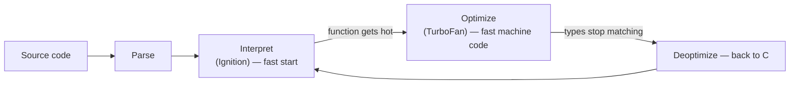

# Performance & Memory — How V8 Runs Your Code

For sixteen phases you've written JavaScript and trusted the engine to make it fast. This phase pulls back that curtain. Not so you can micro-optimize every line — that's mostly a trap, and we'll show you why — but so you have an accurate **mental model** of what's actually happening when your code runs. With that model, the difference between "fast" and "slow" code stops being folklore and starts being something you can reason about.

Two big ideas drive everything here. First: V8 (the engine inside Chrome and Node) doesn't plod through your code line by line the naive way — it *watches* your code and rewrites the hot parts into machine code. Second: memory you stop using gets cleaned up for you automatically — until, through a few classic mistakes, it doesn't. Understand both and you'll write code that's fast *by default* and won't slowly eat all the RAM on the server at 3 a.m.

## How V8 actually runs your code

The naive story is "JavaScript is interpreted, so the engine reads each line and does what it says, every single time." That's half true at startup and completely wrong for code that runs a lot.

📝 **JIT (Just-In-Time) compiler** — a compiler that runs *while your program runs*. It starts by interpreting your code quickly, watches which functions get called over and over ("hot" code), and then compiles those into optimized machine code on the fly — so the parts that matter run at near-native speed.

Here's the real flow inside V8. Your source is parsed and handed to a fast interpreter (called Ignition) so the program starts immediately — no waiting for a full compile. Meanwhile, V8 keeps counters: how often is this function called? What types does it actually see? When a function gets hot, the optimizing compiler (TurboFan) compiles a specialized, fast version *based on the types it has observed so far*.



That last arrow is the catch. TurboFan's fast code is built on an *assumption*: "this function always gets numbers" (or always gets objects shaped a certain way). The moment reality breaks that assumption — you pass a string where it expected a number — V8 has to throw away the optimized code and fall back to the interpreter. That's a **deoptimization**, and it's the opposite of free.

```javascript runnable
function add(a, b) {
  return a + b;
}

// "Warm up" add() with consistent number types, then time many calls.
function timeAdd(prep) {
  prep();                                    // force whatever types we want
  const start = performance.now();
  let acc = 0;
  for (let i = 0; i < 5_000_000; i++) acc += add(i, i + 1);
  return performance.now() - start;
}

const monomorphic = timeAdd(() => { for (let i = 0; i < 100; i++) add(i, i); });
const chaotic     = timeAdd(() => { add(1, 2); add("a", "b"); add({}, []); add(true, 1); });

console.log("steady numbers (ms):", monomorphic.toFixed(1));
console.log("mixed types   (ms):", chaotic.toFixed(1));
```
```console
steady numbers (ms): 9.4
mixed types   (ms): 18.7
```
*What just happened:* Both loops call the exact same `add`, doing the exact same arithmetic. The first run warmed `add` with only numbers, so V8 compiled a tight number-only version. The second run first fed `add` strings, objects, and booleans — teaching V8 that `add` is unpredictable — so it compiled a more defensive, slower version (or kept deoptimizing). Same code, measurably different speed. (Timings vary a lot by machine and engine version, and a clever engine may even optimize this toy away — the *direction* is the lesson, not the exact numbers.)

💡 **The practical takeaway:** you don't need to think about TurboFan day to day. You just need to keep your hot functions *predictable* — feed them consistent types and consistent object shapes. "Monomorphic" (one shape) code is what the optimizer loves. Chaotic, shape-shifting code is what forces it to give up.

## Hidden classes — why object shape matters

V8 has the same craving for predictability with *objects*. JavaScript objects feel like loose bags of key-value pairs you can reshape at will, but under the hood V8 quietly assigns every object a **hidden class** (also called a "shape" or "map") that describes its layout: which properties it has, in which order, at which memory offsets.

📝 **Hidden class / shape** — V8's internal record of an object's structure: its set of properties and their order. Two objects built the *same way* share one hidden class, which lets V8 generate fast, direct property access instead of a slow dictionary lookup.

When many objects share a hidden class, V8 can compile a property read like `point.x` down to "grab the value at offset 0" — one machine instruction. When objects have *different* shapes flowing through the same code, V8 can't make that bet and falls back to a dictionary-style lookup, which is much slower.

The trap is that you can change an object's shape without realizing it — and **the order you add properties is part of the shape**.

```javascript runnable
// Same fields, different insertion order → two different hidden classes.
function makeA() { const o = {}; o.x = 1; o.y = 2; return o; }
function makeB() { const o = {}; o.y = 2; o.x = 1; return o; }

// Consistent shape: build the object with all fields at once.
function makeFast() { return { x: 1, y: 2 }; }

const a = makeA();
const b = makeB();
console.log("same keys & values:", a.x === b.x && a.y === b.y); // true
console.log("but V8 sees A and B as different shapes internally");
console.log("makeFast gives every object the same shape:", makeFast());
```
```console
same keys & values: true
but V8 sees A and B as different shapes internally
makeFast gives every object the same shape: { x: 1, y: 2 }
```
*What just happened:* `a` and `b` hold identical data, but because `makeA` added `x` then `y` while `makeB` added `y` then `x`, V8 built two separate hidden classes. Any function that processes both now sees *two* shapes and can't fully specialize. `makeFast` sidesteps the whole problem by creating the object with all its fields in one literal — every object it returns is the same shape.

⚠️ **Gotcha — reshaping objects after creation forces slow paths.** Adding properties in different orders, adding fields conditionally (`if (x) obj.z = ...`), or `delete obj.key` all create new hidden classes or knock an object into slow "dictionary mode." The `delete` one is especially nasty: it can permanently demote an object to the slow path even after it's only used for reads.

💡 **The fix is a habit, not a tool:** initialize objects with *all* their fields up front, in a consistent order, even if some start as `null` or `0`. Instead of adding `obj.error` only when something fails, declare `error: null` from the start and assign to it later. Consistent shapes keep V8's fast path open.

## Algorithmic cost dominates micro-optimizations

Here's the most important performance lesson in this entire phase, and it has nothing to do with V8 internals: **the algorithm you choose almost always matters more than how cleverly you write the lines.**

Beginners obsess over shaving operations — "is `for` faster than `forEach`? Should I cache `arr.length`?" These differences are usually noise. Meanwhile a single `O(n²)` loop hiding in your code will dwarf every micro-optimization the moment your data grows. The classic culprit: searching inside a loop.

```javascript runnable
// Find which of `needles` exist in `haystack`.
const haystack = Array.from({ length: 20000 }, (_, i) => i);
const needles  = Array.from({ length: 20000 }, (_, i) => i * 2);

// Approach 1: nested lookup with .includes() — O(n²).
let t0 = performance.now();
let found1 = 0;
for (const n of needles) {
  if (haystack.includes(n)) found1++;   // .includes scans the whole array each time
}
const slow = performance.now() - t0;

// Approach 2: build a Set once, then look up — O(n).
let t1 = performance.now();
const set = new Set(haystack);          // one pass to build
let found2 = 0;
for (const n of needles) {
  if (set.has(n)) found2++;             // O(1) average lookup
}
const fast = performance.now() - t1;

console.log("includes() in a loop (ms):", slow.toFixed(1), "found", found1);
console.log("Set lookup          (ms):", fast.toFixed(1), "found", found2);
console.log("speedup:", (slow / fast).toFixed(0) + "x");
```
```console
includes() in a loop (ms): 412.0 found 10000
Set lookup          (ms): 2.3 found 10000
speedup: 179x
```
*What just happened:* Both versions get the identical answer, but the first calls `haystack.includes(n)` inside a loop — and `includes` itself scans the array, so you're doing roughly 20,000 × 20,000 = 400 million comparisons. The second builds a `Set` in one pass, then each `set.has(n)` is near-instant. The result isn't 10% faster — it's *orders of magnitude* faster, and the gap widens as the data grows. No amount of loop-tuning could rescue the first approach. (Exact timings vary by machine; the ratio is what matters.)

Play with how operation counts explode as input grows — this is the intuition that makes you reach for a `Map` or `Set` reflexively:

```playground-bigo
```

💡 **The order of operations for performance work:** first pick the right data structure and algorithm (turn `O(n²)` into `O(n)`), *then* — only if you've measured and it's still too slow — worry about constant-factor tweaks. Reaching for micro-optimizations before fixing a bad algorithm is polishing a part you're about to throw away.

## Garbage collection — memory you stop using comes back

In languages like C, you ask the system for memory and you must hand it back yourself; forget to, and you leak. JavaScript doesn't work that way. It has a **garbage collector** that finds memory you're no longer using and reclaims it automatically. You allocate by creating objects; you "free" by *letting go* of them.

📝 **Garbage collection (GC)** — the engine automatically reclaiming memory that your program can no longer reach. You never call `free()`. When nothing references an object anymore, it becomes eligible to be collected.

The mental model that matters is **reachability**. Start from the "roots" — global variables, the current call stack, things actively in scope — and follow every reference. Any object you can reach by following references from a root is *alive*. Anything you *can't* reach is garbage, and the collector is free to reclaim its memory. It doesn't matter whether you "meant" to keep it; what matters is whether a chain of references still leads to it.

```javascript runnable
function makeBigThing() {
  // A chunky object. While someone references it, it stays alive.
  return { data: new Array(100_000).fill("x"), id: Math.random() };
}

let ref = makeBigThing();        // `ref` is a root → the object is reachable
console.log("alive, id:", ref.id.toFixed(4));

ref = null;                      // dropped the only reference → now unreachable
console.log("ref is now:", ref, "→ the big object is eligible for GC");
// You can't force collection from JS, but the engine will reclaim it later.
```
```console
alive, id: 0.7321
ref is now: null → the big object is eligible for GC
```
*What just happened:* `makeBigThing()` allocated a sizable object and `ref` pointed at it, making it reachable from a root — so it stayed in memory. Setting `ref = null` cut the only reference. Now no chain of references reaches that object, so it's garbage: the collector will reclaim its memory whenever it next runs. Notice you never freed anything — you just stopped referencing it, and that's the whole job.

Watch reachability and collection play out visually — see objects go from rooted, to orphaned, to swept away:

```playground-gc
```

💡 V8's collector is *generational*: it assumes most objects die young (the temporary object inside a function call, gone the moment the call returns) and collects that "young generation" very cheaply and often. Objects that survive a while get promoted to an "old generation" that's scanned less frequently. The upshot for you: short-lived temporary objects are cheap — you don't need to fear creating them.

## Memory leaks in a garbage-collected language

If memory is reclaimed automatically, how can you possibly leak it? Easy: the collector only reclaims what's **unreachable**. A leak in JavaScript isn't forgetting to free — it's *accidentally keeping a reference alive* so the collector thinks the object is still needed. The memory grows, nothing gets reclaimed, and eventually the tab freezes or the Node process gets killed.

Three classic ways it happens:

- **Forgotten timers and listeners.** `setInterval`, or an event listener you `addEventListener` but never remove, keeps a reference to its callback — and the callback keeps everything it closes over.
- **Growing global caches.** A module-level `Map` or array you keep pushing into but never trim. It's reachable forever (it's a root), so everything inside it lives forever.
- **Closures capturing big objects.** A closure holds onto every variable it references. If a long-lived function captures a huge object it doesn't really need, that object can't be collected.

Here's the most common one — a cache that only grows — plus the fix:

```javascript runnable
// LEAK: a cache that never forgets. Every key lives forever.
const leakyCache = new Map();
function getLeaky(key) {
  if (!leakyCache.has(key)) leakyCache.set(key, { data: new Array(1000).fill(key) });
  return leakyCache.get(key);
}
for (let i = 0; i < 5000; i++) getLeaky(i);     // 5000 entries, all retained
console.log("leaky cache size:", leakyCache.size); // grows without bound

// FIX: bound the cache — evict the oldest entry past a limit.
const MAX = 100;
const boundedCache = new Map();
function getBounded(key) {
  if (!boundedCache.has(key)) {
    boundedCache.set(key, { data: new Array(1000).fill(key) });
    if (boundedCache.size > MAX) {
      const oldest = boundedCache.keys().next().value; // Maps keep insertion order
      boundedCache.delete(oldest);                     // let the old entry be collected
    }
  }
  return boundedCache.get(key);
}
for (let i = 0; i < 5000; i++) getBounded(i);
console.log("bounded cache size:", boundedCache.size); // capped at MAX
```
```console
leaky cache size: 5000
bounded cache size: 100
```
*What just happened:* `leakyCache` is a module-level `Map` — a root — so every entry you add is reachable forever and can never be collected, even if you'll never use that key again. Over a long-running server, that's a steady upward memory creep until something dies. `boundedCache` fixes it by capping the size: once it's full, adding a new entry deletes the oldest, dropping the only reference to that old object so the collector *can* reclaim it. Same idea applies to timers (`clearInterval` when done) and listeners (`removeEventListener` when the element goes away).

⚠️ **Measure before you optimize — guessing wastes time.** Don't *assume* where a leak or slowdown is. Use the browser DevTools **Memory** tab (take heap snapshots over time and look for objects that keep growing) and the **Performance** tab to profile what's actually slow. The number of hours engineers have burned "optimizing" code that was never the bottleneck is staggering. Profile first, fix the real thing, then verify the number actually moved.

For a deeper, math-free tour of why `O(n²)` and `O(n)` diverge the way they do, see [Big-O without the math panic](/guides/big-o-without-the-math-panic).

## Recap

1. **V8 uses a JIT compiler:** it starts by interpreting, watches for *hot* code, and compiles it to fast machine code based on the types it has seen. Feed your hot functions **consistent types** and they stay fast; mix types and they **deoptimize**.
2. **Object shape matters.** V8 assigns each object a **hidden class** based on its properties *and their order*. Build objects with all their fields up front, in a consistent order; avoid `delete` and conditional property-adding on hot objects.
3. **Algorithm beats micro-optimization.** Turning an `O(n²)` nested scan into an `O(n)` `Set`/`Map` lookup can be 100×+ faster — far more than any line-level tweak. Fix the algorithm first.
4. **Garbage collection is automatic** and based on **reachability**: an object lives as long as a chain of references reaches it from a root. You "free" memory by *letting go* of references, never by calling `free()`.
5. **Leaks still happen** when you accidentally keep references alive — forgotten timers/listeners, unbounded global caches, closures holding big objects. The fix is to *drop* the reference (clear the timer, bound the cache, remove the listener).
6. **Measure, don't guess.** Use DevTools' Memory and Performance tabs to find the real bottleneck before optimizing, and verify the change actually helped.

## Quick check

Test yourself on the ideas that change how you write code — predictable shapes, algorithmic cost, and reachability:

```quiz
[
  {
    "q": "Why does calling the same function with consistently typed arguments tend to run faster in V8?",
    "choices": [
      "V8's JIT can compile a specialized, optimized version based on the types it observes; mixing types forces it to deoptimize to slower, defensive code",
      "Consistent types use less memory, so the garbage collector runs less often",
      "V8 caches the function's return value when the arguments have the same type",
      "Typed arguments skip the parser entirely"
    ],
    "answer": 0,
    "explain": "The JIT optimizes hot functions based on the types it has seen. Stable (monomorphic) types let it keep the fast machine-code version; feeding it varied types breaks its assumptions and triggers deoptimization back to the slower interpreter."
  },
  {
    "q": "You need to check membership repeatedly while looping over a large list. Which is the bigger win?",
    "choices": [
      "Replacing `array.includes(x)` inside the loop with a `Set` built once and `set.has(x)` — turning O(n²) into O(n)",
      "Caching `array.length` in a variable before the loop",
      "Switching the `for...of` loop to a plain indexed `for` loop",
      "Using `let` instead of `const` for the loop counter"
    ],
    "answer": 0,
    "explain": "Algorithmic cost dominates. `includes` in a loop is O(n²) because it rescans the array each time; a `Set` lookup is O(1) average, making the whole thing O(n). That can be 100×+ faster — the other options are constant-factor noise by comparison."
  },
  {
    "q": "In a garbage-collected language like JavaScript, how does a memory leak typically happen?",
    "choices": [
      "You accidentally keep an object reachable — e.g. an unbounded global cache or a timer that's never cleared — so the collector never reclaims it",
      "You forget to call free() on objects you allocated",
      "You create too many short-lived temporary objects inside functions",
      "The garbage collector has a bug and skips certain objects"
    ],
    "answer": 0,
    "explain": "GC reclaims only unreachable memory. A leak means something still references the object — a growing global Map, a forgotten setInterval, a closure holding a big value — so it stays 'alive.' The fix is to drop the reference. Short-lived temporaries are cheap and fine."
  }
]
```

---

[← Phase 15: Modules & Bundlers, Deep](15-modules-and-bundlers.md) · [Guide overview](_guide.md) · [Phase 17: Types & the Road to TypeScript →](17-types-and-typescript.md)
