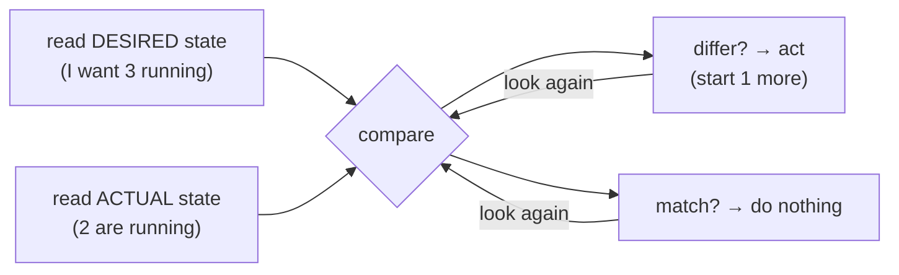

# The Problem K8s Solves

Before any YAML, let's get the one idea that the entire tool is built around. If you take only one thing from
this guide, take this phase — everything in Kubernetes is a consequence of it.

You already know how to run a container. Now picture running it *for real*: not one container on your laptop, but
forty containers across six machines, that must stay up at 3am, survive a server dying, get more copies when
traffic spikes, find each other over the network, and get updated to a new version without taking the site down.
Do that by hand and you will spend your life doing it. That gap — between "I can run a container" and "I can keep
a fleet of them healthy across machines forever" — is the exact gap Kubernetes was built to close.

## Doing it by hand is brutal — and here's why

It helps to feel the pain first, because every Kubernetes feature is an answer to one of these. Suppose you're
running containers across a few servers with nothing but Docker and your own willpower. Here is what lands on you:

- **Placement.** A new container needs to run *somewhere*. Which machine has enough free CPU and memory right
  now? You have to look, decide, and remember.
- **Restarts.** A container crashes at 3am. Who notices? Who starts it again? Right now: you, woken up.
- **Machine death.** A whole server falls over. Everything it was running is gone, and those containers need to
  come back *on the other machines* — fast, and without you logging in to do it.
- **Scaling.** Traffic triples for a sale. You need ten copies of the web container instead of three, spread
  across machines, and then back down to three afterward so you're not paying for idle boxes.
- **Networking.** Those ten copies come and go and live on different machines with different IPs. How does
  anything *find* them? How does traffic get spread across them? You can't hard-code an IP that changes.
- **Rollouts.** New version ships. You want to replace the old containers with new ones gradually, watch that
  the new ones are actually healthy, and roll *back* instantly if they're not — all without a window of downtime.

Each of these is solvable by hand for one container. Across a fleet, doing all of them, constantly, forever, is
a full-time job that no human does well at 3am. So we hand it to software.

📝 **Terminology.** *Orchestration* = the automated coordination of many containers across many machines —
deciding where they run, keeping the right number alive, connecting them, and updating them. An *orchestrator*
is the software that does it. Kubernetes (often written **k8s** — "k", eight letters, "s") is one such
orchestrator, and the dominant one.

## The mental model: you declare desired state, it makes it true

Here is the heart of it, and it is a genuine shift in how you think.

**What it actually is.** With plain Docker you give **imperative** commands — "start this container," "stop that
one." You're the one taking each action, one at a time. Kubernetes is **declarative**: you describe the *end
state you want* — "I want 3 copies of this web app running, reachable at this address" — and hand that
description to the cluster. You don't tell it *how* or *where*. You tell it *what*, and it figures out the rest
and then *keeps it that way*.

**Why people get this wrong.** Newcomers treat `kubectl` like Docker — a tool for issuing one-off commands. It
can be used that way, but that misses the entire point. You're not commanding Kubernetes to *do* a thing; you're
telling it what *should be true*, and it takes on the standing responsibility of making that true and holding it
true. The difference shows up the moment something breaks: a container you started by hand stays dead; a
container Kubernetes is responsible for comes right back.

Picture the difference:

```text
   IMPERATIVE (plain Docker)              DECLARATIVE (Kubernetes)
   ───────────────────────────           ─────────────────────────────────
   you: "start container A"               you: "I want 3 of A running"
   you: "it crashed — start it again"     k8s: notices 1 died, starts a new one
   you: "server died — restart all 3      k8s: re-places the lost copies on
        somewhere else, by hand"               healthy machines, on its own
   you: "scale up — start 7 more"          you: change "3" to "10", k8s does the rest

   you are the control loop.              k8s is the control loop. you set the goal.
```

**Why this is the whole game.** Once you accept "I declare the desired state, it reconciles reality toward it,"
every confusing thing about Kubernetes turns readable. *Why did my deleted container come back?* Because you
declared you wanted it, and you never un-declared it. *Why is there a copy on a different machine now?* Because
the one that died had to be replaced, and that machine had room. You stop thinking "what command do I run?" and
start thinking "what do I want to be true, and have I told the cluster?"

## The control loop — the engine under all of it

That phrase "makes reality match" isn't a metaphor; it's a literal loop running constantly inside the cluster.

**What it actually is.** Kubernetes runs **controllers** — small programs each watching one kind of thing. A
controller's job never changes: *compare the actual state of the world to the desired state you declared, and if
they differ, take a step to close the gap.* Then do it again. Forever.



*What this gives you:* what people call "self-healing" is just this loop doing its boring job. Nobody wrote
special crash-recovery logic. A container died, so actual (2) drifted below desired (3), so on the next pass the
controller noticed the gap and started one. The loop doesn't know or care *why* reality drifted — a crash, a
dead machine, you deleting one by accident. It only ever does one thing: nudge actual toward desired.

⚠️ **Gotcha — this loop fights you when you forget about it.** The most common early surprise: you manually
delete a container (a Pod) to "clean it up," and seconds later an identical one is running. You didn't do
anything wrong with the delete — you just deleted it from *reality* while the *desired* state still says it
should exist, so the loop dutifully recreated it. To actually remove something for good, you change what you
*declared* (e.g. scale the Deployment to fewer copies, or delete the Deployment itself), not the running copy.
Fighting the control loop by hand is a losing game; it always gets the last move.

💡 **Key point.** Kubernetes isn't a pile of commands you run. It's a system you give a *goal* to, that then
works continuously and on its own to keep that goal true across a fleet of machines. Hold that, and the objects
in the next phase are just the vocabulary for expressing the goal.

## Recap

1. Running many containers across many machines by hand means doing **placement, restarts, recovery from machine
   death, scaling, networking, and rollouts** — constantly, forever. That's the job Kubernetes takes off you.
2. Kubernetes is **declarative**: you describe the **desired state** ("3 of these, reachable here"), not the
   step-by-step commands. You set the *what*; it handles the *how* and *where*.
3. Under the hood, **controllers** run a **control loop** — compare actual to desired, act to close the gap,
   repeat. "Self-healing" and "auto-scaling" are just that loop doing its job.
4. The loop always wins, so the way to change anything is to **change what you declared**, not to fight the
   running copies by hand.

Next, the actual objects you use to declare all this — the Pod, the Deployment, and the Service — with real YAML
and `kubectl`.

---

[← Guide overview](_guide.md) · [Phase 2: The Core Objects →](02-the-core-objects.md)
