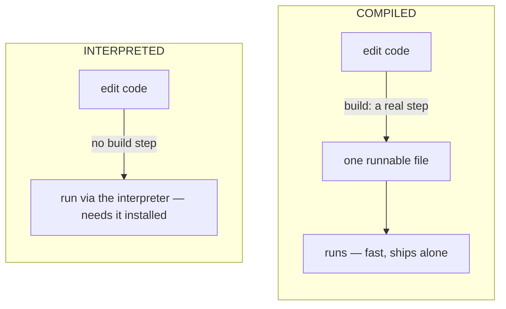

# What Actually Makes Languages Different

When you're new, every language looks like a different alphabet — different keywords, different punctuation,
a different vibe. So it's natural to compare them on surface looks: "Python has no semicolons," "Rust has
weird arrows." But those are spelling differences. They're not what makes a language *feel* the way it
feels, or what makes it good at one job and clumsy at another.

The real differences live underneath, on a small number of **axes** — design decisions the language made
about how it treats your code. There are only a few that matter for choosing, and once you can see them,
every language (including ones not in this guide) clicks into place. Let's install those four ideas now.
Phase 2 will drop our four languages onto them.

## Axis 1: Typed vs dynamic — does the language check your work before it runs?

📝 **Type** — what a value *is*: a number, a piece of text (a "string"), a true/false, a list, and so on.

**What it actually is.** Every value in every language has a type. The axis is about *when the language
checks that you're using types sensibly* — like adding a number to a piece of text by mistake.

- **Statically typed** languages check types *before the program runs*, while you're writing or compiling.
  You often have to *tell* the language a value's type (or it figures it out). It catches "you passed text
  where a number goes" at your desk, not in front of a user.
- **Dynamically typed** languages check types *as the program runs*. You don't declare types; you just use
  values. Mistakes surface when that line of code actually executes — which might be in production.

**Why people get this wrong.** Beginners often hear "dynamic = no types" and "static = more typing for no
reason." Both are wrong. Dynamic languages absolutely have types; they just check them later. And static
checking isn't busywork — it's a second pair of eyes that never gets tired.

**What it feels like in real life.** Here's the same tiny mistake in a dynamic style and a static style,
described in plain terms:

```text
DYNAMIC (checked while running)
  You write code that adds a number to some text.
  The program starts fine.
  It runs for a while...
  ...and crashes the moment it reaches that line — maybe on a user's screen.

STATIC (checked before running)
  You write the same code.
  The compiler refuses: "you can't add text to a number, line 14."
  The program never even builds until you fix it.
```

**The trade-off, honestly.** Static typing trades a little upfront effort and ceremony for fewer surprises
later, and it makes large codebases easier to change safely (the compiler re-checks everything). Dynamic
typing trades that safety net for speed and looseness — you move fast and write less, which is wonderful for
small scripts and exploration and occasionally painful when a project gets big. Neither is "better." They're
bets on where you want to spend your pain.

> ⏭️ Want the deeper story on how types shape program design? See
> [OOP vs Functional](/guides/oop-vs-functional) — it lives one level above this distinction.

## Axis 2: Compiled vs interpreted — how does your code become something the machine runs?

**What it actually is.** You write text. The CPU doesn't speak text. *Something* has to translate. The axis
is about when and how that translation happens.

- **Compiled** languages run a translation step *ahead of time* (`build` or `compile`) that turns your whole
  program into a standalone machine-runnable file. You ship that file; it runs on its own, fast, with no
  translator present.
- **Interpreted** languages are translated *as they run* by a program called an interpreter (or runtime)
  that has to be installed wherever the code runs. You ship your source code; the interpreter reads and runs
  it on the spot.

**Why people get this wrong.** The line is blurrier than tutorials admit. Many "interpreted" languages
quietly compile your code to a faster intermediate form first, and some compile hot code to machine code
*while running* (called JIT, "just-in-time"). So treat this as a spectrum, not two boxes.

**What it feels like in real life.**



**The trade-off, honestly.** Compiling costs you a build step and a slower edit-test loop, and buys you fast
startup, fast execution, and an artifact you can hand someone with nothing else installed. Interpreting buys
you an instant edit-run-edit loop (great for learning and iterating) and costs you raw speed plus a runtime
dependency on the target machine. Again: a bet, not a verdict.

> ⏭️ The full journey from your text to running machine code is its own story:
> [What Happens When Code Runs](/guides/what-happens-when-code-runs).

## Axis 3: How is memory managed — who cleans up after your program?

**What it actually is.** A running program borrows chunks of memory to hold its data, and that memory has to
be given back when it's no longer needed. *Who does the giving-back* is one of the deepest differences
between languages — it shapes both safety and speed.

There are three broad answers:

- **Manual.** *You* free memory yourself, by hand (the classic C/C++ world). Maximum control and speed; also
  the source of some of the nastiest, most dangerous bugs in software history — freeing too early, freeing
  twice, or never freeing.
- **Garbage collected (GC).** A built-in helper periodically finds memory nobody's using and reclaims it for
  you, automatically. You almost never think about it. The cost is that the helper does work while your
  program runs, which can cause small, occasional pauses and uses some extra memory.
- **Ownership.** A newer idea (Rust's signature): the *compiler* tracks who "owns" each piece of memory and
  inserts the cleanup for you, at compile time, with rules it enforces before the program runs. You get
  manual-level speed with no runtime collector and no manual mistakes — but you have to satisfy the
  compiler's rules, which takes real learning.

**What it feels like in real life.**

```text
MANUAL        you allocate, you free.    fast, dangerous, easy to get wrong.
GC            you allocate, it frees.    easy, safe, occasional pauses.
OWNERSHIP     you allocate, compiler     fast AND safe, but you must
              proves when to free.       learn its rules first.
```

**The trade-off, honestly.** This is the axis where "free lunch" doesn't exist. GC buys ease and safety with
some runtime overhead. Ownership buys speed and safety with a steep learning curve. Manual buys raw control
with sharp edges. Most everyday application work is perfectly happy with GC; you reach for ownership or
manual when speed and predictability are the whole point.

> ⏭️ This axis has a guide all to itself:
> [Memory & Garbage Collection](/guides/memory-and-garbage-collection). If "the heap" or "a GC pause" is
> fuzzy, read that and come back.

## Axis 4: Where does it run, and what's the ecosystem like?

**What it actually is.** A language is more than its grammar. It's also *where it can run* (a browser? a
server? a tiny device? everywhere?) and the **ecosystem** around it — the libraries other people have
written, the tools, the community, and the jobs.

📝 **Library / package** — pre-written code you install and use, so you don't rebuild common things (parsing
dates, talking to a database, doing math) from scratch.

**Why this matters more than beginners expect.** You will spend far more time *using* libraries than writing
clever language tricks. A language with a rich, mature ecosystem for your task can make you productive on day
one; a language without one means you build everything yourself. Where a language runs also decides whole
categories of work: only one mainstream language runs natively in every web browser, for instance, and that
single fact has shaped careers.

**The trade-off, honestly.** A huge ecosystem means "there's a library for that" — and also more
abandoned, half-broken, or conflicting libraries to wade through. A smaller, newer ecosystem is cleaner and
more consistent but may be missing the exact thing you need. Maturity and breadth are a genuine asset, not a
detail to wave away.

## Recap

The four axes that actually separate languages:

1. **Typed vs dynamic** — does it check your types *before* it runs (safer, more ceremony) or *while* it runs
   (looser, faster to write)?
2. **Compiled vs interpreted** — does it translate ahead of time (fast, ships alone, has a build step) or as
   it runs (instant loop, needs a runtime present)? It's a spectrum.
3. **Memory management** — manual (control, danger), garbage collected (easy, occasional pauses), or
   ownership (fast and safe, steep to learn). No free lunch here.
4. **Where it runs + the ecosystem** — the libraries, tools, and habitats that decide what you can build and
   how fast.

Hold these four in your head. In the next phase, our four languages stop being names and become coordinates:
Python here, JavaScript there, Go and Rust over here — each a deliberate set of bets on these very axes.

---

[← Guide overview](_guide.md) · [Phase 2: The Four, Honestly →](02-the-four-honestly.md)
