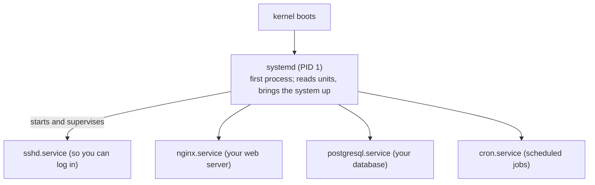

# Managing Services with systemd

In Phase 1 we said a server's whole job is keeping long-running services alive. This phase is about the thing
that actually does that keeping: **systemd**. If you only learn one server tool deeply, learn this one — it's
how you start, stop, supervise, and debug every service on a modern Linux box, and how you read what they're
saying.

## What systemd actually is

**What it actually is.** systemd is two things wearing one name. First, it's **PID 1** — the very first
process the kernel starts at boot, the ancestor of everything else (you'll see it at the top of `ps` as
`/sbin/init`, which is a symlink to systemd). Second, it's the **service manager**: the program that decides
what should run, starts those things in the right order, restarts them if they crash, and tracks whether
each one is healthy.


*Each one is a "unit" systemd keeps watch over.*

**Why people get this wrong.** Coming from running programs by hand, the temptation is to `cd` somewhere and
launch the binary yourself — `./nginx &` or similar. That program dies when your SSH session ends (the Phase 1
war story), nothing restarts it if it crashes, and nothing starts it after a reboot. systemd exists precisely
to take that responsibility off you: you *describe* what should run, and systemd is the one that babysits it,
forever, whether or not you're logged in.

📝 **Terminology.** A *unit* is anything systemd manages, described by a small text file. The kind you'll touch
most is a **`.service`** unit (a daemon to run). The files live in `/lib/systemd/system/` (shipped by
packages) and `/etc/systemd/system/` (your overrides — `/etc` again, as promised). The tool you drive it with
is **`systemctl`**; the tool that reads its logs is **`journalctl`**.

## `systemctl status` — your first move, always

Before you start or stop anything, ask systemd what it already thinks. `status` is read-only and tells you
almost everything you need in one screen:

```console
$ systemctl status nginx
● nginx.service - A high performance web server and a reverse proxy server
     Loaded: loaded (/lib/systemd/system/nginx.service; enabled; preset: enabled)
     Active: active (running) since Wed 2026-06-18 09:15:22 UTC; 2h 31min ago
       Docs: man:nginx(8)
   Main PID: 8123 (nginx)
      Tasks: 3 (limit: 4915)
     Memory: 8.1M
        CPU: 412ms
     CGroup: /system.slice/nginx.service
             ├─8123 "nginx: master process /usr/sbin/nginx"
             ├─8124 "nginx: worker process"
             └─8125 "nginx: worker process"

Jun 18 09:15:22 web-prod-1 systemd[1]: Starting nginx.service...
Jun 18 09:15:22 web-prod-1 systemd[1]: Started nginx.service.
```

*What just happened:* Read it top to bottom. The green `●` and **`Active: active (running)`** mean it's up
right now, and `since … 2h 31min ago` is its uptime. **`Loaded: … enabled`** is the other half of the story:
`enabled` means it's set to start automatically at boot (more on that below — `enabled` and `running` are
different things, and confusing them bites everyone). `Main PID: 8123` is the actual process, and the
`CGroup` tree shows every process systemd is tracking as part of this service. The last lines are the most
recent log entries — `status` hands you a peek at the journal for free, which is often all you need to see
what just went wrong.

💡 **Key point.** Two independent questions live in that output. **Is it running *now*?** → the `Active:` line.
**Will it come back after a reboot?** → the `Loaded:` line (`enabled` vs `disabled`). A service can be running
but not enabled (works until the next reboot, then vanishes) or enabled but not running (will start next boot,
but isn't up now). Keep them separate in your head.

## start / stop / restart — controlling a running service

These three do exactly what they say, take effect *immediately*, and don't survive a reboot on their own
(that's what `enable` is for). They almost always need `sudo`, because changing what's running on the machine
is privileged.

```console
$ sudo systemctl stop nginx
$ systemctl is-active nginx
inactive
$ sudo systemctl start nginx
$ systemctl is-active nginx
active
```

*What just happened:* `stop` told systemd to shut the service down cleanly (it signals the process and waits
for it to exit); `is-active` is a quick, scriptable check that prints one word instead of a whole status
screen. Then `start` brought it back. Notice neither command printed anything on success — on Unix, silence
is success. If a `start` *fails*, it won't be silent: it'll tell you to go check `systemctl status` and the
journal.

**`restart` is stop-then-start in one step**, and it's what you reach for after editing a service's config:

```console
$ sudo systemctl restart nginx
```

*What just happened:* systemd stopped nginx and started it again, so the running process re-reads its
configuration. There's a gentler cousin worth knowing:

```console
$ sudo systemctl reload nginx
```

*What just happened:* `reload` asks the service to re-read its config **without** dropping its running
process — for nginx that means no dropped connections. Not every service supports it; when in doubt, `restart`
always works but causes a brief blip. There's also `reload-or-restart` for "reload if you can, otherwise
restart."

⚠️ **Gotcha.** Editing a config file changes nothing by itself. The running process loaded its config once,
at start, and won't notice your edit until you `reload` or `restart` it. The number of outages caused by
"I changed the file and it didn't take effect" is enormous — the edit and the reload are two separate steps,
and you owe yourself both.

## enable / disable — surviving a reboot

This is the half that catches people. `enable` and `disable` control **boot behavior**, and *by default they
don't touch the current state at all*:

```console
$ sudo systemctl enable nginx
Created symlink /etc/systemd/system/multi-user.target.wants/nginx.service → /lib/systemd/system/nginx.service.
```

*What just happened:* `enable` created a symlink that wires nginx into the boot sequence — now it'll start
automatically every time the machine boots. Look closely: it did *not* start nginx right now. If nginx was
stopped, it's still stopped; you've only changed what happens at the *next* boot. When you want both at once,
say so explicitly:

```console
$ sudo systemctl enable --now nginx
```

*What just happened:* `--now` means "and also do it immediately" — so this enables nginx for future boots
*and* starts it right now, the combination you usually actually want on a fresh install. (`disable --now`
is the mirror image: stop it and keep it from coming back.)

💡 **Key point.** Memorize the pairing: **start/stop = right now**, **enable/disable = at boot**,
**`--now` = both**. Almost every "the service is gone after I rebooted the box" mystery is a service that was
started but never enabled.

## journalctl — reading what a service actually said

systemd captures the standard output and standard error of every service into one central, indexed log
called the **journal**. `journalctl` is how you read it, and it's where you go the moment something misbehaves.

The most useful invocation by far is "show me this one service's logs, newest stuff visible":

```console
$ journalctl -u nginx -n 20 --no-pager
Jun 18 09:15:22 web-prod-1 systemd[1]: Starting nginx.service...
Jun 18 09:15:22 web-prod-1 systemd[1]: Started nginx.service.
Jun 18 11:42:07 web-prod-1 nginx[8124]: 2026/06/18 11:42:07 [error] 8124#8124: *15 open() "/var/www/html/favicon.ico" failed (2: No such file or directory)
```

*What just happened:* `-u nginx` filters the journal down to the `nginx` **unit** (without it you'd get logs
from the *entire system* interleaved, which is occasionally what you want and usually overwhelming). `-n 20`
limits it to the last 20 lines, and `--no-pager` dumps it straight to your terminal instead of opening it in
a scrollable pager. You can immediately read that nginx is up and that someone requested a missing favicon —
the kind of concrete, timestamped truth a desktop has no equivalent for.

When you're actively debugging — restart the service in one window, watch the logs stream in another — the
indispensable flag is `-f`, **follow**:

```console
$ journalctl -u nginx -f
Jun 18 12:03:55 web-prod-1 nginx[8124]: 2026/06/18 12:03:55 [error] ...
^C
```

*What just happened:* `-f` tails the journal live, printing new lines as they're written, exactly like
`tail -f` on a plain log file. You sit and watch; Ctrl-C stops following. This is the single most useful
debugging loop on a server: trigger the thing, watch what the service says about it in real time.

A few more you'll lean on constantly:

```console
$ journalctl -u sshd --since "1 hour ago" -p err
```

*What just happened:* `--since` takes human-friendly time ("1 hour ago", "today", "2026-06-18 09:00"), and
`-p err` filters by **priority** to errors and worse — so this reads "SSH daemon errors from the last hour,"
which is a great first query when logins are failing. (`-p` understands the syslog levels: `emerg`, `alert`,
`crit`, `err`, `warning`, `notice`, `info`, `debug`.)

⚠️ **Gotcha.** By default the journal may be stored only in memory and lost on reboot, depending on the
distro — you'll find that under `Storage=` in `/etc/systemd/journald.conf` (`auto` keeps it on disk only if
`/var/log/journal/` exists; `persistent` always does). If `journalctl --list-boots` shows only the current
boot, your logs aren't surviving reboots, and you'll want to make the journal persistent before you need it
to investigate a crash that *caused* the reboot.

🪖 **War story.** A service "won't start" and the panic begins. Nine times out of ten the answer is sitting
right there: `systemctl status the-service` shows `failed`, and the last few log lines (or
`journalctl -u the-service -n 50`) name the exact reason — a syntax error in a config file, a port already in
use, a missing permission. The discipline that separates calm from chaos is boring: *status first, journal
second, fix third.* You almost never have to guess.

## Recap

1. **systemd** is **PID 1** (the first process) *and* the **service manager** that starts, supervises, and
   restarts your long-running services.
2. A **unit** (usually a `.service`) is a text file describing something systemd manages; you drive it with
   **`systemctl`**.
3. **`systemctl status <svc>`** is your first move — it shows running-or-not (`Active:`), start-at-boot-or-not
   (`Loaded: enabled`), the PID, and recent logs in one view.
4. **start/stop/restart act now**; **enable/disable act at boot**; **`--now` does both**. Don't confuse
   "running" with "enabled."
5. Edit a config, then **`reload`/`restart`** — the edit alone changes nothing.
6. **`journalctl -u <svc>`** reads a service's logs; **`-f`** follows them live, **`-n`** limits lines,
   **`--since`** and **`-p`** filter by time and priority.

Next, the discipline that keeps all of this from becoming a liability: running the box *safely* — users,
`sudo`, scheduled jobs, the firewall, and SSH hardening.

---

[← Guide overview](_guide.md) · [Phase 3: Running It Safely →](03-running-it-safely.md)
