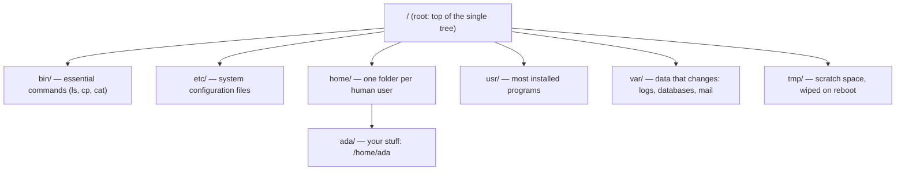

# Getting Around

You know how to find your stuff on the computer you grew up with: a `C:` drive, `Program Files`, your
Documents folder. Sit down at Linux and that map is gone. There's no `C:`, no `Program Files`, and instead
a pile of short, cryptic folders at the top — `etc`, `var`, `usr`, `bin`. It feels like someone hid
everything.

Nothing's hidden. Linux just organizes the house differently, and once you know what each room is *for*,
finding things becomes obvious. Then we'll cover the other day-one surprise: on Linux you don't download
installers — you ask a package manager.

> ⏭️ This phase gives you the working map. For the deeper "what is a path, what is a directory, how do I
> navigate" mechanics, [The Filesystem, Explained](/guides/the-filesystem-explained) is the companion read.

## One tree, not many drives

**What it actually is.** On Windows you have several separate trees — `C:\`, `D:\`, a USB stick as `E:\`.
On Linux there is exactly **one tree**, and everything hangs off a single starting point called the
**root**, written as a lone forward slash: `/`. Every file and folder on the machine lives somewhere under
`/`. A second hard drive or a USB stick doesn't become its own letter; it gets *attached into* the one
tree at some folder (this is called "mounting").

📝 **Terminology.** *Root* (`/`) = the very top of the filesystem, the folder that contains everything
else. (Confusingly, "root" is *also* the name of the all-powerful admin user — we'll meet that root in
[Phase 3](03-users-permissions-sudo.md). Same word, two meanings: the top folder, and the superuser.)



## The folders that surprise everyone, and what each is for

You don't need to memorize all of them. You need a feel for the handful you'll bump into constantly:

- **`/home`** — where *people's* files live. Each user gets a folder named after them: `/home/ada`. This
  is your equivalent of the Windows Documents-and-Desktop area — your downloads, your projects, your
  settings-per-app. When you log in, you start here. The shell calls it your *home directory* and writes
  it with a shortcut: `~`.

- **`/etc`** — **system configuration**. When you need to change how something on the machine behaves —
  the SSH server, the web server, scheduled jobs — you almost always edit a text file under `/etc`. Think
  of `/etc` as the settings drawer for the whole system. (Memory hook some people use: "*etc* = *Editable
  Text Configuration*." That's not what it historically stood for, but it's a fair description of what's in
  there.)

- **`/var`** — **variable data**: stuff that grows and changes while the machine runs. The big one for
  beginners is logs, which live in `/var/log`. When something breaks and you need to find out *why*, the
  answer is very often a file under `/var/log`. Databases and mail queues live under `/var` too.

- **`/usr`** — where **most installed programs** and their supporting files end up (`/usr/bin` holds the
  programs you can run, `/usr/lib` the shared code they need). When you install software with a package
  manager, this is mostly where it lands. You rarely need to go in here by hand, but it's good to know it's
  the "installed software" wing of the house.

- **`/bin`** — **essential commands** themselves: the actual programs behind `ls`, `cp`, `cat`, and
  friends. (On many modern distros `/bin` is just a pointer to `/usr/bin` — the same idea either way:
  "where the runnable commands live.")

💡 **Key point.** The pattern to hold onto: **`/home` is *your* stuff, `/etc` is *settings*, `/var` is
*changing data and logs*, `/usr` and `/bin` are *installed programs*.** With just those four ideas you can
guess where almost anything lives.

**A real example.** Let's actually look at the root of the tree:
```console
$ ls /
bin   dev  home  lib    media  opt   root  sbin  sys  usr
boot  etc  lib64  mnt   proc   run   srv   tmp   var
```
*What just happened:* `ls /` listed the contents of the root directory — the top of the whole tree. You
can see the rooms we just described (`etc`, `home`, `usr`, `var`, `bin`) plus several more the system uses
internally. You don't need to know every one; recognizing the handful that matter is enough to feel
oriented.

And to see *your own* home directory:
```console
$ ls ~
Desktop  Documents  Downloads  projects
```
*What just happened:* `~` expanded to your home directory (`/home/ada`), and `ls` showed what's inside it.
This is where your day-to-day work lives — the equivalent of "my files" on the system you already know.

## Installing software: ask, don't download

Here's the habit you have to *unlearn*. On Windows or macOS, installing an app means: go to a website,
download an installer, double-click it, click Next a few times. On Linux that's the unusual path. The
normal way is a **package manager**.

**What it actually is.** A package manager is a built-in program that installs, updates, and removes
software for you from a trusted, curated online catalog called a **repository** (a "repo" — yes, the word
is overloaded; here it means "the catalog of installable software," not a Git repo). You tell it the name
of what you want; it fetches the right version for your system, installs everything that piece of software
*also* needs, and records what it did so it can cleanly remove it later.

📝 **Terminology.** *Package* = one installable piece of software, bundled up with its description and its
list of dependencies. *Package manager* = the tool that installs packages. *Repository* = the online
catalog the package manager downloads packages from.

It's closer to an app store than to hunting down installers — except it's a command, and it handles the
fiddly "this needs that other thing first" chains automatically.

Which command you use depends on your distro family (the one place that choice matters, as we said in
Phase 1):

```text
   Debian / Ubuntu  →  apt
   Fedora           →  dnf
```

The shape of the commands is the same idea on both. We'll use `apt` (Ubuntu/Debian) for the walkthrough;
the `dnf` equivalents are noted alongside.

## A real `apt install`, narrated

Let's install a small, friendly program called `tree` (it prints a directory as a pretty tree diagram).
First, refresh the catalog so the package manager knows what's available:

```console
$ sudo apt update
Hit:1 http://archive.ubuntu.com/ubuntu jammy InRelease
Get:2 http://archive.ubuntu.com/ubuntu jammy-updates InRelease [119 kB]
Fetched 119 kB in 1s (98.2 kB/s)
Reading package lists... Done
```
*What just happened:* `apt update` didn't install anything — it downloaded the latest *list* of what's
available and what versions exist (it refreshed the catalog). The `sudo` in front means "do this as the
administrator," because changing system-wide software needs admin rights — that's the subject of
[Phase 3](03-users-permissions-sudo.md). (On Fedora you don't usually need a separate update step;
`dnf install` checks freshness itself.)

Now install the program:

```console
$ sudo apt install tree
Reading package lists... Done
Building dependency tree... Done
The following NEW packages will be installed:
  tree
0 upgraded, 1 newly installed, 0 to remove and 0 not upgraded.
Need to get 47.9 kB of archives.
After this operation, 116 kB of additional disk space will be used.
Get:1 http://archive.ubuntu.com/ubuntu jammy/universe amd64 tree amd64 2.0.2-1 [47.9 kB]
Fetched 47.9 kB in 0s (180 kB/s)
Selecting previously unselected package tree.
Setting up tree (2.0.2-1) ...
Processing triggers for man-db (2.10.2-0ubuntu1) ...
```
*What just happened:* `apt` found `tree` in the catalog, told you exactly what it was about to do (install
one new package, using a small amount of disk), downloaded it, and set it up. On Fedora the same step is
`sudo dnf install tree`. Notice you were never sent to a website — the package manager did the whole errand.

⚠️ **Gotcha.** If `apt install` reports `Unable to locate package`, the usual cause is a stale catalog —
run `sudo apt update` first and try again. If the *whole command* is missing (`apt: command not found`),
you're probably on a distro that uses `dnf` (or another manager) instead. That's the Phase 1 lesson biting:
match the tool to the distro family.

Confirm it landed:
```console
$ tree --version
tree v2.0.2 (c) 1996 - 2022 by Steve Baker, Thomas Moore, ...
```
*What just happened:* The program answers, so it's installed and your shell can find it. The exact version
doesn't matter — any answer means success.

To remove a program later, you ask the same manager rather than hunting for an uninstaller:
```console
$ sudo apt remove tree
```
*What just happened:* `apt` knows exactly which files it installed for `tree`, so it can cleanly take them
all back out. (`sudo dnf remove tree` on Fedora.) This is the quiet superpower of package managers: because
*they* installed it, *they* can fully uninstall it.

**Why this saves you later.** Once this clicks, software management on Linux stops feeling mysterious.
Setting up a server, following a tutorial, reproducing someone's environment — it's nearly always a short
list of `apt install` / `dnf install` lines. No downloading, no "is this site safe," no leftover junk. One
trusted catalog, one command, clean removal.

## Recap

1. Linux has **one tree** starting at root (`/`); there are no drive letters — other disks get *mounted*
   into the tree.
2. The rooms that matter: **`/home`** (your files), **`/etc`** (system config), **`/var`** (changing data
   and `/var/log` logs), **`/usr`** and **`/bin`** (installed programs and commands).
3. `~` is a shortcut for your own home directory, where you start and keep your day-to-day work.
4. You install software with a **package manager** from a trusted catalog — **`apt`** on Debian/Ubuntu,
   **`dnf`** on Fedora — not by downloading installers.
5. `apt update` refreshes the catalog; `apt install <name>` installs (handling dependencies for you);
   `apt remove <name>` cleanly uninstalls.

You can find your way and add software. But several of those commands started with `sudo`, and you may have
felt a flicker of "wait, am I allowed to do that?" That flicker is the right instinct — next we'll make
sense of users, permissions, and what `sudo` really means.

---

[← Phase 1: What Linux Actually Is](01-what-linux-actually-is.md) · [Phase 3: Users, Permissions, and sudo →](03-users-permissions-sudo.md)

## Try it yourself

Practice moving around — `ls`, `cd projects`, `cat readme.txt`, `mkdir demo`, `tree`:

```playground-terminal
```
