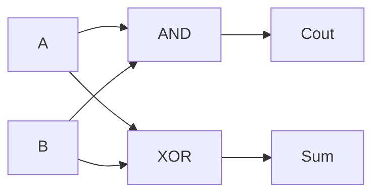

# Logic Gates: Logic Made Physical

In Phase 1, AND, OR, and NOT were ideas - rules for combining `true` and `false`. They lived on
paper. This phase gives them a body.

The logic you learned isn't a metaphor for how computers work. It *is* how computers work. The
same three operations, soldered into silicon, are the entire foundation under everything your
machine does.

## What a gate actually is

A **logic gate** is a small physical component that takes one or two electrical signals as input
and produces one signal as output. That's it. No magic.

The trick is in how we read the signals. Inside a chip, a wire carries either a higher voltage or
a lower one. We call the high voltage `1` and the low voltage `0`. (Some designs flip this, but
the principle holds.) A wire is never "kind of on" - it's exactly one of two states.

That agreement connects the two worlds. Phase 1's `true` and `false` became `1` and `0`, and now
those `1`s and `0`s become voltages on a wire. A gate is a boolean operation you can hold in your
hand.

When you think `A AND B`, a chip does the same thing - it routes two voltages into an AND gate
and reads what comes out. The logic didn't change. It got physical.

## The basic gates

Three gates map directly onto the three operations you know. Each is fully described by its truth
table: list every possible input, write down the output, and you've captured everything the gate
does.

**AND** - output is `1` only when *both* inputs are `1`.

```text
A  B  | A AND B
0  0  |   0
0  1  |   0
1  0  |   0
1  1  |   1
```

**OR** - output is `1` when *at least one* input is `1`.

```text
A  B  | A OR B
0  0  |   0
0  1  |   1
1  0  |   1
1  1  |   1
```

**NOT** - takes a single input and flips it. The one gate with only one input.

```text
A  | NOT A
0  |   1
1  |   0
```

If these tables feel familiar, good - they're the same ones from
[the laws of boolean algebra](01-boolean-algebra-the-laws.md), now read as hardware.

## Derived gates

You build more useful gates by gluing the basics together. Three show up so often they get their
own names and symbols.

**NAND** - "not AND." Run AND, then flip the result. It outputs `0` only when both inputs are
`1`, and `1` in every other case.

```text
A  B  | A NAND B
0  0  |   1
0  1  |   1
1  0  |   1
1  1  |   0
```

**NOR** - "not OR." Run OR, then flip it. Outputs `1` only when both inputs are `0`.

```text
A  B  | A NOR B
0  0  |   1
0  1  |   0
1  0  |   0
1  1  |   0
```

**XOR** - "exclusive OR." Outputs `1` only when the inputs *differ* - one is `1` and the other is
`0`. If they match, the output is `0`. Think of it as asking "are these two things different?"

```text
A  B  | A XOR B
0  0  |   0
0  1  |   1
1  0  |   1
1  1  |   0
```

XOR is the workhorse behind addition and comparison. When a computer adds two bits, the "sum"
digit before carrying is exactly XOR. You'll see that in Phase 3.

> ⚠️ **XOR is not OR.** They agree on three of the four rows - the difference is the last one.
> Plain OR says "one or both," so `1 OR 1` is `1`. XOR says "one *or the other, not both*," so
> `1 XOR 1` is `0`. If you ever wonder which you want, ask: should "both true" count? OR says
> yes, XOR says no.

## Gate diagrams: how they wire together

The truth tables tell you what a gate does. A diagram shows how gates *talk* to each other. Here's a half-adder - the circuit that adds two single bits - built from the gates you just met:



Two inputs, `A` and `B`, flow into both an AND gate and an XOR gate. The AND gate produces the **carry-out** (`Cout`): it's `1` only when both inputs are `1`. The XOR gate produces the **sum** (`Sum`): it's `1` when the inputs differ, which is exactly the "sum" digit before carrying in binary addition.

This is the circuit that lives inside every adder in your CPU. From this, engineers chain more gates to add multi-bit numbers, and from there you get everything else.

## Universality: why NAND is special

Here's a result that sounds too good to be true: **the NAND gate, all by itself, can build every
other gate.** Give an engineer nothing but NAND gates and enough wire, and they can construct
AND, OR, NOT, XOR - the whole family. (The same is true of NOR alone.)

This property is called **functional completeness**: a single building block enough to express any
boolean function whatsoever.

The cleanest place to see it is NOT. Take a NAND gate and feed the *same* signal into both inputs.
Look at the rows where `A` and `B` are equal:

```text
A  A  | A NAND A
0  0  |    1
1  1  |    0
```

The output is the flip of the input - that's NOT, made from one NAND.


Once you have NOT, the rest follows. NAND is already "AND then flip," so flipping a NAND's output
(with another NAND wired as NOT) gives you back a plain **AND**. Getting **OR** takes more wiring,
but it's the same idea - chain NANDs until the truth table matches.

Once you have NOT, the rest follows. NAND is already "AND then flip," so flipping a NAND's output
(with another NAND wired as NOT) gives you back a plain **AND**. Getting **OR** takes more wiring,
but it's the same idea - chain NANDs until the truth table matches.

Why care? Building a chip from one repeated component is cheaper, more uniform, and easier to
manufacture than juggling many gate types. Real silicon leans on this hard. The deep idea you saw
in [what logic actually is](/guides/what-logic-actually-is) - that a few simple rules can express
enormous complexity - is the literal blueprint for a processor.

## For builders

You've met these gates already without knowing it. Most languages have **bitwise operators** that
apply a logic gate to *every bit of an integer at once*, in parallel:

- `&` is AND
- `|` is OR
- `^` is XOR
- `~` is NOT

When you write `5 & 3`, the computer writes both numbers in binary, lines up their bits, and runs
an AND gate on each column:

```text
  0101   (5)
& 0011   (3)
------
  0001   (1)
```

So `5 & 3` is `1`. Swap in `|` and you'd get `7` (`0111`); swap in `^` and you'd get `6` (`0110`).
The truth tables above are the *only* rules you need to predict the result - column by column, bit
by bit. The gates aren't an abstraction sitting above your code; they run underneath it.

## Recap

- A **logic gate** is a physical component that does one boolean operation on electrical
  signals, where high voltage means `1` and low means `0`.
- **AND, OR, NOT** are the basic gates - the Phase 1 operations, now in hardware.
- **NAND** and **NOR** are those gates with the output flipped; **XOR** outputs `1` only when
  its inputs *differ*.
- **NAND alone can build every other gate** (functional completeness) - start with NOT from a
  NAND with tied inputs, and the rest follows.
- The bitwise operators `&`, `|`, `^`, `~` are these gates run across all the bits of a number
  at once.

## Open-ended exercise

Sketch (in text or on paper) a circuit that uses AND, OR, and NOT gates to implement
this condition: `(A AND B) OR (NOT C)`. Then ask: if you only had NAND gates, could you
build the same circuit? Why or why not? (Hint: you already know NAND can make NOT, AND,
and OR.)

Quick check before you move on:

```quiz
[
  {
    "q": "What is a logic gate?",
    "choices": [
      "A physical component that performs one boolean operation on electrical signals read as 1s and 0s",
      "A line of software that simulates true/false values",
      "A storage cell that remembers a single bit between operations",
      "A connector that converts one voltage level into another"
    ],
    "answer": 0,
    "explain": "A gate is hardware: it takes signals (high = 1, low = 0) and outputs one signal according to a boolean operation like AND, OR, or NOT."
  },
  {
    "q": "For which inputs does an XOR gate output 1?",
    "choices": [
      "Only when both inputs are 1",
      "Only when the two inputs differ (one is 1, the other 0)",
      "When at least one input is 1, including both",
      "Only when both inputs are 0"
    ],
    "answer": 1,
    "explain": "XOR means 'exclusive OR': it outputs 1 only when the inputs are different. Unlike plain OR, 1 XOR 1 is 0."
  },
  {
    "q": "Why is the NAND gate called 'universal' (functionally complete)?",
    "choices": [
      "It is the fastest gate to manufacture",
      "It is the only gate that works on single inputs",
      "Every other gate - NOT, AND, OR, XOR - can be built using only NAND gates",
      "It never produces an output of 0"
    ],
    "answer": 2,
    "explain": "NAND alone can construct any boolean function. For example, a NAND with both inputs tied together acts as NOT, and from NOT the rest follow."
  }
]
```

Watch it animated: [logic gates](/explainers/LogicGates.dc.html)

[← Phase 1: Boolean Algebra: The Laws](01-boolean-algebra-the-laws.md) · [Guide overview](_guide.md) · [Phase 3: From Gates to a Computer →](03-from-gates-to-a-computer.md)