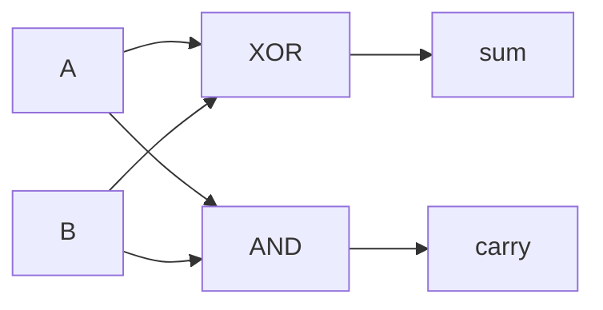

# From Gates to a Computer

You've built a real toolkit. In [What Logic Actually Is](/guides/what-logic-actually-is) you met
true and false. In [Propositional Logic](/guides/propositional-logic) you combined them with AND,
OR, and NOT. In Phase 2 you watched those operations become physical: gates, wires, voltage that
means something. Each step felt small.

This phase is the payoff. We'll wire a handful of gates together and watch something appear that
none of them could do alone: they'll start doing **arithmetic**.

## The question driving this phase

Here's the puzzle that should be bugging you. AND, OR, and NOT are about truth — true/false in,
true/false out. Addition is about *numbers*: `2 + 3 = 5`. Those feel like two different worlds.

So how does a machine that only knows true and false add numbers? Nobody snuck a calculator
inside. There's no "+" component hiding in the silicon. There are only gates.

The answer is one of the most satisfying ideas in computing, and you already have every piece you
need.

## Binary addition, recapped

Computers count in binary — only `0` and `1`. Adding two single bits has exactly four cases, and
you can work all four out by hand:

```text
0 + 0 = 0
0 + 1 = 1
1 + 0 = 1
1 + 1 = 10   ← two! doesn't fit in one bit
```

The first three are calm. The fourth is the interesting one. `1 + 1` is two, and two in binary is
`10` — a `1` followed by a `0`. It doesn't fit in a single bit, so it spills.

That spill is the whole game. When a column overflows, the extra `1` moves to the next column
over. It's the same move you make in decimal: `7 + 5 = 12`, you write the `2` and **carry** the
`1`. Binary does it sooner, but the move is identical.

So adding two bits really produces *two* answers:

- a **sum** bit — what you write down in this column
- a **carry** bit — what spills into the next column

Hold onto those two words. We're about to build a circuit for each.

## The half-adder

Let's make one table for both outputs. Inputs `A` and `B`; outputs `sum` and `carry`:

```text
 A   B  | sum  carry
---------+-----------
 0   0  |  0     0
 0   1  |  1     0
 1   0  |  1     0
 1   1  |  0     1
```

Now look at each output column on its own and compare it to the gates you know.

The **sum** column is `0, 1, 1, 0`. It's `1` when exactly one input is `1`, and `0` when the
inputs match. That is precisely XOR — "one or the other, but not both." So:

```text
sum = A XOR B
```

The **carry** column is `0, 0, 0, 1`. It's `1` only when *both* inputs are `1`. That's AND. So:

```text
carry = A AND B
```

Take a second with that — it's the payoff of the whole guide. We didn't invent a new device. We
didn't add arithmetic to the hardware. We took two gates you'd already met — one XOR, one AND —
wired the same two inputs into both, and the pair *adds*. The arithmetic was hiding inside the
logic the whole time.

This circuit has a name: the **half-adder**. Here's the wiring.



Two inputs fan out to two gates; two outputs come back. That's all it is.

> Why "half"? Because it can produce a carry *out*, but it has no way to accept a carry coming
> *in* from a column to its right. To chain columns together, we need to fix that.

## The full adder

In any real addition past a single bit, each column deals with three things: bit `A`, bit `B`,
and the carry that arrived from the column to its right. Three inputs.

A **full adder** handles all three. It takes `A`, `B`, and a **carry-in**, and produces a **sum**
and a **carry-out**. You can build one from two half-adders and an OR gate, and the reasoning is
the same as before — you fold the carry-in into the mix and ask "did *either* stage produce a
carry?" That's where the OR comes in.

We'll keep this conceptual rather than draw every wire, because the important idea isn't the exact
diagram. It's what the full adder *lets you do*: chain.

Line up one full adder per bit. The carry-out of each feeds the carry-in of its left-hand neighbor
— exactly the way you carry the `1` when adding by hand, moving left column by column.

```text
  bit:    3     2     1     0
        [FA] ← [FA] ← [FA] ← [FA] ← carry starts at 0
         |     |     |     |
        sum3  sum2  sum1  sum0
```

That's a **ripple-carry adder**, because the carry ripples leftward through the chain. Want to add
8-bit numbers? Chain eight full adders. 64-bit? Chain sixty-four. The building block never changes
— you line up more of them. A machine that adds whole numbers is a row of the same tiny circuit,
repeated.

## The leap, honestly

So you can add. With small variations on the same gates you can also subtract (it's addition with a
flipped sign), and you can run AND, OR, and NOT across whole numbers at once. Bundle all those
operations together with some logic that picks *which* one to run, and you've built an **ALU** — an
Arithmetic Logic Unit. The ALU is the part of a processor that does the math.

Now, the honest part. An ALU is not a computer. It computes an answer the instant its inputs arrive
and forgets it as fast — no memory, no sense of time. To go further you need two more ingredients:

- A **memory element** — a small loop of gates called a *latch* that holds onto a single bit after
  the input goes away. Stack a lot of these and you get registers and RAM: a place to keep numbers
  between steps.
- A **clock** — a steady tick that says "now," so operations happen in order instead of all at
  once, and so a held bit updates only when you want it to.

Add **control logic** — gates that read an instruction and decide what the ALU should do and which
bits to move where — and the skeleton of a computer is in front of you: do math (ALU), remember
results (latches), take turns (clock), follow instructions (control).

Straight with you: that paragraph is a sketch, not a build. A real CPU is millions to billions of
gates, and each of those four pieces is a deep topic on its own. But the leap you might have
thought was magic — from true/false to a working machine — is now a list of named, understandable
parts. None is a miracle. All are gates.

## For builders

This isn't trivia. When you write `a + b` in any language, that line ultimately becomes adder
hardware doing the column-by-column carry you traced. The `+` you type is the visible end of this
exact circuit.

The bitwise operators (`&`, `|`, `^`, `~`) are even more direct — they *are* AND, OR, XOR, and NOT
applied across every bit of a number in one shot. The same world you've been reasoning about on
paper runs underneath your code. When you reach for bit-twiddling tricks later, you'll be thinking
in gates, whether you call it that or not.

## The whole journey

Look back at the distance you've covered:

1. **True and false** — the two values everything is built from.
2. **Algebra over them** — AND, OR, NOT, and reliable rules for combining them.
3. **Gates** — those operations made physical, in voltage and silicon.
4. **Arithmetic** — gates wired together until they add, subtract, and beyond.

Each layer was a short, fair step. Stacked up, they reach from a single bit to the machine on your
desk.

Where does it go from here? Down into the silicon — how a gate is carved out of transistors, how
those transistors are etched onto a chip, how memory and clocks are built for real. That's a
hardware story, and a great one, but it's the physics underneath the logic you now understand.
You've finished the logic. The foundation is solid, and it's yours.

## Open-ended exercise

A half-adder takes two single-bit inputs (A and B) and produces two outputs: Sum and
Carry. The Sum is `A XOR B` and the Carry is `A AND B`. Now imagine chaining two
half-adders (plus an OR gate) to make a **full-adder** that also takes a carry-in from
a previous stage. Sketch the gate-level diagram for a full-adder, labeling each gate
and showing how the carry propagates. The goal is to see how a multi-bit adder — and
ultimately a CPU's arithmetic unit — is just gates all the way down.

A quick check before you go:

```quiz
[
  {
    "q": "In a half-adder, which gate produces the sum bit?",
    "choices": ["AND", "OR", "XOR", "NOT"],
    "answer": 2,
    "explain": "The sum is 1 when exactly one input is 1 and 0 when they match — that's XOR. So sum = A XOR B."
  },
  {
    "q": "In a half-adder, which gate produces the carry bit?",
    "choices": ["AND", "XOR", "OR", "NOT"],
    "answer": 0,
    "explain": "The carry is 1 only when both inputs are 1 (because 1 + 1 overflows a single bit). That's exactly AND, so carry = A AND B."
  },
  {
    "q": "What's the big idea this phase demonstrates?",
    "choices": [
      "Computers contain a hidden special 'plus' component separate from logic",
      "Plain logic gates wired together can perform arithmetic",
      "Arithmetic and logic are unrelated and need different hardware",
      "Only XOR gates can do any useful computation"
    ],
    "answer": 1,
    "explain": "No special adder part is hiding in the chip. Ordinary AND/OR/NOT/XOR gates, wired up the right way, produce arithmetic — that's how true/false becomes math."
  }
]
```

[← Phase 2: Logic Gates: Logic Made Physical](02-logic-gates-logic-made-physical.md) · [Guide overview](_guide.md)