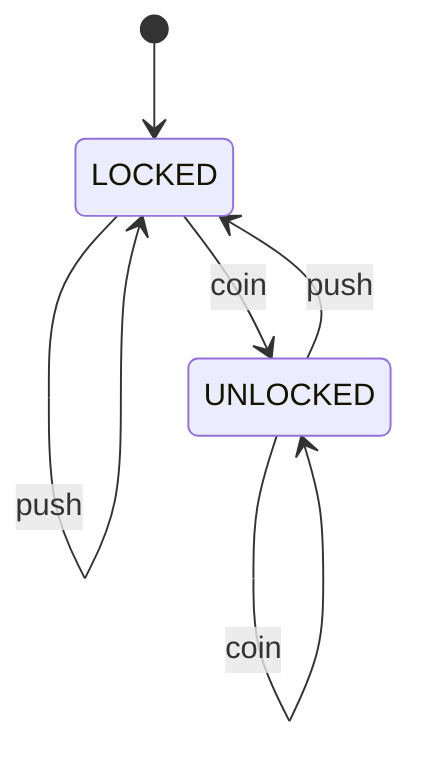

# States, Transitions, and Invariants

In Phase 1 we said a spec describes the design. Good - but "describe the design" is still vague.
What, concretely, do you write down? This is the part that turns the idea into a craft, and the
craft rests on a single model that's powerful enough to capture almost any system you'll build:
**a system is a set of states and the moves allowed between them.** Get fluent in that, add two
kinds of property on top, and you can specify real things.

## A system is states plus transitions

A **state** is a complete snapshot of everything that matters at one moment - every variable, every
flag, every value, frozen. A **transition** is an allowed move from one state to another, triggered
by an event.

That's the whole model. The system starts in some initial state, and at each step *some* enabled
transition fires, carrying it to a new state. The set of all states the system can possibly reach,
following the transition rules from the start, is its **reachable state space**. Everything the
system can ever do is a path through that space.

Take a turnstile - small, but it's a complete example.

```text
States:        LOCKED, UNLOCKED

Transitions:
  LOCKED   --coin-->   UNLOCKED    (paying unlocks it)
  UNLOCKED --push-->   LOCKED      (passing through re-locks it)
  LOCKED   --push-->   LOCKED      (pushing without paying: nothing)
  UNLOCKED --coin-->   UNLOCKED    (paying twice: wasted coin, still open)

Initial state: LOCKED
```

*What just happened:* we've fully specified a turnstile without any code. Two states, four
transitions, one starting point. Notice the last two transitions - "push while locked" and "coin
while unlocked" - loop back to the same state. We had to decide what those do, and writing the
model *forced* the decision. That's the value: the model has no room for "we'll figure it out
later."



The diagram and the text say the same thing. For a turnstile you can hold the whole picture in
your head. For real systems - many variables, concurrent actors - you can't, and that's precisely
why writing the states and transitions down beats keeping them in your head: the model is exhaustive
where your imagination is selective.

## Invariants: what must ALWAYS be true

A model tells you what the system *can* do. Now you say what it must *never* do. An **invariant**
is a property that holds in every reachable state, no matter what path you took to get there. It's
a statement with an implicit "for all states" in front of it - the *always* quantifier you met in
[predicate logic](/guides/predicate-logic-and-quantifiers), aimed at the state space.

Invariants are where you encode the things that, if ever violated, mean disaster:

```text
Money transfer system - invariants (must hold in EVERY reachable state):

  INV1:  sum of all account balances == constant
         (money is never created or destroyed)

  INV2:  for every account a:  a.balance >= 0
         (no account ever goes negative)

  INV3:  no account is both "frozen" and "processing a transfer"
```

*What just happened:* these three lines say more about correctness than a folder of tests. Each is
a claim about *all* reachable states. INV1 in particular is the kind of thing a single mis-ordered
operation can break, and stating it explicitly means a checker can later ask "is there any reachable
state where the balances don't sum to the constant?" - and answer for *every* path at once.

Invariants are also called **safety** properties, summed up as *"nothing bad ever happens."* They're
the workhorses - most of the bugs you fear are invariant violations.

## Liveness: what must EVENTUALLY happen

Safety alone has a loophole. A system that does *nothing at all* never violates a safety property -
it never reaches a bad state because it never reaches any new state. A turnstile welded shut is
perfectly "safe." That's clearly not what you want.

So there's a second flavor of property. A **liveness** property says something good *eventually*
happens - the *there-exists-a-future-moment* quantifier, over time instead of space. Summed up:
*"something good eventually happens."*

```text
SAFETY    (always):     "two threads never hold the lock at the same time"
                        -> nothing bad ever happens
LIVENESS  (eventually): "a thread waiting for the lock eventually gets it"
                        -> something good eventually happens
```

*What just happened:* the two properties guard against opposite failures. Safety stops the system
from doing something wrong. Liveness stops it from doing nothing - from deadlocking, starving a
waiter, or hanging forever. A correct design usually needs both: never do the bad thing (safety),
*and* don't get permanently stuck (liveness).

The classic trap is writing a clever locking scheme that's bulletproof on safety - two threads
truly never collide - and discovering it can deadlock, where each waits on the other forever. Safety
intact, liveness violated. You need to state both or you've only specified half of "correct."

## Putting it together

A specification, then, is four things:

```text
1. STATE       - the variables; what a snapshot contains
2. INIT        - the allowed starting state(s)
3. TRANSITIONS - the moves: from a state, under what condition, to what next state
4. PROPERTIES  - invariants (always) and liveness (eventually) that must hold
```

That's it. That's the shape of every spec you'll write, from a turnstile to a distributed
consensus protocol. The protocol has more state and trickier transitions, but the skeleton is
identical. Once a system is written in this form, it stops being a vague intention and becomes a
precise object - one a tool can examine exhaustively, which is exactly where Phase 3 goes.

## For builders

You already model state machines constantly; you mostly leave them implicit. An order is
`pending -> paid -> shipped -> delivered`. A connection is `connecting -> open -> closed`. The
bugs cluster at the transitions you forgot to think about - what happens on `cancel` while
`shipped`? what's the move out of `connecting` on timeout? Drawing the states and *every* edge
between them, then writing one invariant ("an order is never both refunded and shipped"), surfaces
the missing transition before it becomes a 2am page. You don't need a tool to get most of this
benefit - the discipline of being exhaustive is the win.

```quiz
[
  {
    "q": "What is a 'state' in this model of a system?",
    "choices": [
      "A single line of source code",
      "A complete snapshot of everything that matters at one moment",
      "An error message",
      "The name of a transition"
    ],
    "answer": 1,
    "explain": "A state is a full snapshot - every relevant variable and flag frozen at one instant. Transitions move the system from one such snapshot to another."
  },
  {
    "q": "An invariant is a property that...",
    "choices": [
      "holds in every reachable state (always true)",
      "is true at the start but may later break",
      "eventually becomes true",
      "is checked only by running tests"
    ],
    "answer": 0,
    "explain": "An invariant (a safety property) must hold in every reachable state, no matter the path. It's an 'always' claim over the whole state space."
  },
  {
    "q": "A locking scheme guarantees two threads never collide, but two threads can wait on each other forever. Which property does it violate?",
    "choices": [
      "Safety - something bad happened",
      "Liveness - something good never eventually happens",
      "Neither; deadlock is fine",
      "Both safety and liveness equally"
    ],
    "answer": 1,
    "explain": "Never colliding is safety, and it holds. But a waiting thread never getting the lock is a liveness failure: the good thing (eventually acquiring it) never happens."
  }
]
```

[← Phase 1: The Blueprint, Not the Building](01-the-blueprint-not-the-building.md) · [Guide overview](_guide.md) · [Phase 3: Checking the Design Before You Build →](03-checking-before-you-build.md)
