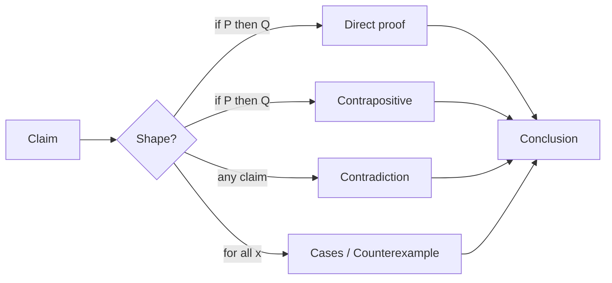

# The Main Proof Techniques

When people say "a proof," they often picture one giant skill you either have or
don't. The reality is smaller than that. Most proofs you'll meet are built from a
handful of recurring *shapes*. Once you recognize the shape a claim wants, half the
work is done - you stop staring at a blank page and start filling in a known template.

This phase walks through five of those shapes. None is a trick. Each is a sane
response to a specific kind of statement, and we'll say *why* each one fits where
it does.



## Direct proof: assume the hypothesis, walk to the conclusion

The most common shape, and the one you reach for first. A claim of the form "if `P`,
then `Q`" asks: *whenever `P` holds, does `Q` follow?* So you assume `P` is true and
walk, step by honest step, until you reach `Q`. No detours, no cleverness - the proof
*is* the walk.

Take a concrete one: the sum of two even numbers is even. "Even" means "divisible by
2," which means you can write the number as 2 times some whole number. That definition
is the whole engine of the proof.

```text
Claim: if a and b are even, then a + b is even.

Assume a and b are even.            (this is P, the hypothesis)
Then a = 2m for some integer m.     (definition of even)
And  b = 2n for some integer n.     (definition of even)
So a + b = 2m + 2n
        = 2(m + n).                 (factor out the 2)
Since m + n is an integer,
  a + b is 2 times an integer.
Therefore a + b is even.           (this is Q, the conclusion)  ∎
```

Notice nothing is missing between any two lines. That gap-free quality is what makes
it a proof rather than a plausible story. When a claim hands you a clear hypothesis
to start from, try direct proof first.

## Proof by contradiction: assume it's false, hit a wall

Sometimes walking forward from the hypothesis is awkward, or the claim has no obvious
hypothesis to grip. Then try the opposite move: assume the statement is *false*, and
show that assumption forces something impossible. If "false" leads to an
impossibility, "false" can't hold - so the statement must be true.

The mental model is a trap you set on purpose. You let the enemy assumption in,
follow where it leads, and watch it walk into a wall it can't get past - like
`1 = 0`, or "this number is both even and odd."

The classic example is that √2 is irrational - it can't be written as a fraction of
two whole numbers. Here's the *idea*, not the full proof:

```text
Suppose, for contradiction, that √2 IS a fraction.
Write it in lowest terms: √2 = a/b, with a and b
  sharing no common factor (already reduced).

Squaring and rearranging forces a to be even,
  and then forces b to be even too.

But if a and b are both even, they share the factor 2 -
  which contradicts "lowest terms, no common factor."

The assumption collapsed. So √2 is NOT a fraction:
  it's irrational.  ∎
```

The shape is what matters: assume the negation, derive an impossibility, conclude the
original. You'll see this pattern constantly once you know to look for it.

## Proof by contrapositive: flip the implication

This one trades a hard direction for an easier one. To prove "if `P`, then `Q`"
(written `P → Q`), you may instead prove "if not `Q`, then not `P`" (written
`¬Q → ¬P`). The two are *logically equivalent* - true in exactly the same situations,
so proving either one proves both. (If "equivalent" feels slippery, the truth-table
reasoning behind it lives in [/guides/propositional-logic](/guides/propositional-logic),
and the bigger picture of what logic is doing here is in
[/guides/what-logic-actually-is](/guides/what-logic-actually-is).)

Why flip? Because sometimes `¬Q` is a much friendlier place to start than `P`. A
negation can hand you concrete structure to work with.

```text
Claim: if n² is even, then n is even.   (P → Q)

Starting from "n² is even" is awkward.
So prove the contrapositive instead:

  if n is NOT even, then n² is NOT even.  (¬Q → ¬P)

Assume n is odd. Then n = 2k + 1.
n² = (2k + 1)²
   = 4k² + 4k + 1
   = 2(2k² + 2k) + 1,   which is odd.

So n odd forces n² odd. By contrapositive,
  n² even forces n even.  ∎
```

Same claim, but the contrapositive gave us an `n = 2k + 1` to expand instead of a
square root to wrestle. When the negation of your conclusion is easier to grab than
the hypothesis, reach for this.

## Proof by cases: split, then conquer each piece

Some claims resist a single line of argument because the objects involved behave
differently in different situations. The fix: carve the possibilities into a few
*exhaustive* buckets - buckets that together cover every case - and prove the claim
inside each. If it holds in every bucket, and the buckets leave nothing out, it holds
everywhere.

The load-bearing word is *exhaustive*. Miss a case and the proof has a hole.

```text
Claim: for every integer n, n² + n is even.

Every integer is either even or odd. Two cases:

Case 1 - n is even: n = 2k.
  n² + n = n(n + 1) = 2k(2k + 1),
  which is 2 times an integer → even.

Case 2 - n is odd: n = 2k + 1.
  n + 1 = 2k + 2 = 2(k + 1), so n + 1 is even.
  n(n + 1) is (something) times an even number → even.

The two cases cover every integer, and both give "even."
Therefore n² + n is always even.  ∎
```

The art is choosing cases that are both *exhaustive* (nothing slips through) and
*useful* (each gives you something concrete to work with). "Even or odd" did both
here.

## Disproof by counterexample: one failure is enough

The techniques above all *prove* statements. This one *disproves* them - and it
reveals a deep asymmetry worth burning into memory.

Consider a claim of the form "for all `x`, `P(x)`" - a universal statement, every
single `x` obeys. To disprove it, you don't need a grand argument. You need *one* `x`
where `P` fails. That single example, a counterexample, kills the universal claim
outright. (Universal "for all" statements and what their negation looks like are the
subject of [/guides/predicate-logic-and-quantifiers](/guides/predicate-logic-and-quantifiers).)

```text
Claim (false): every prime number is odd.

Counterexample: 2 is prime, and 2 is even.

One example breaks "every." Claim disproved.  ∎
```

Now the asymmetry, stated bluntly so it sticks:

- **One counterexample disproves a "for all" claim** - fully, permanently.
- **No pile of examples ever proves a "for all" claim.** You could check a million
  values, find no counterexample, and still be wrong about the million-and-first.

Examples can *suggest* a universal is true and build your intuition. But suggestion
isn't proof. To actually *prove* a universal, go back to the techniques above -
direct, contradiction, contrapositive, cases - which argue about *all* `x` at once
instead of checking them one by one.

> The same asymmetry runs the other way for "there exists" claims: to prove "some `x`
> has property `P`," one good example is enough; to disprove it, you must rule out
> every `x`. Quantifiers flip which direction is cheap. If that's new, it's covered in
> [/guides/predicate-logic-and-quantifiers](/guides/predicate-logic-and-quantifiers).

## For builders

If you write code, you already use two of these shapes - under different names.

**Contradiction is how you isolate a bug.** When you say "assume this layer is
correct - then the data reaching the next layer should look like *this* - but it
actually looks like *that*, which is impossible if the layer were correct, so the bug
is in this layer," you're running a proof by contradiction. You assumed a thing,
derived a state that can't coexist with that assumption, and concluded the assumption
was wrong. That's *reductio* with a debugger attached.

**A counterexample is a failing test case.** The claim "this function always works"
is a universal: for all inputs, it behaves. A green test suite of a thousand passing
cases does *not* prove it - same as a thousand examples don't prove a math universal.
But one red test, one input that returns the wrong answer, disproves "it always works"
instantly. That's why a single reproducible failing test is so powerful: it's a
counterexample, and counterexamples are decisive.

If formal claims still feel intimidating, this is the bridge:
[/guides/why-math-isnt-your-enemy](/guides/why-math-isnt-your-enemy) makes the case
that the reasoning you do daily and the reasoning in proofs are the same muscle.

## Recap

- **Direct proof** - assume the hypothesis, derive the conclusion step by gap-free
  step. Your default for "if `P` then `Q`."
- **Proof by contradiction** - assume the statement is false, derive an impossibility,
  conclude it's true.
- **Proof by contrapositive** - prove `¬Q → ¬P` instead of `P → Q`; equivalent, and
  often easier to start from.
- **Proof by cases** - split into exhaustive buckets, prove each. Watch that the cases
  miss nothing.
- **Disproof by counterexample** - one failing `x` kills a "for all" claim; no number
  of examples ever proves one.

## Open-ended exercise

Pick a claim you believe is true - something small and concrete, like "the sum of two
odd numbers is even" or "a function that checks `x > 0` and `x < 10` can be rewritten
as `x >= 1 && x <= 9`." Now choose *one* of the five proof shapes from this phase and
sketch how you'd structure a proof for it. You don't need to write every step - just
identify: what's the hypothesis, what's the conclusion, and which shape fits best?
The exercise is to feel the difference between "I think this is true" and "I can show
why it must be true."

Pick a quiz to check the parts that trip people up most:

```quiz
[
  {
    "q": "In a proof by contradiction, what do you assume at the start?",
    "choices": [
      "That the statement you want to prove is false",
      "That the statement you want to prove is true",
      "That the hypothesis is false but the conclusion is true",
      "Nothing - you derive the statement with no assumptions"
    ],
    "answer": 0,
    "explain": "You assume the statement is false, then show that assumption forces an impossibility. Since 'false' leads to a wall, the statement must be true."
  },
  {
    "q": "Why is proving the contrapositive (¬Q → ¬P) a valid way to prove P → Q?",
    "choices": [
      "Because the contrapositive is usually shorter to write",
      "Because P → Q and ¬Q → ¬P are logically equivalent - true in exactly the same situations",
      "Because proving any related statement is good enough",
      "Because the converse Q → P is always true too"
    ],
    "answer": 1,
    "explain": "The two statements are logically equivalent: proving either one proves both. Being shorter is a nice bonus, not the reason it's valid."
  },
  {
    "q": "You want to disprove 'every prime number is odd.' What's enough?",
    "choices": [
      "Checking that the first hundred primes are odd",
      "A general argument about all primes at once",
      "One counterexample, such as 2 (prime and even)",
      "Showing most primes are odd"
    ],
    "answer": 2,
    "explain": "A single counterexample disproves a 'for all' claim outright. 2 is prime and even, so 'every prime is odd' is false. Examples that fit the claim never prove it."
  }
]
```

[← Phase 1: What a Proof Actually Is](01-what-a-proof-actually-is.md) · [Guide overview](_guide.md) · [Phase 3: Proof by Induction →](03-proof-by-induction.md)
